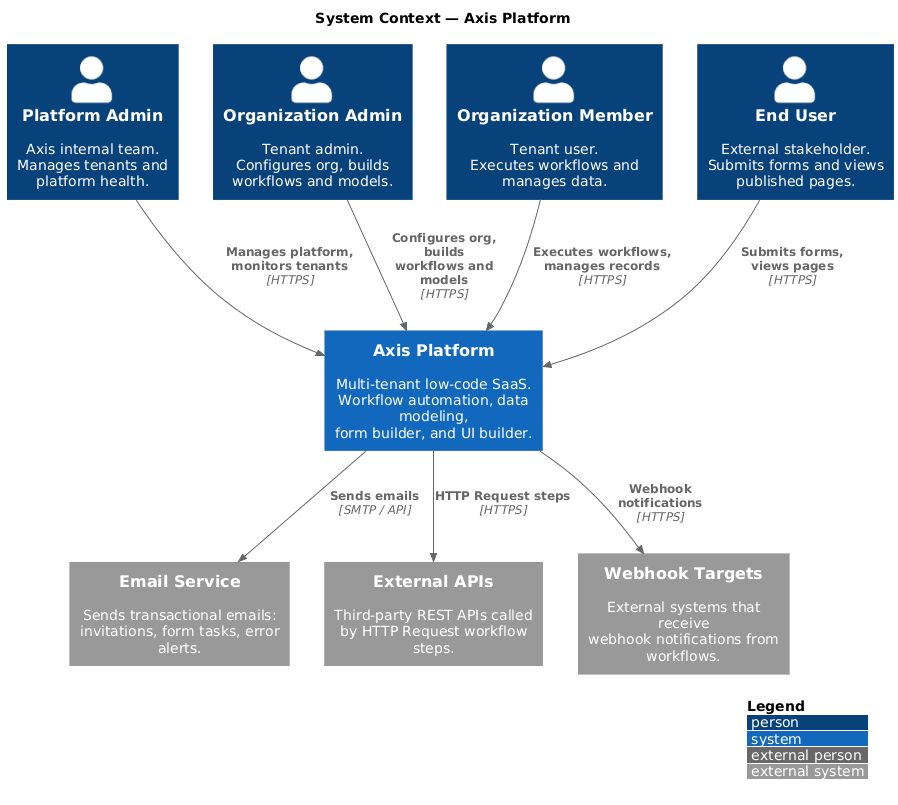
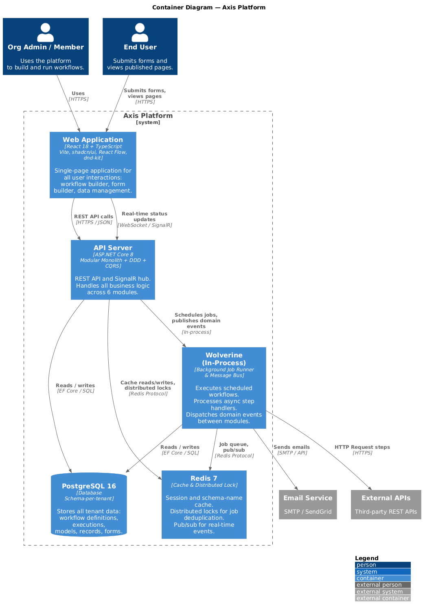
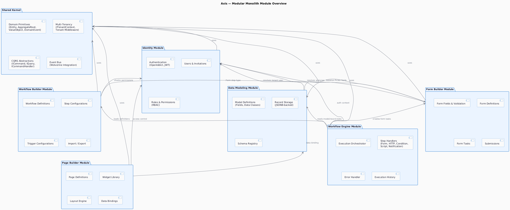
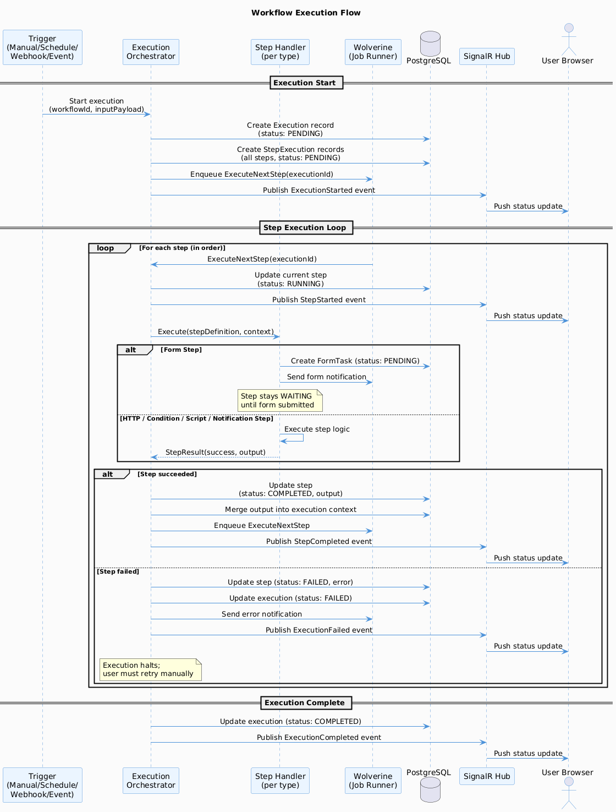

# Architecture

[← Back to Docs Home](./README.md)

---

## System Context



The Axis platform serves four actor types: **Platform Admins** (Axis team), **Organization Admins**, **Organization Members**, and **End Users**. External systems include an email service for notifications, external APIs called by workflow HTTP steps, and webhook targets that receive workflow events.

---

## Containers



| Container | Technology | Responsibility |
|---|---|---|
| **Web Application** | React + TypeScript (Vite) | SPA for all user interactions: workflow builder, form builder, page builder, data management |
| **API Server** | ASP.NET Core 8 | Modular monolith exposing REST API and SignalR hub |
| **Background Job Runner** | Wolverine (in-process) | Executes scheduled workflows, processes async steps, dispatches domain events |
| **PostgreSQL** | PostgreSQL 16 | Primary data store — schema-per-tenant |
| **Redis** | Redis 7 | Session cache, distributed locks, pub/sub for real-time events |

---

## Modular Monolith Structure



### Source Tree

```
src/
├── Axis.Api/                    # ASP.NET Core host, middleware, DI wiring
├── Modules/
│   ├── Identity/
│   │   ├── Axis.Identity.Domain/
│   │   ├── Axis.Identity.Application/
│   │   ├── Axis.Identity.Infrastructure/
│   │   └── Axis.Identity.Api/
│   ├── DataModeling/
│   │   ├── Axis.DataModeling.Domain/
│   │   ├── Axis.DataModeling.Application/
│   │   ├── Axis.DataModeling.Infrastructure/
│   │   └── Axis.DataModeling.Api/
│   ├── WorkflowBuilder/
│   │   ├── Axis.WorkflowBuilder.Domain/
│   │   ├── Axis.WorkflowBuilder.Application/
│   │   ├── Axis.WorkflowBuilder.Infrastructure/
│   │   └── Axis.WorkflowBuilder.Api/
│   ├── FormBuilder/
│   │   ├── Axis.FormBuilder.Domain/
│   │   ├── Axis.FormBuilder.Application/
│   │   ├── Axis.FormBuilder.Infrastructure/
│   │   └── Axis.FormBuilder.Api/
│   ├── WorkflowEngine/
│   │   ├── Axis.WorkflowEngine.Domain/
│   │   ├── Axis.WorkflowEngine.Application/
│   │   ├── Axis.WorkflowEngine.Infrastructure/
│   │   └── Axis.WorkflowEngine.Api/
│   └── PageBuilder/
│       ├── Axis.PageBuilder.Domain/
│       ├── Axis.PageBuilder.Application/
│       ├── Axis.PageBuilder.Infrastructure/
│       └── Axis.PageBuilder.Api/
└── Shared/
    ├── Axis.Shared.Domain/      # Base entities, value objects, domain events
    ├── Axis.Shared.Application/ # Base handlers, pagination, CQRS abstractions
    └── Axis.Shared.Infrastructure/ # Multi-tenancy, EF Core base, Redis, email
```

### Module Layer Convention (per module)

| Layer | Responsibility | Allowed Dependencies |
|---|---|---|
| **Domain** | Entities, value objects, domain events, repository interfaces | Shared.Domain only |
| **Application** | Commands, queries, handlers, DTOs, service interfaces | Domain, Shared.Application |
| **Infrastructure** | EF Core DbContext, repository implementations, external clients | Application, Shared.Infrastructure |
| **Api** | Controllers, SignalR hubs, endpoint mapping | Application |

---

## Multi-Tenancy Strategy

Each organization (tenant) is provisioned with its own **PostgreSQL schema** at sign-up. The `public` schema is reserved for platform-level data (organizations, subscriptions).

```
PostgreSQL
├── public schema
│   ├── organizations
│   ├── subscription_plans
│   └── platform_users
├── tenant_abc schema
│   ├── users
│   ├── roles
│   ├── models
│   ├── workflows
│   ├── executions
│   └── ...
└── tenant_xyz schema
    └── ...
```

**Tenant resolution:** Every API request carries a JWT with an `org_id` claim. Middleware resolves the tenant and switches the EF Core schema context before the request hits any handler.

---

## Authentication Flow

1. User signs in with email + password → `POST /auth/token`
2. OpenIddict validates credentials, issues **Access Token** (JWT, 15 min) + **Refresh Token** (opaque, 7 days)
3. Client sends `Authorization: Bearer <access_token>` on every request
4. Middleware validates JWT, extracts `org_id` + `user_id` + `roles`, injects into request context
5. Refresh via `POST /auth/refresh` before token expires

---

## Real-Time Updates (SignalR)

When a workflow execution changes state (started, step completed, failed, finished), the **WorkflowEngine** publishes a domain event. Wolverine dispatches it to the SignalR hub, which pushes the update to the connected client.

```
WorkflowEngine → domain event → Wolverine → SignalR Hub → Browser
```

---

## Workflow Execution Architecture



Workflow execution is orchestrated by the **WorkflowEngine** module:

1. A trigger fires (manual API call, cron tick, incoming webhook, or internal event).
2. The engine loads the workflow definition and creates an **Execution** record.
3. Steps are executed in order (or in parallel where configured).
4. Each step type has a dedicated **Step Handler** (Form, HTTP, Condition, Script, Notification).
5. On failure, the engine marks the step as `Failed`, notifies configured channels, and halts (user retries manually).
6. On completion, the execution record is marked `Completed` and a domain event is published.
