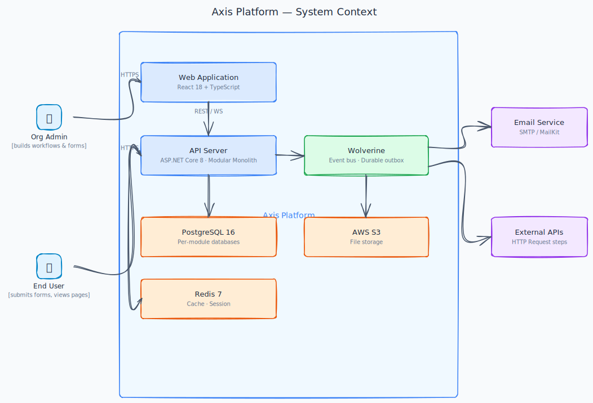
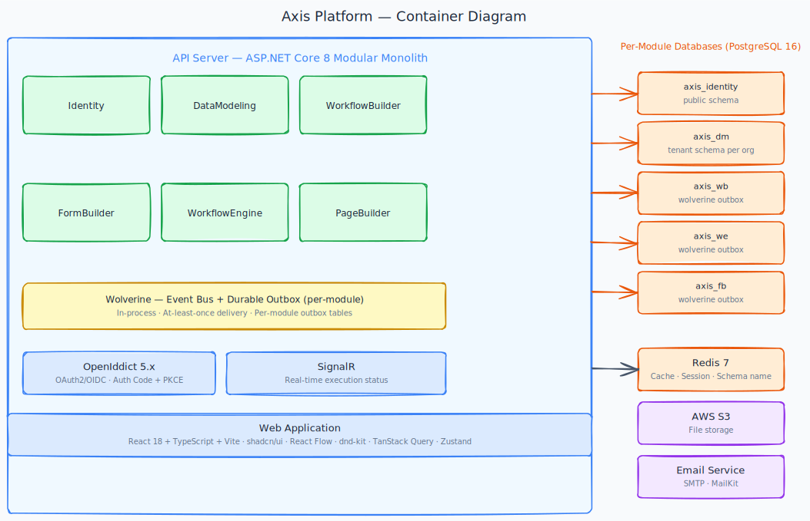
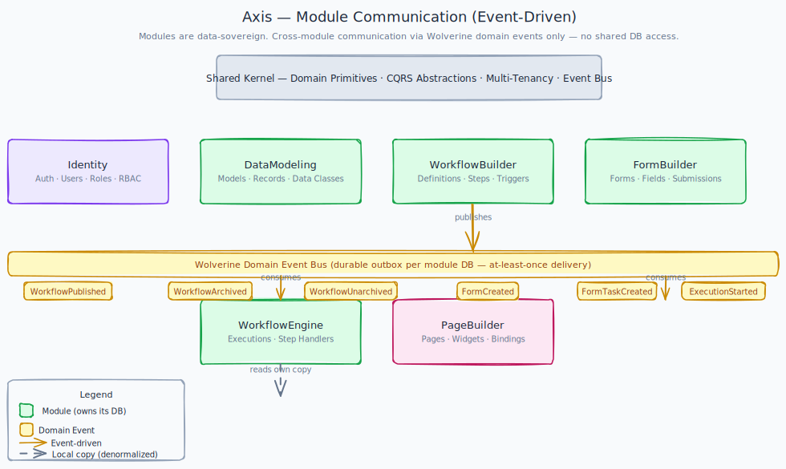

# Architecture

[← Back to Docs Home](./README.md)

> **Scope:** Architectural shape — what containers exist, how tenancy and auth work end-to-end, where the modules sit. **Not** the source of truth for: library versions ([TECH_STACK.md](./TECH_STACK.md)), source tree ([CLAUDE.md](../CLAUDE.md) § Solution tree), feature behaviour (`docs/epics/`), implementation rules (`docs/playbooks/`).
>
> If two docs would disagree, this one defers.

---

## System Context



The Axis platform serves four actor types: **Platform Admins** (Axis team), **Organization Admins**, **Organization Members**, and **End Users**. External systems include an email service for notifications, external APIs called by workflow HTTP steps, and webhook targets that receive workflow events.

---

## Containers



| Container | Responsibility |
|---|---|
| **Web Application** | SPA for all user interactions: workflow builder, form builder, page builder, data management |
| **API Server** | Modular monolith exposing REST API. Real-time execution push lives under [E06 Workflow Engine](./epics/E06-workflow-engine/README.md). |
| **Background Job Runner** | In-process job/event runner — executes scheduled workflows, processes async steps, dispatches domain events |
| **PostgreSQL** | Primary data store — schema-per-tenant |
| **Redis** | Session cache, distributed locks, pub/sub for real-time events |

Concrete technology choices and versions for each container live in [TECH_STACK.md](./TECH_STACK.md).

---

## Modular Monolith Structure



Source tree and project naming live in [CLAUDE.md § Solution tree](../CLAUDE.md#docs-index). Below is the per-module layer rule — the architectural invariant.

### Module Layer Convention (per module)

| Layer | Responsibility | Allowed Dependencies |
|---|---|---|
| **Domain** | Entities, value objects, domain events, repository interfaces | Shared.Domain only |
| **Application** | Commands, queries, handlers, DTOs, service interfaces | Domain, Shared.Application |
| **Infrastructure** | EF Core DbContext, repository implementations, external clients | Application, Shared.Infrastructure |
| **Api** | Minimal API endpoint methods (in `Axis.Api/Endpoints/`), OpenAPI annotations | Application |

Cross-module communication is via Wolverine domain events or Application-layer interfaces only — no shared `DbContext`, no cross-module raw SQL. See [CLAUDE.md § Module boundaries](../CLAUDE.md) and [playbooks/patterns.md § Cross-module data](./playbooks/patterns.md#cross-module-data-pattern).

---

## Multi-Tenancy Strategy

Each organization (tenant) is provisioned with its own **PostgreSQL schema** at sign-up. The `public` schema is reserved for platform-level data (organizations, subscriptions, identity).

```text
PostgreSQL
├── public schema           # organizations, subscription_plans, users, roles
└── tenant_{orgId} schemas  # per-tenant: models, workflows, executions, …
```

**Tenant resolution:** every API request carries a JWT with an `org_id` claim. `HttpTenantContext` (`ITenantContext`) resolves the tenant lazily from the claim on first access. `TenantSchemaInterceptor` (an EF Core `DbConnectionInterceptor`) sets `search_path` to the tenant schema when a DB connection opens — no middleware switches the schema context in the pipeline.

Implementation details and pitfalls: [playbooks/patterns.md § Multi-tenancy](./playbooks/patterns.md#multi-tenancy-pitfalls).

---

## Authentication

Auth is handled by an in-process OAuth2/OIDC server (see [TECH_STACK.md ADR-004](./TECH_STACK.md#adr-004-openiddict-as-oauth2oidc-server)). Two flows are supported:

- **SPA — Authorization Code + PKCE**: browser → `/connect/authorize` → `/connect/token` → short-lived access token (JWT) + refresh token in `httpOnly` cookie.
- **External integrations — Client Credentials**: server-to-server `client_id` + `client_secret` → scoped access token, no user context.

Detailed flow, redirect URIs, and error states: [docs/epics/E02-identity-access/](./epics/E02-identity-access/README.md) and the auth-flow diagram.

---

## Workflow Execution


Full execution model — step lifecycle, retry semantics, history, real-time push — lives under [docs/epics/E06-workflow-engine/](./epics/E06-workflow-engine/README.md).
