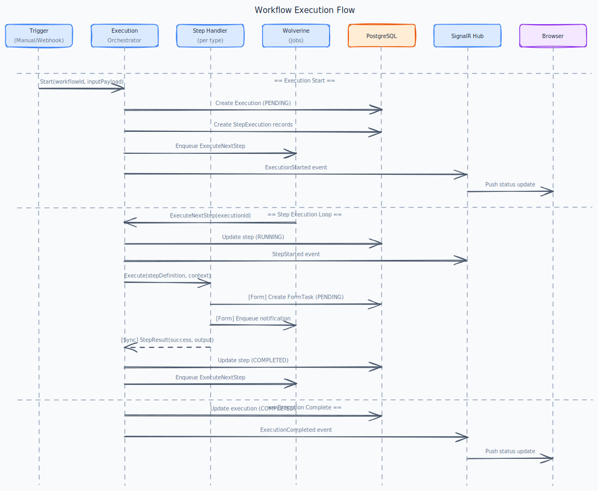

# Architecture

[← Back to Docs Home](./README.md)

> **Scope:** Architectural shape — what containers exist, how tenancy and auth work end-to-end, where the modules sit. **Not** the source of truth for: library versions ([TECH_STACK.md](./TECH_STACK.md)), source tree ([CLAUDE.md](../CLAUDE.md) § Solution tree), feature behaviour (`docs/use-cases/`), implementation rules (`docs/playbooks/`).
>
> If two docs would disagree, this one defers.

---

## System Context


The Axis platform serves four actor types: **Platform Admins** (Axis team), **Organization Admins**, **Organization Members**, and **End Users**. External systems include an email service for notifications, external APIs called by workflow HTTP steps, and webhook targets that receive workflow events.

---

## Containers


Axis runs as a **modulith with strict service boundaries** — each module is a deployable service contract; modulith packaging is the deployment shape today, K8s services tomorrow. See [TECH_STACK.md § ADR-010](./TECH_STACK.md#adr-010-modulith-with-strict-service-boundaries-so-extraction-is-a-redeploy).

| Container | Responsibility |
|---|---|
| **Web Application (SPA)** | All user interactions: workflow builder, form builder, page builder, data management |
| **API Gateway (`Axis.Api`)** | Thin REST/OpenAPI surface for the SPA. Validates JWT, routes to module gRPC clients (modulith mode: in-process; extracted mode: gRPC over network). |
| **Identity service** | Issues JWTs (OAuth2 Authorization Code + PKCE, Client Credentials); exposes JWKS + user/role lookup via gRPC. Other modules treat it as remote ([ADR-015](./TECH_STACK.md#adr-015-identity-is-a-remote-dependency-from-day-1)). |
| **DataModeling service** | Custom data models, fields, records (per-tenant). |
| **WorkflowBuilder service** | Workflow definitions, steps, transitions, triggers. |
| **WorkflowEngine service** | Execution lifecycle, step runtime, saga orchestrator. |
| **FormBuilder service** | Form definitions, form-task submissions. |
| **PageBuilder service** | Visual page builder (Phase 2). |
| **Per-module PostgreSQL** | One database per module (`axis_identity`, `axis_datamodeling`, …). Schema-per-tenant inside each ([ADR-011](./TECH_STACK.md#adr-011-per-module-database-with-schema-per-tenant-inside)). Per-module Wolverine outbox schema lives alongside ([ADR-012](./TECH_STACK.md#adr-012-per-module-wolverine-schema-in-the-modules-own-database)). |
| **Apache Kafka + Schema Registry** | Cross-module **event** transport + event-sourced aggregate log. Topics partitioned by `organizationId`. Avro payloads with CloudEvents envelopes ([ADR-013](./TECH_STACK.md#adr-013-apache-kafka-for-cross-module-domain-events-and-event-sourced-aggregates), [ADR-019](./TECH_STACK.md#adr-019-avro-and-schema-registry-for-event-payloads-with-cloudevents-envelope)). |
| **RabbitMQ** | Cross-module **command + job + saga** transport. Work-queue semantics (ACK, requeue, DLX, prefetch). Per-message routing rule in [ADR-025](./TECH_STACK.md#adr-025-transport-selection-rule-by-message-name-suffix). |
| **Redis** | Session cache + distributed locks + per-tenant short-TTL caches (key-prefixed per module). |
| **AWS S3** | File storage (attachments, exports). |
| **HashiCorp Vault** | Secrets management in production. Per-module policies + Vault Agent sidecar ([ADR-022](./TECH_STACK.md#adr-022-secrets-management-via-hashicorp-vault-in-production)). |
| **Grafana Tempo / Loki / Mimir** | Observability backend — traces, logs, metrics. OpenTelemetry SDK in every module ([ADR-018](./TECH_STACK.md#adr-018-opentelemetry-sdk-with-grafana-stack-for-observability)). |

Concrete versions in [TECH_STACK.md](./TECH_STACK.md).

---

## Module = Service: layering and contract surface


Each module *is* a service contract — modulith mode collocates them as in-process targets, but the contract surface is identical to the extracted form. Source tree and project naming live in [CLAUDE.md § Solution tree](../CLAUDE.md#docs-index).

### Per-module layer convention

| Layer | Responsibility | Allowed dependencies |
|---|---|---|
| **Contracts** (`Axis.{Module}.Contracts`) | `.proto` files for gRPC; Avro schemas for events; CloudEvents types | None — pure schema |
| **Domain** | Entities, value objects, domain events, repository interfaces | `Axis.Shared.Domain` only (primitives + Result) |
| **Application** | Commands, queries, handlers, DTOs, service interfaces, saga state | Domain, `Axis.Shared.Application` (interfaces only — see [ADR-017](./TECH_STACK.md#adr-017-axisshared-is-abstractions-only-no-shared-implementation)) |
| **Infrastructure** | EF Core DbContext, repository impl, Wolverine handlers + outbox, gRPC server impl, Kafka producer/consumer | Application, Npgsql, WolverineFx, gRPC |
| **API entrypoint** | gRPC server hosting (internal); REST endpoints exposing module operations through `Axis.Api` gateway (external) | Module Application + Contracts |

### Cross-module communication contract

| Need | Mechanism | Code surface |
|---|---|---|
| Domain event (`*Event`) → other modules react | **Kafka topic** (Avro + CloudEvents) via Wolverine | Module Infrastructure publishes; other modules' Infrastructure consumes |
| Command (`*Command`) → another module performs an action | **RabbitMQ exchange** via Wolverine | `opts.PublishMessage<T>().ToRabbitExchange(…)` in originating module |
| Background job (`*Job`) → fire-and-forget work | **RabbitMQ queue** via Wolverine | Scheduled via Wolverine's durable scheduler |
| Sync query the calling module cannot satisfy from a local read model | gRPC client → other module's gRPC server | Generated stub from `Axis.{Module}.Contracts/*.proto` |
| User identity on every request | JWT validated locally against Identity's JWKS | `Axis.Shared.Application.Identity.ICurrentUser` (interface); per-module JWT-claim-reader impl |
| Long-running cross-module workflow | Saga orchestrated by originating module ([ADR-020](./TECH_STACK.md#adr-020-saga-orchestration-for-cross-module-workflows)); saga step messages on **RabbitMQ** | Wolverine saga handler in originating module's Application; state in Postgres `saga_state` |

Per-message transport selection follows the suffix convention in [ADR-025](./TECH_STACK.md#adr-025-transport-selection-rule-by-message-name-suffix): `*Command`/`*Job`/`*SagaStep` → RabbitMQ, `*Event`/`*Snapshot` → Kafka.

Forbidden: shared `DbContext`, direct C# method calls into another module's Application services, cross-module SQL, in-process `IMediator` for cross-module dispatch. The drift script and CI enforce these — see [CLAUDE.md § Service boundaries](../CLAUDE.md) and [playbooks/patterns.md § Cross-module communication](./playbooks/patterns.md#cross-module-communication-pattern).

---

## Multi-Tenancy Strategy

Each module owns its own PostgreSQL database. Tenant isolation inside a module is **schema-per-tenant** (`tenant_{orgId:N}`). Identity is the registry of organizations and operates entirely in its `public` schema; other modules never query Identity's DB directly — they receive tenant context via JWT claims.

```text
axis_identity DB
└── public schema                # organizations, users, roles, subscriptions, openiddict tables

axis_datamodeling DB
├── public schema                # module config, cross-tenant indexes
├── wolverine schema             # per-module envelope tables (outbox/inbox/scheduled/dead-letters)
└── tenant_{orgId:N} schemas     # models, fields, records (per tenant)

axis_workflowbuilder DB           ← same shape
axis_workflowengine DB            ← same shape
axis_formbuilder DB               ← same shape
axis_pagebuilder DB               ← same shape (Phase 2)
```

**Tenant resolution:** every external request carries a JWT with an `org_id` claim. The gateway extracts it and propagates via gRPC metadata (sync calls) and CloudEvents `tenantid` extension (events). Each module restores it into a scoped `ITenantContext`. EF Core sets the per-connection `search_path` to the tenant schema via `TenantSchemaInterceptor`.

Implementation details and pitfalls: [playbooks/patterns.md § Multi-tenancy](./playbooks/patterns.md#multi-tenancy-pitfalls).

---

## Authentication

The **Identity** service is the only OAuth2/OIDC server. Other modules **never** query Identity's database — they validate tokens locally via JWKS and look up user/role data through Identity's gRPC API when a local cache is insufficient. See [ADR-015](./TECH_STACK.md#adr-015-identity-is-a-remote-dependency-from-day-1).

- **SPA → Identity — Authorization Code + PKCE**: browser → `/connect/authorize` → `/connect/token` → short-lived access token (JWT, signed by Identity) + refresh token in `httpOnly` cookie.
- **External integrations → Identity — Client Credentials**: server-to-server `client_id` + `client_secret` → scoped access token, no user context.
- **Module-to-module token validation**: each module fetches Identity's `/.well-known/jwks.json` (cached, rotates per JWKS `kid`) and validates incoming JWTs locally. No round-trip to Identity for validation.
- **Module-to-Identity sync lookup**: `IdentityService` gRPC contract in `Axis.Identity.Contracts` for cases like "fetch user profile" or "refresh permission set after a change". Used sparingly — most modules rely on JWT claims + local read models.

Detailed flow, redirect URIs, and error states: [docs/use-cases/identity-access/](./use-cases/identity-access/README.md).

---

## Observability & Operations

- **Tracing**: OpenTelemetry SDK in every module. Trace IDs propagate through Wolverine envelopes and gRPC interceptors so a single request spans modules end-to-end. Backend: Grafana Tempo ([ADR-018](./TECH_STACK.md#adr-018-opentelemetry-sdk-with-grafana-stack-for-observability)).
- **Metrics**: Prometheus scrapes each module's `/metrics`. Long-term storage in Grafana Mimir.
- **Logs**: Serilog → OTEL exporter → Loki. Structured by trace ID + tenant ID + module.
- **Health checks**: `/health` (liveness) and `/health/ready` (readiness, includes DB + Kafka + downstream-module probes). Consumed by Kubernetes probes.
- **Schema migrations**: per-module EF Core migrations; no `EnsureCreated` anywhere — see [ADR-023](./TECH_STACK.md#adr-023-per-module-ef-core-migrations-only). Migrations run as a separate CI step before pod rollout.
- **Secrets**: HashiCorp Vault with per-module policies in production; `.env` files for development.

---

## Workflow Execution



Full execution model — step lifecycle, retry semantics, history, real-time push — lives under [docs/use-cases/workflow-engine/](./use-cases/workflow-engine/README.md).
