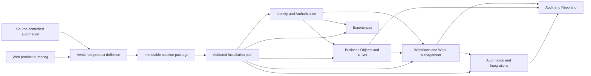

# Platform Strategy

> **Navigation**: [docs/README.md](./README.md) · [docs/ARCHITECTURE.md](./ARCHITECTURE.md) · [docs/use-cases/README.md](./use-cases/README.md) · [AGENTS.md](../AGENTS.md)

Axis is an enterprise application platform only when an independently owned product can be built, installed, upgraded, operated, and tested through public Axis contracts without product-specific code in the platform repository.

This file owns the target capability map and delivery sequence. [docs/ARCHITECTURE.md](./ARCHITECTURE.md) owns current runtime boundaries, [docs/use-cases/README.md](./use-cases/README.md) owns current product behavior, and [docs/TECH_STACK.md](./TECH_STACK.md) owns approved technology.

## Product Position

Axis targets governed, workflow-driven case and operations applications: intake, review, approval, fulfillment, external-system coordination, audit, and reporting. It does not compete first as a general website builder, arbitrary-code plugin host, or generic visual programming environment.

The differentiators are:

- versioned business contracts with explainable rules and reproducible execution;
- portable, versioned product definitions with deterministic export/rebuild, safe environment promotion, and upgrade;
- consistent authorization, audit, isolation, and operational recovery;
- one public API contract shared by the SPA, integrations, and authenticated agents;
- a modular core that a product can extend without forking Axis.

## Enterprise Production Baseline

Axis is engineered for enterprise production from the first implemented slice. Capability delivery sequences scope, not quality levels: an explicitly separate capability may remain out of scope, but an implemented contract cannot rely on temporary security, tenancy, data, API, persistence, deployment, operability, accessibility, or evidence behavior that must be replaced before production.

Each non-trivial slice must decide the applicable security/privacy, authorization/isolation, data lifecycle and migration, failure/recovery and concurrency, deployment/configuration/secrets, observability/support, performance/capacity, accessibility/localization, supply-chain maintenance, and compatibility/rollback concerns. A required concern without current acceptance evidence blocks the slice; `N/A` requires an owning-contract reason.

Local, test, and reference environments may replace addresses, credentials, certificates, data, and infrastructure adapters only. They preserve the same trust boundaries, failure semantics, migrations, and public contracts expected from production. The absence of production consumers or data may justify a clean cutover; it never lowers the quality of the replacement.

## Platform And Product Boundary

| Platform owns | Product owns |
|---|---|
| Identity, authorization, package lifecycle, metadata runtimes, execution safety, shared UI foundations, observability, and public contracts | Domain vocabulary, object schemas, forms and views, workflows, policies, reports, integrations, localized content, and acceptance journeys |
| Stable semantic component types and validation | Versioned instances of those component types |
| Installation, upgrade, promotion, rollback records, and drift detection | Product release cadence and customer-specific configuration |
| Runtime guarantees such as idempotency, isolation, concurrency, audit, and retry | Business decisions and responses to runtime outcomes |

A product package may consume only public module contracts. It may not reference module internals, write module databases, depend on undocumented seed behavior, or require a product key, route, workflow, translation, or rule inside Axis source.

## Customer Product Operating Model

The supported customer outcome is web-based authoring of declarative products, not repository editing or a required custom SPA. A product builder defines versioned data, experience, policy, rule, workflow, and integration components through Axis authoring surfaces; publishing produces the same immutable signed solution contract used by automated source-controlled delivery, and the generic runtime renders the installed product.

Source control remains a supported portability and engineering boundary for deterministic export, review, CI, promotion, and rebuild. It is optional for the customer authoring journey, and a live Axis instance is never the only recoverable source of product behavior.

## Target Bounded Contexts

| Context | Owns | Does not own |
|---|---|---|
| Identity | Organizations, workspaces, memberships, roles, service identities, sessions, and subject context | Product permissions or business records |
| Authorization | Versioned action/resource policies, policy evaluation, delegated authority, and row/field access decisions | Identity lifecycle or UI-only hiding |
| Solutions | Solution identity, immutable package versions, typed component dependencies, installation, upgrade, promotion, rollback records, and drift state | Component-specific business semantics |
| Business Objects | Versioned schemas, typed fields, relations, indexes, records, record revisions, and module-owned query contracts | Generic workflow or presentation behavior |
| Rules | Versioned deterministic definitions, bindings, pure evaluation, and explanations | Side effects, workflow state, or consumer transactions |
| Experiences | Versioned portals, navigation, forms, views, actions, localized content, and theme references rendered through approved components | Arbitrary client code or business mutation semantics |
| Workflows | Versioned process definitions, instances, state transitions, guards, timers, correlation, and execution history | Human inbox policy or external connector implementation |
| Work Management | Tasks, queues, assignment, delegation, approval work, due dates, and SLA state | Process-definition authoring |
| Automation | Event, data, schedule, and webhook triggers plus durable action executions, retry, cancellation, and dead-letter handling | Connector credentials or consumer business truth |
| Integrations | Typed connector contracts, installations, secret references, health, inbound/outbound delivery, and idempotency boundaries | Secrets in product packages or unrestricted in-process plugins |
| Content | File metadata, versions, retention, access checks, scanning state, and storage ports | Product record lifecycle |
| Notifications | Versioned templates, recipient resolution, delivery requests, channel adapters, preferences, and delivery outcomes | Product business decisions or connector secrets |
| Audit | Append-only actor, action, target, correlation, before/after reference, retention, and export records | Business-state reconstruction or event sourcing |
| Reporting | Product-owned projections, report definitions, exports, and scheduled delivery contracts | Cross-module access that bypasses published contracts |
| Entitlements | Plans, licensed capabilities, quotas, metering facts, and enforcement outcomes | Billing-provider implementation or weakened core authorization |

These contexts are introduced only when an owning use case needs them. A target name does not authorize a project, endpoint, schema, service, or dependency.

## Solution Package Contract

A solution is versioned declarative source with stable semantic keys and typed component documents. Supported web authoring and source-controlled automation publish the same immutable `SolutionVersion`; installing it creates a workspace-scoped `SolutionInstallation` pinned to exact component versions.

The package contract must provide:

- a deterministic manifest with solution identity, version, Axis compatibility, dependencies, component inventory, content hashes, source revision, build provenance, and publisher identity;
- fail-closed verification of a trusted publisher signature, provenance, and revocation state before installation or upgrade;
- module-owned typed component schemas and validators instead of opaque generic JSON or raw cross-resource UUIDs;
- environment-neutral product content separated from environment configuration and secret references;
- complete preflight validation and an explicit install plan before mutation;
- migration-backed component evolution, current installation state, operation history, resumable failure handling, and drift detection;
- explicit upgrade and rollback eligibility without rewriting immutable definitions or running workflow instances;
- deterministic export or rebuild from source so a live instance is never the only behavioral source of truth;
- no embedded unrestricted code. Extensions begin as typed out-of-process connectors; any future in-process model requires a separately approved signing, capability, isolation, upgrade, and revocation design.

Solutions orchestrates lifecycle; each consuming module validates and applies its own component types through a public contract. Cross-module installation does not create a hidden distributed transaction.

Installed components are immutable and cannot be edited in place. Product variability has four explicit forms:

- typed installation parameters are workspace-scoped, validated, versioned with the installation operation, and auditable;
- environment configuration and secret references are deployment-owned, never packaged as values, and excluded from product export;
- customer adaptation is a separately versioned overlay solution with declared dependencies and compatibility, never an untracked patch to its base;
- runtime business data remains module-owned state and is neither package content nor configuration drift.

Supported authoring publishes a new solution or overlay version. Upgrade preflight classifies base changes, overlay conflicts, parameter changes, environment prerequisites, data migrations, and runtime data separately; unresolved conflicts fail before mutation.

## Reference Product Contract

Axis maintains one independently versioned reference product that uses the same supported contracts as a customer product. Its first complete journey is a regulated case workflow with applicant, caseworker, and administrator experiences:

1. Install the product into a blank workspace from one immutable signed release.
2. Submit a typed case with documents and deterministic validation.
3. Route it through role-separated review and two-stage approval.
4. Invoke a simulated external service with idempotent retry and observable recovery.
5. Deliver a localized notification and an auditable report.
6. Upgrade the product while preserving active cases, pinned workflow versions, policy meaning, and data.

Every platform slice must add or strengthen one journey in this product. Platform-only demonstrations, hidden database setup, platform-owned product copy, and direct product provisioning from a feature component do not satisfy this boundary.

The source-built reference release is the first proving consumer of the public package lifecycle. This is lifecycle evidence, not the customer authoring contract. The required web-authoring capability must recreate the reference product through supported browser workflows and render its installed experiences through the generic runtime without requiring product-repository edits or a custom product SPA.

## Delivery Sequence

| Capability | Outcome | Modules and components | Exit proof |
|---|---|---|---|
| External product boundary | Existing Business Objects and Rules can form a product outside Axis source | Deterministic product definition, public contracts, and a separate reference-product acceptance deployment | A blank workspace can reproduce the current case intake through public contracts; Axis contains no reference-product key or product-specific provisioning logic |
| Governed trust foundation | Multiple real users can operate one governed workspace | Identity memberships and service identities, Authorization policy contract, Audit records, Solutions definition/version/installation core, trusted-publisher registry and revocation | Administrator, applicant, and caseworker receive distinct API and UI outcomes; authentic installs and access actions are auditable and workspace-isolated; unknown or revoked publishers fail closed; the source-built reference release proves lifecycle only, not customer authoring |
| Web-authored configured data and experience | A customer product builder can define useful records and portals through supported web authoring without repository edits or custom SPA code | Business Object relations, indexes, later schema versions, Content files, Experiences forms/views/navigation/localization, Reporting read models/exports, web authoring surfaces, generic record runtime | From a blank workspace, a product builder recreates and publishes the reference product through the web; applicant and caseworker portals render from installed contracts, store an authorized scanned document, and produce an auditable report with accessibility, localization, and search evidence |
| Human workflow | Long-running work can be reviewed, assigned, approved, and recovered | Workflow definitions/versions/instances, transition authorization, Work Management queues/tasks/delegation/SLA | A case completes two-stage approval; stale, unauthorized, reassigned, overdue, and upgraded-in-flight cases have deterministic outcomes |
| Automation and integration | Products coordinate time, events, and external systems safely | Durable trigger/action execution, scheduler, outbox/inbox where required, connector contracts, secret references, webhooks, Notifications templates/delivery, scheduled report delivery, retry/dead-letter operations | The external-service and notification journey proves duplicate suppression, retry, cancellation, redaction, health, delivery outcome, failure recovery, and read-back |
| Product lifecycle and operations | Teams can promote and support releases across environments | Trusted publisher policy, package dependency graph, upgrade plans, product data migrations, backups, rollback eligibility, drift detection, deployment audit, runtime dashboards | The same authentic immutable release promotes through clean environments; revoked/untrusted artifacts fail closed; upgrade and supported rollback preserve data and active work with no manual database edits |
| Commercialization prerequisites | Axis technically supports governed paid offers and extensions | Entitlements, metering, managed-cloud operations, support tooling, signed connector SDK | A licensed capability is enforced and metered; an operator can provision, diagnose, support, and upgrade a customer through supported contracts; one signed connector can be installed and revoked without an Axis fork |

Do not start a dependent capability to compensate for missing prerequisite exit proof. Within each capability outcome, implement one end-to-end use case at a time instead of completing horizontal engines in isolation.

## Architecture and stack ownership

[docs/ARCHITECTURE.md](./ARCHITECTURE.md) owns durable source/runtime boundaries and [docs/TECH_STACK.md](./TECH_STACK.md) owns approved technologies. This strategy does not redefine either owner. Applying those contracts to the delivery sequence has these product-lifecycle consequences:

- Pin records, workflow instances, policies, views, and bindings to immutable published versions where later edits could change meaning.
- Prefer semantic keys and typed contracts at product-source boundaries; runtime IDs remain internal identities.
- Compile declarative authorization into consistent API, query, workflow, and UI decisions; UI visibility never proves authorization.
- Treat observability, retry, redaction, retention, migration, and recovery as acceptance behavior for the module that needs them.
- Add extension points only from two independent product needs or one accepted reference-product need plus a known external consumer.

## Commercial Hypothesis

The leading offer hypothesis is a managed, governed case-workflow platform for teams replacing spreadsheets, email approvals, and bespoke internal portals. Candidate revenue units are hosted environments, operator seats or case volume, enterprise identity and governance, premium connectors, implementation support, and supported product upgrades.

A product and commercial owner must validate the target segment, urgent problem, buyer, willingness to pay, packaging, pricing, acquisition path, cost to serve, and support burden with real customers. Technical entitlement or metering evidence proves only that Axis can enforce an accepted offer; it does not prove market demand or profitability.

The web-authored configured-data-and-experience capability owns the minimum supported product-building journey. Curated templates, partner certification, marketplace breadth, advanced citizen-developer visual composition, arbitrary plugins, and general-purpose AI generation follow proven package, authorization, workflow, integration, and lifecycle contracts plus commercial validation. They are distribution multipliers, not prerequisites for the first paying product.
