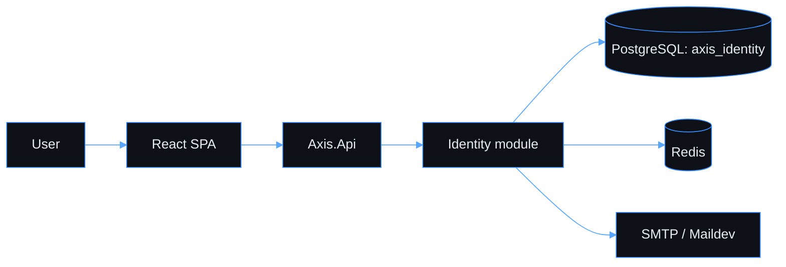

# Axis Documentation

> **Navigation**: [AGENTS.md](../AGENTS.md)

Axis is currently a focused registration product slice: standalone email/password registration, email verification, PKCE token exchange, and a verified-user dashboard.

## Primary Docs

| Doc | Use |
|---|---|
| [Product Vision](./PRODUCT_VISION.md) | Current product scope and explicit non-scope. |
| [Architecture](./ARCHITECTURE.md) | Current runtime shape and boundaries. |
| [Tech Stack](./TECH_STACK.md) | Approved libraries and ADRs that still apply. |
| [Use cases](./use-cases/README.md) | Implemented or actively specified use cases only. |
| [Progress](./PROGRESS.md) | Current layer status. |
| [Workarounds](./WORKAROUNDS.md) | Active intentional shortcuts. Empty means no known active shortcuts. |
| [Review findings](./REVIEW_FINDINGS.md) | Enforcement status for recurring review findings. |

## Playbooks

| Playbook | Use |
|---|---|
| [Agent checklist](./playbooks/agent-checklist.md) | Daily workflow, verification, and review checkpoints. |
| [Design Gate](./playbooks/design-gate.md) | Required reasoning artifact before non-trivial changes. |
| [Process](./playbooks/process.md) | Layer workflow and deferred follow-up handling. |
| [API patterns](./playbooks/api-patterns.md) | REST/OpenAPI and API-type change guidance. |
| [Frontend](./playbooks/frontend.md) | SPA implementation guidance. |
| [Design system](./playbooks/design-system.md) | Tokens, primitives, and frontend design contracts. |
| [Design source](./playbooks/design-source.md) | Design-source ownership rules. |
| [Visual artifact checklist](./playbooks/visual-artifact-checklist.md) | Checklist for diagrams and committed visual artifacts. |
| [Testing](./playbooks/testing.md) | Backend and frontend test conventions. |
| [Docs style](./playbooks/docs-style.md) | Documentation ownership and size rules. |
| [Scripts](./playbooks/scripts.md) | Axis CLI and repo script standards. |
| [Local dev](./playbooks/local-dev.md) | Local stack commands and ports. |
| [Local HTTPS](./playbooks/local-https.md) | Local certificate setup. |
| [Mermaid](./playbooks/mermaid.md) | Diagram theme rules. |
| [Code hygiene](./playbooks/code-hygiene-patterns.md) | Focused hygiene checks. |

## Current Diagram

## Single Source Of Truth

| Topic | Owner |
|---|---|
| Agent rules and current boundaries | [AGENTS.md](../AGENTS.md) |
| Product scope | [PRODUCT_VISION.md](./PRODUCT_VISION.md) |
| Runtime architecture | [ARCHITECTURE.md](./ARCHITECTURE.md) |
| Library and ADR choices | [TECH_STACK.md](./TECH_STACK.md) |
| Use-case acceptance criteria | [docs/use-cases](./use-cases/README.md) |
| Layer status | [PROGRESS.md](./PROGRESS.md) |
| Active shortcuts | [WORKAROUNDS.md](./WORKAROUNDS.md) |

When two docs disagree, update the owner first and convert the other document back into a pointer.
