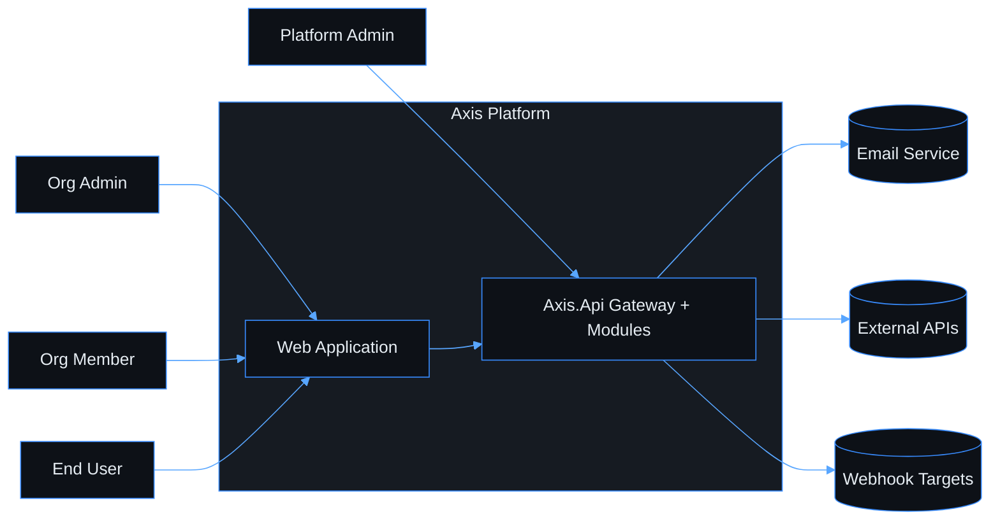
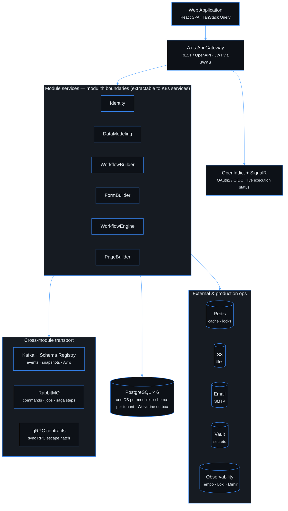
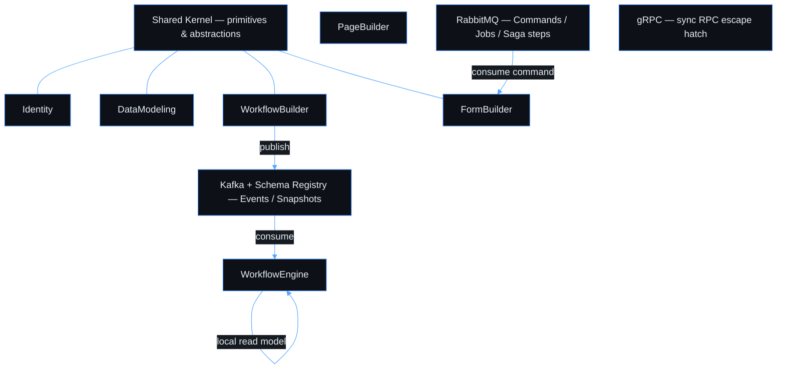

# Axis Platform — Documentation

> **Navigation**: [← CLAUDE.md](../CLAUDE.md)

> A low-code SaaS platform for building data-driven workflow applications.

---

## Navigation

| Section | Description |
|---|---|
| [Product Vision](./PRODUCT_VISION.md) | Goals, target users, problem & solution |
| [Tech Stack](./TECH_STACK.md) | Technology decisions and rationale |
| [Architecture](./ARCHITECTURE.md) | System design, modules, data strategy |
| [Use cases](./use-cases/README.md) | Product specs: domains, use cases, wireframes, diagrams, implementation progress |

### Playbooks (how-to guides)

| Playbook | Description |
|---|---|
| [Local dev](./playbooks/local-dev.md) | Run the full stack with `docker compose up` — URLs, ports, hot reload, reset commands |
| [Process](./playbooks/process.md) | Step-by-step implementation workflow — backend and frontend; deferred follow-ups and PR wrap-up checklist |
| [Design Gate](./playbooks/design-gate.md) | **Agents:** mandatory pre-code reasoning — re-derive the rules for the surface you touch, produce the dossier, sign-off on high-risk before coding |
| [PR slicing](./playbooks/pr-slicing.md) | **Agents:** split large use cases into genuinely isolated, mergeable PRs — two-sided isolation test, shared-seam ownership, merge/rebase cadence |
| [Repo layout discovery](./playbooks/repo-layout-discovery.md) | **Agents:** auto vs manual CI maps (module → docs, Kafka, buf, indexes) + checklists before push |
| [Patterns](./playbooks/patterns.md) | Technical patterns, pitfalls, and code examples |
| [Testing](./playbooks/testing.md) | Test isolation, naming, file layout, mocking rules — .NET and frontend |
| [Frontend](./playbooks/frontend.md) | TanStack Query patterns, TypeScript discipline, routing, component design |
| [Wireframe kit](./playbooks/wireframes.md) | Screen generators, kit sections; **agents:** [spacing & blocks contract](./wireframes/README.md#agent-contract) |
| [Visual artifact checklist](./playbooks/visual-artifact-checklist.md) | Required review checklist for diagrams/wireframes/use-case visuals before commit |
| [Mermaid theme](./playbooks/mermaid.md) | One `%%{init}%%` for every diagram in `docs/` |
| [Docs style](./playbooks/docs-style.md) | Anti-patterns for `.md` files — single-owner rule, size budgets, when to create vs absorb |
| [Review findings](./REVIEW_FINDINGS.md) | Recurring review finding classes → Enforced / Partial / Review-only / Guidance status; wired to Retrospective review |

---

## Domains overview

| Domain | Status |
|---|---|
| [platform-foundation](./use-cases/platform-foundation/README.md) | 🚧 In Progress |
| [identity-access](./use-cases/identity-access/README.md) | 🚧 In Progress |
| [data-modeling](./use-cases/data-modeling/README.md) | 🚧 In Progress |
| [workflow-builder](./use-cases/workflow-builder/README.md) | 🚧 In Progress |
| [form-builder](./use-cases/form-builder/README.md) | 🚧 In Progress |
| [workflow-engine](./use-cases/workflow-engine/README.md) | 🚧 In Progress |
| [page-builder](./use-cases/page-builder/README.md) | ⏳ Not started |

---

## Key Diagrams

Platform **architecture** diagrams live here as **Mermaid** (one shared [dark theme](./playbooks/mermaid.md) via `docs/diagrams/mermaid-theme.mjs`). **UI wireframes** stay Excalidraw — see [Wireframes](#wireframes) below.

Use-case **sequence / entity** diagrams live in each use-case `README.md` under `## Diagrams` (also Mermaid). Index:

| Diagram | Owner |
|---|---|
| Organization onboarding journey | [register-org § Diagrams](./use-cases/platform-foundation/register-org/README.md#diagrams) |
| User registration journey | [register-user § Diagrams](./use-cases/identity-access/register-user/README.md#diagrams) |
| Auth flow | [sign-in § Diagrams](./use-cases/identity-access/sign-in/README.md#diagrams) |
| Data model | [create-model § Diagrams](./use-cases/data-modeling/create-model/README.md#diagrams) |
| Workflow model | [create-workflow § Diagrams](./use-cases/workflow-builder/create-workflow/README.md#diagrams) |
| Form model | [create-form § Diagrams](./use-cases/form-builder/create-form/README.md#diagrams) |
| Execution flow | [start-execution § Diagrams](./use-cases/workflow-engine/start-execution/README.md#diagrams) |

### System context

External actors and the Axis platform boundary. Detail: [ARCHITECTURE.md § System Context](./ARCHITECTURE.md#system-context).

### Container diagram

Runtime containers in **layers** (top → bottom). Each module owns one PostgreSQL database; messaging is one shared layer below the module row. Detail: [ARCHITECTURE.md § Containers](./ARCHITECTURE.md#containers) (table + ADRs).

### Module overview

Cross-module communication (Kafka events, RabbitMQ commands, gRPC escape hatch). Detail: [ARCHITECTURE.md](./ARCHITECTURE.md).

## Wireframes

Screen wireframes use Excalidraw (`.excalidraw` + `.svg`). Each use case lists its screens under `## Wireframes` in that use case’s README.

| What | Where |
|------|--------|
| Browse by domain | [use-cases](./use-cases/README.md) → domain `README.md` → use-case `README.md` → `## Wireframes` |
| Shared app shell | [wireframes/app-shell](./wireframes/app-shell.excalidraw) (kit under [wireframes/](./wireframes/), generators in [wireframes.md](./playbooks/wireframes.md)) |
| Use-case layout rules | [USE_CASE_TEMPLATE](./use-cases/USE_CASE_TEMPLATE.md) · [docs-style § Wireframes](./playbooks/docs-style.md#wireframes-content-rules) |

**Example use cases** (full wireframe table + screen flow):

| Use case | Why open this |
|----------|----------------|
| [register-org § Wireframes](./use-cases/platform-foundation/register-org/README.md#wireframes) | Multi-screen organization onboarding path, error `*-states`, links to Mermaid diagrams |

Regenerate screen `.svg` after `.excalidraw` changes: `node docs/wireframes/generate-screens.mjs` and Kroki (see [wireframes.md](./playbooks/wireframes.md)).

---

## Single source of truth per topic

When two docs disagree, the **owner** wins. Update the owner first; everything else is a pointer.

| Topic | Owner |
|---|---|
| Use-case layout (flow + AC + artifacts + status) | [use-cases/USE_CASE_TEMPLATE.md](./use-cases/USE_CASE_TEMPLATE.md) + [playbooks/docs-style.md](./playbooks/docs-style.md#use-case-files--wireframes--implementation-status) |
| Product scope, target users, production requirements | [PRODUCT_VISION.md](./PRODUCT_VISION.md) |
| Library versions and ADRs | [TECH_STACK.md](./TECH_STACK.md) |
| Source tree and module boundaries | [../CLAUDE.md](../CLAUDE.md) |
| Per-use-case ACs and current gaps | `docs/use-cases/{domain}/{short-slug}/README.md` |
| Module-wide layer status | [PROGRESS.md](./PROGRESS.md) |
| Daily agent workflow + gates | [playbooks/agent-checklist.md](./playbooks/agent-checklist.md) |
| Local dev (compose, ports, URLs) | [playbooks/local-dev.md](./playbooks/local-dev.md) + [`docker-compose.yml`](../docker-compose.yml) |
| Implementation patterns and pitfalls | [playbooks/patterns.md](./playbooks/patterns.md) (start at [patterns-index.md](./playbooks/patterns-index.md)) |
| UI wireframes (per screen / use case) | `docs/use-cases/{domain}/{use-case}/README.md` → `## Wireframes` ([hub § Wireframes](./README.md#wireframes) for navigation only) |
