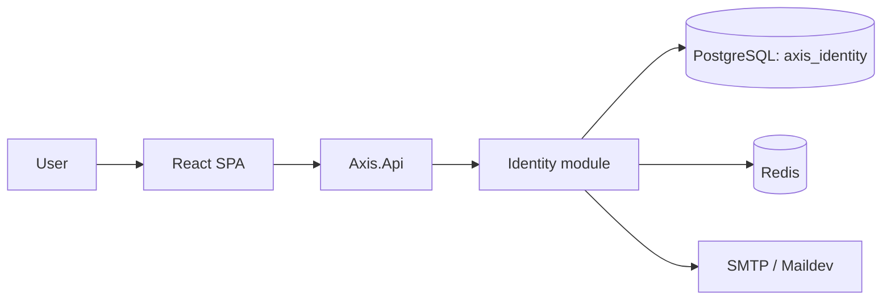

# Axis Documentation

> **Navigation**: [AGENTS.md](../AGENTS.md)

Axis is an open-source platform being built for adaptable, workflow-driven business applications.

## Primary Docs

| Doc | Use |
|---|---|
| [docs/ARCHITECTURE.md](./ARCHITECTURE.md) | Current runtime shape and boundaries. |
| [docs/TECH_STACK.md](./TECH_STACK.md) | Approved stack baseline and version owners. |
| [docs/use-cases/README.md](./use-cases/README.md) | Implemented or actively specified use cases only. |
| [docs/ENFORCEMENT.md](./ENFORCEMENT.md) | Enforcement status for recurring rule classes. |

## Playbooks

| Playbook | Use |
|---|---|
| [docs/playbooks/agent-checklist.md](./playbooks/agent-checklist.md) | Review checkpoints and verification boundary. |
| [docs/playbooks/design-gate.md](./playbooks/design-gate.md) | Required reasoning artifact before non-trivial changes. |
| [docs/playbooks/api-patterns.md](./playbooks/api-patterns.md) | REST/OpenAPI and API-type change guidance. |
| [docs/playbooks/frontend.md](./playbooks/frontend.md) | SPA implementation guidance. |
| [docs/playbooks/testing.md](./playbooks/testing.md) | Backend and frontend test conventions. |
| [docs/playbooks/docs-style.md](./playbooks/docs-style.md) | Documentation ownership and size rules. |
| [docs/playbooks/scripts.md](./playbooks/scripts.md) | Axis CLI and repo script standards. |
| [docs/playbooks/local-dev.md](./playbooks/local-dev.md) | Local stack commands and ports. |

## Current Diagram

