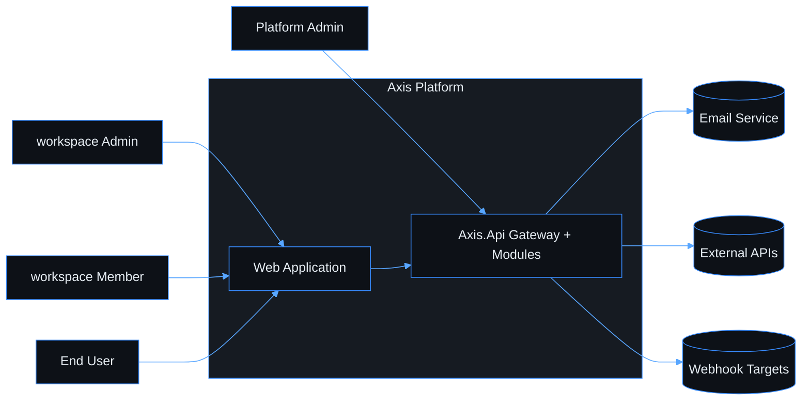
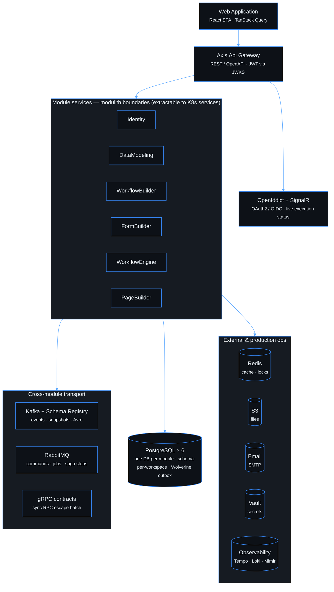
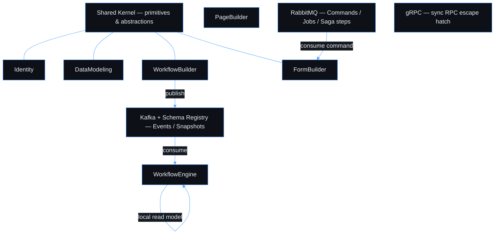

# Axis Platform — Documentation

> **Navigation**: [← AGENTS.md](../AGENTS.md)

> A low-code SaaS platform for building data-driven workflow applications.

---

## Navigation

| Section | Description |
|---|---|
| [Product Vision](./PRODUCT_VISION.md) | Goals, target users, problem & solution |
| [Tech Stack](./TECH_STACK.md) | Technology decisions and rationale |
| [Architecture](./ARCHITECTURE.md) | System design, modules, data strategy |
| [Use cases](./use-cases/README.md) | Product specs: domains, use cases, design sources, diagrams, implementation progress |

### Playbooks (how-to guides)

| Playbook | Description |
|---|---|
| [Local dev](./playbooks/local-dev.md) | Run the full stack with `python scripts/axis.py local-dev up` — baseline commands, URLs, ports, environment adapters |
| [Process](./playbooks/process.md) | Step-by-step implementation workflow — backend and frontend; deferred follow-ups and PR wrap-up checklist |
| [Design Gate](./playbooks/design-gate.md) | **Agents:** mandatory pre-code reasoning — re-derive the rules for the surface you touch, produce the dossier, sign-off on high-risk before coding |
| [PR slicing](./playbooks/pr-slicing.md) | **Agents:** split large use cases into genuinely isolated, mergeable PRs — two-sided isolation test, shared-seam ownership, merge/rebase cadence |
| [Repo layout discovery](./playbooks/repo-layout-discovery.md) | **Agents:** auto vs manual CI maps (module → docs, Kafka, buf, indexes) + checklists before review |
| [Patterns index](./playbooks/patterns-index.md) | Router to the focused technical-pattern owner docs |
| [Domain/Application patterns](./playbooks/domain-application-patterns.md) | Domain behavior, `Result`, aggregate boundaries, application idempotency |
| [Dependency patterns](./playbooks/dependency-patterns.md) | NuGet/CPM and dependency-injection pitfalls |
| [Persistence patterns](./playbooks/persistence-patterns.md) | EF Core, repositories, workspace schema, migrations |
| [API patterns](./playbooks/api-patterns.md) | Minimal API, DTOs, OpenAPI, pagination, HTTP mapping |
| [Runtime patterns](./playbooks/runtime-patterns.md) | Async, cancellation, background work, OpenTelemetry |
| [Wolverine patterns](./playbooks/wolverine-patterns.md) | Wolverine host setup, handlers, jobs, idempotency, logging |
| [Cross-module patterns](./playbooks/cross-module-patterns.md) | Cross-module data sovereignty, Kafka/local read models, violation sweeps |
| [gRPC patterns](./playbooks/grpc-patterns.md) | gRPC escape hatch, proto/Buf compatibility, grpcurl, JWKS validation |
| [Code hygiene patterns](./playbooks/code-hygiene-patterns.md) | Pre-commit hygiene and policy regex constraints |
| [Testing](./playbooks/testing.md) | Test isolation, naming, file layout, mocking rules — .NET and frontend |
| [Frontend](./playbooks/frontend.md) | UX-first UI rules, TanStack Query patterns, TypeScript discipline, routing, component design |
| [Design system](./playbooks/design-system.md) | Tokens, reusable components, pixel-perfect definition, and contract workflow |
| [Design source](./playbooks/design-source.md) | Open Design package workflow, design-source handoff, and source/preview link rules |
| [Wireframe kit](./playbooks/wireframes.md) | Low-fidelity screen intent and use-case visual inventory; **agents:** [wireframe contract](./wireframes/README.md#agent-contract) |
| [Visual artifact checklist](./playbooks/visual-artifact-checklist.md) | Required review checklist for diagrams, design sources, and use-case visuals before commit |
| [Mermaid theme](./playbooks/mermaid.md) | One `%%{init}%%` for every diagram in `docs/` |
| [Docs style](./playbooks/docs-style.md) | Anti-patterns for `.md` files — single-owner rule, size budgets, when to create vs absorb |
| [Review findings](./REVIEW_FINDINGS.md) | Recurring review finding classes → Enforced / Partial / Review-only / Guidance status; wired to Retrospective review |

---

## Domains overview

| Domain | Status |
|---|---|
| [platform-foundation](./use-cases/platform-foundation/README.md) | 🚧 In Progress |
| [identity-access](./use-cases/identity-access/README.md) | 🚧 In Progress |
| [data-modeling](./use-cases/data-modeling/README.md) | 🚧 In Progress |
| [workflow-builder](./use-cases/workflow-builder/README.md) | 🚧 In Progress |
| [form-builder](./use-cases/form-builder/README.md) | 🚧 In Progress |
| [workflow-engine](./use-cases/workflow-engine/README.md) | 🚧 In Progress |
| [page-builder](./use-cases/page-builder/README.md) | ⏳ Not started |

---

## Key Diagrams

Platform **architecture** diagrams live here as **Mermaid** (one shared [dark theme](./playbooks/mermaid.md) via `docs/diagrams/mermaid_theme.py`). **UI design sources** are indexed from each use-case `## Design Sources` table — see [Design Sources](#design-sources) below.

Use-case **sequence / entity** diagrams live in each use-case `README.md` under `## Diagrams` (also Mermaid). Index:

| Diagram | Owner |
|---|---|
| Workspace onboarding journey | [register-workspace § Diagrams](./use-cases/platform-foundation/register-workspace/README.md#diagrams) |
| Standalone user registration journey | [register-user § Diagrams](./use-cases/identity-access/register-user/README.md#diagrams) |
| Auth flow | [sign-in § Diagrams](./use-cases/identity-access/sign-in/README.md#diagrams) |
| Data model | [create-model § Diagrams](./use-cases/data-modeling/create-model/README.md#diagrams) |
| Workflow model | [create-workflow § Diagrams](./use-cases/workflow-builder/create-workflow/README.md#diagrams) |
| Form model | [create-form § Diagrams](./use-cases/form-builder/create-form/README.md#diagrams) |
| Execution flow | [start-execution § Diagrams](./use-cases/workflow-engine/start-execution/README.md#diagrams) |

### System context

External actors and the Axis platform boundary. Detail: [ARCHITECTURE.md § System Context](./ARCHITECTURE.md#system-context).

### Container diagram

Runtime containers in **layers** (top → bottom). Each module owns one PostgreSQL database; messaging is one shared layer below the module row. Detail: [ARCHITECTURE.md § Containers](./ARCHITECTURE.md#containers) (table + ADRs).

### Module overview

Cross-module communication (Kafka events, RabbitMQ commands, gRPC escape hatch). Detail: [ARCHITECTURE.md](./ARCHITECTURE.md).

## Design Sources

Screen design-source links and previews live with their owning use case. This hub is navigation only; design-source workflow lives in [design-source.md](./playbooks/design-source.md), the shared Open Design package starts at [`DESIGN.md`](../design-sources/open-design/axis/DESIGN.md), and low-fidelity/source-table rules live in [wireframes.md](./playbooks/wireframes.md), [docs-style.md](./playbooks/docs-style.md#use-case-files--design-sources--implementation-status), and [visual-artifact-checklist.md](./playbooks/visual-artifact-checklist.md).

| What | Where |
|------|--------|
| Browse by domain | [use-cases](./use-cases/README.md) → domain `README.md` → use-case `README.md` → `## Design Sources` |
| Design-source workflow | [design-source.md](./playbooks/design-source.md) |
| Shared Open Design package | [`DESIGN.md`](../design-sources/open-design/axis/DESIGN.md) |
| Shared app shell | Shared design source; legacy preview: [wireframes/app-shell](./wireframes/app-shell.excalidraw) |
| Canonical multi-screen example | [register-workspace § Design Sources](./use-cases/platform-foundation/register-workspace/README.md#design-sources) |

---

## Single source of truth per topic

When two docs disagree, the **owner** wins. Update the owner first; everything else is a pointer.

| Topic | Owner |
|---|---|
| Use-case layout (flow + AC + artifacts + status) | [use-cases/USE_CASE_TEMPLATE.md](./use-cases/USE_CASE_TEMPLATE.md) + [playbooks/docs-style.md](./playbooks/docs-style.md#use-case-files--design-sources--implementation-status) |
| Product scope, target users, production requirements | [PRODUCT_VISION.md](./PRODUCT_VISION.md) |
| Library versions and ADRs | [TECH_STACK.md](./TECH_STACK.md) |
| Source tree and module boundaries | [../AGENTS.md](../AGENTS.md) |
| Per-use-case ACs and current gaps | `docs/use-cases/{domain}/{short-slug}/README.md` |
| Module-wide layer status | [PROGRESS.md](./PROGRESS.md) |
| Daily agent workflow + gates | [playbooks/agent-checklist.md](./playbooks/agent-checklist.md) |
| Local dev (Axis CLI, compose graph, ports, URLs, environment adapters) | [playbooks/local-dev.md](./playbooks/local-dev.md) + [`docker-compose.yml`](../docker-compose.yml) |
| Implementation patterns and pitfalls | [playbooks/patterns-index.md](./playbooks/patterns-index.md) routes to the focused owner docs; [playbooks/patterns.md](./playbooks/patterns.md) is a compatibility router only |
| Design-system tokens, component inventory, and component contract workflow | [playbooks/design-system.md](./playbooks/design-system.md) |
| Product design source, Open Design package, and agent workflow | [playbooks/design-source.md](./playbooks/design-source.md) |
| UI design sources and preview rows (per screen / use case) | `docs/use-cases/{domain}/{use-case}/README.md` → `## Design Sources` ([hub § Design Sources](./README.md#design-sources) for navigation only) |
