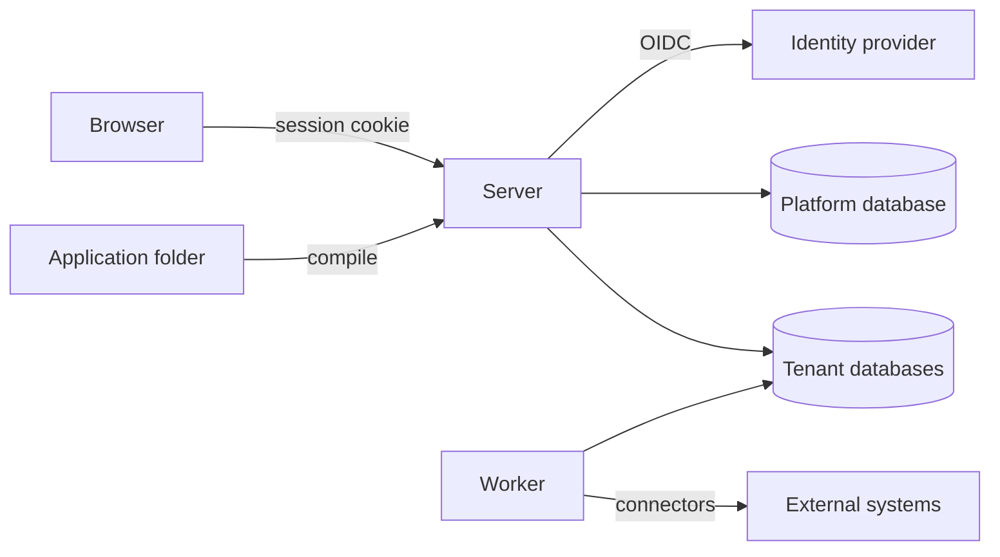
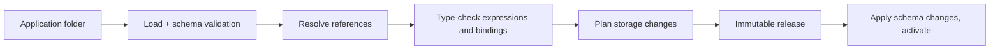

# Axis architecture

This is the target structure. Sections marked *(planned for Mx)* describe work
that has not been built yet. Decisions referenced as Dn are in
[decisions.md](decisions.md).

## Overview



- **Axis.Server** serves the SPA. It is the BFF (OIDC client and cookie
  session) and hosts the authoring and runtime APIs.
- **Axis.Worker** *(planned for M3)* executes durable work: process steps,
  timers, outbox delivery, triggers and schedules. It loads the same modules
  as the server.
- **Platform database** stores installation-level data: the tenant directory
  and platform settings.
- **Tenant databases** hold everything else for one tenant: releases, system
  tables, process state, audit and the generated entity tables (D10).

## Repository layout

```text
src/
  Axis.Server/            ASP.NET Core host: API, BFF, SPA hosting
  Axis.Worker/            background host (M3)
  Axis.Core/              shared primitives: ids, results, clock, tenant context
  Axis.Configuration/     resource model, file loader, JSON Schemas, compiler, diagnostics, releases
  Axis.Expressions/       expression parser, type checker, interpreter (M2)
  Axis.Data/              entity storage mapping, schema planning, record commands, data sources
  Axis.Processes/         process engine, tasks, outbox, timers (M3)
  Axis.Policy/            roles, policies, evaluation (M4)
  Axis.Presentation/      site/page/widget metadata served to the SPA
  Axis.Tenancy/           tenant resolution, connection factory
web/                      React + TypeScript SPA (Vite), Ant Design, ProComponents
tests/
  Axis.*.Tests/           unit tests and PostgreSQL integration tests per module
  e2e/                    Playwright journeys against the running server
    fixtures/e2e-app/     generic test application the E2E server activates
samples/
  apps/purchase-requests/ the first sample application, as configuration only
```

Projects are created when the first issue needs them. M0 contains only
`Axis.Server`, the test projects and `web/`. `Axis.Configuration`, `Axis.Data`,
`Axis.Core` (only the tenant context so far), `Axis.Presentation` (the
platform site, its texts and the shapes of application site metadata) and
`Axis.Tenancy` exist now.

## Module rules

- **Ownership.** Each module owns its tables and its public contracts. Other
  modules use only those contracts and never read another module's tables
  directly.
- **Dependency direction.** Dependencies point inward:
  - Hosts depend on modules.
  - Modules depend on `Axis.Core` and on other modules' contracts.
  - Nothing depends on a host.
- **Shared transactions.** A module that takes part in a step transaction
  receives the shared connection and transaction through a unit-of-work
  contract. Writes through EF Core and through Npgsql commit together.
- **Persistence boundary.** Engine logic does not depend on ASP.NET Core or on
  persistence details. It depends on small interfaces with infrastructure
  implementations (ports and adapters).
- **Commands and queries.** Commands enforce state transitions. Queries return
  authorized projections. Both use the same tenant database (no separate read
  store).

## Configuration pipeline



1. **Load.** Every `*.json` file in the folder and its subfolders is one
   resource. Each is validated against the JSON Schema for its `kind`
   (`application`, `entity`, `site`, `page` or `text`). The manifest is the single `application`
   resource, stored as `application.json` at the folder root; an `application`
   resource in any other file is not used as the manifest. Resource IDs are
   unique across the application, compared as UUIDs. Names are unique per
   kind, ignoring letter case. The same checks run on a release's stored
   resources when the server rebuilds its model.
2. **Resolve.** Every reference must resolve inside the application or its
   declared modules. The entity model is built here: each field's `type`
   becomes a typed field type, every type-specific property is checked against
   the field type and against what storage accepts (see
   [Entity field types and constraints](#entity-field-types-and-constraints)),
   field names must be unique within their entity ignoring letter case, and a
   reference field's `target` must name a loaded entity, ignoring letter case.
   An entity may reference itself. A `target` naming an entity whose file is
   in the folder, has kind `entity` and a string `name`, but was not loaded
   because of its own errors (such as a schema violation) is not reported
   again; only that file's own diagnostics are.
   - **Texts.** Each `text` resource holds the texts of one locale. Two text
     resources for the same locale, ignoring letter case, are `AXC0026` at
     `/locale` of the later file in path order. Every locale must have the
     same keys: a key that one locale has and another lacks is `AXC0027` at
     `/texts` of the file that lacks it, once per key, naming the first
     locale in path order that has it. A file already reported as a duplicate
     locale is left out of this check. Keys are compared ordinally.
   - **Labels.** The text key of the application label, an entity label or a
     field label must be in some locale, otherwise it is `AXC0028` at that
     label's `/textKey`. This applies also when the application has no text
     resource. Unused keys are allowed.
   - **Display field.** An entity's `displayField` must name one of its own
     required `text` fields, ignoring letter case, otherwise it is `AXC0029`
     at `/displayField`. Every entity that is the `target` of a reference,
     including a reference to itself, must have a `displayField`, otherwise
     the reference is `AXC0030` at `/fields/{i}/target`. It is not reported
     when the target is already `AXC0012` or names an entity file that was
     not loaded.
   - **Sites and pages.** A site belongs to one application. Its `path` is
     lower-case letters, digits and hyphens, starting with a letter. A path
     reserved by the platform (`api`, `health`, `assets`), or one that an
     earlier site of the application already uses in path order, is
     `AXC0024` at `/path`. A reserved path is not also checked for
     duplicates. The `default` and `fallback` locales must be in
     `available`, and every available locale needs a `text` resource,
     ignoring letter case, otherwise it is `AXC0025`. A widget's `entity`
     must name a loaded entity (`AXC0021`). A `formPage` is allowed only on
     a `table` widget and must name a page whose widget is a `form` over the
     same entity (`AXC0022`). A navigation entry must name a loaded page
     (`AXC0023`). Entity and page names resolve ignoring letter case, and a
     name whose file was not loaded because of its own errors is not
     reported again. Site titles, navigation labels and page titles join the
     `AXC0028` check.

   The model holds the text resources, each entity's display field, and the
   sites and pages with their entity and page references resolved. No model
   is produced while any error remains.
3. **Check.** Expressions, data source fields, form bindings and operation
   inputs are type-checked.
4. **Plan.** The current tenant schema is compared with the new entity
   definitions. Additive changes are planned automatically; incompatible
   changes are rejected with a diagnostic until migrations exist (M6). See
   [Schema planning](#schema-planning).
5. **Release.** The compiled application is stored as a release with a
   content hash. It is immutable.
   - **Content hash.** Every resource file is canonicalized as in RFC 8785
     (JCS): no whitespace, object properties sorted by UTF-16 code units,
     minimal string escaping, numbers written as ECMAScript does. The hash is
     SHA-256 over every resource in ordinal order of its relative path (`/`
     separators), each contributing `path`, a newline, its canonical JSON and
     a newline, encoded as UTF-8. It is written as lowercase hex.
     Formatting-only changes (whitespace, key order, line endings) keep the
     hash; a changed value, or an added, removed or renamed file changes it.
   - **Identity.** A release is unique per application `id` and content hash.
     Compiling an unchanged folder returns the stored release instead of
     storing a second one, also when two compiles run at the same time.
   - **Content.** A release stores the canonical content of every resource
     with its relative path, so it can be read back without the folder.
   - **Errors.** A folder with any error diagnostic produces no release;
     compile returns the diagnostics only.
6. **Activate.** Schema changes are applied. The release becomes active for
   new work only after preparation has completed successfully.
   - **Active release.** Each application `id` has at most one active
     release, stored with the manifest `name` as written. The name is unique
     across the active applications, ignoring letter case; names are ASCII
     (`AXC0004`), so the database's `lower(name)` matches. An application
     may change its name: its active release then holds the new name and the
     old one is free for another application.
   - **Site paths.** A site path is active for at most one application `id`
     in the tenant. The active release stores the paths of its sites. A site
     whose path another application's active release holds gets `AXC0031` at
     `/path` of its site file. Activation checks the paths before
     provisioning, and a unique index on the path enforces the rule when the
     active release is set. Site paths are lower-case (`AXC0004`), so the
     plain index already ignores letter case.
   - **Order.** Activation first checks that no other application `id` is
     active under the manifest name; if one is, it returns `AXC0020` and
     changes nothing. It then checks each site path; it returns one `AXC0031`
     for every site whose path another application holds, and changes
     nothing. It then provisions the entity tables (see
     [Storage](#storage)); when provisioning returns diagnostics, they are
     returned and the active release is untouched. Only then is the release
     set active, in one upsert per application `id`, so two activations of
     the same application never conflict and the last one wins. When another
     application took the name after the check, the upsert is refused and
     activation returns the same `AXC0020`. When another application took a
     site path after the check, the unique index refuses it and activation
     returns one `AXC0031` for that path.
   - **Transactions.** Provisioning runs in its own transaction (DDL,
     provisioning records and the schema lock). The active release and its
     `axis.active_sites` rows are written afterwards, after provisioning
     committed, in one short transaction of their own. A refused name or path
     leaves neither written. No other configuration statement runs while the
     provisioning transaction is open, so the caller may use one tenant
     connection for both or two connections. Activation must run outside an
     explicit transaction.
   - **Failure after provisioning.** When writing the active release fails
     after provisioning committed, the error propagates. The new tables and
     columns stay, recorded for the application, and the previous release
     stays active and keeps serving: it reads and writes only its own
     columns, so only a new required column on a table that had no rows
     rejects its inserts. Activating again is safe because provisioning is
     additive. An activation that loses the name or a site path to a
     concurrent one also
     leaves its provisioned tables in place, recorded for its application
     `id` and not active.
   - **Re-activation.** Activating the active release again provisions
     nothing, keeps its site paths and changes only its activation time. A
     release that renames a site path frees the old path for another
     application.
   - **Serving.** The server rebuilds the `ApplicationModel` from the
     release's stored resources through `IActiveReleaseStore` and caches it
     per tenant and release id. A stored release that no longer compiles
     clean, or compiles to another content hash, is an error, never served.
     The active row is read on every request, so a new activation is served
     by the next request. A name outside the manifest name rule (an ASCII
     letter, then ASCII letters or digits, at most 60 characters) resolves to
     nothing without a query, so Unicode case folding such as the Kelvin sign
     never aliases an application name.

Diagnostics always carry `file`, `resourceId` (when the file has a readable
ID), `path`, `code` and a message. `file` is relative to the application
folder and uses `/` separators, or is empty when the diagnostic concerns the
whole application folder. `path` is a JSON Pointer (RFC 6901) into that file,
such as `/fields/0/type`, or empty when the problem concerns the whole file or
the whole folder. Messages never contain absolute paths or exception text,
because they are shown to application authors. Codes have the form `AXCnnnn`
and never change meaning. Compile reports all diagnostics, not just the first,
sorted by file and then path.

| Code | Meaning |
| --- | --- |
| `AXC0001` | The file is not valid JSON. |
| `AXC0002` | The resource has no `kind`, or `kind` is not a string. |
| `AXC0003` | The `kind` is not a known resource kind. |
| `AXC0004` | The resource does not match the JSON Schema for its kind. |
| `AXC0005` | Another resource already uses this `id`. |
| `AXC0006` | Another resource of the same kind already uses this `name`. |
| `AXC0007` | The folder has no `application` manifest. |
| `AXC0008` | The folder has more than one `application` manifest. |
| `AXC0009` | An `application` resource is not `application.json` at the folder root, or the root `application.json` has another kind. |
| `AXC0010` | The file could not be read, for example because access is denied. |
| `AXC0011` | Another field of the same entity already uses this `name`, ignoring letter case. |
| `AXC0012` | A reference field's `target` names no loaded entity. Not reported when the target names an entity file in the folder that was not loaded because of its own errors. |
| `AXC0013` | A field property does not fit the field's type, or its value is outside what storage accepts. |
| `AXC0014` | A field lacks a property its type needs: `target` on a reference, `values` on an enum. |
| `AXC0015` | An entity table has a column whose field was removed. Reported at `/fields` of the entity file. |
| `AXC0016` | A field changed in a way its existing column cannot follow, such as a new type, a shorter `maxLength` or a removed enum value. |
| `AXC0017` | An entity provisioned for the application is missing from it. Reported at `application.json` with an empty path. |
| `AXC0018` | The entity's `id` is already provisioned for another application. Reported at `/id` of the entity file. |
| `AXC0019` | The application folder could not be listed: it does not exist, it cannot be opened, or one of its subfolders cannot be opened. Reported with an empty `file` and `path`, as the only diagnostic; nothing in the folder is loaded. |
| `AXC0020` | The application's `name` is active for another application `id`, ignoring letter case. Reported at `/name` of `application.json`, as the only diagnostic; nothing is provisioned or activated. |
| `AXC0021` | A widget's `entity` names no loaded entity. Reported at `/widgets/{i}/entity`. |
| `AXC0022` | A widget's `formPage` is set on a `form` widget, names no loaded page, or names a page whose widget is not a `form` over the same entity. Reported at `/widgets/{i}/formPage`. |
| `AXC0023` | A navigation entry names no loaded page. Reported at `/navigation/{i}/page`. |
| `AXC0024` | A site path is reserved by the platform, or another site of the application already uses it. Reported at `/path` of the later file. |
| `AXC0025` | A site's default or fallback locale is not in `available`, or an available locale has no `text` resource. Reported at that locale. |
| `AXC0026` | Another `text` resource already holds this locale, ignoring letter case. Reported at `/locale` of the later file. |
| `AXC0027` | A text key that another locale has is missing from this locale. Reported at `/texts`, naming the key and a locale that has it. |
| `AXC0028` | No locale has the text key of this label. Reported at the label's `/textKey`. |
| `AXC0029` | The entity's `displayField` names no required `text` field of the entity. Reported at `/displayField`. |
| `AXC0030` | A reference field's target entity has no `displayField`. Reported at `/fields/{i}/target`. |
| `AXC0031` | A site path is active for another application. Reported at `/path` of the site file; nothing is provisioned or activated. |

### Startup activation

The server can compile and activate application folders when it starts, so a
development or E2E server serves a real application without a separate step.

- **Setting.** `ActivateOnStartup` is an array of application folders, such
  as `"ActivateOnStartup": ["../../samples/apps/purchase-requests"]` or the
  environment variable `ActivateOnStartup__0=/path/to/folder`. Relative paths
  are resolved against the server content root. When the setting is absent or
  empty the step does not run. That is the default, and so the Production
  behaviour.
- **Order.** Tenants are processed in ordinal order of their id. For each
  tenant, the step applies the configuration and data migrations to the
  tenant database, then compiles each listed folder against that database and
  activates the release, in the listed order. The same folders apply to
  every tenant.
- **Before listening.** The step runs before any hosted service starts, so
  the server accepts no request until every tenant is done.
- **Failures.** Any compile or activation diagnostic, or any error, stops the
  start and the process exits. Each diagnostic is logged with its code, file
  and path, together with the folder and tenant. An error after provisioning
  committed is logged with the folder and tenant too. The previously active
  release stays active, and the first failing tenant stops the whole start,
  so no server runs with some tenants on old releases and others on new ones.
- **Restarts.** Restarting with unchanged folders is safe. An unchanged
  folder returns its stored release, and activating the active release again
  only updates its activation time. After a failure, the next start
  activates again safely because provisioning is additive.

### Resource file shape

```json
{
  "id": "4b6f0c1e-6a0e-4c47-9a53-0f5f8f8b1a01",
  "kind": "entity",
  "name": "PurchaseRequest",
  "formatVersion": 1,
  "label": { "textKey": "purchaseRequest.label" },
  "displayField": "title",
  "fields": [
    { "name": "title", "type": "text", "required": true, "maxLength": 200 },
    { "name": "department", "type": "reference", "target": "Department", "required": true },
    { "name": "total", "type": "decimal", "precision": 18, "scale": 2 }
  ]
}
```

- `id` is permanent.
- `name` is the stable technical name used in references and storage. It
  starts with a letter, contains only ASCII letters and digits, and is at most
  60 characters long (`AXC0004`). The same rule applies to field names.
- Labels always come from text resources.
- `displayField` names the required `text` field that gives a record its
  name, for example in lookups. An entity that is the target of a reference
  must have one.

A `text` resource holds the texts of one locale, as a map from text key to
text:

```json
{
  "id": "8c3a6b4d-5e6f-4a7b-8c9d-0e1f2a3b4c04",
  "kind": "text",
  "name": "TextsEn",
  "formatVersion": 1,
  "locale": "en",
  "texts": {
    "purchaseRequest.label": "Purchase request"
  }
}
```

- `locale` is a language tag such as `en`, `vi` or `pt-BR`: two or three
  letters, then any number of `-` parts of two to eight letters or digits
  (`AXC0004`). Locales are compared ignoring letter case.
- Each locale has one `text` resource, and every locale has the same keys.
- Texts are never shared across applications.

A `site` is an entry point of the application. A `page` is a route in a
site, and its widgets are its content:

```json
{
  "id": "c5e8d2a1-7b3f-4c9e-9d1a-2f3b4c5d6e06",
  "kind": "site",
  "name": "Purchasing",
  "formatVersion": 1,
  "path": "purchasing",
  "title": { "textKey": "purchasing.title" },
  "locales": { "default": "en", "fallback": "en", "available": ["en", "vi"] },
  "navigation": [{ "page": "PurchaseRequests", "label": { "textKey": "purchasing.nav.requests" } }]
}
```

```json
{
  "id": "d6f9e3b2-8c4a-4d0f-8e2b-3a4c5d6e7f07",
  "kind": "page",
  "name": "PurchaseRequests",
  "formatVersion": 1,
  "title": { "textKey": "pages.requests.title" },
  "widgets": [{ "type": "table", "entity": "PurchaseRequest", "formPage": "PurchaseRequestForm" }]
}
```

- A page holds exactly one widget in M1. The widget `type` is `table` or
  `form`, and both name an `entity`.
- A `table` widget may name a `formPage`: the page with the `form` widget
  that opens one of its records.
- The page has no entity or template of its own, so more widgets and a
  layout can be added later without a format change.

### Entity field types and constraints

A field property is allowed only on the types that have an entry for it below.
Properties are optional unless marked *needed*. A property on another type is
`AXC0013`; a missing *needed* property is `AXC0014`.
Value ranges follow what PostgreSQL accepts, so an invalid value fails at
compile time rather than when the table is created; a value outside the range
is `AXC0013`.

| Type | `required` | `unique` | `maxLength` | `precision` | `scale` | `target` | `values` |
| --- | --- | --- | --- | --- | --- | --- | --- |
| `text` | yes | yes | 1..10485760 | | | | |
| `integer` | yes | yes | | | | | |
| `decimal` | yes | yes | | 1..1000 | 0..`precision`, only with `precision` | | |
| `boolean` | yes | yes | | | | | |
| `date` | yes | yes | | | | | |
| `date-time` | yes | yes | | | | | |
| `enum` | yes | yes | | | | | needed |
| `reference` | yes | yes | | | | needed | |

- `required` and `unique` default to `false`.
- `maxLength` is capped at 10485760, the largest `varchar` length.
- `values` is a non-empty list of distinct strings; the JSON Schema checks
  this (`AXC0004`).
- `target` names an entity in the same application, ignoring letter case.

## Storage

- **Platform tables.** These are managed by EF Core migrations shipped with
  Axis.
- **System tables.** These live in the `axis` schema of each tenant database.
  Each module owns its tables and manages them with its own EF Core context
  and migrations. Each module context keeps its migration history in its own
  table, `axis.__<module>_migrations`, so the contexts sharing the schema do
  not collide.
  - `Axis.Configuration` owns `axis.releases`, `axis.release_resources`,
    `axis.active_releases` (the active release of each application `id`,
    with its name, unique ignoring letter case) and `axis.active_sites` (the
    site paths of each active release, as application `id` and path, unique
    on path), with history in `axis.__configuration_migrations`. The caller
    supplies the tenant database connection. Other modules read and set the
    active release and its site paths only through `IActiveReleaseStore`;
    they never use `axis.active_releases`, `axis.active_sites` or the
    configuration context directly.
  - `Axis.Data` owns `axis.provisioned_entities` (each provisioned entity
    with its application and table) and `axis.provisioned_enum_values` (each
    recorded enum value), with history in `axis.__data_migrations`.
  - Releases are immutable, enforced through the context's change tracking:
    a release and its resources are only inserted together. Saving fails when
    a stored release or resource is modified or deleted, or when a resource is
    added to a stored release. Bulk operations (`ExecuteUpdate`,
    `ExecuteDelete`) and raw SQL bypass this guard; a database-level guard
    is a later change.
- **Entity tables.** These are generated per entity in the tenant database and
  live in the `entities` schema, separate from the `axis` system tables.
  `Axis.Data` plans them (see [Schema planning](#schema-planning)) and
  applies the plan.
  - In M1, plan and apply run together in one transaction. One fixed
    advisory transaction lock (`pg_advisory_xact_lock`) serializes entity
    schema changes, so the catalog and records read for the plan are still
    current when it is applied.
  - The provisioning records are written in the same transaction as the DDL.
    When the plan has any diagnostic, the transaction is rolled back and
    nothing is applied.
  - The lock does not block runtime writes to entity tables, so a statement
    can still fail, for example adding a `NOT NULL` column after a row was
    inserted following the catalog read. Any failing statement rolls back the
    whole transaction, DDL and records, and the exception propagates.
- **Physical names.** Table and column names are derived from stable IDs and
  names, never from labels. Renaming a label, or renaming an entity while
  keeping its `id`, never touches storage.

  | Object | Name | Length |
  | --- | --- | --- |
  | Table | `e_` + entity `id` as 32 lowercase hex characters | 34 |
  | Primary key column | `id` (`uuid`) | 2 |
  | Version column | `version` (`bigint`) | 7 |
  | Field column | `f_` + field name in lowercase | at most 62 |
  | Primary key | `pk_` + table | 37 |
  | Unique constraint | `uq_` + table + `_` + hash of the column name | 54 |
  | Foreign key | `fk_` + table + `_` + hash of the column name | 54 |

  The hash is the first 16 lowercase hex characters of SHA-256 over the UTF-8
  column name. Because names are ASCII and at most 60 characters, every
  identifier fits PostgreSQL's 63-byte limit by construction and is never
  truncated. Identifiers are always double-quoted in SQL.
- **Column types.** Each field type maps to one PostgreSQL type, spelled as
  `format_type` renders it, so a catalog column matches by string equality.

  | Field type | Column type |
  | --- | --- |
  | `text` | `character varying(n)` with `maxLength`, otherwise `text` |
  | `integer` | `bigint` |
  | `decimal` | `numeric(p,s)` with `precision` (`s` is 0 when `scale` is omitted), otherwise `numeric` |
  | `boolean` | `boolean` |
  | `date` | `date` |
  | `date-time` | `timestamp with time zone` |
  | `enum` | `text`; the values are recorded, not enforced by a `CHECK` |
  | `reference` | `uuid` with a foreign key to the target table's `id` |
- **SQL safety.** Every SQL statement for entity data is built by the data
  module from compiled metadata. Identifiers are resolved and quoted by the
  module; values are always parameters. Configuration can never supply raw SQL.
  Request text, such as the entity segment, `sort` and `values` names, is
  matched against the model's declared names and never used as an identifier.
- **Database credentials.** Runtime access and schema changes use different
  database roles.

### Schema planning

`Axis.Data` compares a compiled application with a snapshot of the tenant
catalog (entity tables, their columns, types, `NOT NULL`, single-column
unique constraints, foreign key targets and whether the table has rows) and
with the provisioning records (each provisioned entity with its application
and table, and each recorded enum value). The records cover the application's
entities and any entity recorded with one of its entity `id`s, whatever its
application. The planner itself has no database
access. It returns diagnostics, SQL statements and the new records to write.

- **System columns.** `id` and `version` are created with the table.
  `version` is added to an existing table that lacks it as
  `bigint NOT NULL DEFAULT 1`, even when the table has rows, because the
  default fills them. System columns are never compared or changed otherwise:
  only Axis DDL creates them, and an author cannot fix them through
  configuration.
- **Missing table.** It is created with the system columns and every field
  column, `NOT NULL` for required fields and a unique constraint for unique
  fields. The entity and its enum values are recorded.
- **Missing column.** It is added. `NOT NULL` is added only when the table
  has no rows; a required field added to a table with rows is `AXC0016` at
  `/fields/{i}/required`. A unique field also gets its unique constraint.
- **Existing column.**
  - The type must equal the expected type. Widening text
    (`character varying(n)` to a larger `n` or to `text`) is applied.
    Narrowing it, including `text` to `character varying(n)`, is `AXC0016` at
    `/fields/{i}/maxLength`. Any other type difference is `AXC0016` at
    `/fields/{i}/type`.
  - Dropping `required` drops `NOT NULL`, and dropping `unique` drops the
    unique constraint. Adding either to an existing column is `AXC0016` at
    `/fields/{i}/required` or `/fields/{i}/unique`.
  - A reference column without a foreign key gets one. A foreign key that
    points at another table than the target's is `AXC0016` at
    `/fields/{i}/target`.
- **Enum values.** Values are compared ordinally, so letter case matters.
  Recorded values missing from the field's `values` are one `AXC0016` at
  `/fields/{i}/values` listing them; new values become new records and need
  no SQL. A column switching between `enum` and another type (recorded values
  present for a non-enum field, or absent for an enum field) is `AXC0016` at
  `/fields/{i}/type`.
- **Removed field.** A column other than the system columns without a
  matching field is `AXC0015` at `/fields`, naming the column.
- **Removed entity.** An entity recorded for the application but missing from
  it is `AXC0017` at `application.json` with an empty path and the entity's
  `id` as `resourceId`.
- **Entity owned by another application.** Tables are keyed by entity `id`,
  so an entity whose `id` is recorded for another application, for example in
  an application copied with only its manifest `id` changed, would share that
  application's table. It is `AXC0018` at `/id` of the entity file, and the
  entity is not planned.
- **Labels.** A label change produces no statements.
- **Order.** Every `CREATE TABLE` comes first, then the `ALTER TABLE` column
  changes, then every `ADD CONSTRAINT ... FOREIGN KEY`, so references between
  entities, cycles and self-references need no further ordering.
- **Errors.** When any diagnostic exists, the plan has no statements and no
  new records; nothing is applied.

## Record API

Records of an entity are read and written through the record API. It serves
the entities of the active release of an application, in the tenant that the
request host resolves to. A record of another tenant does not exist for the
request, so it is a 404 like any unknown record.

The endpoints have no authorization yet. Policies are checked on every record
endpoint from M4 (see "Authentication and authorization").

### Routes

| Method and path | Response |
| --- | --- |
| `GET /api/apps/{app}/entities/{entity}/records?page=&pageSize=&sort=` | `200` with one page of records |
| `GET /api/apps/{app}/entities/{entity}/records/{id}` | `200` with one record |
| `POST /api/apps/{app}/entities/{entity}/records` | `201` with the new record and a `Location` header |
| `PATCH /api/apps/{app}/entities/{entity}/records/{id}` | `200` with the updated record |
| `DELETE /api/apps/{app}/entities/{entity}/records/{id}` | `204` with no body |

`{app}` is the name of an active release, and `{entity}` an entity name in that
release. Both match ignoring letter case. `{id}` is a record id in the
hyphenated 8-4-4-4-12 hex form, in either letter case.

### Record shape

```json
{
  "id": "6f1c2a3b-4d5e-4f60-8a71-92b3c4d5e6f7",
  "version": 1,
  "values": {
    "name": "Desk",
    "quantity": 3,
    "price": 1250.50,
    "orderedAt": "2026-10-06T02:00:00.123456Z",
    "department": "0b9e8d7c-6a5f-4e3d-9c2b-1a0f9e8d7c6b"
  },
  "labels": {
    "department": "Finance"
  }
}
```

`values` holds every declared field of the entity under its declared name, in
declaration order. A field that is SQL `NULL` is `null`; it is never left out.

`labels` maps each `reference` field that is not `null` to the display field
value of the referenced record, so a page can show "Finance" without one more
request per row. It is always present, and it is `{}` when the entity has no
reference or every reference is `null`. A `null` reference has no entry.
`values` keeps the record id of each reference, so a record read and sent back
is unchanged.

The labels come from the same SQL statement as the records, through one left
join per reference field to the target table. They are never read with one
query per row. Create and update return their labels from the same statement
as the write: the write is a data-modifying `WITH` clause, and the labels are
selected from it with the same joins, because `RETURNING` cannot join. Labels
are not filtered by access yet. From M4 the server decides whether a caller may
see the label of a record it cannot read.

A list response is `{ "items": [ ... ], "page": 1, "pageSize": 20,
"totalCount": 42 }`. `items` holds records in the shape above, including
`labels`. `page` and `pageSize` are the values used, and `totalCount` counts
every record of the entity.

### Reading values

| Field type | JSON value |
| --- | --- |
| `text`, `enum` | A string |
| `integer` | A number |
| `decimal` | A number written as PostgreSQL renders the stored `numeric`. It is read as text, so no digit is lost and stored trailing zeros stay, such as `1250.50` |
| `boolean` | `true` or `false` |
| `date` | A string `yyyy-MM-dd` |
| `date-time` | A string in UTC with exactly six fraction digits and `Z`, such as `2026-10-06T02:00:00.123456Z`. PostgreSQL stores microseconds, so no precision is lost |
| `reference` | A string with the record id in the lowercase hyphenated form. Its label is in `labels` |

### Paging and sorting

- **`page`.** An integer of at least 1. It defaults to 1.
- **`pageSize`.** An integer from 1 to 100. It defaults to 20.
- **`sort`.** A declared field name, or `-` and the name for descending
  order. The name matches exactly, so letter case matters.
- **Order.** Records are ordered by the sort column and then by `id`
  ascending, also for descending sorts. Without `sort`, they are ordered by
  `id` alone. `NULL` values follow the PostgreSQL defaults: last when
  ascending and first when descending. Text sorts by the tenant database's
  collation.
- **Past the end.** A page past the last one is `200` with empty `items` and
  the real `totalCount`.
- **Count.** `totalCount` is counted in a separate statement from the page,
  without a transaction. Under concurrent writes it can differ from the items
  by a few rows.

The parameters are digits only: a sign, a space or a repeated parameter
(`page=1&page=2`) is invalid.

### Create, update and delete

- **Create.** `POST` takes `{ "values": { ... } }`. The record gets a new
  version 7 UUID as its id and `version` 1. Fields the body leaves out are
  SQL `NULL`. The response is `201` with the record, and `Location` is
  `/api/apps/{app}/entities/{entity}/records/{id}`. It uses the application
  and entity names from the active model, not the letter case of the request,
  so a record always has one URL. The id is in the lowercase hyphenated form.
- **Update.** `PATCH` takes `{ "version": n, "values": { ... } }`. Only the
  fields in `values` change, and fields left out keep their value. `null`
  clears a field that is not required. An empty `values` only increments
  `version`. The response is `200` with the record and its new version.
- **Delete.** `DELETE` removes the record by id only. It needs no body and no
  version. The response is `204` with no body. A record that another record
  references through a `reference` field is kept, and the response is `409`.
- **Content type.** Both need `Content-Type: application/json`. The media
  type matches ignoring letter case. The only allowed parameter is `charset`
  with the value `utf-8`, in any letter case. A cross-site page can send a
  `text/plain` or form body without a CORS preflight, so accepting it would
  open a CSRF path once M4 adds the session cookie. SameSite cookies and the
  M4 CSRF protection stay the main defence.
- **References.** Before the write, each non-null `reference` value is looked
  up in the target table by id. The check and the write share the request's
  connection without a transaction. The foreign key is the backstop: a target
  removed in between is a foreign-key violation that maps to the same error.

### Concurrency

Every record has a `version` that starts at 1 and grows by one on each update.
An update names the version it read and is applied only when the stored
version is still that one: `WHERE "id" = @id AND "version" = @version`. When
no row matches, a read by id decides between an unknown record (`404`) and a
stale version (`409`). The client then reads the record again and retries.

### Errors

Every error is problem details (`application/problem+json`). The titles are
fixed and never contain text from the request.

A request is checked in this order, and the first failure is the response:
the path (`404`), the content type (`415`), the body (`400`), then storage
(`400`, `404` or `409`). A request with the wrong content type is answered
before its body is read. A delete has no body, so it is checked for the path
and then in storage (`404` or `409`).

- **`404`.** An unknown application, an application with no active release,
  an unknown entity, an unknown record and an `{id}` that is not a UUID in the
  hyphenated form. The path is resolved before the query is checked, so a
  path that names nothing is a 404 whatever its query.
- **`400`.** An invalid `page`, `pageSize` or `sort` is a validation problem
  whose `errors` is keyed `page`, `pageSize` and `sort`. Every invalid
  parameter is reported in the same response.
- **`400` for a body.** A body the parser rejects (see "Request bodies and
  values") is a validation problem whose `errors` is keyed by JSON Pointer. A
  `reference` value that names no record of the target entity is an error at
  `/values/<field>`.
- **`415`.** A `POST` or `PATCH` without `Content-Type` or with any type other
  than `application/json` with an optional `utf-8` charset.
- **`409` for a unique value.** A value that repeats the value of a `unique`
  field in another record is a validation problem with status `409`, whose
  `errors` is keyed `/values/<field>`. The field is found by matching the
  violated constraint against the names the model declares.
- **`409` for a stale version.** An update whose `version` is not the stored
  one.
- **`409` for a referenced record.** A delete of a record that another record
  references. Any foreign-key violation on delete maps to it. The title is
  fixed, and the response never names the referencing entity, table or
  constraint.
- **`409` for a schema conflict.** The table has a constraint the active model
  does not declare, such as a `NOT NULL` column left by an activation that
  failed after provisioning committed. The title is fixed, and the response
  never names a table, column or constraint.
- **`500`.** An unexpected error on any path is caught by the exception
  handler. The response has no exception type, message or stack trace.

**No leaks.** No response body, including `title`, `detail` and the `errors`
messages, ever contains SQL, the `entities` schema, a table, column or
constraint name, an exception type or a stack trace. The `errors` keys repeat
the request's property names by design, so they can hold any text the request
sent. The integration tests check every error response of the record API for
this.

### Request bodies and values

`Axis.Data` parses a create or update body against the compiled entity
(`RecordInputParser`) without database access. It reports every problem in
one pass, or returns the typed values in the entity's field declaration order,
holding only the fields the body names.

- **Body.** The body is UTF-8 JSON. An empty body, malformed JSON, invalid
  UTF-8, nesting beyond the default depth of 64, a property name with an
  unpaired surrogate escape, or a body that is not an object is one error at
  `""`.
- **Body properties.** The body object has only `values`, plus `version` on
  update. Any other property, including `version` on create, is an error at
  `/<property>`.
- **`values`.** It is required and must be an object; otherwise it is one
  error at `/values`, and required fields are not reported as well. On update
  it may be empty, so the update only increments `version`.
- **Field names.** A `values` property name must equal a declared field name
  exactly, so letter case matters. Any other name is an error at
  `/values/<name>`.
- **Duplicates.** A property name repeated in the body or in `values` is an
  error at that property's pointer; the repeated value is not parsed.
- **Required fields.** On create, a required field that is missing or `null`
  is an error at `/values/<field>`. On update, missing fields are left
  untouched; `null` clears a field that is not required and is an error for a
  required one. `null` is SQL `NULL`.
- **`version`.** On update it is required and is an integral number from 1 to
  2^63 − 1, by the same integral rule as `integer`; otherwise an error at
  `/version`.

Values are never coerced between JSON types: `"5"` is not an `integer` and `5`
is not a `text`. A wrong JSON type or a value outside its bounds is an error at
`/values/<field>`.

| Field type | JSON value | Parsed as |
| --- | --- | --- |
| `text` | A string with no U+0000 and no unpaired surrogate escape, at most `maxLength` Unicode code points when set; a character outside the BMP counts as one | `string` |
| `integer` | A number that is integral and within the signed 64-bit range; `5.0` and `5e0` are integral, `5.5` is not | `long` |
| `decimal` | A number. After the exponent is applied, integer digits are counted without leading zeros and fraction digits without trailing zeros. With `precision`, at most `scale` (0 when omitted) fraction digits and `precision - scale` integer digits; without it, at most 131072 integer and 16383 fraction digits. Values are never rounded, and the limits are checked on the number text before any text is built, so a huge exponent is cheap to reject | `string` in plain notation that keeps the written trailing zeros (`1.50` stays `1.50`, `1.5e2` becomes `150`, `-0` becomes `0`), bound as text cast to `numeric` |
| `boolean` | `true` or `false` | `bool` |
| `date` | A string `yyyy-MM-dd` that is a valid date from 0001-01-01 to 9999-12-31 | `DateOnly` |
| `date-time` | An RFC 3339 string `yyyy-MM-ddTHH:mm:ss` with an optional fraction of 1 to 6 digits and `Z` or `±HH:mm`; `T` and `Z` may be lower case. A missing offset, an offset beyond ±14:00, a leap second (`:60`), more than 6 fraction digits (PostgreSQL stores microseconds) or an instant outside 0001..9999 in UTC is an error | `DateTimeOffset` converted to UTC with offset zero, the only offset Npgsql writes to `timestamp with time zone` |
| `enum` | A string equal to one of `values`, compared ordinally | `string` |
| `reference` | A string in the hyphenated 8-4-4-4-12 hex form, in either letter case; whether the record exists is checked when it is written | `Guid` |

**Errors** are a dictionary from RFC 6901 JSON Pointer into the body to its
messages, in ordinal key order, usable as is for a validation problem
response. The keys are `""` for the body, `/<property>` for a body property,
`/values`, `/values/<field>` and `/version`. Pointers escape `~` as `~0` and
`/` as `~1`; declared names never need it, but unknown names can. Each key has
one fixed English message for the first problem found there, such as
"Unknown property." or "Must be at most 200 characters.". Messages may use
field type names and limits from the model. They never contain a table,
column, constraint or schema name, a PostgreSQL type name, exception text, or
text from the request; the key already says where the problem is.

## Tenancy (D10)

- **Resolution.** `TenantContext` is resolved from the request host. For
  background jobs it is resolved from the job's tenant ID.
- **Connections.** A connection factory returns connections only for the
  current tenant. Without a tenant context, data access fails.
- **Scoping.** Cache keys, file storage paths, job records and log scopes all
  include the tenant.
- **Tenant source.** Until M9, tenants come from server configuration.

### Tenant configuration

The `Tenants` section of the server configuration is keyed by tenant id:

```json
"Tenants": {
  "default": { "Hosts": [ "localhost" ], "ConnectionString": "Host=..." }
}
```

Environment variables override it in the usual form, such as
`Tenants__default__ConnectionString` or `Tenants__default__Hosts__0`.
`appsettings.Development.json` maps `localhost` to tenant `default` on the
compose database; the E2E server maps `127.0.0.1` to a tenant on the E2E
database. The `Platform` connection string is separate and still serves the
readiness check.

Startup fails with an `InvalidOperationException` naming every problem when:

- no tenant is configured;
- a tenant id contains anything other than lowercase letters, digits and
  hyphens;
- a tenant has no hosts, or a host entry that is blank or only whitespace;
- a tenant has no connection string, or one that is only whitespace;
- the same host is listed under two tenants, compared ignoring letter case.

### Request resolution

- **Host matching.** Middleware in `Axis.Server` runs before static files and
  endpoints. It matches `Request.Host.Host` against the configured hosts,
  ignoring letter case. The port is ignored, so `A.Example.TEST:8443` matches
  `a.example.test`.
- **Unknown host.** The response is `404` problem details
  (`application/problem+json`) titled "No tenant is configured for this
  host." It names neither the requested host nor any configured tenant or
  host. This covers API and SPA paths alike.
- **Health exemption.** Paths under `/health` are not resolved, so
  `/health/live` and `/health/ready` answer for any host.
- **Log scope.** While a resolved request runs, the logging scope carries
  `TenantId` with the tenant id.

### Tenant connections

- `ITenantConnectionFactory` opens connections to the current tenant's
  database only. Without a tenant context it throws
  `InvalidOperationException`.
- There is one `NpgsqlDataSource` per tenant. It is created on first use and
  disposed with the host.
- The current tenant is held per asynchronous flow (`AsyncLocal`), so
  concurrent requests never see each other's tenant.
- In the server, a request scope holds one tenant connection, opened on first
  use and disposed with the scope. The module contexts and raw commands share
  it.

## Authentication and authorization

- **Authentication (D9, planned for M4).**
  - The server is the OIDC confidential client.
  - The browser gets a secure, HttpOnly, SameSite cookie session.
  - API calls from the SPA are protected against CSRF.
  - Tests and local development use Keycloak in a container.
- **Authorization (D12, planned for M4).**
  - Every API endpoint and engine command calls the policy module with an
    explicit resource and action.
  - Record filters from policies are added to every data source query.
  - Field policies remove or mask fields from results and reject writes to
    protected fields.
- **Before M4.** M1–M3 use a development-only authentication handler with a
  fixed set of test users. It must be impossible to enable it outside the
  `Development` and test environments.

## Process engine (D11, planned for M3)

- **State.** Instances and step occurrences are rows in the tenant database.
  There is no in-memory state that matters after a crash.
- **Step transactions.** A step transition loads the instance at its current
  revision, executes, and in one transaction writes:
  - business changes
  - new instance state
  - the receipt
  - audit records
  - outbox items

  A revision mismatch aborts the transaction.
- **Workers.** Workers claim ready work with `FOR UPDATE SKIP LOCKED` and a
  lease. Commits check the claim token (fencing).
- **External operations.** These run outside the transaction, using the
  operation identity as their idempotency key. The result is recorded by a
  following transaction.
- **History.** Every attempt, input, output, decision and error is recorded
  for inspection.

## Frontend

- **One SPA for all applications.** The SPA renders from metadata served by
  the server: site navigation, page templates, widget definitions, data source
  schemas and text resources. Publishing an application never rebuilds the
  frontend.
- **Shared look and feel.** A page is a route in a site, and its widgets are
  its content. Each widget type, such as `table` and `form`, has one shared
  component, and layout comes from container widgets rather than per-page
  templates. Those components and a single token-based theme with light and
  dark modes live in `web/src/platform/`. Feature code assembles them and
  adds no styling of its own.
- **How pages and widgets grow.** M1 has one widget per page and binds it to
  an entity. Container widgets such as tabs, sections and columns will hold
  other widgets. Data sources, navigate actions and shared `form` resources
  are expected to replace the M1 shortcuts; see
  [D15](decisions.md#d15-presentation-model--agreed), where those parts are
  still **Proposed**.
- **Text.** All UI strings come from text resources.
- **Sites and texts.** The server describes sites to the SPA through
  read-only endpoints. Like every other `/api` path, they need a known tenant
  host.
- **Platform site.** The built-in platform site in `Axis.Presentation` serves
  the shell and the home page through two endpoints.
  - `GET /api/site` returns the site name, its title key, the locales
    (default, fallback and available) and the navigation items. Navigation
    labels are text keys, never literal text.
  - `GET /api/texts/{locale}` returns a flat map from text key to text for
    one locale. A locale without texts gets a 404 problem response.
  - The platform site offers English (`en`, default and fallback) and
    Vietnamese (`vi`). The platform site stays: application sites never
    replace or merge into it. The SPA reaches them through the site endpoints
    below. A test checks that every locale has exactly the same keys as
    English.
- **Application sites.** The sites of the tenant's active applications are
  found by path, not by application name, because the path is what users see
  and one application can have several sites. Four endpoints describe them.

  | Method and path | Response |
  | --- | --- |
  | `GET /api/sites` | `{ "sites": [ { "path", "titleKey", "titles" } ] }`, every site of every active application, in path order |
  | `GET /api/sites/{path}` | `{ "path", "titleKey", "locales": { "default", "fallback", "available" }, "navigation": [ { "page", "labelKey" } ] }` |
  | `GET /api/sites/{path}/texts/{locale}` | `{ "locale", "texts" }`, the texts of the site's application for one locale, in the shape of the platform texts |
  | `GET /api/sites/{path}/pages/{page}` | the page metadata shown below |

  A page response looks like this:

  ```json
  {
    "name": "Items",
    "titleKey": "items.title",
    "widgets": [
      {
        "type": "table",
        "formPage": "ItemForm",
        "entity": {
          "name": "Item",
          "labelKey": "item.label",
          "displayField": "name",
          "recordsPath": "/api/apps/RecordsApp/entities/Item/records",
          "fields": [
            {
              "name": "name", "type": "text", "labelKey": null,
              "required": true, "unique": false, "maxLength": 100,
              "precision": null, "scale": null, "values": null, "target": null
            },
            {
              "name": "department", "type": "reference", "labelKey": "item.department",
              "required": false, "unique": false, "maxLength": null,
              "precision": null, "scale": null, "values": null,
              "target": {
                "entity": "Department",
                "displayField": "name",
                "recordsPath": "/api/apps/RecordsApp/entities/Department/records"
              }
            }
          ]
        }
      }
    ]
  }
  ```

  - `titles` in the site list has one entry per available locale of the site,
    from the locale as the site declares it to the title text. The home page
    can show each site without one more request per site.
  - `type` of a widget is `table` or `form`. `formPage` is the page holding
    the form for a table's records, and `null` otherwise.
  - `entity` is the widget's entity: its name, its label key, its display
    field, the path of its record API in `recordsPath`, and its fields in
    declaration order.
  - Each field has its name, its `type` as written in entity files (such as
    `date-time`), its label key, `required` and `unique`, `maxLength` for
    text, `precision` and `scale` for decimal, `values` for enum, and
    `target` for reference. A property the field's type does not have, or a
    label the file leaves out, is `null`; it is never left out.
  - `target` names the referenced entity, its display field and the path of
    its record API, so the SPA never builds a record URL itself.
  - Names in responses (page, form page, entity, and the application in
    `recordsPath`) are the model's declared names, not the letter case of the
    request.
  - The texts endpoint serves any locale the site's application has texts
    for, and the page endpoint any page of the site's application, not only
    pages in the site's navigation, because form pages opened from a table
    are not in navigation.
  - `{path}`, `{locale}` and `{page}` match ignoring letter case. A path
    outside the pattern (an ASCII letter, then ASCII letters, digits or
    hyphens, at most 60 characters, matched ignoring letter case) is a 404
    without a query. A reserved path such as `api` is a 404 because no site
    can hold it.
  - An unknown site, page or locale is a 404 problem with a fixed title. A
    site active only in another tenant does not exist for the request.
  - The endpoints have no authorization yet, like the record API.
- **Routing.** The SPA routes on the client with `react-router` v7. The
  server answers every other path with the SPA, so each address below
  answers 200.

  | Address | Shows |
  | --- | --- |
  | `/` | the platform home page: the server status and the tenant's sites as links, each titled in the current locale, or in the site's first locale when it lacks the current one |
  | `/{site}` | the site's first navigation entry, by redirect |
  | `/{site}/{page}` | the page inside the site shell, with the page title. A table page also takes `?page=&pageSize=&sort=` |
  | `/{site}/{page}/new` | the form of a form page, to create a record |
  | `/{site}/{page}/{id}` | the form of a form page, to edit the record with that id |

  - `{site}` is the site path. `{page}` is the page name in lower case, as
    navigation links write it. The server matches both ignoring letter case.
  - An unknown site shows the not-found page inside the platform shell. An
    unknown page shows it inside the site shell.
    An address with more than three segments, such as `/e2e/notes/42/edit`,
    matches no route and shows the not-found page inside the platform shell.
  - A form page without `new` or an id, `new` or an id on a table page, an
    id that is not in the hyphenated 8-4-4-4-12 hex form, and an id the
    entity has no record for show the not-found page inside the site shell.
    An id in the wrong form is not requested.
  - Inside a site, the shell shows the site's title, navigation and locales.
    The theme toggle and the locale switch work as they do on the platform
    site.
- **Table widget.** A page whose widget is a `table` lists the records of its
  entity through the record API, in the shared Ant Design table.
  - **Columns.** There is one column per field, in declaration order. The
    header is the field's label, or the field name when it has no label.
  - **URL state.** Paging and sorting live in the URL as the record API's own
    `page`, `pageSize` and `sort` (`-` and the field name for descending), so
    reload, sharing and the back button keep them. The widget writes them
    after every other parameter, always in the order `page`, `pageSize`,
    `sort`, and leaves out defaults (page 1, 20 a page, no sort). It changes
    only its own three parameters: any other parameter, such as `x=1`, stays
    as it is.
  - **Changes.** A new sort or page size starts again at page 1, because the
    old page number means nothing under a new order or size. Only the
    pagination control moves between pages. Each change adds a history entry.
  - **Invalid values.** A `page` that is not a positive integer, a `pageSize`
    other than the offered 10, 20, 50 and 100, and a `sort` that names no
    field or a reference field are ignored. The default is requested instead,
    and the URL is rewritten without them and without a history entry. Once
    the total is known, a `page` past the last page (at least 1) becomes the
    last page in the same way, so the URL and the pagination agree. With no
    records the last page is 1, so `page` is removed.
  - **Sorting.** Every column but a reference is sortable. The record API
    sorts a reference by the stored id, which does not match the label people
    see. Repeated clicks on a header sort ascending, then descending, then
    not at all.
  - **Values.** Values are formatted for display and never changed:

    | Field type | Shown as |
    | --- | --- |
    | `date-time` | date and time to the second in the UI locale and the browser's time zone. The fraction is dropped |
    | `date` | the date in the UI locale, without a time-zone shift |
    | `integer`, `decimal` | exactly as the API wrote them, right-aligned |
    | `boolean` | a localized yes or no |
    | `reference` | the label from `labels` |
    | `text`, `enum` | the value |
    | `null` | an empty cell |

  - **Number source text.** The SPA parses record responses with the source
    text of each JSON number, so `values` holds integers and decimals as
    strings. A plain parse would show `1250.50` as `1250.5` and lose digits
    beyond double precision. `version`, `page`, `pageSize` and `totalCount`
    are record metadata, not field values, so they are turned back into
    numbers. A browser without `JSON.parse` source text access (older than
    Chromium 114, Firefox 135 or Safari 18.4) falls back to the parsed
    number, so `1250.50` shows as `1250.5` there. The web unit tests need
    Node 22 or later for the same reason. The API never coerces a string to a
    number, so the form widget sends numbers back as JSON numbers.
  - **Links.** When the widget names a form page, a create button links to
    `/{site}/{formpage}/new` and each row has an open link to
    `/{site}/{formpage}/{id}`, with the page name in lower case. The create
    button is a link: a click with a modifier key or the middle button opens
    the form in a new tab or window. Both pass the table's address, with
    its paging and sorting, to the form in history state. Without a form
    page there is no create button and no open column.
  - **States.** Loading, empty and error states use the shared table and
    alert with platform texts. While the next page loads, the current rows
    stay under the loading overlay.
- **Form widget.** A page whose widget is a `form` creates a record at
  `/{site}/{page}/new` and edits one at `/{site}/{page}/{id}`, through the
  record API. It adds no rules of its own: the server validates.
  - **Inputs.** There is one input per field, in declaration order, labelled
    with the field's label or the field name. A required field's label is
    marked, but the mark blocks nothing: the server still decides.

    | Field type | Input |
    | --- | --- |
    | `text` | a text input limited to `maxLength` |
    | `integer`, `decimal` | a plain text input with a numeric keyboard hint. It keeps the typed text as it is |
    | `boolean` | a checkbox |
    | `date` | a date picker |
    | `date-time` | a date and time picker to the second, in the browser's time zone. It sends the instant in UTC with no fraction |
    | `enum` | a choice of the declared values, as written in the entity file |
    | `reference` | the label of the chosen record, read-only, with a choose button that opens the lookup. A field that is not required and is set also has a clear button |

  - **Lookup.** The choose button opens a dialog titled with the field's
    label. It lists the target entity's records through their record API,
    sorted ascending by the target's display field, in one column for that
    field. It pages 20 records at a time and keeps nothing in the URL.
    Loading, empty and error states use the table's texts. Clicking a row
    or pressing Enter on it picks the record and closes the dialog. Search
    comes with filtering in M2.
  - **Reference label.** On edit, the label starts from the record's
    `labels`. A picked record's display field value replaces it at once. A
    changed reference is sent as the record id, and a cleared one as `null`.
    Picking the record that was already set leaves the field unchanged.
  - **Changed fields.** The form sends only the fields whose value differs
    from the value it started from. A new record starts with every field
    `null`, so an untouched field stays out of a create and the server
    decides what is required. An edit also sends the `version` it read. An
    emptied text or number input is sent as `null`.
  - **Number text.** The body is written by hand, so an integer or decimal
    goes out as the typed text and no digit is lost. Text that is not a JSON
    number, such as `1,5`, goes out as a JSON string, and the server rejects
    it on its field. The form never turns number text into a JavaScript
    number.
  - **Errors.** A `400` or `409` problem is mapped by its JSON Pointer keys. A
    key `/values/<field>` for a field of the form shows its messages under
    that field. Every other key, such as `""`, `/values` or `/version`, shows
    above the form. A save that fails in any other way shows a shared error
    there too.
  - **Conflicts.** A `409` on edit that names no field is a stale version. The
    form shows a conflict message with a reload button, which loads the
    current values and version and drops the user's changes. A duplicate
    unique value is a `409` keyed `/values/<field>`, so it shows under its
    field.
  - **Return address.** Save and cancel return to the table page that opened
    the form, with its paging and sorting, which the table passes in history
    state. Without it, such as in a new tab, they go to `/{site}`, which opens
    the site's first page. Only an address inside the same site is used.
  - **Keys.** Enter in a date or date-time picker only confirms the picked
    value and never sends the form. Enter in a text input sends the form, as
    in any form.
- **Locale.** The shell header has a locale switch next to the light/dark
  toggle. The chosen locale is kept in `localStorage` under `axis.locale`,
  like the theme mode under `axis.themeMode`. One key serves every site: a
  site starts in the stored locale when it offers it, and in its default
  locale otherwise. The shell keeps the current texts until the chosen
  locale's texts have loaded. If they fail to load, it stays in the current
  locale and shows an error message.
  - Ant Design components, such as picker placeholders, follow the UI
    locale. `en` maps to Ant Design's `en_US` and `vi` to `vi_VN`, ignoring
    letter case, and any other locale uses `en_US`. dayjs, which the pickers
    use, follows the same locale. The shell sets both through a nested
    `ConfigProvider` that inherits the theme tokens.
- **Text resolution.** The SPA resolves each key through catalogs in order.
  On the platform site the only catalog is the platform texts. Inside an
  application site, the site texts come first and the platform texts second,
  so shared shell texts such as the theme toggle keep working.
  - Inside a site, the platform texts load in the site's current locale when
    the platform offers it. Otherwise only the platform fallback-locale texts
    serve the shell.
  - So a key resolves from the site's current locale, then the site's
    fallback locale, then the platform's current locale, then the platform's
    fallback locale. A key no catalog has shows its key name.
  - Within one catalog, a key missing from the current locale but present in
    the fallback locale shows its key name in development builds, so it gets
    noticed, and the fallback-locale text otherwise. Only a key missing from
    both locales of a catalog moves on to the next catalog. Every locale of a
    catalog has the same keys, so the development rule never hides a
    platform text behind a site that lacks it.

## Testing

| Level | Tooling | Scope |
| --- | --- | --- |
| Unit | xUnit | Compiler, expression engine, policy evaluation, pure logic |
| Integration | xUnit + Testcontainers PostgreSQL | Storage, transactions, concurrency, tenancy isolation, engine recovery |
| Frontend unit | Vitest + Testing Library | Shared components and metadata rendering |
| End to end | Playwright | Real server + real database + SPA, user journeys and denied access |

Every acceptance criterion maps to at least one of these. The exact commands
are fixed in M0 and listed in [AGENTS.md](../AGENTS.md).

The E2E server starts with the generic test application in
`tests/e2e/fixtures/e2e-app` listed in `ActivateOnStartup` (see
[Startup activation](#startup-activation)), so Playwright journeys run against
real metadata and records. It is not the purchase request sample.
