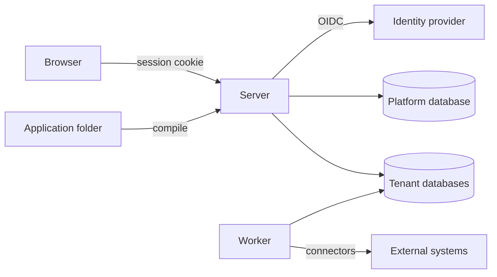

# Axis architecture

This is the target structure. Sections marked *(planned for Mx)* describe work
that has not been built yet, as defined in
[delivery.md](delivery.md#keeping-the-docs-current). Decisions referenced as
Dn are in [decisions.md](decisions.md). Detailed behaviour is in
[reference/](reference/).

## Overview



- **Axis.Server** serves the SPA and hosts the authoring and runtime APIs.
  It becomes the BFF (OIDC client and cookie session) *(planned for M4)*.
- **Axis.Worker** *(planned for M3)* executes durable work: process steps,
  timers, outbox delivery, triggers and schedules. It loads the same modules
  as the server.
- **Platform database** stores installation-level data: the tenant directory
  and platform settings *(tenant directory planned for M9; tenants come from
  server configuration until then)*.
- **Tenant databases** hold everything else for one tenant: releases, system
  tables, process state, audit and the generated entity tables (D10).

## Repository layout

```text
src/
  Axis.Server/            ASP.NET Core host: API, BFF, SPA hosting
  Axis.Worker/            background host (M3)
  Axis.Core/              shared primitives: ids, results, clock, tenant context
  Axis.Configuration/     resource model, file loader, JSON Schemas, compiler, diagnostics, releases
  Axis.Expressions/       expression parser, type checker, interpreter, SQL translation (M2)
  Axis.Data/              entity storage mapping, schema planning, record commands, data sources
  Axis.Processes/         process engine, tasks, outbox, timers (M3)
  Axis.Policy/            roles, policies, evaluation (M4)
  Axis.Presentation/      site/page/widget metadata served to the SPA
  Axis.Tenancy/           tenant resolution, connection factory
web/                      React + TypeScript SPA (Vite), Ant Design, ProComponents
tests/
  Axis.<Module>.Tests/    unit tests per module (Axis.Server.Tests, Axis.Configuration.Tests, Axis.Data.Tests, Axis.Expressions.Tests, Axis.Tenancy.Tests)
  Axis.Integration.Tests/ PostgreSQL (Testcontainers) and API integration tests
  e2e/                    Playwright journeys against the running server
    fixtures/e2e-app/     generic test application the E2E server activates
samples/
  apps/purchase-requests/ the first sample application, as configuration only
```

Projects are created when the first issue needs them. The solution holds
`Axis.Server`, `Axis.Core` (only the tenant context so far),
`Axis.Configuration`, `Axis.Data`, `Axis.Expressions` (the parser, type
checker, interpreter and SQL translation), `Axis.Presentation` (the platform site, its texts and the
shapes of application site metadata), `Axis.Tenancy`, the test projects and
`web/`. `Axis.Worker`,
`Axis.Processes` and `Axis.Policy` do not exist yet.

## Module rules

- **Ownership.** Each module owns its tables and its public contracts. Other
  modules use only those contracts and never read another module's tables
  directly.
- **Dependency direction.** Dependencies point inward:
  - Hosts depend on modules.
  - Modules depend on `Axis.Core` and on other modules' contracts.
  - Nothing depends on a host.
- **Shared transactions.** A module that takes part in a step transaction
  receives the shared connection and transaction through a unit-of-work
  contract. Writes through EF Core and through Npgsql commit together.
- **Persistence boundary.** Engine logic does not depend on ASP.NET Core or on
  persistence details. It depends on small interfaces with infrastructure
  implementations (ports and adapters).
- **Commands and queries.** Commands enforce state transitions. Queries return
  authorized projections. Both use the same tenant database (no separate read
  store).

## Configuration pipeline

Moved to [reference/configuration.md](reference/configuration.md).

## Storage

Moved to [reference/storage.md](reference/storage.md).

## Record API

Moved to [reference/record-api.md](reference/record-api.md).

## Tenancy (D10)

- **Resolution.** `TenantContext` is resolved from the request host. For
  background jobs it is resolved from the job's tenant ID *(planned for M3)*.
- **Connections.** A connection factory returns connections only for the
  current tenant. Without a tenant context, data access fails.
- **Scoping.** Cache keys, file storage paths, job records and log scopes all
  include the tenant.
- **Tenant source.** Until M9, tenants come from server configuration.

### Tenant configuration

The `Tenants` section of the server configuration is keyed by tenant id:

```json
"Tenants": {
  "default": { "Hosts": [ "localhost" ], "ConnectionString": "Host=..." }
}
```

Environment variables override it in the usual form, such as
`Tenants__default__ConnectionString` or `Tenants__default__Hosts__0`.
`appsettings.Development.json` maps `localhost` to tenant `default` on the
compose database; the E2E server maps `127.0.0.1` to a tenant on the E2E
database. The `Platform` connection string is separate and still serves the
readiness check.

Startup fails with an `InvalidOperationException` naming every problem when:

- no tenant is configured;
- a tenant id contains anything other than lowercase letters, digits and
  hyphens;
- a tenant has no hosts, or a host entry that is blank or only whitespace;
- a tenant has no connection string, or one that is only whitespace;
- the same host is listed under two tenants, compared ignoring letter case.

### Request resolution

- **Host matching.** Middleware in `Axis.Server` runs before static files and
  endpoints. It matches `Request.Host.Host` against the configured hosts,
  ignoring letter case. The port is ignored, so `A.Example.TEST:8443` matches
  `a.example.test`.
- **Unknown host.** The response is `404` problem details
  (`application/problem+json`) titled "No tenant is configured for this
  host." It names neither the requested host nor any configured tenant or
  host. This covers API and SPA paths alike.
- **Health exemption.** Paths under `/health` are not resolved, so
  `/health/live` and `/health/ready` answer for any host.
- **Log scope.** While a resolved request runs, the logging scope carries
  `TenantId` with the tenant id.

### Tenant connections

- `ITenantConnectionFactory` opens connections to the current tenant's
  database only. Without a tenant context it throws
  `InvalidOperationException`.
- There is one `NpgsqlDataSource` per tenant. It is created on first use and
  disposed with the host.
- The current tenant is held per asynchronous flow (`AsyncLocal`), so
  concurrent requests never see each other's tenant.
- In the server, a request scope holds one tenant connection, opened on first
  use and disposed with the scope. The module contexts and raw commands share
  it.

## Authentication and authorization

- **Authentication (D9, planned for M4).**
  - The server is the OIDC confidential client.
  - The browser gets a secure, HttpOnly, SameSite cookie session.
  - API calls from the SPA are protected against CSRF.
  - Tests and local development use Keycloak in a container.
- **Authorization (D12, planned for M4).**
  - Every API endpoint and engine command calls the policy module with an
    explicit resource and action.
  - Record filters from policies are added to every data source query.
  - Field policies remove or mask fields from results and reject writes to
    protected fields.
- **Before M4.** There is no authentication yet: every endpoint is open.
  Development test users arrive before M4, as described below (D21).

### Development test users (planned for M3)

Test users stand in for authentication until OIDC replaces them in M4 (D9).
They exist only in development and tests, never in Production.

- **Configuration.** The `TestUsers` section of the server configuration is
  a fixed list. Each user has an id, a display name and role names:

  ```json
  "TestUsers": [
    { "Id": "anna", "DisplayName": "Anna Requester", "Roles": ["requester"] }
  ]
  ```

- **Allowed environments.** Test users work only in the `Development` and
  `Testing` environments. `Testing` is the environment the server tests
  already use.
- **Startup guard.** When `TestUsers` has any entry in any other
  environment, startup fails with an `InvalidOperationException` before the
  server listens. The message names the environment. This matches how bad
  [tenant configuration](#tenant-configuration) stops startup.
- **Choosing a user.** The SPA lists the users and lets the person pick one:
  - `GET /api/test-users` returns the configured users.
  - `POST /api/test-users/sign-in` with `{ "id": "..." }` signs that user in.
  - `POST /api/test-users/sign-out` signs the user out.

  Outside the allowed environments these endpoints do not exist and answer
  `404`. The `POST` endpoints follow the record API's
  [content type rule](reference/record-api.md#create-update-and-delete).
- **Cookie.** The server keeps the chosen user id in an HttpOnly,
  SameSite=Strict cookie.
- **Current user.** `GET /api/me` returns `{ "id", "displayName", "roles" }`
  for the signed-in user. With nobody signed in, it is a `401` problem
  details response.
- **Open writes.** Until M4, record writes stay open with nobody signed in.
  Their [audit records](reference/record-api.md#audit-records-and-history)
  then have the actor `anonymous`.
- **E2E server.** The E2E server runs as `Production` today. It moves to
  `Testing` when M3 builds test users, so Playwright journeys can sign in.

## Process engine (D11, planned for M3)

- **State.** Instances and step occurrences are rows in the tenant database.
  There is no in-memory state that matters after a crash.
- **Step transactions.** A step transition loads the instance at its current
  revision, executes, and in one transaction writes:
  - business writes
  - the new instance state and revision
  - the step history
  - audit records
  - the next work item
  - outbox items *(planned for M5)*

  A revision mismatch aborts the transaction.
- **Workers.** Workers claim ready work with `FOR UPDATE SKIP LOCKED` and a
  lease. Commits check the claim token (fencing).
- **External operations.** These run outside the transaction, using the
  operation identity as their idempotency key. The result is recorded by a
  following transaction.
- **History.** Every attempt, input, output, decision and error is recorded
  for inspection.

The process resource, the start endpoint, the instance and task states, the
task API, the worker settings and the tables are in
[reference/processes.md](reference/processes.md).

## Frontend

Moved to [reference/frontend.md](reference/frontend.md).

## Testing

| Level | Tooling | Scope |
| --- | --- | --- |
| Unit | xUnit | Compiler, expression engine, policy evaluation, pure logic |
| Integration | xUnit + Testcontainers PostgreSQL | Storage, transactions, concurrency, tenancy isolation, engine recovery |
| Frontend unit | Vitest + Testing Library | Shared components and metadata rendering |
| End to end | Playwright | Real server + real database + SPA, user journeys and denied access |

Every acceptance criterion maps to at least one of these. The exact commands
are fixed in M0 and listed in [AGENTS.md](../AGENTS.md).

Some doc facts are checked by machine. `scripts/lint.sh` checks every relative
Markdown link and `#anchor` in the repository. Unit tests in
`Axis.Configuration.Tests` compare the diagnostic code table and the resource
kinds in the [configuration pipeline](reference/configuration.md#configuration-pipeline) with
`DiagnosticCodes`, `ResourceKinds` and the schema files. They find them by
heading or table header, so the sections may move within `docs/`.

The E2E server starts with two applications listed in `ActivateOnStartup` (see
[Startup activation](reference/configuration.md#startup-activation)), so Playwright journeys run against
real metadata and records:

- the generic test application in `tests/e2e/fixtures/e2e-app`, for the
  platform journeys;
- the purchase request sample in `samples/apps/purchase-requests`, for the
  purchase request skeleton journeys.
