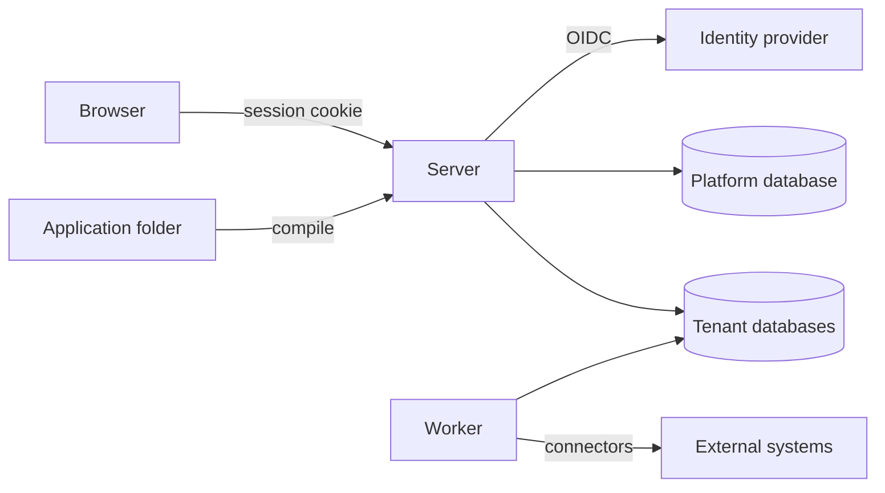
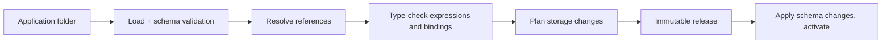

# Axis architecture

This is the target structure. Sections marked *(planned for Mx)* describe work
that has not been built yet. Decisions referenced as Dn are in
[decisions.md](decisions.md).

## Overview



- **Axis.Server** serves the SPA. It is the BFF (OIDC client and cookie
  session) and hosts the authoring and runtime APIs.
- **Axis.Worker** *(planned for M3)* executes durable work: process steps,
  timers, outbox delivery, triggers and schedules. It loads the same modules
  as the server.
- **Platform database** stores installation-level data: the tenant directory
  and platform settings.
- **Tenant databases** hold everything else for one tenant: releases, system
  tables, process state, audit and the generated entity tables (D10).

## Repository layout

```text
src/
  Axis.Server/            ASP.NET Core host: API, BFF, SPA hosting
  Axis.Worker/            background host (M3)
  Axis.Core/              shared primitives: ids, results, clock, tenant context
  Axis.Configuration/     resource model, file loader, JSON Schemas, compiler, diagnostics
  Axis.Expressions/       expression parser, type checker, interpreter (M2)
  Axis.Data/              entity storage mapping, schema planning, record commands, data sources
  Axis.Processes/         process engine, tasks, outbox, timers (M3)
  Axis.Policy/            roles, policies, evaluation (M4)
  Axis.Presentation/      site/page/widget metadata served to the SPA
  Axis.Tenancy/           tenant resolution, connection factory
web/                      React + TypeScript SPA (Vite), Ant Design, ProComponents
tests/
  Axis.*.Tests/           unit tests and PostgreSQL integration tests per module
  e2e/                    Playwright journeys against the running server
samples/
  apps/purchase-requests/ the first sample application, as configuration only
```

Projects are created when the first issue needs them. M0 contains only
`Axis.Server`, the test projects and `web/`.

## Module rules

- **Ownership.** Each module owns its tables and its public contracts. Other
  modules use only those contracts and never read another module's tables
  directly.
- **Dependency direction.** Dependencies point inward:
  - Hosts depend on modules.
  - Modules depend on `Axis.Core` and on other modules' contracts.
  - Nothing depends on a host.
- **Shared transactions.** A module that takes part in a step transaction
  receives the shared connection and transaction through a unit-of-work
  contract. Writes through EF Core and through Npgsql commit together.
- **Persistence boundary.** Engine logic does not depend on ASP.NET Core or on
  persistence details. It depends on small interfaces with infrastructure
  implementations (ports and adapters).
- **Commands and queries.** Commands enforce state transitions. Queries return
  authorized projections. Both use the same tenant database (no separate read
  store).

## Configuration pipeline



1. **Load.** Every `*.json` file in the folder and its subfolders is one
   resource. Each is validated against the JSON Schema for its `kind`
   (`application` or `entity`). The manifest is the single `application`
   resource, stored as `application.json` at the folder root; an `application`
   resource in any other file is not used as the manifest. Resource IDs are
   unique across the application, compared as UUIDs. Names are unique per
   kind, ignoring letter case.
2. **Resolve.** Every reference must resolve inside the application or its
   declared modules.
3. **Check.** Expressions, data source fields, form bindings and operation
   inputs are type-checked.
4. **Plan.** The current tenant schema is compared with the new entity
   definitions. Additive changes are planned automatically; incompatible
   changes are rejected with a diagnostic until migrations exist (M6).
5. **Release.** The compiled plan is stored with a content hash. It is
   immutable.
6. **Activate.** Schema changes are applied. The release becomes active for
   new work only after preparation has completed successfully.

Diagnostics always carry `file`, `resourceId` (when the file has a readable
ID), `path`, `code` and a message. `file` is relative to the application
folder and uses `/` separators. `path` is a JSON Pointer (RFC 6901) into that
file, such as `/fields/0/type`, or empty when the problem concerns the whole
file. Codes have the form `AXCnnnn` and never change meaning. Compile reports
all diagnostics, not just the first, sorted by file and then path.

| Code | Meaning |
| --- | --- |
| `AXC0001` | The file is not valid JSON. |
| `AXC0002` | The resource has no `kind`, or `kind` is not a string. |
| `AXC0003` | The `kind` is not a known resource kind. |
| `AXC0004` | The resource does not match the JSON Schema for its kind. |
| `AXC0005` | Another resource already uses this `id`. |
| `AXC0006` | Another resource of the same kind already uses this `name`. |
| `AXC0007` | The folder has no `application` manifest. |
| `AXC0008` | The folder has more than one `application` manifest. |
| `AXC0009` | An `application` resource is not `application.json` at the folder root, or the root `application.json` has another kind. |
| `AXC0010` | The file could not be read, for example because access is denied. |

### Resource file shape

```json
{
  "id": "4b6f0c1e-6a0e-4c47-9a53-0f5f8f8b1a01",
  "kind": "entity",
  "name": "PurchaseRequest",
  "formatVersion": 1,
  "label": { "textKey": "purchaseRequest.label" },
  "fields": [
    { "name": "title", "type": "text", "required": true, "maxLength": 200 },
    { "name": "department", "type": "reference", "target": "Department", "required": true },
    { "name": "total", "type": "decimal", "precision": 18, "scale": 2 }
  ]
}
```

- `id` is permanent.
- `name` is the stable technical name used in references and storage.
- Labels always come from text resources.

## Storage

- **Platform tables.** These are managed by EF Core migrations shipped with
  Axis.
- **Entity tables.** These are generated per entity in the tenant database and
  live in a dedicated schema, separate from the system tables.
- **Physical names.** Table and column names are derived from stable IDs and
  names, never from labels. Renaming a label never touches storage.
- **SQL safety.** Every SQL statement for entity data is built by the data
  module from compiled metadata. Identifiers are resolved and quoted by the
  module; values are always parameters. Configuration can never supply raw SQL.
- **Database credentials.** Runtime access and schema changes use different
  database roles.

## Tenancy (D10)

- **Resolution.** `TenantContext` is resolved from the request host. For
  background jobs it is resolved from the job's tenant ID.
- **Connections.** A connection factory returns connections only for the
  current tenant. Without a tenant context, data access fails.
- **Scoping.** Cache keys, file storage paths, job records and log scopes all
  include the tenant.
- **Tenant source.** Until M9, tenants come from server configuration.

## Authentication and authorization

- **Authentication (D9, planned for M4).**
  - The server is the OIDC confidential client.
  - The browser gets a secure, HttpOnly, SameSite cookie session.
  - API calls from the SPA are protected against CSRF.
  - Tests and local development use Keycloak in a container.
- **Authorization (D12, planned for M4).**
  - Every API endpoint and engine command calls the policy module with an
    explicit resource and action.
  - Record filters from policies are added to every data source query.
  - Field policies remove or mask fields from results and reject writes to
    protected fields.
- **Before M4.** M1–M3 use a development-only authentication handler with a
  fixed set of test users. It must be impossible to enable it outside the
  `Development` and test environments.

## Process engine (D11, planned for M3)

- **State.** Instances and step occurrences are rows in the tenant database.
  There is no in-memory state that matters after a crash.
- **Step transactions.** A step transition loads the instance at its current
  revision, executes, and in one transaction writes:
  - business changes
  - new instance state
  - the receipt
  - audit records
  - outbox items

  A revision mismatch aborts the transaction.
- **Workers.** Workers claim ready work with `FOR UPDATE SKIP LOCKED` and a
  lease. Commits check the claim token (fencing).
- **External operations.** These run outside the transaction, using the
  operation identity as their idempotency key. The result is recorded by a
  following transaction.
- **History.** Every attempt, input, output, decision and error is recorded
  for inspection.

## Frontend

- **One SPA for all applications.** The SPA renders from metadata served by
  the server: site navigation, page templates, widget definitions, data source
  schemas and text resources. Publishing an application never rebuilds the
  frontend.
- **Shared look and feel.** Shared page templates (`ListPage`, `DetailPage`,
  `FormPage`, `WizardPage`) and a single token-based theme with light and dark
  modes live in `web/src/platform/`. Feature code assembles them and adds no
  styling of its own.
- **Text.** All UI strings come from text resources.

## Testing

| Level | Tooling | Scope |
| --- | --- | --- |
| Unit | xUnit | Compiler, expression engine, policy evaluation, pure logic |
| Integration | xUnit + Testcontainers PostgreSQL | Storage, transactions, concurrency, tenancy isolation, engine recovery |
| Frontend unit | Vitest + Testing Library | Shared components and metadata rendering |
| End to end | Playwright | Real server + real database + SPA, user journeys and denied access |

Every acceptance criterion maps to at least one of these. The exact commands
are fixed in M0 and listed in [AGENTS.md](../AGENTS.md).
