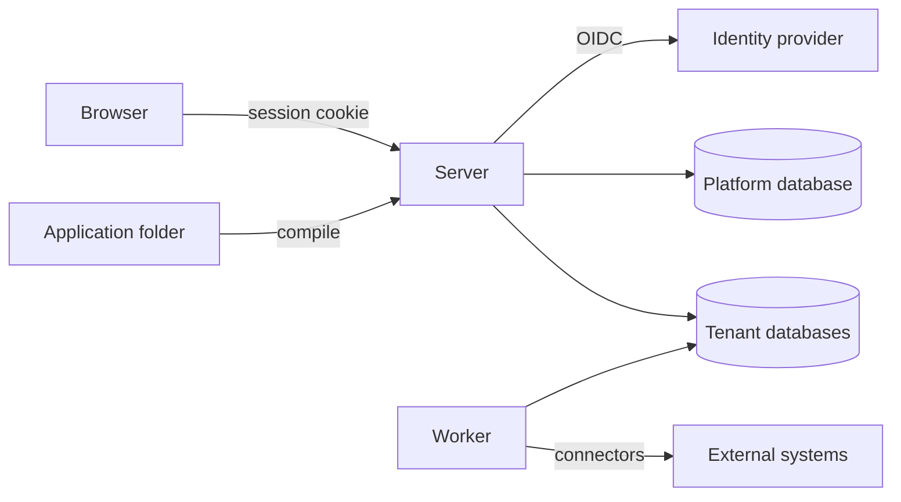
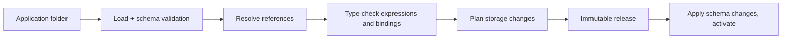

# Axis architecture

This is the target structure. Sections marked *(planned for Mx)* describe work
that has not been built yet. Decisions referenced as Dn are in
[decisions.md](decisions.md).

## Overview



- **Axis.Server** serves the SPA. It is the BFF (OIDC client and cookie
  session) and hosts the authoring and runtime APIs.
- **Axis.Worker** *(planned for M3)* executes durable work: process steps,
  timers, outbox delivery, triggers and schedules. It loads the same modules
  as the server.
- **Platform database** stores installation-level data: the tenant directory
  and platform settings.
- **Tenant databases** hold everything else for one tenant: releases, system
  tables, process state, audit and the generated entity tables (D10).

## Repository layout

```text
src/
  Axis.Server/            ASP.NET Core host: API, BFF, SPA hosting
  Axis.Worker/            background host (M3)
  Axis.Core/              shared primitives: ids, results, clock, tenant context
  Axis.Configuration/     resource model, file loader, JSON Schemas, compiler, diagnostics, releases
  Axis.Expressions/       expression parser, type checker, interpreter (M2)
  Axis.Data/              entity storage mapping, schema planning, record commands, data sources
  Axis.Processes/         process engine, tasks, outbox, timers (M3)
  Axis.Policy/            roles, policies, evaluation (M4)
  Axis.Presentation/      site/page/widget metadata served to the SPA
  Axis.Tenancy/           tenant resolution, connection factory
web/                      React + TypeScript SPA (Vite), Ant Design, ProComponents
tests/
  Axis.*.Tests/           unit tests and PostgreSQL integration tests per module
  e2e/                    Playwright journeys against the running server
samples/
  apps/purchase-requests/ the first sample application, as configuration only
```

Projects are created when the first issue needs them. M0 contains only
`Axis.Server`, the test projects and `web/`. `Axis.Configuration`, `Axis.Data`,
`Axis.Core` (only the tenant context so far) and `Axis.Tenancy` exist now.

## Module rules

- **Ownership.** Each module owns its tables and its public contracts. Other
  modules use only those contracts and never read another module's tables
  directly.
- **Dependency direction.** Dependencies point inward:
  - Hosts depend on modules.
  - Modules depend on `Axis.Core` and on other modules' contracts.
  - Nothing depends on a host.
- **Shared transactions.** A module that takes part in a step transaction
  receives the shared connection and transaction through a unit-of-work
  contract. Writes through EF Core and through Npgsql commit together.
- **Persistence boundary.** Engine logic does not depend on ASP.NET Core or on
  persistence details. It depends on small interfaces with infrastructure
  implementations (ports and adapters).
- **Commands and queries.** Commands enforce state transitions. Queries return
  authorized projections. Both use the same tenant database (no separate read
  store).

## Configuration pipeline



1. **Load.** Every `*.json` file in the folder and its subfolders is one
   resource. Each is validated against the JSON Schema for its `kind`
   (`application` or `entity`). The manifest is the single `application`
   resource, stored as `application.json` at the folder root; an `application`
   resource in any other file is not used as the manifest. Resource IDs are
   unique across the application, compared as UUIDs. Names are unique per
   kind, ignoring letter case.
2. **Resolve.** Every reference must resolve inside the application or its
   declared modules. The entity model is built here: each field's `type`
   becomes a typed field type, every type-specific property is checked against
   the field type and against what storage accepts (see
   [Entity field types and constraints](#entity-field-types-and-constraints)),
   field names must be unique within their entity ignoring letter case, and a
   reference field's `target` must name a loaded entity, ignoring letter case.
   An entity may reference itself. A `target` naming an entity whose file is
   in the folder, has kind `entity` and a string `name`, but was not loaded
   because of its own errors (such as a schema violation) is not reported
   again; only that file's own diagnostics are. No model is produced while
   any error remains.
3. **Check.** Expressions, data source fields, form bindings and operation
   inputs are type-checked.
4. **Plan.** The current tenant schema is compared with the new entity
   definitions. Additive changes are planned automatically; incompatible
   changes are rejected with a diagnostic until migrations exist (M6). See
   [Schema planning](#schema-planning).
5. **Release.** The compiled application is stored as a release with a
   content hash. It is immutable.
   - **Content hash.** Every resource file is canonicalized as in RFC 8785
     (JCS): no whitespace, object properties sorted by UTF-16 code units,
     minimal string escaping, numbers written as ECMAScript does. The hash is
     SHA-256 over every resource in ordinal order of its relative path (`/`
     separators), each contributing `path`, a newline, its canonical JSON and
     a newline, encoded as UTF-8. It is written as lowercase hex.
     Formatting-only changes (whitespace, key order, line endings) keep the
     hash; a changed value, or an added, removed or renamed file changes it.
   - **Identity.** A release is unique per application `id` and content hash.
     Compiling an unchanged folder returns the stored release instead of
     storing a second one, also when two compiles run at the same time.
   - **Content.** A release stores the canonical content of every resource
     with its relative path, so it can be read back without the folder.
   - **Errors.** A folder with any error diagnostic produces no release;
     compile returns the diagnostics only.
6. **Activate.** Schema changes are applied. The release becomes active for
   new work only after preparation has completed successfully.

Diagnostics always carry `file`, `resourceId` (when the file has a readable
ID), `path`, `code` and a message. `file` is relative to the application
folder and uses `/` separators, or is empty when the diagnostic concerns the
whole application folder. `path` is a JSON Pointer (RFC 6901) into that file,
such as `/fields/0/type`, or empty when the problem concerns the whole file or
the whole folder. Messages never contain absolute paths or exception text,
because they are shown to application authors. Codes have the form `AXCnnnn`
and never change meaning. Compile reports all diagnostics, not just the first,
sorted by file and then path.

| Code | Meaning |
| --- | --- |
| `AXC0001` | The file is not valid JSON. |
| `AXC0002` | The resource has no `kind`, or `kind` is not a string. |
| `AXC0003` | The `kind` is not a known resource kind. |
| `AXC0004` | The resource does not match the JSON Schema for its kind. |
| `AXC0005` | Another resource already uses this `id`. |
| `AXC0006` | Another resource of the same kind already uses this `name`. |
| `AXC0007` | The folder has no `application` manifest. |
| `AXC0008` | The folder has more than one `application` manifest. |
| `AXC0009` | An `application` resource is not `application.json` at the folder root, or the root `application.json` has another kind. |
| `AXC0010` | The file could not be read, for example because access is denied. |
| `AXC0011` | Another field of the same entity already uses this `name`, ignoring letter case. |
| `AXC0012` | A reference field's `target` names no loaded entity. Not reported when the target names an entity file in the folder that was not loaded because of its own errors. |
| `AXC0013` | A field property does not fit the field's type, or its value is outside what storage accepts. |
| `AXC0014` | A field lacks a property its type needs: `target` on a reference, `values` on an enum. |
| `AXC0015` | An entity table has a column whose field was removed. Reported at `/fields` of the entity file. |
| `AXC0016` | A field changed in a way its existing column cannot follow, such as a new type, a shorter `maxLength` or a removed enum value. |
| `AXC0017` | An entity provisioned for the application is missing from it. Reported at `application.json` with an empty path. |
| `AXC0018` | The entity's `id` is already provisioned for another application. Reported at `/id` of the entity file. |
| `AXC0019` | The application folder could not be listed: it does not exist, it cannot be opened, or one of its subfolders cannot be opened. Reported with an empty `file` and `path`, as the only diagnostic; nothing in the folder is loaded. |

### Resource file shape

```json
{
  "id": "4b6f0c1e-6a0e-4c47-9a53-0f5f8f8b1a01",
  "kind": "entity",
  "name": "PurchaseRequest",
  "formatVersion": 1,
  "label": { "textKey": "purchaseRequest.label" },
  "fields": [
    { "name": "title", "type": "text", "required": true, "maxLength": 200 },
    { "name": "department", "type": "reference", "target": "Department", "required": true },
    { "name": "total", "type": "decimal", "precision": 18, "scale": 2 }
  ]
}
```

- `id` is permanent.
- `name` is the stable technical name used in references and storage. It
  starts with a letter, contains only ASCII letters and digits, and is at most
  60 characters long (`AXC0004`). The same rule applies to field names.
- Labels always come from text resources.

### Entity field types and constraints

A field property is allowed only on the types that have an entry for it below.
Properties are optional unless marked *needed*. A property on another type is
`AXC0013`; a missing *needed* property is `AXC0014`.
Value ranges follow what PostgreSQL accepts, so an invalid value fails at
compile time rather than when the table is created; a value outside the range
is `AXC0013`.

| Type | `required` | `unique` | `maxLength` | `precision` | `scale` | `target` | `values` |
| --- | --- | --- | --- | --- | --- | --- | --- |
| `text` | yes | yes | 1..10485760 | | | | |
| `integer` | yes | yes | | | | | |
| `decimal` | yes | yes | | 1..1000 | 0..`precision`, only with `precision` | | |
| `boolean` | yes | yes | | | | | |
| `date` | yes | yes | | | | | |
| `date-time` | yes | yes | | | | | |
| `enum` | yes | yes | | | | | needed |
| `reference` | yes | yes | | | | needed | |

- `required` and `unique` default to `false`.
- `maxLength` is capped at 10485760, the largest `varchar` length.
- `values` is a non-empty list of distinct strings; the JSON Schema checks
  this (`AXC0004`).
- `target` names an entity in the same application, ignoring letter case.

## Storage

- **Platform tables.** These are managed by EF Core migrations shipped with
  Axis.
- **System tables.** These live in the `axis` schema of each tenant database.
  Each module owns its tables and manages them with its own EF Core context
  and migrations. Each module context keeps its migration history in its own
  table, `axis.__<module>_migrations`, so the contexts sharing the schema do
  not collide.
  - `Axis.Configuration` owns `axis.releases` and `axis.release_resources`,
    with history in `axis.__configuration_migrations`. The caller supplies
    the tenant database connection.
  - `Axis.Data` owns `axis.provisioned_entities` (each provisioned entity
    with its application and table) and `axis.provisioned_enum_values` (each
    recorded enum value), with history in `axis.__data_migrations`.
  - Releases are immutable, enforced through the context's change tracking:
    a release and its resources are only inserted together. Saving fails when
    a stored release or resource is modified or deleted, or when a resource is
    added to a stored release. Bulk operations (`ExecuteUpdate`,
    `ExecuteDelete`) and raw SQL bypass this guard; a database-level guard
    is a later change.
- **Entity tables.** These are generated per entity in the tenant database and
  live in the `entities` schema, separate from the `axis` system tables.
  `Axis.Data` plans them (see [Schema planning](#schema-planning)) and
  applies the plan.
  - In M1, plan and apply run together in one transaction. One fixed
    advisory transaction lock (`pg_advisory_xact_lock`) serializes entity
    schema changes, so the catalog and records read for the plan are still
    current when it is applied.
  - The provisioning records are written in the same transaction as the DDL.
    When the plan has any diagnostic, the transaction is rolled back and
    nothing is applied.
  - The lock does not block runtime writes to entity tables, so a statement
    can still fail, for example adding a `NOT NULL` column after a row was
    inserted following the catalog read. Any failing statement rolls back the
    whole transaction, DDL and records, and the exception propagates.
- **Physical names.** Table and column names are derived from stable IDs and
  names, never from labels. Renaming a label, or renaming an entity while
  keeping its `id`, never touches storage.

  | Object | Name | Length |
  | --- | --- | --- |
  | Table | `e_` + entity `id` as 32 lowercase hex characters | 34 |
  | Primary key column | `id` (`uuid`) | 2 |
  | Version column | `version` (`bigint`) | 7 |
  | Field column | `f_` + field name in lowercase | at most 62 |
  | Primary key | `pk_` + table | 37 |
  | Unique constraint | `uq_` + table + `_` + hash of the column name | 54 |
  | Foreign key | `fk_` + table + `_` + hash of the column name | 54 |

  The hash is the first 16 lowercase hex characters of SHA-256 over the UTF-8
  column name. Because names are ASCII and at most 60 characters, every
  identifier fits PostgreSQL's 63-byte limit by construction and is never
  truncated. Identifiers are always double-quoted in SQL.
- **Column types.** Each field type maps to one PostgreSQL type, spelled as
  `format_type` renders it, so a catalog column matches by string equality.

  | Field type | Column type |
  | --- | --- |
  | `text` | `character varying(n)` with `maxLength`, otherwise `text` |
  | `integer` | `bigint` |
  | `decimal` | `numeric(p,s)` with `precision` (`s` is 0 when `scale` is omitted), otherwise `numeric` |
  | `boolean` | `boolean` |
  | `date` | `date` |
  | `date-time` | `timestamp with time zone` |
  | `enum` | `text`; the values are recorded, not enforced by a `CHECK` |
  | `reference` | `uuid` with a foreign key to the target table's `id` |
- **SQL safety.** Every SQL statement for entity data is built by the data
  module from compiled metadata. Identifiers are resolved and quoted by the
  module; values are always parameters. Configuration can never supply raw SQL.
- **Database credentials.** Runtime access and schema changes use different
  database roles.

### Schema planning

`Axis.Data` compares a compiled application with a snapshot of the tenant
catalog (entity tables, their columns, types, `NOT NULL`, single-column
unique constraints, foreign key targets and whether the table has rows) and
with the provisioning records (each provisioned entity with its application
and table, and each recorded enum value). The records cover the application's
entities and any entity recorded with one of its entity `id`s, whatever its
application. The planner itself has no database
access. It returns diagnostics, SQL statements and the new records to write.

- **System columns.** `id` and `version` are created with the table.
  `version` is added to an existing table that lacks it as
  `bigint NOT NULL DEFAULT 1`, even when the table has rows, because the
  default fills them. System columns are never compared or changed otherwise:
  only Axis DDL creates them, and an author cannot fix them through
  configuration.
- **Missing table.** It is created with the system columns and every field
  column, `NOT NULL` for required fields and a unique constraint for unique
  fields. The entity and its enum values are recorded.
- **Missing column.** It is added. `NOT NULL` is added only when the table
  has no rows; a required field added to a table with rows is `AXC0016` at
  `/fields/{i}/required`. A unique field also gets its unique constraint.
- **Existing column.**
  - The type must equal the expected type. Widening text
    (`character varying(n)` to a larger `n` or to `text`) is applied.
    Narrowing it, including `text` to `character varying(n)`, is `AXC0016` at
    `/fields/{i}/maxLength`. Any other type difference is `AXC0016` at
    `/fields/{i}/type`.
  - Dropping `required` drops `NOT NULL`, and dropping `unique` drops the
    unique constraint. Adding either to an existing column is `AXC0016` at
    `/fields/{i}/required` or `/fields/{i}/unique`.
  - A reference column without a foreign key gets one. A foreign key that
    points at another table than the target's is `AXC0016` at
    `/fields/{i}/target`.
- **Enum values.** Values are compared ordinally, so letter case matters.
  Recorded values missing from the field's `values` are one `AXC0016` at
  `/fields/{i}/values` listing them; new values become new records and need
  no SQL. A column switching between `enum` and another type (recorded values
  present for a non-enum field, or absent for an enum field) is `AXC0016` at
  `/fields/{i}/type`.
- **Removed field.** A column other than the system columns without a
  matching field is `AXC0015` at `/fields`, naming the column.
- **Removed entity.** An entity recorded for the application but missing from
  it is `AXC0017` at `application.json` with an empty path and the entity's
  `id` as `resourceId`.
- **Entity owned by another application.** Tables are keyed by entity `id`,
  so an entity whose `id` is recorded for another application, for example in
  an application copied with only its manifest `id` changed, would share that
  application's table. It is `AXC0018` at `/id` of the entity file, and the
  entity is not planned.
- **Labels.** A label change produces no statements.
- **Order.** Every `CREATE TABLE` comes first, then the `ALTER TABLE` column
  changes, then every `ADD CONSTRAINT ... FOREIGN KEY`, so references between
  entities, cycles and self-references need no further ordering.
- **Errors.** When any diagnostic exists, the plan has no statements and no
  new records; nothing is applied.

## Tenancy (D10)

- **Resolution.** `TenantContext` is resolved from the request host. For
  background jobs it is resolved from the job's tenant ID.
- **Connections.** A connection factory returns connections only for the
  current tenant. Without a tenant context, data access fails.
- **Scoping.** Cache keys, file storage paths, job records and log scopes all
  include the tenant.
- **Tenant source.** Until M9, tenants come from server configuration.

### Tenant configuration

The `Tenants` section of the server configuration is keyed by tenant id:

```json
"Tenants": {
  "default": { "Hosts": [ "localhost" ], "ConnectionString": "Host=..." }
}
```

Environment variables override it in the usual form, such as
`Tenants__default__ConnectionString` or `Tenants__default__Hosts__0`.
`appsettings.Development.json` maps `localhost` to tenant `default` on the
compose database; the E2E server maps `127.0.0.1` to a tenant on the E2E
database. The `Platform` connection string is separate and still serves the
readiness check.

Startup fails with an `InvalidOperationException` naming every problem when:

- no tenant is configured;
- a tenant id contains anything other than lowercase letters, digits and
  hyphens;
- a tenant has no hosts, or a host entry that is blank or only whitespace;
- a tenant has no connection string, or one that is only whitespace;
- the same host is listed under two tenants, compared ignoring letter case.

### Request resolution

- **Host matching.** Middleware in `Axis.Server` runs before static files and
  endpoints. It matches `Request.Host.Host` against the configured hosts,
  ignoring letter case. The port is ignored, so `A.Example.TEST:8443` matches
  `a.example.test`.
- **Unknown host.** The response is `404` problem details
  (`application/problem+json`) titled "No tenant is configured for this
  host." It names neither the requested host nor any configured tenant or
  host. This covers API and SPA paths alike.
- **Health exemption.** Paths under `/health` are not resolved, so
  `/health/live` and `/health/ready` answer for any host.
- **Log scope.** While a resolved request runs, the logging scope carries
  `TenantId` with the tenant id.

### Tenant connections

- `ITenantConnectionFactory` opens connections to the current tenant's
  database only. Without a tenant context it throws
  `InvalidOperationException`.
- There is one `NpgsqlDataSource` per tenant. It is created on first use and
  disposed with the host.
- The current tenant is held per asynchronous flow (`AsyncLocal`), so
  concurrent requests never see each other's tenant.

## Authentication and authorization

- **Authentication (D9, planned for M4).**
  - The server is the OIDC confidential client.
  - The browser gets a secure, HttpOnly, SameSite cookie session.
  - API calls from the SPA are protected against CSRF.
  - Tests and local development use Keycloak in a container.
- **Authorization (D12, planned for M4).**
  - Every API endpoint and engine command calls the policy module with an
    explicit resource and action.
  - Record filters from policies are added to every data source query.
  - Field policies remove or mask fields from results and reject writes to
    protected fields.
- **Before M4.** M1–M3 use a development-only authentication handler with a
  fixed set of test users. It must be impossible to enable it outside the
  `Development` and test environments.

## Process engine (D11, planned for M3)

- **State.** Instances and step occurrences are rows in the tenant database.
  There is no in-memory state that matters after a crash.
- **Step transactions.** A step transition loads the instance at its current
  revision, executes, and in one transaction writes:
  - business changes
  - new instance state
  - the receipt
  - audit records
  - outbox items

  A revision mismatch aborts the transaction.
- **Workers.** Workers claim ready work with `FOR UPDATE SKIP LOCKED` and a
  lease. Commits check the claim token (fencing).
- **External operations.** These run outside the transaction, using the
  operation identity as their idempotency key. The result is recorded by a
  following transaction.
- **History.** Every attempt, input, output, decision and error is recorded
  for inspection.

## Frontend

- **One SPA for all applications.** The SPA renders from metadata served by
  the server: site navigation, page templates, widget definitions, data source
  schemas and text resources. Publishing an application never rebuilds the
  frontend.
- **Shared look and feel.** Shared page templates (`ListPage`, `DetailPage`,
  `FormPage`, `WizardPage`) and a single token-based theme with light and dark
  modes live in `web/src/platform/`. Feature code assembles them and adds no
  styling of its own.
- **Text.** All UI strings come from text resources.

## Testing

| Level | Tooling | Scope |
| --- | --- | --- |
| Unit | xUnit | Compiler, expression engine, policy evaluation, pure logic |
| Integration | xUnit + Testcontainers PostgreSQL | Storage, transactions, concurrency, tenancy isolation, engine recovery |
| Frontend unit | Vitest + Testing Library | Shared components and metadata rendering |
| End to end | Playwright | Real server + real database + SPA, user journeys and denied access |

Every acceptance criterion maps to at least one of these. The exact commands
are fixed in M0 and listed in [AGENTS.md](../AGENTS.md).
