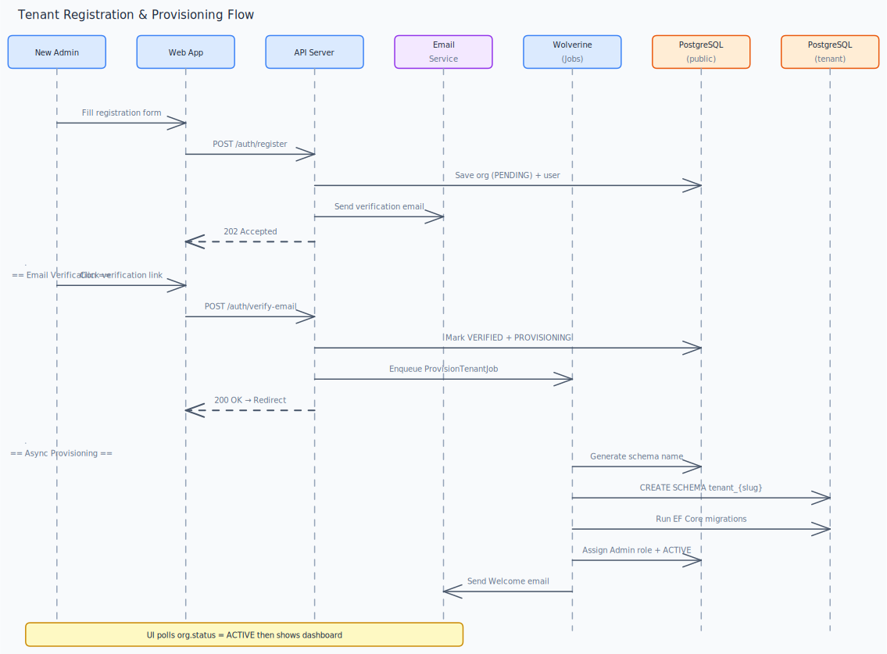

# E01 — Platform Foundation

[← Back to Epics](../README.md)

---

## Overview

Establish the multi-tenant SaaS foundation that all other modules depend on. This epic covers tenant provisioning, organization lifecycle management, and the data isolation strategy that keeps each tenant's data completely separate.

## Business Value

Without this foundation, nothing else works. Every feature in every other epic runs on top of the multi-tenancy infrastructure built here.

## Phase

**MVP** — Must be completed first. All other epics depend on this.

---

## Features

| ID | Feature | Description |
|---|---|---|
| [F01](./features/F01-tenant-registration.md) | Tenant Registration & Provisioning | Self-service sign-up, org creation, schema provisioning |
| [F02](./features/F02-organization-management.md) | Organization Management | Edit org profile, settings, branding |
| [F03](./features/F03-tenant-isolation.md) | Tenant Data Isolation | Schema-per-tenant enforcement, middleware, tenant resolution |
| [F04](./features/F04-subscription-plans.md) | Subscription Plan Management | Plan tiers, feature gating, billing metadata |

---

## Diagrams

---

## Acceptance Criteria (Epic Level)

- [ ] A new organization can register and be fully provisioned (own schema, admin account) within 60 seconds.
- [ ] No tenant can read or write data belonging to another tenant under any circumstances.
- [ ] Tenant schema is automatically created and migrated on registration.
- [ ] Organization can update its profile (name, logo, settings) without affecting other tenants.

---

## Implementation Status

| Layer | Status | Notes |
|---|---|---|
| Shared Domain | ✅ Done | `Entity`, `AggregateRoot`, `ValueObject`, `IDomainEvent`, `Result<T>` |
| Shared Application | ✅ Done | `ICommand/IQuery`, `ICommandHandler/IQueryHandler`, `ValidationBehavior`, `ITenantContext` |
| Shared Infrastructure | ✅ Done | `TenantSchemaInterceptor`, per-module `UnitOfWork` ([ADR-017](../../TECH_STACK.md#adr-017-axisshared-is-abstractions-only-no-shared-implementation)); **OpenTelemetry** host wiring on `Axis.Api` ([ADR-018](../../TECH_STACK.md#adr-018-opentelemetry-sdk-with-grafana-stack-for-observability), [patterns § OpenTelemetry](../../playbooks/patterns.md#opentelemetry-observability)) |
| Tenant Registration (US-001–002) | ⚠️ Partial | Domain + Application + Infrastructure + API done (`POST /api/organizations/`, `/api/auth/verify-email`, `/api/auth/resend-verification`); Frontend ⏳. Gap: rate-limiting on resend (max 3/hr) pending |
| Tenant Provisioning (US-003) | ⚠️ Partial | `ITenantSchemaProvisioner` provisions tenant schemas via `Database.MigrateAsync()` per module DB ([ADR-011](../../TECH_STACK.md#adr-011-per-module-database-with-schema-per-tenant-inside), [ADR-023](../../TECH_STACK.md#adr-023-per-module-ef-core-migrations-only)). **Deferred (F01 US-003 follow-up):** retry/alert/polling UI. **Deferred (PR follow-up):** durable retry policy for `ProvisionTenantHandler`. `ProvisionTenantMessage` uses RabbitMQ per ADR-024/025. |
| Organization Management (F02) | ⏳ Pending | — |
| Subscription Plans (F04) | ⏳ Pending | — |
| Frontend | ⏳ Pending | — |

---

## Dependencies

- None (this is the foundation)

## Dependents

- [E02 — Identity & Access Management](../E02-identity-access/README.md)
- All other epics
