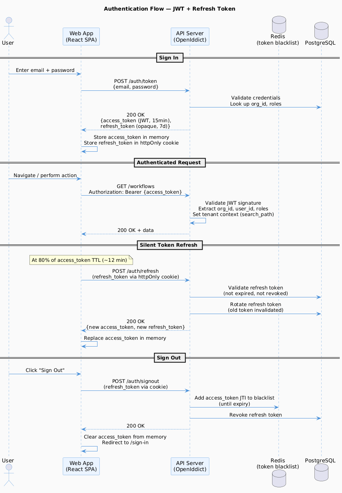

# E02 — Identity & Access Management

[← Back to Epics](../README.md)

---

## Overview

Provide secure authentication and a flexible role-based access control (RBAC) system. Users belong to an organization, hold one or more roles, and each role grants a set of permissions. All identity data is tenant-scoped.

## Business Value

Security and access control are non-negotiable for a SaaS product. Organizations need confidence that their users see only what they should see.

## Phase

**MVP**

---

## Features

| ID | Feature | Description |
|---|---|---|
| [F01](./features/F01-authentication.md) | Authentication | Sign up, sign in, sign out, JWT + refresh tokens |
| [F02](./features/F02-user-management.md) | User Management | Invite users, activate/deactivate, profile management |
| [F03](./features/F03-role-management.md) | Role Management | Create/edit/delete roles within an organization |
| [F04](./features/F04-permissions.md) | Permission System | Assign permissions to roles, enforce on API and UI |
| [F05](./features/F05-password-security.md) | Password & Security | Password reset, change password, session management |

---

## Diagrams

---

## Default Roles

| Role | Description |
|---|---|
| **Admin** | Full access to all features within the organization |
| **Editor** | Can create and edit workflows, models, forms, pages |
| **Viewer** | Read-only access to data and execution history |
| **End User** | Access only to published pages and assigned forms |

*Organizations can create custom roles with granular permissions.*

---

## Acceptance Criteria (Epic Level)

- [ ] Users can register an account and join an organization via invitation.
- [ ] JWT tokens are validated on every request; expired tokens return 401.
- [ ] Users without required permissions receive 403, never 404 or 500.
- [ ] Password reset flow works end-to-end via email link.
- [ ] Roles and permissions are enforced on both API and frontend UI.

---

## Dependencies

- [E01 — Platform Foundation](../E01-platform-foundation/README.md)

## Dependents

- [E03 — Data Modeling](../E03-data-modeling/README.md)
- All other epics
