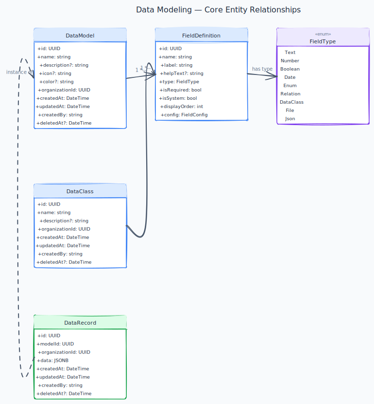

# E03 — Data Modeling

[← Back to Epics](../README.md)

---

## Overview

Allow users to define their own data structures — Models (like database tables) and Data Classes (reusable nested types). Users can then create, read, update, and delete records against those models. Schemas are defined at runtime and stored as metadata, not as actual DB schema changes.

## Business Value

Custom data modeling is the core differentiator of Axis. Without it, the platform is just another workflow tool with a fixed data structure. With it, users can model any business domain.

## Phase

**MVP**

---

## Features

| ID | Feature | Description |
|---|---|---|
| [F01](./features/F01-model-definition.md) | Model Definition | Create, edit, delete custom models within an org |
| [F02](./features/F02-field-types.md) | Field Type System | Text, Number, Date, Boolean, Enum, Relation, File, JSON |
| [F03](./features/F03-data-classes.md) | Data Class Management | Reusable nested object types used as field types |
| [F04](./features/F04-data-records.md) | Data Record CRUD | Create, read, update, delete records against any model |

---

## Diagrams

---

## Core Concepts

### Model
A user-defined entity type, equivalent to a database table conceptually. Example: `Order`, `Customer`, `Invoice`.

### Field
A typed attribute on a Model. Each field has a name, type, validation rules, and optionally a display label.

### Data Class
A reusable, structured type composed of multiple fields. Used as a field type within a Model (similar to an embedded object). Example: `Address`, `ContactInfo`.

### Record
A concrete instance of a Model. Records are stored in the tenant's schema using a flexible JSONB-backed storage strategy.

---

## Supported Field Types

| Type | Description |
|---|---|
| `Text` | Short or long text string |
| `Number` | Integer or decimal |
| `Boolean` | True / False |
| `Date` | Date or DateTime |
| `Enum` | One value from a predefined list |
| `Relation` | Reference to a record of another Model |
| `DataClass` | Embedded nested object (references a Data Class) |
| `File` | File attachment reference |
| `JSON` | Raw JSON blob |

---

## Acceptance Criteria (Epic Level)

- [ ] Users can create a model with at least 5 different field types.
- [ ] Relation fields correctly link records across models.
- [ ] Data classes can be nested inside models and reused across multiple models.
- [ ] Deleting a field displays a warning about data loss and requires confirmation.
- [ ] Records can be filtered, sorted, and paginated via API.

---

## Code style

Repo-wide C# conventions (explicit types, naming, Allman braces) are enforced via [`.editorconfig`](../../.editorconfig). Run `dotnet format Axis.sln` before push ([CONTRIBUTING.md](../../CONTRIBUTING.md)).

---

## Implementation Status

| Layer | Status | Notes |
|---|---|---|
| Domain | ✅ Done | `DataModel`, `Field`, `DataRecord` aggregates; all field types and domain events |
| Application | ✅ Done | All command/query handlers; `RecordFieldValidator`; `BulkDeleteRecordsHandler`; `ExportRecordsCsvHandler` |
| Infrastructure | ✅ Done | EF Core mappings, repositories, JSONB field converters; `GetPagedAsync` with filter/sort; `BulkDeleteAsync`; `GetAllForExportAsync`. Database `axis_datamodeling` with initial migration `InitialCreate` ([ADR-011](../../TECH_STACK.md#adr-011-per-module-database-with-schema-per-tenant-inside), [ADR-023](../../TECH_STACK.md#adr-023-per-module-ef-core-migrations-only)). DbContext + UnitOfWork inlined per ADR-017. `OrganizationVerifiedHandler` provisions tenant schema via `TenantModuleProvisionAttempt` (reports `TenantModuleProvisionReportEvent` to Identity; retries via `RetryTenantModuleProvisionHandler` + shared `TenantSchemaProvisioner`, E01 US-003). `Axis.DataModeling.Contracts` + `DataModelingEventMapper` publish 9 Avro lifecycle/field events via Wolverine outbox → Kafka ([ADR-019](../../TECH_STACK.md#adr-019-avro-and-schema-registry-for-event-payloads-with-cloudevents-envelope), [ADR-025](../../TECH_STACK.md#adr-025-transport-selection-rule-by-message-name-suffix)) (PR #101). **Done:** `ModelDeletedHandler` in FormBuilder + WorkflowBuilder. **Deferred (PR #101 follow-up):** Kafka consumer in WorkflowBuilder for field delete refs. |
| API | ✅ Done | 7 record endpoints (CRUD + bulk-delete + CSV export); filter/sort params; HTTP 422 `ValidationProblemDetails` on create/update |
| Frontend | ⏳ Pending | — |

---

## Open work (agents)

| Area | Status | Detail |
|------|--------|--------|
| **Backend** | ⚠️ polish | HTTP 422/409 on records ([F04](./features/F04-data-records.md)); relation display-field resolution; model plan limits **not in F04** (spec mentions 402 — product decision). 30-day purge jobs deferred. |
| **Frontend** | ⏳ | Model/record UI, filters, data-class sub-forms — all US callouts mark Frontend ⏳. |

Module API is largely ✅; grep `API: ⏳` in [features/](./features/) only when adding endpoints.

---

## Dependencies

- [E01 — Platform Foundation](../E01-platform-foundation/README.md)
- [E02 — Identity & Access Management](../E02-identity-access/README.md)

## Dependents

- [E04 — Workflow Builder](../E04-workflow-builder/README.md)
- [E05 — Form Builder](../E05-form-builder/README.md)
- [E07 — Page Builder](../E07-page-builder/README.md)
