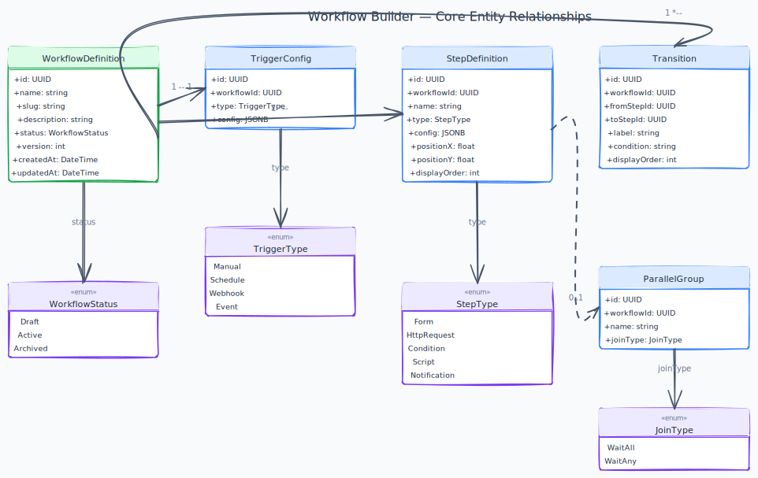

# E04 — Workflow Builder

[← Back to Epics](../README.md)

---

## Overview

Provide a visual drag-and-drop canvas where users can design workflows composed of typed steps connected by transitions. Workflows can branch conditionally, run steps in parallel, and be triggered by multiple trigger types. Definitions can be imported and exported as JSON.

## Business Value

The workflow builder is the heart of the platform. It is what differentiates Axis from a simple CRUD data tool.

## Phase

**MVP**

---

## Use Cases

| Use case | Description |
|---|---|---|
| [Workflow Definition Management](../../use-cases/workflow-builder/workflow-definition.md) | CRUD operations on workflow definitions |
| [Visual Workflow Canvas](../../use-cases/workflow-builder/visual-canvas.md) | Drag & drop canvas powered by React Flow |
| [Step Type Configuration](../../use-cases/workflow-builder/step-types.md) | Configure Form, HTTP Request, Condition, Script, Notification steps |
| [Trigger Configuration](../../use-cases/workflow-builder/triggers.md) | Manual, Schedule (cron), Webhook, Event triggers |
| [Branching & Conditional Logic](../../use-cases/workflow-builder/branching.md) | If/else conditions, switch, dynamic routing |
| [Parallel Step Execution](../../use-cases/workflow-builder/parallel-execution.md) | Fan-out and fan-in parallel step groups |
| [Workflow Import / Export](../../use-cases/workflow-builder/import-export.md) | Export workflow as JSON, import from JSON file |
---

## Diagrams

---

## Step Types

| Type | Description | Config |
|---|---|---|
| **Form** | Pauses workflow and presents a form for user input | Form definition reference, assignee |
| **HTTP Request** | Calls an external REST API | URL, method, headers, body, auth, output mapping |
| **Condition** | Evaluates an expression, routes to different branches | Expression (field comparisons, logical operators) |
| **Script** | Runs a sandboxed JavaScript snippet | Script body, input context, output variable |
| **Notification** | Sends an email or webhook notification | Template, recipient, channel |

## Trigger Types

| Type | Description |
|---|---|
| **Manual** | User starts the workflow explicitly via UI or API |
| **Schedule** | Cron expression — runs at defined intervals |
| **Webhook** | An incoming HTTP POST to a unique URL starts the workflow |
| **Event** | A platform event (e.g., record created, form submitted) starts the workflow |

---

## Acceptance Criteria (Epic Level)

- [ ] Users can create a workflow with at least 3 connected steps on the visual canvas.
- [ ] All 5 step types can be added and configured without errors.
- [ ] All 4 trigger types can be configured and activated.
- [ ] A workflow with an if/else condition correctly routes to the appropriate branch.
- [ ] Parallel steps fan out and the workflow waits for all to complete before continuing.
- [ ] A workflow exported as JSON can be imported into another organization and runs correctly.

---

## Code style

Repo-wide C# conventions (explicit types, naming, Allman braces) are enforced via [`.editorconfig`](../../../.editorconfig). Run `dotnet format Axis.sln` before push ([CONTRIBUTING.md](../../../CONTRIBUTING.md)).

---

## Implementation Status

| Layer | Status | Notes |
|---|---|---|
| Domain | ✅ Done | `WorkflowDefinition`, `Step`, `Trigger` aggregates; all step types and domain events; ConfigureStep method; AddTrigger duplicate-type guard |
| Application | ✅ Done | All 15 handlers: CreateWorkflow, PublishWorkflow, ArchiveWorkflow, UnarchiveWorkflow, UpdateWorkflow, DuplicateWorkflow, AddStep, RemoveStep, ConfigureStep, AddTransition, RemoveTransition, AddTrigger, RemoveTrigger, ImportWorkflow, BulkExportWorkflows; GetWorkflows, GetWorkflow, ExportWorkflow queries |
| Infrastructure | ✅ Done | WorkflowBuilderDbContext, EF Core configuration (WorkflowDefinition with steps/transitions/triggers as JSONB), WorkflowRepository, integration tests (Testcontainers). `workflow_form_references` + `workflow_model_references` read models with `IWorkflowReferenceSync`; `ModelDeletedHandler` + `FormDeletedHandler` (Kafka); `WorkflowFormReferenceService` gRPC. Migration `AddWorkflowReferenceReadModels`. DbContext + UnitOfWork inlined per ADR-017. `OrganizationVerifiedHandler` provisions tenant schema via `TenantModuleProvisionAttempt` (reports `TenantModuleProvisionReportEvent` to Identity; retries via `RetryTenantModuleProvisionHandler` + shared `TenantSchemaProvisioner`, E01 US-003). Avro lifecycle publish ([ADR-019](../../TECH_STACK.md#adr-019-avro-and-schema-registry-for-event-payloads-with-cloudevents-envelope)). Publish blocked when broken refs; `GetWorkflow` returns `isBroken` on steps/triggers. |
| API | ✅ Done | 18 endpoints: workflow CRUD + publish/archive/unarchive/duplicate, step/transition/trigger management, JSON export, JSON import, ZIP bulk export |
| Frontend | ⏳ Pending | — |

---

## Open work (agents)

| Area | Status | Detail |
|------|--------|--------|
| **Backend** | ⚠️ mostly ✅ | CRUD/publish/import/export ✅; plan limits 402 ✅ (E01 F04). **Engine-owned:** triggers (cron/webhook/event), step execution, parallel/join — tracked in [E06](../E06-workflow-engine/README.md#open-work-agents). **API polish:** list filters (last execution date), import transactional rollback — [F07](../../use-cases/workflow-builder/import-export.md). |
| **Frontend** | ⏳ | Visual canvas, step config panels, trigger UI — every F02–F07 US. |

Do not re-implement plan limits here; update stale “pending E01 F04” lines if you see them in feature callouts.

---

## Dependencies

- [E01 — Platform Foundation](../E01-platform-foundation/README.md)
- [E02 — Identity & Access Management](../E02-identity-access/README.md)
- [E03 — Data Modeling](../E03-data-modeling/README.md)
- [E05 — Form Builder](../E05-form-builder/README.md) *(for Form step type)*

## Dependents

- [E06 — Workflow Execution Engine](../E06-workflow-engine/README.md)
