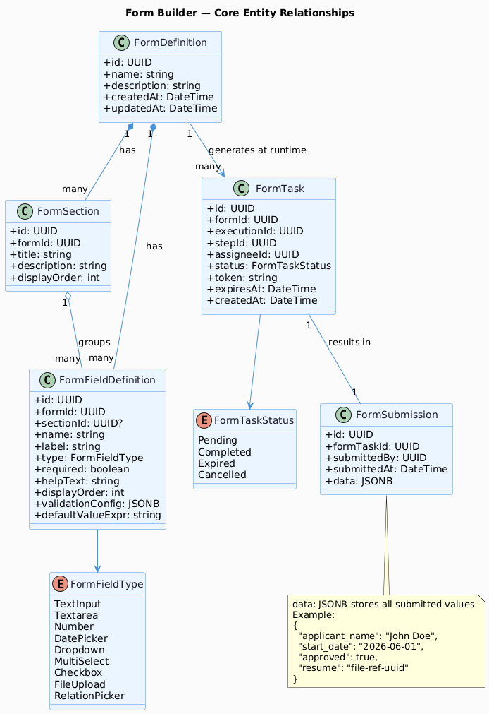

# E05 — Form Builder

[← Back to Epics](../README.md)

---

## Overview

Enable users to design interactive forms that can be embedded as steps within workflows. Forms collect structured data from users, validate it, and store submissions that can flow through the rest of the workflow as context data.

## Business Value

Forms are the primary mechanism for human interaction within a workflow. Without forms, workflows can only be fully automated — with forms, they can support approval processes, data entry, and human-in-the-loop automation.

## Phase

**MVP**

---

## Features

| ID | Feature | Description |
|---|---|---|
| [F01](./features/F01-form-definition.md) | Form Definition Management | Create, edit, delete form definitions |
| [F02](./features/F02-form-fields.md) | Form Field Configuration & Validation | Add fields with types, labels, placeholders, validation rules |
| [F03](./features/F03-workflow-integration.md) | Workflow Step Integration | Attach a form to a Form step in a workflow |
| [F04](./features/F04-form-submission.md) | Form Submission Handling | Render form to assignee, capture submission, continue workflow |

---

## Diagrams



---

## Form Field Types

| Type | Description |
|---|---|
| `Text Input` | Single-line text |
| `Textarea` | Multi-line text |
| `Number` | Numeric input |
| `Date Picker` | Date or datetime selection |
| `Dropdown` | Select from a list of options |
| `Checkbox` | Boolean toggle |
| `File Upload` | Attach one or more files |
| `Relation Picker` | Search and select a record from a Model |

---

## Form Lifecycle in a Workflow

```
Workflow reaches Form step
    → Assignee receives notification
        → Assignee opens form URL
            → Submits form
                → Submission stored
                    → Workflow continues with form data in context
```

---

## Acceptance Criteria (Epic Level)

- [ ] Users can create a form with at least 5 different field types.
- [ ] Each field can have required validation, min/max length, and custom error messages.
- [ ] A form can be linked to a Form step in a workflow.
- [ ] When workflow reaches the Form step, the assignee receives a notification with the form link.
- [ ] Submitted form data is available as context variables in subsequent workflow steps.
- [ ] Submitting an invalid form shows inline validation errors without page reload.

---

## Implementation Status

| Layer | Status | Notes |
|---|---|---|
| Domain | ✅ Done | `FormDefinition`, `FormField`, `FormSubmission` aggregates; all field types and domain events |
| Application | ✅ Done | All command/query handlers; repository interfaces |
| Infrastructure | ⏳ Pending | EF Core mappings, repositories, `AxisDbContext` wiring |
| API | ⏳ Pending | — |
| Frontend | ⏳ Pending | — |

---

## Dependencies

- [E01 — Platform Foundation](../E01-platform-foundation/README.md)
- [E02 — Identity & Access Management](../E02-identity-access/README.md)
- [E03 — Data Modeling](../E03-data-modeling/README.md) *(for Relation Picker fields)*

## Dependents

- [E04 — Workflow Builder](../E04-workflow-builder/README.md) *(Form step type)*
- [E06 — Workflow Execution Engine](../E06-workflow-engine/README.md)
