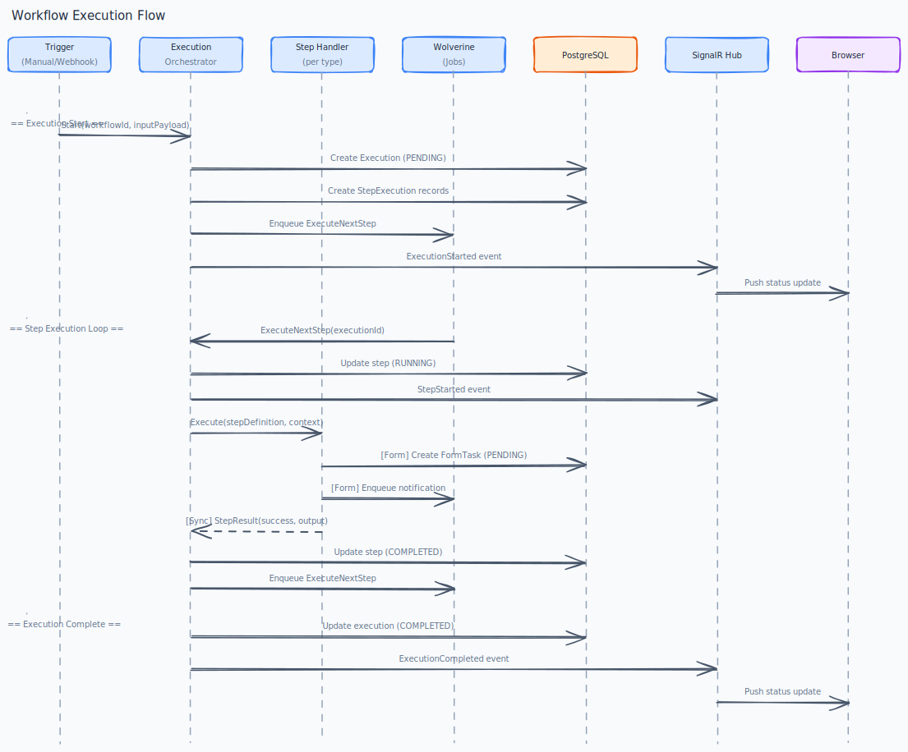

# E06 — Workflow Execution Engine

[← Back to Epics](../README.md)

---

## Overview

The runtime engine that takes a workflow definition and executes it step-by-step. Manages execution state, handles all step types, deals with errors, persists execution history, and notifies users of failures. Users can manually retry failed executions.

## Business Value

A workflow builder without an execution engine is just a drawing tool. This epic is what makes workflows actually run and deliver value.

## Phase

**MVP**

---

## Features

| ID | Feature | Description |
|---|---|---|
| [F01](./features/F01-execution-management.md) | Execution Management | Create, track, and terminate workflow executions |
| [F02](./features/F02-step-handlers.md) | Step Execution Handlers | Dedicated handler per step type (Form, HTTP, Condition, Script, Notification) |
| [F03](./features/F03-error-handling.md) | Error Handling & Notification | Detect failures, notify configured channels, mark execution as failed |
| [F04](./features/F04-execution-history.md) | Execution History & Audit Log | Full history of executions, step results, and context data |
| [F05](./features/F05-manual-retry.md) | Manual Retry | Resume a failed execution from the failed step |

---

## Diagrams



---

## Execution States

```
PENDING → RUNNING → COMPLETED
                 ↘ FAILED
                 ↘ CANCELLED
```

## Step States

```
PENDING → RUNNING → COMPLETED
                 ↘ FAILED
                 ↘ SKIPPED   (conditional branch not taken)
                 ↘ WAITING   (Form step — waiting for human input)
```

---

## Execution Context

Each execution carries a **context object** — a key/value map that accumulates data as steps complete:

- Input variables (from trigger payload)
- Form submission data
- HTTP response data
- Script output variables

Subsequent steps can reference context values using expressions like `{{context.step_id.field_name}}`.

---

## Acceptance Criteria (Epic Level)

- [ ] A manually triggered workflow starts and completes all steps in order.
- [ ] A scheduled workflow fires at the correct cron time (±30 seconds).
- [ ] An incoming webhook payload correctly starts a configured workflow.
- [ ] A failed HTTP step marks the execution as Failed and sends an error notification.
- [ ] Execution history shows each step's start time, end time, status, and output.
- [ ] A failed execution can be retried from the failed step and completes successfully.
- [ ] Real-time status updates are pushed to the UI via SignalR during execution.

---

## Implementation Status

| Layer | Status | Notes |
|---|---|---|
| Domain | ✅ Done | `WorkflowExecution` aggregate + `ExecutionStep` entity; full execution state machine; `WorkflowSnapshot` local read model; domain events (ExecutionStarted, Completed, Failed, Cancelled, StepCompleted, StepFailed, FormStepReached) |
| Application | ✅ Done | All commands/queries (StartExecution, Cancel, Retry, RetryWithContext, GetExecution, GetAllExecutions, GetExecutionsByWorkflow, GetRetryHistory); step handler messages and orchestrator (ExecuteNextStepHandler, StepCompletedHandler, StepFailedHandler, per-step handlers); ConditionEvaluator; IStepDispatcher / IHttpStepExecutor / IScriptExecutor / INotificationSender interfaces |
| Infrastructure | ⚠️ Partial | `WorkflowEngineDbContext` + all repositories + step executors registered. `IScriptExecutor` and `INotificationSender` are stubs (real dispatch deferred). `FormTaskSubmittedHandler` cross-module handler implemented. 27 integration tests (Testcontainers). |
| API | ✅ Done | `ExecutionEndpoints`: list, detail, start, cancel, retry, retry-with-context, retry history. Default-input shaping moved into `StartExecutionHandler`. Form task routes live under E05 `FormTaskEndpoints` |
| Frontend | ⏳ Pending | — |

---

## Dependencies

- [E01 — Platform Foundation](../E01-platform-foundation/README.md)
- [E02 — Identity & Access Management](../E02-identity-access/README.md)
- [E04 — Workflow Builder](../E04-workflow-builder/README.md)
- [E05 — Form Builder](../E05-form-builder/README.md)

## Dependents

- [E07 — Page Builder](../E07-page-builder/README.md) *(display execution data on pages)*
