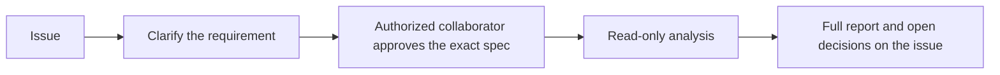
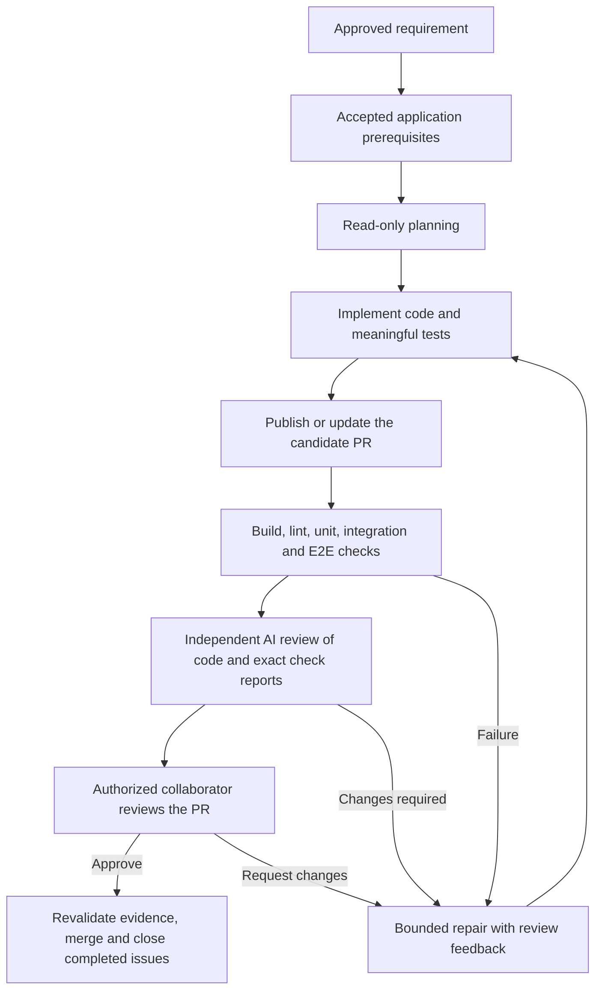

# Axis development pipeline

Axis uses three named NexKit pipelines. Requirements describe Axis's own user
goals, behavior, constraints and acceptance criteria. Knowledge from unrelated
systems does not become an issue reference or a delivery dependency.

## Installation state

`discovery` supports clarification and approved read-only investigations.
The `delivery` and `release` workflows are installed with application work
blocked before reservation. There is no application, accepted architecture,
application test/E2E command set or release artifact definition yet.

The accepted `.nexkit/controls/application-readiness.json` keeps application work
disabled. Its reusable readiness job runs on a hosted runner before the delivery
or release adapter can reserve work. Direct dispatch cannot skip this boundary.
Missing prerequisites produce a blocked result rather than passing application
checks. A deliberate setup proposal must establish the architecture, real
commands and artifact paths before enabling this control.

Pipeline validation and boundary tests verify workflow structure. They do not
establish application behavior or live model access.

## Discovery



Use discovery for business questions, architecture proposals and investigation.
Reports distinguish observed behavior, proposals and decisions still needed.
They do not approve their own conclusions, edit source or create candidate PRs.

```sh
nexkit --pipeline discovery request --title "Requirement title" --body-file request.md
```

For an existing issue, comment `/nexkit start discovery`. Review the bot's
specification and post its exact `/nexkit approve <hash>` command. Starting an
issue alone grants no approval. Task completion leaves the issue available for
discussion and follow-up decisions.

## Delivery



Delivery uses separate planning, editing and independent review sessions. All
agents use `gpt-6.1-sol` with `max` reasoning. Build, lint, unit, integration and
E2E are separate jobs bound to the exact published candidate. Review consumes
every recorded check report; the finalizer handles all jobs and failure paths.

E2E runs on a GitHub-hosted Ubuntu runner with an isolated command workspace.
Application commands start the real application and its test dependencies,
prepare isolated data and exercise the agreed UI/API journeys. Test/E2E reports
must contain real successful cases. Missing, empty, failed or skipped results
cannot establish acceptance. The reviewer checks assertion quality against spec.

After successful checks and independent AI review, one collaborator with current
write, maintain or admin access must approve the current PR. Use GitHub's
**Approve** or **Request changes** decisions. Inline feedback reaches bounded
repair; a comment-only review is discussion. A changed candidate invalidates
approval and requires current checks, AI review and a new human decision.
A changed requirement needs an updated specification and fresh spec approval.

Waiting saves the exact evidence and ends the workflow without holding a runner
or reserving a model call. The PR event relay runs metadata operations on a
hosted runner. A finish-only continuation revalidates frozen evidence before
merge without replaying completed agents. Failed checks and review findings
return to delivery while its persistent budget permits repair.

When application delivery is enabled, use `nexkit --pipeline delivery request`
or `/nexkit start delivery`. The bot supplies the exact spec approval command.
Completed requirement issues close after their reviewed PR merges.

## Release

Release is a separate request over an immutable commit already merged into
`main`, a version and release notes. A release can include several merged changes.
Support stays disabled until real checks, a build command and artifact paths are
accepted through setup.

```sh
nexkit --pipeline release release \
  --commit FULL_COMMIT_SHA \
  --version VERSION \
  --notes-file release-notes.md
```

The shared intake creates a release candidate issue. Review the commit, version
and notes, then post the bot's exact `/nexkit release <hash>` command. Actions
verifies/builds that source and publishes its tag and matching GitHub Release
artifacts. The issue closes after publication. Recover partial failures using
the same candidate without moving tags or replacing differing artifact bytes.
Production deployment requires a separately configured integration and authority.

## Budgets and runners

| Scope | Configured bound |
| --- | --- |
| Discovery clarification | Three calls, ten minutes each |
| Discovery analysis | Two calls, two attempts, forty-five minutes total; fifteen minutes per invocation |
| Delivery clarification | Three calls, ten minutes each |
| Delivery execution | Nine calls, three attempts, 120 minutes total |
| Delivery invocations | Planning fifteen minutes, implementation thirty minutes, review fifteen minutes |
| PR approval window | Seven days, separate from execution time |
| Application command timeout | Fifteen minutes, also bounded by the pipeline deadline |
| Release execution | Two attempts, sixty minutes total; no model invocation |

These are caps, not reservations for every round. Failed calls retain their
reservation; resume does not reset budgets. Exhaustion stops work explicitly.
Clarification has a separate budget. Composed work and its continuation share
the native `nexkit-work` queue; adapters retain their own queues without duplicate
caller locks.

The dedicated subscription runner has an explicit credential-bearing caller
allowlist. Hosted checks, readiness, PR relay, finish-only continuation and
release do not use that runner or login. See [runner operations](runner-operations.md).

## Verification and activation

Use the immutable toolkit checkout selected in `.nexkit/project.json`:

```sh
python3 .nexkit/controls/check-pipeline.py --kit "$NEXKIT_SOURCE"
python3 .nexkit/controls/test-pipeline.py --kit "$NEXKIT_SOURCE"
nexkit doctor --online --checks
```

The `Axis pipeline validation` Actions job validates schema, accepted hashes,
artifact wiring, check dependencies, PR approval and deferred-work boundaries.
Pinned actionlint validates native YAML. The documented `concurrency.queue` field
is excluded from the older linter's syntax check; native Actions verifies it.
This job has no model credential and is separate from `NexKit verification` and
`NexKit review` delivery checks.

Activation requires an accepted architecture/application, five actual commands
named `build`, `lint`, `unit`, `integration` and `e2e`, native reports for test/E2E,
and release build/artifact definitions. Accept controls and configuration with
an exact-hash installation proposal. Require one native PR approval with stale
review dismissal and current `NexKit verification` and `NexKit review` checks
before enabling application work. Never substitute pipeline tests for app tests.

Report live Actions runs, live model access and simulated-model tests separately.
A doctor result without native app checks cannot declare full readiness. Keep
receipts, logs and host snapshots outside the source tree.
