```mermaid
%%{init: {'theme':'dark','themeVariables':{'background':'#0d1117','mainBkg':'#0d1117','primaryColor':'#161b22','primaryBorderColor':'#388bfd','primaryTextColor':'#e6edf3','secondaryColor':'#21262d','secondaryBorderColor':'#388bfd','secondaryTextColor':'#e6edf3','tertiaryColor':'#161b22','tertiaryTextColor':'#e6edf3','lineColor':'#58a6ff','textColor':'#e6edf3','nodeBorder':'#388bfd','clusterBkg':'#161b22','clusterBorder':'#388bfd','titleColor':'#e6edf3','edgeLabelBackground':'#161b22','actorBkg':'#161b22','actorBorder':'#388bfd','actorTextColor':'#e6edf3','signalColor':'#58a6ff','labelBoxBkgColor':'#161b22','labelBoxBorderColor':'#388bfd','noteBkgColor':'#161b22','noteBorderColor':'#388bfd','noteTextColor':'#c9d1d9','activationBkgColor':'#30363d'}}}%%

sequenceDiagram
  rect rgb(22, 35, 58)
    Note over A,B: Section title
    A->>B: Message
  end
```

# Mermaid diagrams (standard theme)

> **Navigation**: [← docs/README.md](../README.md) · [← playbooks](../README.md)

All Mermaid blocks under `docs/` use **one** theme so flowcharts, sequence diagrams, and ER diagrams look the same in GitHub, VS Code, and Cursor.

## Source of truth

| Asset | Path |
|-------|------|
| Init line (copy-paste) | [`docs/diagrams/mermaid-theme.mjs`](../diagrams/mermaid-theme.mjs) → `MERMAID_INIT` |
| Sequence phase `rect` color | same file → `SEQUENCE_PHASE_RGB` |

Print the init line:

```bash
node --input-type=module -e "import { MERMAID_INIT } from './docs/diagrams/mermaid-theme.mjs'; console.log(MERMAID_INIT);"
```

## Required shape

Every fenced block must start like this:

````markdown

```mermaid
%%{init: {'theme':'dark','themeVariables':{'background':'#0d1117','mainBkg':'#0d1117','primaryColor':'#161b22','primaryBorderColor':'#388bfd','primaryTextColor':'#e6edf3','secondaryColor':'#21262d','secondaryBorderColor':'#388bfd','secondaryTextColor':'#e6edf3','tertiaryColor':'#161b22','tertiaryTextColor':'#e6edf3','lineColor':'#58a6ff','textColor':'#e6edf3','nodeBorder':'#388bfd','clusterBkg':'#161b22','clusterBorder':'#388bfd','titleColor':'#e6edf3','edgeLabelBackground':'#161b22','actorBkg':'#161b22','actorBorder':'#388bfd','actorTextColor':'#e6edf3','signalColor':'#58a6ff','labelBoxBkgColor':'#161b22','labelBoxBorderColor':'#388bfd','noteBkgColor':'#161b22','noteBorderColor':'#388bfd','noteTextColor':'#c9d1d9','activationBkgColor':'#30363d'}}}%%

flowchart TD
  ...
```

````

The first line after ` ```mermaid ` is always `MERMAID_INIT` from `mermaid-theme.mjs`. Edit colors there only — do not invent per-file themes.

## Sequence diagrams — phase sections

Group steps with a tinted band (same blue-gray on dark canvas):



Use `SEQUENCE_PHASE_RGB` from `mermaid-theme.mjs` for the `rect rgb(...)` values.

## Diagram types

| Type | Use for |
|------|---------|
| `flowchart` | Screen flow, architecture layers |
| `sequenceDiagram` | API / auth / provisioning flows |
| `erDiagram` | Entity models |

## Where diagrams live

| Scope | Location |
|-------|----------|
| Platform architecture | [docs/README.md § Key Diagrams](../README.md#key-diagrams) |
| Use case | `docs/use-cases/{domain}/{slug}/README.md` → `## Diagrams` or `## Screen flow` |

Wireframes stay **Excalidraw** — see [wireframes.md](./wireframes.md).
