# Mermaid Diagrams

> **Navigation**: [docs/README.md](../README.md) | [playbooks](../README.md)

All Mermaid blocks under `docs/` use one theme so flowcharts, sequence diagrams, and ER diagrams look consistent in GitHub and IDE previews.

## Source Of Truth

| Asset | Path |
|-------|------|
| Init line | [`docs/diagrams/mermaid_theme.py`](../diagrams/mermaid_theme.py) -> `MERMAID_INIT` |
| Sequence phase `rect` color | same file -> `SEQUENCE_PHASE_RGB` |

Print the init line:

```bash
python -c "from docs.diagrams.mermaid_theme import MERMAID_INIT; print(MERMAID_INIT)"
```

Sync all Mermaid blocks:

```bash
python docs/scripts/sync-mermaid-theme.py
```

## Required Shape

Every fenced block must start like this:

````markdown

```mermaid
%%{init: {'theme':'dark','themeVariables':{'background':'#0d1117','mainBkg':'#0d1117','primaryColor':'#161b22','primaryBorderColor':'#388bfd','primaryTextColor':'#e6edf3','secondaryColor':'#21262d','secondaryBorderColor':'#388bfd','secondaryTextColor':'#e6edf3','tertiaryColor':'#161b22','tertiaryTextColor':'#e6edf3','lineColor':'#58a6ff','textColor':'#e6edf3','nodeBorder':'#388bfd','clusterBkg':'#161b22','clusterBorder':'#388bfd','titleColor':'#e6edf3','edgeLabelBackground':'#161b22','actorBkg':'#161b22','actorBorder':'#388bfd','actorTextColor':'#e6edf3','signalColor':'#58a6ff','labelBoxBkgColor':'#161b22','labelBoxBorderColor':'#388bfd','noteBkgColor':'#161b22','noteBorderColor':'#388bfd','noteTextColor':'#c9d1d9','activationBkgColor':'#30363d'}}}%%

flowchart TD
  ...
```

````

The first line after ```` ```mermaid ```` is always `MERMAID_INIT` from `mermaid_theme.py`. Edit colors there only.

## Sequence Diagrams

Group phases with the shared band color:

```mermaid
%%{init: {'theme':'dark','themeVariables':{'background':'#0d1117','mainBkg':'#0d1117','primaryColor':'#161b22','primaryBorderColor':'#388bfd','primaryTextColor':'#e6edf3','secondaryColor':'#21262d','secondaryBorderColor':'#388bfd','secondaryTextColor':'#e6edf3','tertiaryColor':'#161b22','tertiaryTextColor':'#e6edf3','lineColor':'#58a6ff','textColor':'#e6edf3','nodeBorder':'#388bfd','clusterBkg':'#161b22','clusterBorder':'#388bfd','titleColor':'#e6edf3','edgeLabelBackground':'#161b22','actorBkg':'#161b22','actorBorder':'#388bfd','actorTextColor':'#e6edf3','signalColor':'#58a6ff','labelBoxBkgColor':'#161b22','labelBoxBorderColor':'#388bfd','noteBkgColor':'#161b22','noteBorderColor':'#388bfd','noteTextColor':'#c9d1d9','activationBkgColor':'#30363d'}}}%%

sequenceDiagram
  rect rgb(22, 35, 58)
    Note over A,B: Section title
    A->>B: Message
  end
```



Use `SEQUENCE_PHASE_RGB` from `mermaid_theme.py` for `rect rgb(...)`.

## Diagram Types

| Type | Use for |
|------|---------|
| `flowchart` | Screen flow, architecture layers |
| `sequenceDiagram` | API / auth / provisioning flows |
| `erDiagram` | Entity models |

## Where Diagrams Live

| Scope | Location |
|-------|----------|
| Platform architecture | [docs/README.md - Key Diagrams](../README.md#key-diagrams) |
| Use case | `docs/use-cases/{domain}/{slug}/README.md` -> `## Diagrams` or `## Screen flow` |

Wireframe/design sources stay in Penpot. See [design-source.md](./design-source.md) and [wireframes.md](./wireframes.md). Legacy Excalidraw assets are only refreshed when touched.
