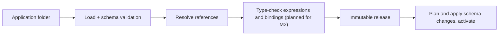

# Configuration pipeline

Detailed reference for the configuration pipeline, startup activation,
resource file shapes, entity field types and the diagnostic codes. The
conventions of [architecture.md](../architecture.md) apply: sections marked
*(planned for Mx)* are not built yet, and Dn refers to
[decisions.md](../decisions.md).



1. **Load.** Every `*.json` file in the folder and its subfolders is one
   resource. Each is validated against the JSON Schema for its `kind`
   (`application`, `entity`, `site`, `page`, `text` or `seed`). The manifest is the single `application`
   resource, stored as `application.json` at the folder root; an `application`
   resource in any other file is not used as the manifest. Resource IDs are
   unique across the application, compared as UUIDs. Names are unique per
   kind, ignoring letter case. The same checks run on a release's stored
   resources when the server rebuilds its model.
2. **Resolve.** Every reference must resolve inside the application or its
   declared modules. The entity model is built here: each field's `type`
   becomes a typed field type, every type-specific property is checked against
   the field type and against what storage accepts (see
   [Entity field types and constraints](#entity-field-types-and-constraints)),
   field names must be unique within their entity ignoring letter case, and the
   `target` of a reference or child collection field must name a loaded
   entity, ignoring letter case. An entity may reference itself. A `target` naming an entity whose file is
   in the folder, has kind `entity` and a string `name`, but was not loaded
   because of its own errors (such as a schema violation) is not reported
   again; only that file's own diagnostics are.
   - **Texts.** Each `text` resource holds the texts of one locale. Two text
     resources for the same locale, ignoring letter case, are `AXC0026` at
     `/locale` of the later file in path order. Every locale must have the
     same keys: a key that one locale has and another lacks is `AXC0027` at
     `/texts` of the file that lacks it, once per key, naming the first
     locale in path order that has it. A file already reported as a duplicate
     locale is left out of this check. Keys are compared ordinally.
   - **Labels.** The text key of the application label, an entity label or a
     field label must be in some locale, otherwise it is `AXC0028` at that
     label's `/textKey`. This applies also when the application has no text
     resource. Unused keys are allowed.
   - **Display field.** An entity's `displayField` must name one of its own
     required `text` fields, ignoring letter case, otherwise it is `AXC0029`
     at `/displayField`. Every entity that is the `target` of a reference,
     including a reference to itself, must have a `displayField`, otherwise
     the reference is `AXC0030` at `/fields/{i}/target`. It is not reported
     when the target is already `AXC0012` or `AXC0040`, or names an entity
     file that was not loaded.
   - **Child collections.** A `child-collection` field without `target` is
     `AXC0014` at the field, and a `target` that names no loaded entity is
     `AXC0012` at `/fields/{i}/target`. The entity it names is a child
     entity, owned by that field. The owner is the first such field in path
     order of the entity files, then in field order. A later field with the
     same target is `AXC0039` at its `/fields/{i}/target`, naming the owner.
     A `reference` whose target is a child entity is `AXC0040` at
     `/fields/{i}/target`. A `reference` or `child-collection` field on a
     child entity is `AXC0041` at its `/fields/{i}/type`, so an entity whose
     child collection names itself is `AXC0041`. See
     [Entity logic](#entity-logic) for why these limits exist.
   - **Sites and pages.** A site belongs to one application. Its `path` is
     lower-case letters, digits and hyphens, starting with a letter. A path
     reserved by the platform (`api`, `health`, `assets`), or one that an
     earlier site of the application already uses in path order, is
     `AXC0024` at `/path`. A reserved path is not also checked for
     duplicates. The `default` and `fallback` locales must be in
     `available`, and every available locale needs a `text` resource,
     ignoring letter case, otherwise it is `AXC0025`. A widget's `entity`
     must name a loaded entity (`AXC0021`). A `formPage` is allowed only on
     a `table` widget and must name a page whose widget is a `form` over the
     same entity (`AXC0022`). A navigation entry must name a loaded page
     (`AXC0023`). Entity and page names resolve ignoring letter case, and a
     name whose file was not loaded because of its own errors is not
     reported again. Site titles, navigation labels and page titles join the
     `AXC0028` check.
   - **Seeds.** A seed's `entity` must name a loaded entity, ignoring letter
     case, otherwise it is `AXC0032` at `/entity`. A name whose entity file
     was not loaded because of its own errors is not reported again. Seed
     record ids are unique across every seed file of the application,
     compared as UUIDs: a record whose id an earlier record already uses, in
     the same file or an earlier file in path order, is `AXC0034` at
     `/records/{i}/id`, naming the file of the first one. Seed record ids are
     not compared with resource ids. Seed values are not checked at compile
     time; the startup step checks them before it inserts any record (see
     [Startup activation](#startup-activation)).

   The model holds the text resources, each entity's display field, the
   sites and pages with their entity and page references resolved, and the
   seeds in path order with their entity resolved. No model
   is produced while any error remains.
3. **Check** *(planned for M2)*. Expressions (see
   [Expression language](expressions.md)), data source fields, form
   bindings and operation inputs are type-checked. M1 has no check step; the
   model goes straight to the release.
4. **Release.** The compiled application is stored as a release with a
   content hash. It is immutable.
   - **Content hash.** Every resource file is canonicalized as in RFC 8785
     (JCS): no whitespace, object properties sorted by UTF-16 code units,
     minimal string escaping, numbers written as ECMAScript does. The hash is
     SHA-256 over every resource in ordinal order of its relative path (`/`
     separators), each contributing `path`, a newline, its canonical JSON and
     a newline, encoded as UTF-8. It is written as lowercase hex.
     Formatting-only changes (whitespace, key order, line endings) keep the
     hash; a changed value, or an added, removed or renamed file changes it.
   - **Identity.** A release is unique per application `id` and content hash.
     Compiling an unchanged folder returns the stored release instead of
     storing a second one, also when two compiles run at the same time.
   - **Content.** A release stores the canonical content of every resource
     with its relative path, so it can be read back without the folder.
   - **Errors.** A folder with any error diagnostic produces no release;
     compile returns the diagnostics only.
5. **Activate.** The current tenant schema is compared with the entity
   definitions of the release. Additive changes are planned and applied;
   incompatible changes are rejected with a diagnostic until migrations exist
   (M6). See [Schema planning](storage.md#schema-planning). The release becomes active
   for new work only after that has completed successfully.
   - **Active release.** Each application `id` has at most one active
     release, stored with the manifest `name` as written. The name is unique
     across the active applications, ignoring letter case; names are ASCII
     (`AXC0004`), so the database's `lower(name)` matches. An application
     may change its name: its active release then holds the new name and the
     old one is free for another application.
   - **Site paths.** A site path is active for at most one application `id`
     in the tenant. The active release stores the paths of its sites. A site
     whose path another application's active release holds gets `AXC0031` at
     `/path` of its site file. Activation checks the paths before
     provisioning, and a unique index on the path enforces the rule when the
     active release is set. Site paths are lower-case (`AXC0004`), so the
     plain index already ignores letter case.
   - **Order.** Activation first checks that no other application `id` is
     active under the manifest name; if one is, it returns `AXC0020` and
     changes nothing. It then checks each site path; it returns one `AXC0031`
     for every site whose path another application holds, and changes
     nothing. It then provisions the entity tables (see
     [Storage](storage.md#storage)); when provisioning returns diagnostics, they are
     returned and the active release is untouched. Only then is the release
     set active, in one upsert per application `id`, so two activations of
     the same application never conflict and the last one wins. When another
     application took the name after the check, the upsert is refused and
     activation returns the same `AXC0020`. When another application took a
     site path after the check, the unique index refuses it and activation
     returns one `AXC0031` for that path.
   - **Transactions.** Provisioning runs in its own transaction (DDL,
     provisioning records and the schema lock). The active release and its
     `axis.active_sites` rows are written afterwards, after provisioning
     committed, in one short transaction of their own. A refused name or path
     leaves neither written. No other configuration statement runs while the
     provisioning transaction is open, so the caller may use one tenant
     connection for both or two connections. Activation must run outside an
     explicit transaction.
   - **Failure after provisioning.** When writing the active release fails
     after provisioning committed, the error propagates. The new tables and
     columns stay, recorded for the application, and the previous release
     stays active and keeps serving: it reads and writes only its own
     columns, so only a new required column on a table that had no rows
     rejects its inserts. Activating again is safe because provisioning is
     additive. An activation that loses the name or a site path to a
     concurrent one also
     leaves its provisioned tables in place, recorded for its application
     `id` and not active.
   - **Re-activation.** Activating the active release again provisions
     nothing, keeps its site paths and changes only its activation time. A
     release that renames a site path frees the old path for another
     application.
   - **Serving.** The server rebuilds the `ApplicationModel` from the
     release's stored resources through `IActiveReleaseStore` and caches it
     per tenant and release id. A stored release that no longer compiles
     clean, or compiles to another content hash, is an error, never served.
     The active row is read on every request, so a new activation is served
     by the next request. A name outside the manifest name rule (an ASCII
     letter, then ASCII letters or digits, at most 60 characters) resolves to
     nothing without a query, so Unicode case folding such as the Kelvin sign
     never aliases an application name.

Diagnostics always carry `file`, `resourceId` (when the file has a readable
ID), `path`, `code` and a message. `file` is relative to the application
folder and uses `/` separators, or is empty when the diagnostic concerns the
whole application folder. `path` is a JSON Pointer (RFC 6901) into that file,
such as `/fields/0/type`, or empty when the problem concerns the whole file or
the whole folder. Messages never contain absolute paths or exception text,
because they are shown to application authors. Codes have the form `AXCnnnn`
and never change meaning. Compile reports all diagnostics, not just the first,
sorted by file and then path.

| Code | Meaning |
| --- | --- |
| `AXC0001` | The file is not valid JSON. |
| `AXC0002` | The resource has no `kind`, or `kind` is not a string. |
| `AXC0003` | The `kind` is not a known resource kind. |
| `AXC0004` | The resource does not match the JSON Schema for its kind. |
| `AXC0005` | Another resource already uses this `id`. |
| `AXC0006` | Another resource of the same kind already uses this `name`. |
| `AXC0007` | The folder has no `application` manifest. |
| `AXC0008` | The folder has more than one `application` manifest. |
| `AXC0009` | An `application` resource is not `application.json` at the folder root, or the root `application.json` has another kind. |
| `AXC0010` | The file could not be read, for example because access is denied. |
| `AXC0011` | Another field of the same entity already uses this `name`, ignoring letter case. |
| `AXC0012` | A reference or child collection field's `target` names no loaded entity. Not reported when the target names an entity file in the folder that was not loaded because of its own errors. |
| `AXC0013` | A field property does not fit the field's type, or its value is outside what storage accepts. |
| `AXC0014` | A field lacks a property its type needs: `target` on a reference or child collection, `values` on an enum. |
| `AXC0015` | An entity table has a column whose field was removed. Reported at `/fields` of the entity file. |
| `AXC0016` | A field changed in a way its existing column cannot follow, such as a new type, a shorter `maxLength` or a removed enum value. |
| `AXC0017` | An entity provisioned for the application is missing from it. Reported at `application.json` with an empty path. |
| `AXC0018` | The entity's `id` is already provisioned for another application. Reported at `/id` of the entity file. |
| `AXC0019` | The application folder could not be listed: it does not exist, it cannot be opened, or one of its subfolders cannot be opened. Reported with an empty `file` and `path`, as the only diagnostic; nothing in the folder is loaded. |
| `AXC0020` | The application's `name` is active for another application `id`, ignoring letter case. Reported at `/name` of `application.json`, as the only diagnostic; nothing is provisioned or activated. |
| `AXC0021` | A widget's `entity` names no loaded entity. Reported at `/widgets/{i}/entity`. |
| `AXC0022` | A widget's `formPage` is set on a `form` widget, names no loaded page, or names a page whose widget is not a `form` over the same entity. Reported at `/widgets/{i}/formPage`. |
| `AXC0023` | A navigation entry names no loaded page. Reported at `/navigation/{i}/page`. |
| `AXC0024` | A site path is reserved by the platform, or another site of the application already uses it. Reported at `/path` of the later file. |
| `AXC0025` | A site's default or fallback locale is not in `available`, or an available locale has no `text` resource. Reported at that locale. |
| `AXC0026` | Another `text` resource already holds this locale, ignoring letter case. Reported at `/locale` of the later file. |
| `AXC0027` | A text key that another locale has is missing from this locale. Reported at `/texts`, naming the key and a locale that has it. |
| `AXC0028` | No locale has the text key of this label. Reported at the label's `/textKey`. |
| `AXC0029` | The entity's `displayField` names no required `text` field of the entity. Reported at `/displayField`. |
| `AXC0030` | A reference field's target entity has no `displayField`. Reported at `/fields/{i}/target`. |
| `AXC0031` | A site path is active for another application. Reported at `/path` of the site file; nothing is provisioned or activated. |
| `AXC0032` | A seed's `entity` names no loaded entity. Reported at `/entity`. |
| `AXC0033` | A seed value is one the record API would reject, or the seed record could not be inserted, for example because a reference names no record. Reported by the startup step at `/records/{i}/values/<field>` of the seed file, or at `/records/{i}` when the stored schema does not match the active model. |
| `AXC0034` | An earlier seed record of the application already uses this record id. Reported at `/records/{i}/id` of the later record, naming the file of the first one. |
| `AXC0039` | The child entity is already owned by another `child-collection` field. Reported at `/fields/{i}/target` of the later field, naming the owner. |
| `AXC0040` | A reference field's target is a child entity. Reported at `/fields/{i}/target`, naming the owner. |
| `AXC0041` | A child entity has a `reference` or `child-collection` field. Reported at `/fields/{i}/type` of that field, naming the owner. |

## Startup activation

The server can compile and activate application folders when it starts, so a
development or E2E server serves a real application without a separate step.

- **Setting.** `ActivateOnStartup` is an array of application folders, such
  as `"ActivateOnStartup": ["../../samples/apps/purchase-requests"]` or the
  environment variable `ActivateOnStartup__0=/path/to/folder`. Relative paths
  are resolved against the server content root. When the setting is absent or
  empty the step does not run. That is the default, and so the Production
  behaviour.
- **Order.** Tenants are processed in ordinal order of their id. For each
  tenant, the step applies the configuration and data migrations to the
  tenant database, then compiles each listed folder against that database and
  activates the release, in the listed order. The same folders apply to
  every tenant.
- **Before listening.** The step runs before any hosted service starts, so
  the server accepts no request until every tenant is done.
- **Failures.** Any compile or activation diagnostic, or any error, stops the
  start and the process exits. Each diagnostic is logged with its code, file
  and path, together with the folder and tenant. An error after provisioning
  committed is logged with the folder and tenant too. The previously active
  release stays active, and the first failing tenant stops the whole start,
  so no server runs with some tenants on old releases and others on new ones.
- **Seeding.** After a folder is activated in a tenant, the step inserts
  every seed record whose id the entity table does not hold yet. Existing
  records are left alone, including records edited through the UI, so
  restarts never duplicate seeds. Only the id decides: a seed record that was
  deleted is inserted again on the next start. Each record goes through the
  record input parser as a create body and is inserted by the record create
  command, so the record API's rules apply. Every record is parsed before any
  insert, and every invalid value is `AXC0033` at
  `/records/{i}/values/<field>`. Then all inserts of the folder run in one
  transaction, seed files in path order and records in file order, so a
  reference value must name an existing record or one inserted earlier in
  the same run. The first record that storage refuses, for a missing
  reference, a duplicate unique value or a schema conflict, is reported as
  `AXC0033`, and the transaction is rolled back. Any
  `AXC0033` stops the start like any other diagnostic, and the release stays
  active.
- **Restarts.** Restarting with unchanged folders is safe. An unchanged
  folder returns its stored release, and activating the active release again
  only updates its activation time. After a failure, the next start
  activates again safely because provisioning is additive.

## Resource file shape

```json
{
  "id": "4b6f0c1e-6a0e-4c47-9a53-0f5f8f8b1a01",
  "kind": "entity",
  "name": "PurchaseRequest",
  "formatVersion": 1,
  "label": { "textKey": "purchaseRequest.label" },
  "displayField": "title",
  "fields": [
    { "name": "title", "type": "text", "required": true, "maxLength": 200 },
    { "name": "department", "type": "reference", "target": "Department", "required": true },
    { "name": "total", "type": "decimal", "precision": 18, "scale": 2 }
  ]
}
```

- `id` is permanent.
- `name` is the stable technical name used in references and storage. It
  starts with a letter, contains only ASCII letters and digits, and is at most
  60 characters long (`AXC0004`). The same rule applies to field names.
- Labels always come from text resources.
- `displayField` names the required `text` field that gives a record its
  name, for example in lookups. An entity that is the target of a reference
  must have one.

A `text` resource holds the texts of one locale, as a map from text key to
text:

```json
{
  "id": "8c3a6b4d-5e6f-4a7b-8c9d-0e1f2a3b4c04",
  "kind": "text",
  "name": "TextsEn",
  "formatVersion": 1,
  "locale": "en",
  "texts": {
    "purchaseRequest.label": "Purchase request"
  }
}
```

- `locale` is a language tag such as `en`, `vi` or `pt-BR`: two or three
  letters, then any number of `-` parts of two to eight letters or digits
  (`AXC0004`). Locales are compared ignoring letter case.
- Each locale has one `text` resource, and every locale has the same keys.
- Texts are never shared across applications.

A `site` is an entry point of the application. A `page` is a route in a
site, and its widgets are its content:

```json
{
  "id": "c5e8d2a1-7b3f-4c9e-9d1a-2f3b4c5d6e06",
  "kind": "site",
  "name": "Purchasing",
  "formatVersion": 1,
  "path": "purchasing",
  "title": { "textKey": "purchasing.title" },
  "locales": { "default": "en", "fallback": "en", "available": ["en", "vi"] },
  "navigation": [{ "page": "PurchaseRequests", "label": { "textKey": "purchasing.nav.requests" } }]
}
```

```json
{
  "id": "d6f9e3b2-8c4a-4d0f-8e2b-3a4c5d6e7f07",
  "kind": "page",
  "name": "PurchaseRequests",
  "formatVersion": 1,
  "title": { "textKey": "pages.requests.title" },
  "widgets": [{ "type": "table", "entity": "PurchaseRequest", "formPage": "PurchaseRequestForm" }]
}
```

- A page holds exactly one widget in M1. The widget `type` is `table` or
  `form`, and both name an `entity`.
- A `table` widget may name a `formPage`: the page with the `form` widget
  that opens one of its records.
- The page has no entity or template of its own, so more widgets and a
  layout can be added later without a format change.

A `seed` holds records with fixed ids for one entity:

```json
{
  "id": "e7a0f4c3-9d5b-4e1f-8f3c-4b5d6e7f8a08",
  "kind": "seed",
  "name": "Departments",
  "formatVersion": 1,
  "entity": "Department",
  "records": [
    { "id": "0b9e8d7c-6a5f-4e3d-9c2b-1a0f9e8d7c6b", "values": { "name": "Finance" } }
  ]
}
```

- Each record's `id` is the record id, fixed so that the startup step
  inserts the record once. It is unique across every seed file of the
  application (`AXC0034`).
- `values` has the shape of the `values` of a record API create body (see
  [Request bodies and values](record-api.md#request-bodies-and-values)).
- Seed files are inserted in path order, so a seed whose records reference
  another seed's records sorts after it.

A `rule` resource *(planned for M2)* holds a named expression with typed
parameters and a result type. Any expression can call it (see
[Expression language](expressions.md#names-and-references)):

```json
{
  "id": "8e16aa07-44d2-435b-8260-557ea9f3c1b2",
  "kind": "rule",
  "name": "IsPositive",
  "formatVersion": 1,
  "parameters": [{ "name": "value", "type": "integer" }],
  "resultType": "boolean",
  "expression": "value > 0"
}
```

- `parameters` is a list of `name` and `type`. Parameter and result types are
  the scalar field types: `text`, `integer`, `decimal`, `boolean`, `date`,
  `date-time` and `enum`. A parameter is never a record.
- A rule is called by name, ignoring letter case, such as `IsPositive(quantity)`.
- The `expression` must give the `resultType`, and sees only its parameters.
- The `rule` kind is not in the Load step's list of kinds yet. It is added by
  the issue that builds it.

## Entity field types and constraints

A field property is allowed only on the types that have an entry for it below.
Properties are optional unless marked *needed*. A property on another type is
`AXC0013`; a missing *needed* property is `AXC0014`.
Value ranges follow what PostgreSQL accepts, so an invalid value fails at
compile time rather than when the table is created; a value outside the range
is `AXC0013`.

| Type | `required` | `unique` | `maxLength` | `precision` | `scale` | `target` | `values` | `expression` *(planned for M2)* |
| --- | --- | --- | --- | --- | --- | --- | --- | --- |
| `text` | yes | yes | 1..10485760 | | | | | yes |
| `integer` | yes | yes | | | | | | yes |
| `decimal` | yes | yes | | 1..1000 | 0..`precision`, only with `precision` | | | yes |
| `boolean` | yes | yes | | | | | | yes |
| `date` | yes | yes | | | | | | yes |
| `date-time` | yes | yes | | | | | | yes |
| `enum` | yes | yes | | | | | needed | yes |
| `reference` | yes | yes | | | | needed | | |
| `child-collection` | | | | | | needed | | |
- `required` and `unique` default to `false`.
- `maxLength` is capped at 10485760, the largest `varchar` length.
- `values` is a non-empty list of distinct strings; the JSON Schema checks
  this (`AXC0004`).
- `target` names an entity in the same application, ignoring letter case.
- `child-collection` owns the rows of the entity that `target` names. It
  allows no other type-specific property. It has no `required`, because a
  missing collection means no rows, and no `unique`. Setting either, even to
  `false`, is `AXC0013`.
- `expression` *(planned for M2)* makes the field a computed field. It is not
  allowed with `required`. See [Entity logic](#entity-logic).

## Entity logic

This section adds validations, computed fields and child collections to an
entity (D17). Child collection fields and their child tables are built.
Validations, computed fields and the `expression` property are *(planned for
M2)*, and so are the parts of the child collection rules that the record API
serves. Expressions use the
syntax of the [expression language](expressions.md), and diagnostic codes come
with the issues that build each check.

```json
{
  "id": "0ec02f4a-bf31-4409-8eb9-bfb9c39b6756",
  "kind": "entity",
  "name": "PurchaseRequest",
  "formatVersion": 1,
  "label": { "textKey": "purchaseRequest.label" },
  "displayField": "title",
  "fields": [
    { "name": "title", "type": "text", "required": true, "maxLength": 200 },
    { "name": "lineItems", "type": "child-collection", "target": "LineItem" },
    {
      "name": "total",
      "type": "decimal",
      "precision": 18,
      "scale": 2,
      "expression": "sum(lineItems, amount)"
    }
  ],
  "validations": [
    {
      "expression": "count(lineItems) >= 1",
      "message": { "textKey": "purchaseRequest.needsLineItem" },
      "field": "lineItems"
    }
  ]
}
```

```json
{
  "id": "b6c15e88-82e5-43e7-a589-c48ba8a56bc3",
  "kind": "entity",
  "name": "LineItem",
  "formatVersion": 1,
  "label": { "textKey": "lineItem.label" },
  "fields": [
    { "name": "description", "type": "text", "maxLength": 200 },
    { "name": "quantity", "type": "integer" },
    { "name": "unitPrice", "type": "decimal", "precision": 18, "scale": 2 },
    {
      "name": "amount",
      "type": "decimal",
      "precision": 18,
      "scale": 2,
      "expression": "quantity * unitPrice"
    }
  ],
  "validations": [
    {
      "expression": "IsPositive(quantity)",
      "message": { "textKey": "lineItem.quantityPositive" },
      "field": "quantity"
    }
  ]
}
```

- **Validations.** `validations` is a list on the entity. Each entry has:
  - `expression`, which must be boolean.
  - `message`, a label that is checked like other labels (`AXC0028`). Its text
    key is the message of a failure.
  - `field`, which names a field of the same entity.

  The server runs them on create and update, on the record as it will be
  stored and after computed fields are calculated. A validation fails when its
  condition is `false` or `null`. The validations of a child entity run on
  each row. See
  [the record API](record-api.md#child-rows-computed-fields-and-validations).
- **Computed fields.** A field with an `expression` is a computed field.
  - The expression type must match the field's type.
  - The type must be a scalar type. A `reference` or a `child-collection`
    cannot be computed.
  - `required` is not allowed. `unique`, `maxLength`, `precision`, `scale` and
    `values` keep their usual meaning, because they describe the column that
    stores the value.
  - It reads only the record's own fields and its child rows, never a
    reference path.
  - The rows of a child collection are computed before the owner.
  - Clients cannot write it. See
    [Child tables and computed columns](storage.md#child-tables-and-computed-columns).
- **Child collections.** The field type `child-collection` needs a `target`
  that names the child entity. Its rows are read and written only through the
  owner record *(planned for M2)*. Until then the record API leaves the field
  out, as [the record API](record-api.md#reading-values) describes.
- **M2 limits on a child entity.** These are limits of M2, not permanent
  rules. Real line items often point to a product, so a later milestone is
  expected to lift the last one. A child entity:
  - is owned by exactly one `child-collection` field (`AXC0039`);
  - is never the `target` of a `reference` (`AXC0040`);
  - has no record routes of its own *(planned for M2)*;
  - has no `reference` or `child-collection` fields (`AXC0041`).
