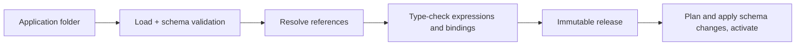

# Configuration pipeline

Detailed reference for the configuration pipeline, startup activation,
resource file shapes, entity field types and the diagnostic codes. The
conventions of [architecture.md](../architecture.md) apply: sections marked
*(planned for Mx)* are not built yet, and Dn refers to
[decisions.md](../decisions.md).



1. **Load.** Every `*.json` file in the folder and its subfolders is one
   resource. Each is validated against the JSON Schema for its `kind`
   (`application`, `entity`, `site`, `page`, `text`, `seed`, `dataSource`,
   `rule`, `sequence`, `process` or `form`). The manifest is the single `application`
   resource, stored as `application.json` at the folder root; an `application`
   resource in any other file is not used as the manifest. Resource IDs are
   unique across the application, compared as UUIDs. Names are unique per
   kind, ignoring letter case. The same checks run on a release's stored
   resources when the server rebuilds its model.
2. **Resolve.** Every reference must resolve inside the application or its
   declared modules. The entity model is built here: each field's `type`
   becomes a typed field type, every type-specific property is checked against
   the field type and against what storage accepts (see
   [Entity field types and constraints](#entity-field-types-and-constraints)),
   field names must be unique within their entity ignoring letter case, and the
   `target` of a reference or child collection field must name a loaded
   entity, ignoring letter case. An entity may reference itself. A `target` naming an entity whose file is
   in the folder, has kind `entity` and a string `name`, but was not loaded
   because of its own errors (such as a schema violation) is not reported
   again; only that file's own diagnostics are.
   - **Texts.** Each `text` resource holds the texts of one locale. Two text
     resources for the same locale, ignoring letter case, are `AXC0026` at
     `/locale` of the later file in path order. Every locale must have the
     same keys: a key that one locale has and another lacks is `AXC0027` at
     `/texts` of the file that lacks it, once per key, naming the first
     locale in path order that has it. A file already reported as a duplicate
     locale is left out of this check. Keys are compared ordinally.
   - **Labels.** The text key of the application label, an entity label or a
     field label must be in some locale, otherwise it is `AXC0028` at that
     label's `/textKey`. This applies also when the application has no text
     resource. Unused keys are allowed.
   - **Display field.** An entity's `displayField` must name one of its own
     required `text` fields, ignoring letter case, otherwise it is `AXC0029`
     at `/displayField`. Every entity that is the `target` of a reference,
     including a reference to itself, must have a `displayField`, otherwise
     the reference is `AXC0030` at `/fields/{i}/target`. It is not reported
     when the target is already `AXC0012` or `AXC0040`, or names an entity
     file that was not loaded.
   - **Child collections.** A `child-collection` field without `target` is
     `AXC0014` at the field, and a `target` that names no loaded entity is
     `AXC0012` at `/fields/{i}/target`. The entity it names is a child
     entity, owned by that field. The owner is the first such field in path
     order of the entity files, then in field order. A later field with the
     same target is `AXC0039` at its `/fields/{i}/target`, naming the owner.
     A `reference` whose target is a child entity is `AXC0040` at
     `/fields/{i}/target`. A `reference` or `child-collection` field on a
     child entity is `AXC0041` at its `/fields/{i}/type`, so an entity whose
     child collection names itself is `AXC0041`. See
     [Entity logic](#entity-logic) for why these limits exist.
   - **Sites and pages.** A site belongs to one application. Its `path` is
     lower-case letters, digits and hyphens, starting with a letter. A path
     reserved by the platform (`api`, `health`, `assets`), or one that an
     earlier site of the application already uses in path order, is
     `AXC0024` at `/path`. A reserved path is not also checked for
     duplicates. The `default` and `fallback` locales must be in
     `available`, and every available locale needs a `text` resource,
     ignoring letter case, otherwise it is `AXC0025`. A `table` widget names
     exactly one of `entity` and `dataSource`, and a `form` widget exactly
     one of `form` and `entity`, otherwise it is `AXC0060` at
     `/widgets/{i}`. A widget's `entity` must name a loaded entity
     (`AXC0021`). A `dataSource` is allowed only on a `table` widget, and
     its data source must have no required parameter (`AXC0060` at
     `/widgets/{i}/dataSource`). It must name a loaded data source
     (`AXC0059`). A `form` is allowed only on a `form` widget (`AXC0060` at
     `/widgets/{i}/form`), and must name a loaded form (`AXC0077`). A
     `formPage` is allowed only on a `table` widget and must
     name a page whose widget is a `form` over the same entity, or over the
     root entity of the table's data source (`AXC0022`). A `form` widget
     that names a form is over the form's entity. A `formPage` is not
     allowed when the table's data source has an `aggregate`, because a group
     is not a record (`AXC0022`). A navigation entry
     must name a loaded page (`AXC0023`). Entity, page, data source and form names
     resolve ignoring letter case, and a name whose file was not loaded
     because of its own errors is not reported again. Site titles, navigation labels and page titles join the
     `AXC0028` check.
   - **Forms.** A [form](frontend.md)'s `entity` must name a loaded
     entity, ignoring letter case, otherwise it is `AXC0074` at `/entity`,
     and its fields are not checked. A name whose entity file was not loaded
     because of its own errors is not reported again. Each section `field`
     must name a field of that entity, ignoring letter case, otherwise it is
     `AXC0075` at `/sections/{i}/fields/{j}/field`. A field that an earlier
     entry of the form already lists, in any section and ignoring letter
     case, is `AXC0076` at the later entry's `field`, naming the first one.
     Each section title joins the `AXC0028` check, at
     `/sections/{i}/title/textKey`.
   - **Seeds.** A seed's `entity` must name a loaded entity, ignoring letter
     case, otherwise it is `AXC0032` at `/entity`. A name whose entity file
     was not loaded because of its own errors is not reported again. Seed
     record ids are unique across every seed file of the application,
     compared as UUIDs: a record whose id an earlier record already uses, in
     the same file or an earlier file in path order, is `AXC0034` at
     `/records/{i}/id`, naming the file of the first one. Seed record ids are
     not compared with resource ids. Seed values are not checked at compile
     time; the startup step checks them before it inserts any record (see
     [Startup activation](#startup-activation)).
   - **Sequences.** A field's [`sequence`](#sequences) must name a loaded
     `sequence` resource, ignoring letter case, otherwise it is `AXC0066` at
     `/fields/{i}/sequence`. A name whose sequence file was not loaded
     because of its own errors, such as a bad `format`, is not reported
     again. A `sequence` is `AXC0013` at `/fields/{i}/sequence` when the
     field is not `text`, is `required`, has an `expression`, or belongs to
     a child entity. The field gets one diagnostic, for the first of these
     reasons in that order. A field that is not `text` gets no `AXC0066`.
   - **Data sources.** A data source's `entity` must name a loaded entity,
     ignoring letter case, otherwise it is `AXC0042` at `/entity`, and its
     fields and sort are not checked further. A name whose entity file was
     not loaded because of its own errors is not reported again. An
     `entity` that is a child entity is `AXC0064` at `/entity`, naming the
     owner. Each `path` must name a field of that entity, or go through
     `reference` fields with at most 3 hops, each name ignoring letter case,
     otherwise it is `AXC0043` at `/fields/{i}/path`. A path through a field that is not a
     `reference`, to an unknown field or with more than 3 hops is `AXC0043`,
     with a message that says which. A path ending at a `child-collection`
     field is `AXC0043` too, because that field has no column. A path that
     reaches an entity whose file was not loaded is not reported again. Projected names compare
     exactly: a name that an earlier entry of `fields` already uses is
     `AXC0044` at `/fields/{i}/name`. The `sort`, without its leading `-`,
     must exactly match a projected name whose path does not end at a `reference`,
     otherwise it is `AXC0045` at `/sort`. A sort naming an entry whose path
     is already `AXC0043` is not reported again. An `aggregate` groups by
     projected names, compared exactly: a `groupBy` entry that names no
     projected field is `AXC0061` at `/aggregate/groupBy/{i}`. A measure name
     that is a group field or repeats an earlier measure, compared exactly,
     is `AXC0062` at `/aggregate/measures/{i}/name`. A `count` with a `field`,
     or a `sum`, `min` or `max` without one, is `AXC0063` at
     `/aggregate/measures/{i}`. A measure `field` that names no projected
     field, or whose type the function does not take, is `AXC0063` at
     `/aggregate/measures/{i}/field`. A measure field whose path is already
     `AXC0043` is not reported again. When the data source is grouped, the
     `sort` must exactly match a group field that is not a `reference`, or a
     measure, otherwise it is `AXC0045`. A parameter name that is
     also a field of the entity, is `page`, `pageSize` or `sort`, or repeats
     an earlier parameter, all ignoring letter case, is `AXC0054` at
     `/parameters/{i}/name`. A parameter's type properties are checked as an
     entity field's, with the same codes (`AXC0012`, `AXC0013`, `AXC0014`,
     `AXC0030`, `AXC0040`) at `/parameters/{i}/...`, and its label joins the
     `AXC0028` check. The `filter` is parsed, type-checked as a boolean over
     the entity's fields, the parameters, paths through `reference`
     fields and the named rules, and translated to SQL. Its first problem is
     reported at `/filter` with its
     [expression diagnostic](expressions.md#diagnostics) code, and anything
     outside the SQL subset is `AXC0053`, including an aggregate over a
     child collection. An enum parameter with a value the compared enum field
     lacks is `AXC0047`, and so is a `.` after a field that is not a
     `reference` or after a parameter. A path with more than 3 hops is
     `AXC0058`. The filter of a data source
     whose entity is unknown, or that has a parameter with a diagnostic, is
     not checked. See
     [data sources](data-sources.md#compile-checks).
   - **Processes.** A [process](processes.md#resource-shape)'s `entity` must
     name a loaded entity, ignoring letter case, otherwise it is `AXC0067` at
     `/entity`, and its conditions are not checked. A name whose entity file
     was not loaded because of its own errors is not reported again. An
     `entity` that is a child entity is `AXC0068` at `/entity`, naming the
     owner. Step names are unique ignoring letter case: a later step with a
     name already used is `AXC0069` at `/steps/{i}/name`, naming the first
     step. `start`, each branch `next`, each `otherwise`, each operation
     `next` and each task outcome `next` must name a step, ignoring letter
     case, otherwise it is `AXC0070` at that property. A
     transition goes to the first step with its name. A step that cannot be
     reached from `start` is `AXC0071` at `/steps/{i}`. It is not checked
     when `start` is unknown. A step with no path to an `end` step is
     `AXC0072` at `/steps/{i}`. A step with a transition to an unknown step
     is not also `AXC0072`. A transition that closes a cycle is `AXC0073` at
     that transition, naming the steps in the cycle. The steps are walked in
     file order, with the branches, then `otherwise`, then `next`, then the
     outcomes. A step whose name is
     already `AXC0069` is left out of `AXC0071`, `AXC0072` and `AXC0073`. The
     `startCondition` expression and each decision `when` are parsed and
     type-checked as a boolean over the entity's fields, computed ones
     included, its child collections, which only aggregates accept, the
     named rules, and paths through `reference` fields of at most 3 hops. A
     problem is reported at `/startCondition/expression` or
     `/steps/{i}/branches/{j}/when` with its
     [expression diagnostic](expressions.md#diagnostics) code. The
     `startCondition` message joins the `AXC0028` check. An operation step
     whose `operation` is not `updateRecord`, matched exactly, is `AXC0078`
     at `/steps/{i}/operation`, and its `set` is not checked. Each key of an
     `updateRecord` `set` must name a field of the entity, ignoring letter
     case, that no earlier key of the step names, otherwise it is `AXC0079`.
     A computed field, a sequence field or a child collection is `AXC0080`.
     Each `set` expression is parsed and type-checked against its field's
     type, with the same scope as a `when`. Each of these is reported at
     `/steps/{i}/set/{field}`. A task step's `assignee` without exactly one
     of `user` and `role` is `AXC0081` at `/steps/{i}/assignee`. Whether a
     `role` exists is not checked. A `user` expression is parsed and
     type-checked as `text`, with the same scope as a `when`, and a problem is
     reported at `/steps/{i}/assignee/user`. A task's `form` that names no
     loaded form, ignoring letter case, is `AXC0082` at `/steps/{i}/form`. A
     name whose form file was not loaded because of its own errors is not
     reported again. A form over another entity than the process's is
     `AXC0083` at `/steps/{i}/form`. It is not checked when either entity is
     unknown. A `dueIn` that is not a positive whole-number duration is
     `AXC0084` at `/steps/{i}/dueIn`. A later outcome with a name already
     used in the step, ignoring letter case, is `AXC0085` at
     `/steps/{i}/outcomes/{j}/name`. The task `label` and each outcome
     `label` join the `AXC0028` check. A decision with no branches, an
     operation without `operation`, `set` or `next`, a task without `label`,
     `assignee`, `form` or an outcome, and an `end` step with `branches`,
     `otherwise` or any other property, are `AXC0004`. See
     [processes](processes.md#compile-checks).

   The model holds the text resources, each entity's display field, each
   field's sequence with its id, name and format, the
   sites and pages with their entity, data source and page references
   resolved, the
   seeds in path order with their entity resolved, and the data sources in
   path order with their entity, projected fields and parameter targets
   resolved and their filter checked. It also holds the processes in path
   order, with their entity resolved, each transition resolved to the
   declared name of its step and their conditions checked. No model
   is produced while any error remains.
3. **Check.** Each entity's [validations](#entity-logic) are parsed and
   type-checked against the entity's own fields and its child collections,
   which only [aggregates](expressions.md#aggregates) accept, and must be
   boolean. A
   problem in the expression is reported with its
   [expression diagnostic](expressions.md#diagnostics) code at
   `/validations/{i}/expression`. The expression of each
   [computed field](#entity-logic) is parsed and type-checked against the
   entity's fields that are not computed and its child collections, and
   must give the field's type.
   A problem in it is reported the same way at `/fields/{i}/expression`. A `field` that names no field of the
   entity, ignoring letter case, is `AXC0052` at `/validations/{i}/field`,
   and the `message` joins the `AXC0028` check. A validation with an error
   produces no model. [Data source](data-sources.md#compile-checks) filters
   are checked in the Resolve step, with the data sources. Form bindings and
   operation inputs join this step as they are built.
   - **Rules.** Each [rule](#resource-file-shape)'s expression is parsed and
     type-checked against its own parameters, and must give its
     `resultType`. A problem in it is reported at `/expression` of the rule
     file. A validation, a data source filter or a process condition may
     call a rule, and each call is checked for the
     rule's name, its argument count and each argument's type, with the
     codes a function call gets (`AXC0050`, `AXC0051`, `AXC0047`). Rules
     that call each other in a cycle, such as A → B → A, are `AXC0055`
     once per cycle, at `/expression` of the rule where the cycle starts,
     naming every rule in it. A rule whose calls nest more than 8 deep, counting
     itself, is `AXC0065` once, at `/expression` of the lowest rule past the
     limit, naming the rules in the chain. A cycle never also gives
     `AXC0065`. Rules are walked in path order. A parameter
     name that an earlier parameter of the same rule already uses, ignoring
     letter case, is `AXC0056` at `/parameters/{i}/name`. A rule name that
     is a built-in [function](expressions.md#functions) name, ignoring letter
     case, is `AXC0057` at `/name`. A rule whose own expression has an
     error, or that is in a cycle, is still known by its parameters and
     result type, so a call to it gets no further diagnostic. Validations,
     data source filters and process conditions can call rules, but only
     outside an aggregate's item expression. In a computed field or an item
     expression, a rule call is still `AXC0050`.
4. **Release.** The compiled application is stored as a release with a
   content hash. It is immutable.
   - **Content hash.** Every resource file is canonicalized as in RFC 8785
     (JCS): no whitespace, object properties sorted by UTF-16 code units,
     minimal string escaping, numbers written as ECMAScript does. The hash is
     SHA-256 over every resource in ordinal order of its relative path (`/`
     separators), each contributing `path`, a newline, its canonical JSON and
     a newline, encoded as UTF-8. It is written as lowercase hex.
     Formatting-only changes (whitespace, key order, line endings) keep the
     hash; a changed value, or an added, removed or renamed file changes it.
   - **Identity.** A release is unique per application `id` and content hash.
     Compiling an unchanged folder returns the stored release instead of
     storing a second one, also when two compiles run at the same time.
   - **Content.** A release stores the canonical content of every resource
     with its relative path, so it can be read back without the folder.
   - **Errors.** A folder with any error diagnostic produces no release;
     compile returns the diagnostics only.
5. **Activate.** The current tenant schema is compared with the entity
   definitions of the release. Additive changes are planned and applied;
   incompatible changes are rejected with a diagnostic until migrations exist
   (M6). See [Schema planning](storage.md#schema-planning). The release becomes active
   for new work only after that has completed successfully.
   - **Active release.** Each application `id` has at most one active
     release, stored with the manifest `name` as written. The name is unique
     across the active applications, ignoring letter case; names are ASCII
     (`AXC0004`), so the database's `lower(name)` matches. An application
     may change its name: its active release then holds the new name and the
     old one is free for another application.
   - **Site paths.** A site path is active for at most one application `id`
     in the tenant. The active release stores the paths of its sites. A site
     whose path another application's active release holds gets `AXC0031` at
     `/path` of its site file. Activation checks the paths before
     provisioning, and a unique index on the path enforces the rule when the
     active release is set. Site paths are lower-case (`AXC0004`), so the
     plain index already ignores letter case.
   - **Order.** Activation first checks that no other application `id` is
     active under the manifest name; if one is, it returns `AXC0020` and
     changes nothing. It then checks each site path; it returns one `AXC0031`
     for every site whose path another application holds, and changes
     nothing. It then provisions the entity tables (see
     [Storage](storage.md#storage)); when provisioning returns diagnostics, they are
     returned and the active release is untouched. Only then is the release
     set active, in one upsert per application `id`, so two activations of
     the same application never conflict and the last one wins. When another
     application took the name after the check, the upsert is refused and
     activation returns the same `AXC0020`. When another application took a
     site path after the check, the unique index refuses it and activation
     returns one `AXC0031` for that path.
   - **Transactions.** Provisioning runs in its own transaction (DDL,
     provisioning records and the schema lock). The active release and its
     `axis.active_sites` rows are written afterwards, after provisioning
     committed, in one short transaction of their own. A refused name or path
     leaves neither written. No other configuration statement runs while the
     provisioning transaction is open, so the caller may use one tenant
     connection for both or two connections. Activation must run outside an
     explicit transaction.
   - **Failure after provisioning.** When writing the active release fails
     after provisioning committed, the error propagates. The new tables and
     columns stay, recorded for the application, and the previous release
     stays active and keeps serving: it reads and writes only its own
     columns, so only a new required column on a table that had no rows
     rejects its inserts. Activating again is safe because provisioning is
     additive. An activation that loses the name or a site path to a
     concurrent one also
     leaves its provisioned tables in place, recorded for its application
     `id` and not active.
   - **Re-activation.** Activating the active release again provisions
     nothing, keeps its site paths and changes only its activation time. A
     release that renames a site path frees the old path for another
     application.
   - **Serving.** The server rebuilds the `ApplicationModel` from the
     release's stored resources through `IActiveReleaseStore` and caches it
     per tenant and release id. A stored release that no longer compiles
     clean, or compiles to another content hash, is an error, never served.
     The active row is read on every request, so a new activation is served
     by the next request. A name outside the manifest name rule (an ASCII
     letter, then ASCII letters or digits, at most 60 characters) resolves to
     nothing without a query, so Unicode case folding such as the Kelvin sign
     never aliases an application name.

Diagnostics always carry `file`, `resourceId` (when the file has a readable
ID), `path`, `code` and a message. `file` is relative to the application
folder and uses `/` separators, or is empty when the diagnostic concerns the
whole application folder. `path` is a JSON Pointer (RFC 6901) into that file,
such as `/fields/0/type`, or empty when the problem concerns the whole file or
the whole folder. Messages never contain absolute paths or exception text,
because they are shown to application authors. Codes have the form `AXCnnnn`
and never change meaning. Compile reports all diagnostics, not just the first,
sorted by file and then path.

| Code | Meaning |
| --- | --- |
| `AXC0001` | The file is not valid JSON. |
| `AXC0002` | The resource has no `kind`, or `kind` is not a string. |
| `AXC0003` | The `kind` is not a known resource kind. |
| `AXC0004` | The resource does not match the JSON Schema for its kind. |
| `AXC0005` | Another resource already uses this `id`. |
| `AXC0006` | Another resource of the same kind already uses this `name`. |
| `AXC0007` | The folder has no `application` manifest. |
| `AXC0008` | The folder has more than one `application` manifest. |
| `AXC0009` | An `application` resource is not `application.json` at the folder root, or the root `application.json` has another kind. |
| `AXC0010` | The file could not be read, for example because access is denied. |
| `AXC0011` | Another field of the same entity already uses this `name`, ignoring letter case. |
| `AXC0012` | A reference or child collection field's `target` names no loaded entity. Not reported when the target names an entity file in the folder that was not loaded because of its own errors. |
| `AXC0013` | A field property does not fit the field's type, or its value is outside what storage accepts. This includes `required` on a computed field, and an `expression` on a `reference` or `child-collection` field. A `sequence` on a field that is not `text`, is `required`, has an `expression` or belongs to a child entity is reported once, at `/fields/{i}/sequence`. |
| `AXC0014` | A field lacks a property its type needs: `target` on a reference or child collection, `values` on an enum. |
| `AXC0015` | An entity table has a column whose field was removed. Reported at `/fields` of the entity file. |
| `AXC0016` | A field changed in a way its existing column cannot follow, such as a new type, a shorter `maxLength` or a removed enum value. |
| `AXC0017` | An entity provisioned for the application is missing from it. Reported at `application.json` with an empty path. |
| `AXC0018` | The entity's `id` is already provisioned for another application. Reported at `/id` of the entity file. |
| `AXC0019` | The application folder could not be listed: it does not exist, it cannot be opened, or one of its subfolders cannot be opened. Reported with an empty `file` and `path`, as the only diagnostic; nothing in the folder is loaded. |
| `AXC0020` | The application's `name` is active for another application `id`, ignoring letter case. Reported at `/name` of `application.json`, as the only diagnostic; nothing is provisioned or activated. |
| `AXC0021` | A widget's `entity` names no loaded entity. Reported at `/widgets/{i}/entity`. |
| `AXC0022` | A widget's `formPage` is set on a `form` widget, names no loaded page, or names a page whose widget is not a `form` over the same entity, or over the root entity of the widget's data source, or is set on a table whose data source has an `aggregate`. A `form` widget that names a form is over the form's entity. Reported at `/widgets/{i}/formPage`. |
| `AXC0023` | A navigation entry names no loaded page. Reported at `/navigation/{i}/page`. |
| `AXC0024` | A site path is reserved by the platform, or another site of the application already uses it. Reported at `/path` of the later file. |
| `AXC0025` | A site's default or fallback locale is not in `available`, or an available locale has no `text` resource. Reported at that locale. |
| `AXC0026` | Another `text` resource already holds this locale, ignoring letter case. Reported at `/locale` of the later file. |
| `AXC0027` | A text key that another locale has is missing from this locale. Reported at `/texts`, naming the key and a locale that has it. |
| `AXC0028` | No locale has the text key of this label. Reported at the label's `/textKey`. |
| `AXC0029` | The entity's `displayField` names no required `text` field of the entity. Reported at `/displayField`. |
| `AXC0030` | A reference field's target entity has no `displayField`. Reported at `/fields/{i}/target`. |
| `AXC0031` | A site path is active for another application. Reported at `/path` of the site file; nothing is provisioned or activated. |
| `AXC0032` | A seed's `entity` names no loaded entity. Reported at `/entity`. |
| `AXC0033` | A seed value is one the record API would reject, or the seed record could not be inserted or updated, for example because a reference names no record. Reported by the startup step at `/records/{i}/values/<field>` of the seed file, or at `/records/{i}` when the stored schema does not match the active model. |
| `AXC0034` | An earlier seed record of the application already uses this record id. Reported at `/records/{i}/id` of the later record, naming the file of the first one. |
| `AXC0035` | An expression has a syntax error: an unknown character, a bad token or literal, or text the grammar does not allow. Reported at the JSON Pointer of the expression string, with the character position in the message. See [expression diagnostics](expressions.md#diagnostics). |
| `AXC0036` | An expression is longer than 2,000 characters. Reported at the JSON Pointer of the expression string. |
| `AXC0037` | An expression nests deeper than 32 levels. Reported at the JSON Pointer of the expression string, with the character position in the message. |
| `AXC0038` | An expression has more than 500 syntax nodes. Reported at the JSON Pointer of the expression string, with the character position in the message. |
| `AXC0039` | The child entity is already owned by another `child-collection` field. Reported at `/fields/{i}/target` of the later field, naming the owner. |
| `AXC0040` | A reference field's target is a child entity. Reported at `/fields/{i}/target`, naming the owner. |
| `AXC0041` | A child entity has a `reference` or `child-collection` field. Reported at `/fields/{i}/type` of that field, naming the owner. |
| `AXC0042` | A data source's `entity` names no loaded entity. Reported at `/entity`. Not reported when the name is an entity file that was not loaded because of its own errors. |
| `AXC0043` | A data source field's `path` names no field of the data source's entity or of a reference's target, goes through a field that is not a `reference`, takes more than 3 hops, or ends at a `child-collection` field, which has no column. The message says which. Reported at `/fields/{i}/path`. |
| `AXC0044` | An earlier field of the same data source already uses this `name`, compared exactly. Reported at `/fields/{i}/name` of the later field. |
| `AXC0045` | A data source's `sort` names no projected field, or names a projected field whose path ends at a `reference`. For a grouped data source, it names no group field or measure, or names a group field whose path ends at a `reference`. Reported at `/sort`. |
| `AXC0046` | An expression names a field that is not in its scope, including an unknown field after a `.`. Outside a data source filter and a process condition, every `.` path is reported this way. Reported at the JSON Pointer of the expression string, with the character position in the message. See [expression diagnostics](expressions.md#diagnostics). |
| `AXC0047` | An expression gives an operator, function or rule operands of types it does not accept, such as `'a' < 'b'`, `quantity and true`, `length(1)` or `IsPositive('a')`. This includes a `date('…')` or `dateTime('…')` text that is not a valid date or date-time, such as `date('2026-13-45')`, in every use. It also includes a child collection used anywhere but as the first argument of an aggregate, such as `lineItems == null`, and an aggregate over a field that is not a child collection, such as `sum(title, amount)`. In a data source filter or a process condition it also includes a `.` after a field that is not a `reference`, such as `name.x`. In a data source filter it also includes a `.` after a parameter. Reported at the JSON Pointer of the expression string, with the character position of the operator or the call in the message. |
| `AXC0048` | An expression's type does not fit the type its use needs, such as an integer where a validation needs a boolean. Reported at the JSON Pointer of the expression string. The message names both types. |
| `AXC0049` | A text literal compared with an enum is not one of the field's `values`. Reported at the JSON Pointer of the expression string, with the character position of the literal in the message. |
| `AXC0050` | An expression calls a function or rule that does not exist, such as `foo(1)`. Reported at the JSON Pointer of the expression string, with the character position of the call in the message. |
| `AXC0051` | An expression calls a function or rule with the wrong number of arguments, such as `round(1.5)`, `sum(lineItems)` or `IsPositive()`. Reported at the JSON Pointer of the expression string, with the character position of the call in the message. The message names the expected count. |
| `AXC0052` | A validation's `field` names no field of the entity. Reported at `/validations/{i}/field`. |
| `AXC0053` | A data source filter uses something outside the SQL subset, such as `/`, `lower(name)`, an aggregate such as `count(lines)`, or a call to a rule whose expression uses `lower`. So does a filter whose rule calls inline to more than 2,000 syntax nodes. Reported at `/filter`, with the character position of the operator or the call in the message. A message about a rule call names the rule the filter calls. See [SQL subset](expressions.md#sql-subset). |
| `AXC0054` | A data source parameter's `name` is also a field of the data source's entity, is `page`, `pageSize` or `sort`, or is already used by an earlier parameter of the same data source, all ignoring letter case. Reported at `/parameters/{i}/name`. |
| `AXC0055` | Rules call each other in a cycle, such as A → B → A. Reported once per cycle, at `/expression` of the rule where the cycle starts in path order. The message names every rule in the cycle. |
| `AXC0056` | An earlier parameter of the same rule already uses this `name`, ignoring letter case. Reported at `/parameters/{i}/name` of the later parameter. |
| `AXC0057` | A rule's `name` is the name of a built-in function, ignoring letter case, such as `round`. Reported at `/name`. |
| `AXC0058` | A path in a data source filter or a process condition takes more than 3 hops, such as `a.b.c.d.name`. Reported at the JSON Pointer of the expression string, such as `/filter` or `/steps/0/branches/0/when`, with the character position of the `.` that goes past the limit in the message. See [expression diagnostics](expressions.md#diagnostics). |
| `AXC0059` | A widget's `dataSource` names no loaded data source. Reported at `/widgets/{i}/dataSource`. Not reported when the name is a data source file that was not loaded because of its own errors. |
| `AXC0060` | A `table` widget names both `entity` and `dataSource`, or neither, or a `form` widget names both `form` and `entity`, or neither. Reported at `/widgets/{i}`. Or a `form` widget names a `dataSource`, or a table's data source has a required parameter, which the table has no input for. Those are reported at `/widgets/{i}/dataSource`, and the message names the parameter. Or a `table` widget names a `form`, reported at `/widgets/{i}/form`. |
| `AXC0061` | A data source's `aggregate.groupBy` entry names no projected field, compared exactly. Reported at `/aggregate/groupBy/{i}`. |
| `AXC0062` | A data source measure's `name` is also a group field, or is already used by an earlier measure, compared exactly. Reported at `/aggregate/measures/{i}/name` of the later measure. |
| `AXC0063` | A data source measure is invalid. A `count` with a `field`, or a `sum`, `min` or `max` without one, is reported at `/aggregate/measures/{i}`. A `field` that names no projected field, or whose type the function does not take, is reported at `/aggregate/measures/{i}/field`. `sum` takes an integer or a decimal. `min` and `max` take an integer, a decimal, a date or a date-time. |
| `AXC0064` | A data source's `entity` is a child entity. Reported at `/entity`, naming the owner. |
| `AXC0065` | Rule calls nest more than 8 deep, such as R1 → R2 → … → R9. Reported once, at `/expression` of the lowest rule past the limit, not at the rules or validations that call it. The message names the rules in the chain in call order. A rule in a cycle, or that calls into one, gets only `AXC0055`. See [cost bounds](expressions.md#cost-bounds). |
| `AXC0066` | A field's `sequence` names no loaded sequence, ignoring letter case. Reported at `/fields/{i}/sequence`. Not reported when the name is a sequence file that was not loaded because of its own errors, or when the field is not `text`. |
| `AXC0067` | A process's `entity` names no loaded entity. Reported at `/entity`. Not reported when the name is an entity file that was not loaded because of its own errors. |
| `AXC0068` | A process's `entity` is a child entity. Reported at `/entity`, naming the owner. |
| `AXC0069` | An earlier step of the same process already uses this `name`, ignoring letter case. Reported at `/steps/{i}/name` of the later step, naming the first one. The later step is left out of `AXC0071`, `AXC0072` and `AXC0073`. |
| `AXC0070` | A process's `start`, a branch `next`, an `otherwise`, an operation's `next` or a task outcome's `next` names no step of the process, ignoring letter case. Reported at that property, such as `/start`, `/steps/{i}/branches/{j}/next`, `/steps/{i}/next` or `/steps/{i}/outcomes/{j}/next`. |
| `AXC0071` | A process step cannot be reached from `start`. Reported at `/steps/{i}`. Not checked when `start` names no step. |
| `AXC0072` | A process step has no path to an `end` step. Reported at `/steps/{i}`. Not reported for a step with a transition to an unknown step, which is already `AXC0070`. |
| `AXC0073` | Process steps form a cycle, such as a → b → a. Reported at the transition that closes the cycle, walking the steps in file order and each step's transitions in order: the branches, then `otherwise`, then `next`, then the outcomes. The message names the steps in the cycle. See [Limits in M3](processes.md#limits-in-m3). |
| `AXC0074` | A form's `entity` names no loaded entity. Reported at `/entity`. Not reported when the name is an entity file that was not loaded because of its own errors. |
| `AXC0075` | A form section's `field` names no field of the form's entity, ignoring letter case. Reported at `/sections/{i}/fields/{j}/field`. |
| `AXC0076` | An earlier entry of the same form already lists this field, in any section and ignoring letter case. Reported at `/sections/{i}/fields/{j}/field` of the later entry, naming the first one. |
| `AXC0077` | A `form` widget's `form` names no loaded form. Reported at `/widgets/{i}/form`. Not reported when the name is a form file that was not loaded because of its own errors. |
| `AXC0078` | A process operation step's `operation` is not `updateRecord`, matched exactly. Reported at `/steps/{i}/operation`. Its `set` is then not checked. |
| `AXC0079` | A key of an `updateRecord` `set` names no field of the subject entity, or a field an earlier key of the step already sets, ignoring letter case. Reported at `/steps/{i}/set/{field}`. |
| `AXC0080` | A key of an `updateRecord` `set` names a computed field, a sequence field or a child collection, which a process cannot set. Reported at `/steps/{i}/set/{field}`. |
| `AXC0081` | A process task step's `assignee` has both or neither of `user` and `role`. Reported at `/steps/{i}/assignee`. |
| `AXC0082` | A process task step's `form` names no loaded form, ignoring letter case. Reported at `/steps/{i}/form`. Not reported when the name is a form file that was not loaded because of its own errors. |
| `AXC0083` | A process task step's `form` is over another entity than the process's subject entity. Reported at `/steps/{i}/form`, naming both entities. Not checked when either entity is unknown. |
| `AXC0084` | A process task step's `dueIn` is not a positive ISO 8601 duration in the accepted form: whole-number weeks (`W`), or days (`D`) with an optional `T` part of hours (`H`), minutes (`M`) and seconds (`S`), such as `P2W`, `P3D`, `PT4H` or `P1DT12H`. Years and months are `AXC0084` until calendar durations come with the time zone rule, because they have no fixed length. Reported at `/steps/{i}/dueIn`. |
| `AXC0085` | An earlier outcome of the same task step already uses this `name`, ignoring letter case. Reported at `/steps/{i}/outcomes/{j}/name` of the later outcome, naming the first one. |

## Startup activation

The server can compile and activate application folders when it starts, so a
development or E2E server serves a real application without a separate step.

- **Setting.** `ActivateOnStartup` is an array of application folders, such
  as `"ActivateOnStartup": ["../../samples/apps/purchase-requests"]` or the
  environment variable `ActivateOnStartup__0=/path/to/folder`. Relative paths
  are resolved against the server content root. When the setting is absent or
  empty the step does not run. That is the default, and so the Production
  behaviour.
- **Order.** Tenants are processed in ordinal order of their id. For each
  tenant, the step applies the configuration, data and processes migrations
  to the tenant database, then compiles each listed folder against that database and
  activates the release, in the listed order. The same folders apply to
  every tenant.
- **Before listening.** The step runs before any hosted service starts, so
  the server accepts no request until every tenant is done.
- **Failures.** Any compile or activation diagnostic, or any error, stops the
  start and the process exits. Each diagnostic is logged with its code, file
  and path, together with the folder and tenant. An error after provisioning
  committed is logged with the folder and tenant too. The previously active
  release stays active, and the first failing tenant stops the whole start,
  so no server runs with some tenants on old releases and others on new ones.
- **Seeding.** After a folder is activated in a tenant, the step inserts
  every seed record whose id the entity table does not hold yet, so
  restarts never duplicate seeds. Only the id decides: a seed record that was
  deleted is inserted again on the next start. What happens to a record
  that already exists depends on the seed's `sync` setting:
  - Without `sync`, existing records are left alone, including records
    edited through the UI.
  - With `sync`, a record whose declared values differ from the stored ones
    is updated by the record update command, and its version grows by one.
    PostgreSQL compares the typed values, so `1.5` equals a stored `1.50`.
    A record that is identical is not written, and its version stays the
    same. Fields the seed does not declare keep their stored values, and a
    record removed from the seed file stays in the table. A `null` value
    clears the stored field. Only declared values are compared, so a
    computed value alone never causes a write.

  Each record goes through the record input parser as a create body, so the
  record API's rules apply, and a synced seed still needs every required
  field. Every record is parsed before any write, and every invalid value is
  `AXC0033` at `/records/{i}/values/<field>`, as is a value for a
  [computed field](#entity-logic) or a [sequence](#sequences) field. An
  inserted seed record gets the sequence's next number, like any other
  create, and a synced update keeps the number. Seed records are not run
  through the entity's [validations](#entity-logic) yet. Then all inserts and updates of
  the folder run in one transaction, seed files in path order and records in
  file order, so a reference value must name an existing record or one
  inserted earlier in the same run. Each write computes the record's
  computed fields, an update from the stored record with the declared
  values on top. A value that cannot be computed is `AXC0033` at
  `/records/{i}/values/<field>`, and the transaction is rolled back. The first record that storage refuses,
  for a missing reference, a duplicate unique value or a schema conflict, is
  reported as `AXC0033`, and the transaction is rolled back. Any `AXC0033`
  stops the start like any other diagnostic, and the release stays active.
  The step logs how many seed records it inserted and updated.
- **Restarts.** Restarting with unchanged folders is safe. An unchanged
  folder returns its stored release, and activating the active release again
  only updates its activation time. After a failure, the next start
  activates again safely because provisioning is additive.

## Resource file shape

```json
{
  "id": "4b6f0c1e-6a0e-4c47-9a53-0f5f8f8b1a01",
  "kind": "entity",
  "name": "PurchaseRequest",
  "formatVersion": 1,
  "label": { "textKey": "purchaseRequest.label" },
  "displayField": "title",
  "fields": [
    { "name": "title", "type": "text", "required": true, "maxLength": 200 },
    { "name": "department", "type": "reference", "target": "Department", "required": true },
    { "name": "total", "type": "decimal", "precision": 18, "scale": 2 }
  ]
}
```

- `id` is permanent.
- `name` is the stable technical name used in references and storage. It
  starts with a letter, contains only ASCII letters and digits, and is at most
  60 characters long (`AXC0004`). The same rule applies to field names.
- Labels always come from text resources.
- `displayField` names the required `text` field that gives a record its
  name, for example in lookups. An entity that is the target of a reference
  must have one.

A `text` resource holds the texts of one locale, as a map from text key to
text:

```json
{
  "id": "8c3a6b4d-5e6f-4a7b-8c9d-0e1f2a3b4c04",
  "kind": "text",
  "name": "TextsEn",
  "formatVersion": 1,
  "locale": "en",
  "texts": {
    "purchaseRequest.label": "Purchase request"
  }
}
```

- `locale` is a language tag such as `en`, `vi` or `pt-BR`: two or three
  letters, then any number of `-` parts of two to eight letters or digits
  (`AXC0004`). Locales are compared ignoring letter case.
- Each locale has one `text` resource, and every locale has the same keys.
- Texts are never shared across applications.

A `site` is an entry point of the application. A `page` is a route in a
site, and its widgets are its content:

```json
{
  "id": "c5e8d2a1-7b3f-4c9e-9d1a-2f3b4c5d6e06",
  "kind": "site",
  "name": "Purchasing",
  "formatVersion": 1,
  "path": "purchasing",
  "title": { "textKey": "purchasing.title" },
  "locales": { "default": "en", "fallback": "en", "available": ["en", "vi"] },
  "navigation": [{ "page": "PurchaseRequests", "label": { "textKey": "purchasing.nav.requests" } }]
}
```

```json
{
  "id": "d6f9e3b2-8c4a-4d0f-8e2b-3a4c5d6e7f07",
  "kind": "page",
  "name": "PurchaseRequests",
  "formatVersion": 1,
  "title": { "textKey": "pages.requests.title" },
  "widgets": [{ "type": "table", "entity": "PurchaseRequest", "formPage": "PurchaseRequestForm" }]
}
```

- A page holds exactly one widget. The widget `type` is `table` or
  `form`. A `form` names a `form` resource, which lays out the fields of
  one entity in sections (see [frontend.md](frontend.md)), or an `entity`, as
  shorthand for all its fields in one section. A `table` names an `entity`, as
  shorthand for all records of that entity, or a `dataSource`.
- A `table` widget may name a `formPage`: the page with the `form` widget
  that opens one of its records.
- The page has no entity or template of its own, so more widgets and a
  layout can be added later without a format change.
- A `table` widget may name a `dataSource` instead of an `entity`, such as
  `{ "type": "table", "dataSource": "PurchaseRequestList", "formPage": "PurchaseRequestForm" }`.
  Its columns are the data source's projected fields. See
  [widget binding](data-sources.md#widget-binding).

A `seed` holds records with fixed ids for one entity:

```json
{
  "id": "e7a0f4c3-9d5b-4e1f-8f3c-4b5d6e7f8a08",
  "kind": "seed",
  "name": "Departments",
  "formatVersion": 1,
  "entity": "Department",
  "sync": true,
  "records": [
    { "id": "0b9e8d7c-6a5f-4e3d-9c2b-1a0f9e8d7c6b", "values": { "name": "Finance" } }
  ]
}
```

- Each record's `id` is the record id, fixed so that the startup step
  inserts the record once. It is unique across every seed file of the
  application (`AXC0034`).
- `sync` is optional and defaults to `false`. When `true`, the startup step
  keeps existing records in step with the file. It writes only the fields
  the seed declares and never deletes a record (see
  [Startup activation](#startup-activation)).
- `values` has the shape of the `values` of a record API create body (see
  [Request bodies and values](record-api.md#request-bodies-and-values)).
- Seed files are inserted in path order, so a seed whose records reference
  another seed's records sorts after it.

A `rule` resource holds a named expression with typed parameters and a
result type. A validation, a data source filter or a process condition can
call it (see
[Expression language](expressions.md#names-and-references)). Calls from
computed fields come later:

```json
{
  "id": "8e16aa07-44d2-435b-8260-557ea9f3c1b2",
  "kind": "rule",
  "name": "IsPositive",
  "formatVersion": 1,
  "parameters": [{ "name": "value", "type": "integer" }],
  "resultType": "boolean",
  "expression": "value > 0"
}
```

- `parameters` is a list of `name` and `type`, and may be empty. Parameter
  and result types are `text`, `integer`, `decimal`, `boolean`, `date` and
  `date-time`. Any other type, `enum` included, is `AXC0004`. An `enum`
  parameter would need its own `values` to be compared with an enum field,
  so it comes later. A parameter is never a record.
- Parameter names are unique within the rule, ignoring letter case
  (`AXC0056`). A rule name may not be a built-in function name (`AXC0057`).
- A rule is called by name, ignoring letter case, such as `IsPositive(quantity)`.
  An integer argument fits a `decimal` parameter, and `null` fits any
  parameter.
- The `expression` must give the `resultType`, and sees only its parameters.
  It may call other rules, but not in a cycle (`AXC0055`) or more than 8 deep
  (`AXC0065`).
- The server runs the rule's expression when it evaluates the calling
  validation. Every argument is evaluated, even when one is `null`, and the
  rule's steps count against the caller's
  [step budget](expressions.md#cost-bounds).
- A data source filter's SQL inlines the rule's expression in place of the
  call, instead of running it. The expression must then be in the
  [SQL subset](expressions.md#sql-subset).

## Sequences

A `sequence` resource hands out business numbers, such as `PR-2026-00042`
(D21). The compiler checks sequences and the fields that name them. The
record create fills a field that names a sequence with the next number.

```json
{
  "id": "5d2f8a61-3c4b-4e7d-9a0f-6b1c2d3e4f09",
  "kind": "sequence",
  "name": "PurchaseRequestNumber",
  "formatVersion": 1,
  "format": "PR-{yyyy}-{n:5}"
}
```

- **Tokens.** `{yyyy}` is the four-digit UTC year. `{n}` is the number, and
  `{n:k}` is the number zero-padded to `k` digits, with `k` from 1 to 18.
  Every other character is literal.
- **One number.** The format holds exactly one `{n}` or `{n:k}` token. It
  may hold `{yyyy}`, even more than once, and no other braces. Any other
  format is `AXC0004` at `/format`.
- **Yearly restart.** The counter restarts each UTC year, but only when the
  format holds `{yyyy}`. Without a year, a restart would hand out the same
  number twice. Application time zones come later.

An entity `text` field names the sequence in its `sequence` property:

```json
{
  "id": "0ec02f4a-bf31-4409-8eb9-bfb9c39b6756",
  "kind": "entity",
  "name": "PurchaseRequest",
  "formatVersion": 1,
  "label": { "textKey": "purchaseRequest.label" },
  "displayField": "title",
  "fields": [
    { "name": "number", "type": "text", "maxLength": 20, "unique": true, "sequence": "PurchaseRequestNumber" },
    { "name": "title", "type": "text", "required": true, "maxLength": 200 }
  ]
}
```

- `sequence` names a loaded `sequence` resource, ignoring letter case.
- The field gets its number on create, in the create's transaction, and
  clients cannot write it. See
  [the record API](record-api.md#create-update-and-delete) and
  [storage](storage.md#audit-records-and-sequence-counters).
- A field with `sequence` cannot be `required` or have an `expression`,
  because the server always assigns its value. A child entity's field cannot
  have a `sequence` either. Each of these is `AXC0013`.

## Entity field types and constraints

A field property is allowed only on the types that have an entry for it below.
Properties are optional unless marked *needed*. A property on another type is
`AXC0013`; a missing *needed* property is `AXC0014`.
Value ranges follow what PostgreSQL accepts, so an invalid value fails at
compile time rather than when the table is created; a value outside the range
is `AXC0013`.

| Type | `required` | `unique` | `maxLength` | `precision` | `scale` | `target` | `values` | `expression` | `sequence` |
| --- | --- | --- | --- | --- | --- | --- | --- | --- | --- |
| `text` | yes | yes | 1..10485760 | | | | | yes | yes |
| `integer` | yes | yes | | | | | | yes | |
| `decimal` | yes | yes | | 1..1000 | 0..`precision`, only with `precision` | | | yes | |
| `boolean` | yes | yes | | | | | | yes | |
| `date` | yes | yes | | | | | | yes | |
| `date-time` | yes | yes | | | | | | yes | |
| `enum` | yes | yes | | | | | needed | yes | |
| `reference` | yes | yes | | | | needed | | | |
| `child-collection` | | | | | | needed | | | |
- `required` and `unique` default to `false`.
- `maxLength` is capped at 10485760, the largest `varchar` length.
- `values` is a non-empty list of distinct strings; the JSON Schema checks
  this (`AXC0004`).
- `target` names an entity in the same application, ignoring letter case.
- `child-collection` owns the rows of the entity that `target` names. It
  allows no other type-specific property. It has no `required`, because a
  missing collection means no rows, and no `unique`. Setting either, even to
  `false`, is `AXC0013`.
- `expression` makes the field a computed field. `required` on a computed
  field is `AXC0013` at `/fields/{i}/required`, and an `expression` on a
  `reference` or `child-collection` field is `AXC0013` at
  `/fields/{i}/expression`. See [Entity logic](#entity-logic).
- `sequence` names a [sequence](#sequences), ignoring letter case. It cannot
  be combined with `required: true` or `expression`, and a child entity's
  field cannot have it. Each is `AXC0013` at `/fields/{i}/sequence`.

## Entity logic

This section adds validations, computed fields and child collections to an
entity (D17). Child collection fields, their child tables, validations and
computed fields are built, including
[aggregates](expressions.md#aggregates) over child rows.
Expressions use the syntax of the [expression language](expressions.md), and
diagnostic codes come with the issues that build each check. A validation
can call a named [rule](#resource-file-shape), such as `IsPositive(quantity)`
below. Both examples below compile, given that rule.

```json
{
  "id": "0ec02f4a-bf31-4409-8eb9-bfb9c39b6756",
  "kind": "entity",
  "name": "PurchaseRequest",
  "formatVersion": 1,
  "label": { "textKey": "purchaseRequest.label" },
  "displayField": "title",
  "fields": [
    { "name": "title", "type": "text", "required": true, "maxLength": 200 },
    { "name": "lineItems", "type": "child-collection", "target": "LineItem" },
    {
      "name": "total",
      "type": "decimal",
      "precision": 18,
      "scale": 2,
      "expression": "sum(lineItems, amount)"
    }
  ],
  "validations": [
    {
      "expression": "count(lineItems) >= 1",
      "message": { "textKey": "purchaseRequest.needsLineItem" },
      "field": "lineItems"
    }
  ]
}
```

```json
{
  "id": "b6c15e88-82e5-43e7-a589-c48ba8a56bc3",
  "kind": "entity",
  "name": "LineItem",
  "formatVersion": 1,
  "label": { "textKey": "lineItem.label" },
  "fields": [
    { "name": "description", "type": "text", "maxLength": 200 },
    { "name": "quantity", "type": "integer" },
    { "name": "unitPrice", "type": "decimal", "precision": 18, "scale": 2 },
    {
      "name": "amount",
      "type": "decimal",
      "precision": 18,
      "scale": 2,
      "expression": "quantity * unitPrice"
    }
  ],
  "validations": [
    {
      "expression": "IsPositive(quantity)",
      "message": { "textKey": "lineItem.quantityPositive" },
      "field": "quantity"
    }
  ]
}
```

- **Validations.** `validations` is a list on the entity. Each entry has:
  - `expression`, which must be boolean.
  - `message`, a label that is checked like other labels (`AXC0028`). Its text
    key is the message of a failure.
  - `field`, which names a field of the same entity.

  The expression reads the entity's own fields by name, and can call named
  rules. It can also aggregate over the entity's child collections, such as
  `count(lineItems) >= 1`. An aggregate reads the rows as they will be
  stored, so `count(lineItems) >= 1` refuses a create without rows and an
  update that removes the last row. The server runs the
  validations on create and update, on the record as it will be stored and
  after computed fields are calculated. A validation fails when its condition
  is `false` or `null`, or stops with a run-time error. The validations of a
  child entity run on each row the body sends. See
  [the record API](record-api.md#child-rows-computed-fields-and-validations).
- **Computed fields.** A field with an `expression` is a computed field.
  - The expression type must match the field's type, under the
    [result type rule](expressions.md#types).
  - The type must be a scalar type. A `reference` or a `child-collection`
    cannot be computed.
  - `required` is not allowed. `unique`, `maxLength`, `precision`, `scale` and
    `values` keep their usual meaning, because they describe the column that
    stores the value.
  - It reads only the record's own fields and its child rows, never a
    reference path. It reads the entity's own fields that are not computed.
    Naming a computed field, itself included, is `AXC0046`.
  - It reads child rows only through an
    [aggregate](expressions.md#aggregates), such as `sum(lineItems, amount)`.
    Inside the item expression, names are the child row's fields, computed
    ones included, and nothing else.
  - The rows of a child collection are computed before the owner, so the
    owner's aggregates read the rows' computed values. An update that leaves
    a collection out aggregates its stored rows.
  - Clients cannot write it. A body that sets it, even to `null`, is a `400`
    at its pointer with the message "Cannot be set.". A run-time error is a
    `400` at its pointer with "Could not be computed.". A value that does not
    fit the column gets the message a body value would get. See
    [the record API](record-api.md#child-rows-computed-fields-and-validations)
    and
    [Child tables and computed columns](storage.md#child-tables-and-computed-columns).
- **Child collections.** The field type `child-collection` needs a `target`
  that names the child entity. Its rows are read and written only through the
  owner record, as
  [the record API](record-api.md#child-rows-computed-fields-and-validations)
  describes.
- **M2 limits on a child entity.** These are limits of M2, not permanent
  rules. Real line items often point to a product, so a later milestone is
  expected to lift the last one. A child entity:
  - is owned by exactly one `child-collection` field (`AXC0039`);
  - is never the `target` of a `reference` (`AXC0040`);
  - is never the `entity` of a data source (`AXC0064`) or of a process
    (`AXC0068`);
  - has no record routes of its own;
  - has no `reference` or `child-collection` fields (`AXC0041`).
