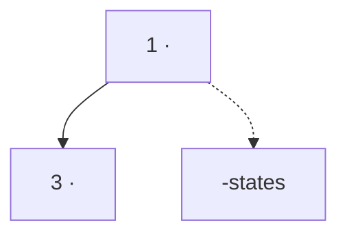

# Use case — <slug title>

> **Navigation**: [← domain index](../README.md)

## Purpose

One sentence about user value.

## Primary actor

- <actor>

## Trigger

- <what starts the use case>

## Main flow

1. ...
2. ...
3. ...

## Alternate / error flows

- ...
- ...

## Acceptance Criteria

*Happy path*
- [ ] ...

*Validation & errors*
- [ ] ...

*Edge cases*
- [ ] ...

*Out of scope*
- ...

## Screen flow

Add this section when the use case has **more than three** wireframe screens, **branched** happy paths, or non-obvious error screens. Otherwise delete it. Rules: [docs-style § Use-case visual artifacts](../playbooks/docs-style.md#use-case-files--wireframes--implementation-status). Example: [register-org](./platform-foundation/register-org/README.md#screen-flow).

Canonical order for this use case. **The wireframes table below uses the same row order.**

| Step | Screen | When |
|------|--------|------|
| 1 | `<screen-slug>` | … |
| 2a | `<branch-screen>` | … |
| 3 | `<screen-slug>` | … |

**Error / reference screens** (not sequential steps):

| Screen | When |
|--------|------|
| `<screen>-states` | … |

## Wireframes

If `## Screen flow` exists, use the full table and inventory note from [register-org](./platform-foundation/register-org/README.md#wireframes). Otherwise use the minimal table below.

All UI assets in this folder (<N> screens). Row order matches [Screen flow](#screen-flow) above. Sequence/architecture drawings are under [Diagrams](#diagrams).

| # | Screen | Role | Excalidraw | Preview |
|---|--------|------|------------|---------|
| 1 | `<screen-slug>` | Happy path — … | `/<screen-slug>.excalidraw` | `/<screen-slug>.svg` |

Replace path placeholders with real `[source](./…)` / `[preview](./…)` links when implementing (see [register-org](./platform-foundation/register-org/README.md#wireframes) for a filled-in table including error rows).

Minimal (delete `#` / `Role` columns and the inventory note when Screen flow is omitted):

| Screen | Excalidraw | Preview |
|--------|------------|---------|
| `<screen-slug>` | `/<screen-slug>.excalidraw` | `/<screen-slug>.svg` |

Use real `[source](./…)` / `[preview](./…)` links in implemented use cases — not angle-bracket placeholders.

Assets live **flat** inside this use-case folder. Reference shared kit screens from `../../../wireframes/` when needed. Use a single `N/A` row when no wireframe applies.

## Diagrams

| Diagram | Source | Preview |
|---------|--------|---------|
| `<diagram-slug>` | `/<diagram-slug>.excalidraw` | `/<diagram-slug>.svg` |

Use real markdown links in implemented use cases (see [register-org § Diagrams](./platform-foundation/register-org/README.md#diagrams)).

**Related (next use case):** optional — short link to the next use case / diagram in prose. See [register-org § Diagrams](./platform-foundation/register-org/README.md#diagrams).

Use `| N/A | N/A | N/A |` when this use case has no diagram in its folder.

> **Implementation status**
>
> | Layer | Status |
> |-------|--------|
> | Domain | N/A |
> | Application | N/A |
> | Infrastructure | N/A |
> | API | N/A |
> | Frontend | ⏳ |
>
> **Gaps vs spec:** ...
>
> **Decisions:** ...
