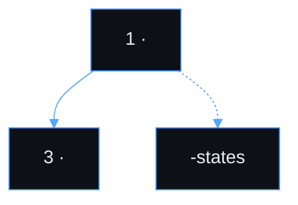

# Use case — <slug title>

> **Navigation**: [← domain index](../README.md)

## Purpose

One sentence about user value.

## Primary actor

- <actor>

## Trigger

- <what starts the use case>

## Main flow

1. ...
2. ...
3. ...

## Alternate / error flows

- ...
- ...

## Acceptance Criteria

*Happy path*
- [ ] AC-001 ...

*Validation & errors*
- [ ] AC-002 ...

*Edge cases*
- [ ] AC-003 ...

*Out of scope*
- ...

## Acceptance Test Matrix

Add this section when implementing, closing, or materially refreshing this use case. Keep IDs local to this README. Do not bulk-retrofit unrelated use cases.

| ID | Level | Scenario | Covers AC | Automated by | Required to close |
|----|-------|----------|-----------|--------------|-------------------|
| AT-001 | E2E | `<happy-path journey>` | AC-001 | Playwright | Yes |
| AT-002 | API | `<backend contract or side effect>` | AC-001, AC-002 | xUnit API | Yes |
| AT-003 | UI | `<focused UI state or validation>` | AC-002 | Vitest | Yes |

Use the lowest reliable level for each AC. Playwright covers browser-level journeys; Vitest covers focused UI behavior; xUnit API/Application/Infrastructure tests cover backend contracts, side effects, and business rules. Keep implementation details out of this matrix: do not include test file paths, class names, commands, or implementation-evidence columns. Required AT expected behavior must cite the spec section, AC ID, or flow step in the implementation/verification report; if no citation exists, tighten the spec before implementation.

## Screen flow

Add this section when the use case has **more than three** wireframe screens, **branched** happy paths, or non-obvious error screens. Otherwise delete it. Rules: [docs-style § Use-case visual artifacts](../playbooks/docs-style.md#use-case-files--wireframes--implementation-status). Example: [register-workspace](./platform-foundation/register-workspace/README.md#screen-flow).

Canonical order for this use case. **The wireframes table below uses the same row order.**

| Step | Screen | When |
|------|--------|------|
| 1 | `<screen-slug>` | … |
| 2a | `<branch-screen>` | … |
| 3 | `<screen-slug>` | … |

**Error / reference screens** (not sequential steps):

| Screen | When |
|--------|------|
| `<screen>-states` | … |



## Wireframes

If `## Screen flow` exists, use the full table and inventory note from [register-workspace](./platform-foundation/register-workspace/README.md#wireframes). Otherwise use the minimal table below.

All UI assets in this folder (<N> screens). Row order matches [Screen flow](#screen-flow) above. Sequence/architecture drawings are under [Diagrams](#diagrams).

| # | Screen | Role | Source | Preview |
|---|--------|------|--------|---------|
| 1 | `<screen-slug>` | Happy path — … | `[source](https://design.example/penpot-frame)` | `[preview](./<screen-slug>.svg)` |

Replace placeholders with real Penpot `[source](…)` links and optional `[preview](./…)` links when implementing (see [register-workspace](./platform-foundation/register-workspace/README.md#wireframes) for a filled-in table including error rows).

Minimal (delete `#` / `Role` columns and the inventory note when Screen flow is omitted):

| Screen | Source | Preview |
|--------|--------|---------|
| `<screen-slug>` | `[source](https://design.example/penpot-frame)` | `[preview](./<screen-slug>.svg)` |

Use real `[source](…)` / `[preview](./…)` links in implemented use cases — not angle-bracket placeholders.

Committed previews live **flat** inside this use-case folder. Reference shared kit screens from Penpot or `../../../wireframes/` legacy assets when needed. Use a single `N/A` row when no wireframe applies.

## Diagrams

Mermaid blocks in this README (sequence, flowchart, or `erDiagram`). One `### <diagram-slug>` heading per diagram. Multi-screen journeys: prefer **one** `<slug>-journey` sequence + **optional** `<slug>-cases` for error wireframes ([docs-style § Diagrams](../playbooks/docs-style.md#diagrams-content-rules)).

```markdown
### `<slug>-journey`

\`\`\`mermaid
sequenceDiagram
  ...
\`\`\`
```

See [register-workspace § Diagrams](./platform-foundation/register-workspace/README.md#diagrams). **Related (next use case):** optional prose link after the diagrams — do not duplicate another use case’s diagram here.

Omit this section (or note “N/A”) when the use case has no local diagram.

> **Implementation status**
>
> | Layer | Status |
> |-------|--------|
> | Domain | N/A |
> | Application | N/A |
> | Infrastructure | N/A |
> | API | N/A |
> | Frontend | ⏳ |
>
> **Gaps vs spec:** ...
>
> **Deferred follow-ups:** ...
>
> **Decisions:** ...
