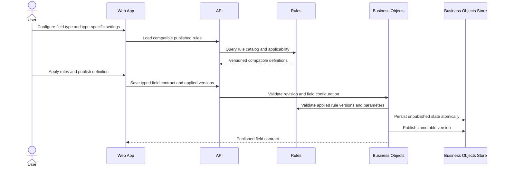

# Configure Field Types And Rules

> **Navigation**: [docs/use-cases/business-objects/README.md](./README.md) · [docs/use-cases/README.md](../README.md) · [docs/README.md](../../README.md) · [AGENTS.md](../../../AGENTS.md)

## Purpose

Let a signed-in workspace user configure enterprise field types, type-specific field configuration, and compatible reusable rules on an unpublished business object definition so each published version carries an explicit, stable record contract.

## Primary actor

- Signed-in workspace user

## Trigger

- User edits fields on an unpublished business object definition in the current workspace.
- User prepares to publish an unpublished definition that contains typed field configuration or applied rules.

## Main flow

1. User opens an unpublished business object definition in the current workspace.
2. System shows each field's stable key, label, type, type-specific configuration, ordering, and applied rule summary.
3. User chooses text, integer, decimal, date, date-and-time, boolean, or choice as the field type.
4. For a choice field, user chooses single or multiple selection and manages ordered structured options with stable option IDs, keys, and labels.
5. System loads reusable rule definitions compatible with the field type and configuration.
6. User applies compatible rules and enters their required parameters.
7. System validates identity, type configuration, rule version, applicability, parameters, workspace scope, and the user's last-seen revision.
8. System saves the unpublished definition and returns the current revision with canonical field configuration and applied rule snapshots.
9. User publishes the unpublished definition using the current revision.
10. System creates an immutable published object definition version preserving field identity, type, type configuration, ordering, label, and versioned applied rule snapshots.

## Alternate / error flows

- Unsupported field type or malformed type configuration: reject save and publish with a field-specific error.
- Date value used where date-and-time is required, or date-and-time parameter without an explicit offset: reject the affected rule parameter.
- Choice field without a selection mode, without options, or with duplicate option keys: reject save and publish.
- Multiple-choice selection bounds with a negative minimum or maximum below minimum: reject the affected rule.
- Unknown, unpublished, archived, or incompatible rule version: reject without persistence.
- Missing, malformed, or type-incompatible rule parameter: reject with a parameter-specific error.
- Stale save or concurrent publish: reject without overwriting newer unpublished state or published versions.
- Missing, unavailable, or cross-workspace scope: reject without mutation or resource disclosure.

## Acceptance Criteria

*Happy path*
- **AC-001** User can select text, integer, decimal, date, date-and-time, boolean, or choice for each unpublished field.
- **AC-002** Date and date-and-time remain distinct contracts: date values use calendar-date semantics without time or zone, while date-and-time values require an explicit offset and are canonicalized as an instant.
- **AC-003** Choice fields store `Single` or `Multiple` selection mode plus ordered static options as type configuration; option definitions are not modeled as validation rules.
- **AC-004** Static choice options have stable IDs and immutable persisted keys, editable labels, deterministic ordering, and are snapshotted into published definition versions with distinct snapshot IDs and source option identities.
- **AC-005** User can apply a published system or workspace rule version compatible with the selected field type and configuration.
- **AC-006** Applied rules store a stable rule definition key, immutable rule version, and canonical parameter values rather than per-rule nullable columns or consumer-owned rule enums.
- **AC-007** Saving field configuration round-trips and preserves stable field and option identities while returning the current revision required by later save and publish attempts.
- **AC-008** Publishing creates an immutable field contract containing type configuration and versioned applied rule snapshots for later record validation.

*Validation & errors*
- **AC-009** Unsupported types, malformed type configuration, unknown rule definitions, non-published rule versions, and incompatible rules are rejected before persistence.
- **AC-010** Rule parameters are required, typed, canonicalized, and validated, including decimal, calendar-date, offset date-and-time, text, boolean, and multiple-value parameters.
- **AC-011** Choice configuration rejects missing selection mode, empty option sets, duplicate option keys, blank labels, and invalid ordering.
- **AC-012** Publication is blocked while any field type, type configuration, or applied rule is invalid; the unpublished definition remains editable.
- **AC-013** Stale saves and concurrent publish attempts fail without silently overwriting newer field configuration or rule snapshots.
- **AC-014** Applied rules cannot execute arbitrary code, perform external I/O, use nondeterministic time or randomness, or trigger side effects as part of definition configuration.

*Edge cases*
- **AC-015** Current workspace scope is required for save, publish, list, and load operations; unavailable and cross-workspace access is rejected without mutation or disclosure.
- **AC-016** Business Objects owns fields, choice configuration, and applied snapshots; Rules owns reusable definitions, versions, parameter schemas, applicability, and deterministic evaluation contracts.
- **AC-017** Mutable field, option, and applied-rule entities use identities distinct from immutable published snapshots, and every published snapshot retains its source entity identity.
- **AC-018** The initial Business Objects schema contains only the approved `Choice` plus `Single` or `Multiple` contract and uses one clean initial migration without compatibility aliases.
- **AC-019** Save, migration, and publish operations are atomic; failures leave the previous unpublished state and published versions unchanged.

## Acceptance Test Matrix

| ID | Boundary | Scenario | Covers AC | Verification | Required |
|---|---|---|---|---|---|
| AT-001 | Domain boundary | Valid field contracts preserve supported types, Date/DateTime semantics, Choice selection mode, options, and versioned rule snapshots | AC-001, AC-002, AC-003, AC-004, AC-006, AC-008 | Domain test | Yes |
| AT-002 | Application boundary | Invalid field configuration, incompatible rule versions, and malformed parameters fail before persistence | AC-009, AC-010, AC-011, AC-012, AC-014 | Domain test + Application test | Yes |
| AT-003 | Application boundary | Saving configured fields preserves identities and returns the revision required by later save and publish attempts | AC-005, AC-007, AC-013, AC-019 | Application test | Yes |
| AT-004 | Application/Infrastructure boundaries | Publishing preserves immutable type configuration and exact applied rule versions atomically | AC-006, AC-008, AC-019 | Application test + Infrastructure integration test | Yes |
| AT-005 | Infrastructure boundary | The clean initial schema enforces distinct current/snapshot identities, source references, choice configuration, constraints, and no retired compatibility residue | AC-017, AC-018, AC-019 | Infrastructure integration test | Yes |
| AT-006 | API boundary | Object definition endpoints expose canonical type configuration and applied rule versions with generated frontend parity | AC-001, AC-002, AC-003, AC-004, AC-006, AC-009 | API integration test | Yes |
| AT-007 | API/Application boundaries | Missing, unavailable, and cross-workspace scope is rejected without mutation or disclosure | AC-015, AC-016 | API integration test + Application test | Yes |
| AT-008 | UI component | Field editor supports Date, DateTime, Choice configuration, compatible rules, and contextual validation | AC-001, AC-002, AC-003, AC-004, AC-005, AC-009, AC-010, AC-011, AC-012 | UI component test | Yes |
| AT-009 | Browser journey | User configures and publishes typed fields and rules without console errors, document scrolling, or horizontal overflow | AC-001, AC-003, AC-005, AC-007, AC-008, AC-015 | Browser automation | Yes |
| AT-010 | Application boundary | Business Objects depends on Rules contracts only and no rule execution or type configuration leaks into shared infrastructure | AC-014, AC-016 | Architecture test | Yes |

## Out Of Scope

- Creating or mutating business object records; record enforcement is owned by a record-facing use case.
- Dynamic choice options backed by object records, external providers, or remote APIs.
- Changing an immutable published definition version in place.
- Side-effect actions, webhooks, notifications, workflow orchestration, or automation execution.

## Screen flow

| Screen | Required contract |
|---|---|
| Business object collection | Keep one primary table and open unpublished definition editing through the owning route-backed dialog contract. |
| Field definition editor | Show stable identity, selected type, type configuration, applied rules, and configuration state for each unpublished field. |
| Type configuration | Show calendar-date controls for Date, offset-aware controls for DateTime, and selection mode plus ordered option management for Choice. |
| Rule configuration | Show only compatible published rules, identify their owner and version when needed, and associate parameter errors with the affected rule control. |
| Publish review | Block publication while invalid configuration remains and identify every affected field or rule. |
| Published definition detail | Show immutable field type configuration and exact applied rule versions as the record contract. |

Required UI quality: controls must have programmatic labels, keyboard reachability, visible focus and invalid states, stable layout as type-specific controls change, recoverable stale-save state, and responsive behavior inside the record dialog without document scrolling or horizontal overflow. Choice options must use structured row controls; ordering must remain keyboard-operable and labels must not silently change stable option IDs or keys.

## Diagrams

### enterprise-field-contract-publication

> **Implementation status**
>
> | Layer | Status |
> |-------|--------|
> | Domain | Done |
> | Application | Done |
> | Infrastructure | Done |
> | API | Done |
> | Frontend | Done |
>
> **Gaps vs spec:** None.
>
> **Deferred follow-ups:** N/A. Every in-scope gap is tracked by AC-001 through AC-019 and AT-001 through AT-010.
>
> **Verification:** Acceptance proof is tracked in the sibling evidence sidecar.
>
> **Decisions:** Date remains a calendar-only type and DateTime is additive with explicit-offset semantics. `Choice` plus immutable `Single` or `Multiple` selection mode is the only initial selection contract. Static options are field type configuration, not a rule. No compatibility migration is retained because no production data exists; the module receives one clean initial migration after restructuring. Applied rules reference immutable published versions and the frontend renders their parameters from Rules metadata rather than a hard-coded catalog. Rules remain pure and side-effect free; consumers own business state and enforcement transactions. Event sourcing, integration events, inbox/outbox, and workflow automation are rejected.
