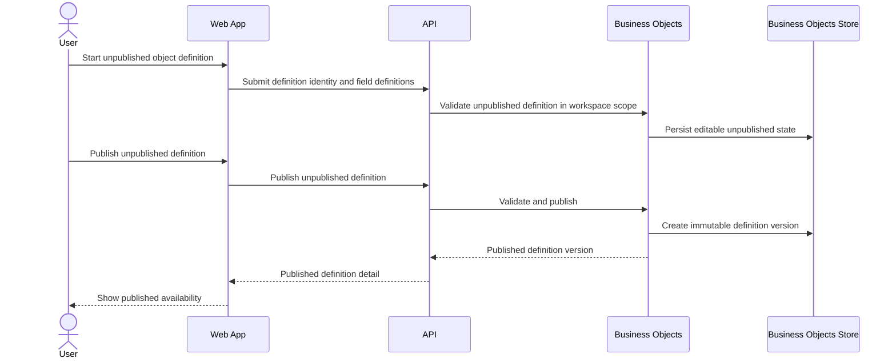

# Define A Business Object

> **Navigation**: [docs/use-cases/business-objects/README.md](./README.md) · [docs/use-cases/README.md](../README.md) · [docs/README.md](../../README.md) · [AGENTS.md](../../../AGENTS.md)

## Purpose

Define and publish a workspace-scoped business object definition so published versions provide a stable record contract.

## Primary actor

- Signed-in workspace user

## Trigger

- User starts defining a new business object in the current workspace.

## Main flow

1. User opens the business object collection for the current workspace.
2. User starts a new unpublished business object definition through the app-scoped record-window contract owned by [docs/foundations/data-display/collection-page.md](../../foundations/data-display/collection-page.md).
3. User enters a definition name; system derives a stable object key, displays it read-only, and preserves it after the definition is created.
4. User adds, orders, edits, or removes unpublished text field definitions with stable field keys and labels.
5. System validates definition identity, field identity, workspace scope, and the user's last-seen revision.
6. System saves the editable unpublished definition and returns the current revision.
7. User publishes the unpublished definition using the current revision.
8. System creates immutable published business object definition version 1; the unpublished definition state itself never becomes a record contract.

## Alternate / error flows

- Duplicate object key in the current workspace: reject the create, save, or publish action with an object-key error.
- Duplicate field key in the unpublished definition: reject the save or publish action with a field-key error.
- Unpublished definition with no fields: keep the definition editable, but block publication.
- Concurrent publish or stale save: reject the stale operation without overwriting the newer unpublished state or published version.
- Missing or unavailable workspace scope: reject the operation without creating, changing, or revealing object definitions.
- Cross-workspace definition access: return a not-found style outcome instead of revealing that another workspace owns the definition.

## Acceptance Criteria

*Happy path*
- **AC-001** User can create an unpublished object definition in the current workspace with a required name while the system derives, displays, and locks a stable object key.
- **AC-002** User can add, order, edit, and remove unpublished text field definitions with stable field IDs, immutable persisted field keys, and editable labels before publish.
- **AC-003** Advanced field configuration is not part of the current define-and-publish contract.
- **AC-004** User can save unpublished definition changes repeatedly before publish; each saved response includes the current revision required by later save and publish attempts.
- **AC-005** Publishing a valid unpublished definition creates immutable published object definition version 1 that future records can reference.
- **AC-006** Published business object definition versions use distinct immutable snapshot identities and preserve the source definition and field identities, keys, labels, and ordering as they existed at publication time.
- **AC-007** Unpublished object definitions are not available for record creation; only published versions can become record contracts.
- **AC-008** The current workspace can list its object definitions with deterministic ordering and pagination metadata while distinguishing unpublished and published availability.

*Validation & errors*
- **AC-009** Definition names are required, and system-derived object keys are required, read-only to the user, unique within a workspace, 1-63 characters, start with a lowercase letter, and contain only lowercase letters, digits, and underscores.
- **AC-010** Field labels are required, and field keys are required, unique within the definition, immutable after the field is first persisted, 1-63 characters, start with a lowercase letter, and contain only lowercase letters, digits, and underscores.
- **AC-011** Publication is blocked when the unpublished definition has no fields, duplicate identities, or invalid definition or field identity.
- **AC-012** Stale unpublished changes and concurrent publish attempts fail without silently overwriting newer definition state.

*Edge cases*
- **AC-013** An authenticated current workspace scope is required to create, save, publish, list, or load object definitions; missing or unavailable workspace scope is rejected without mutation.
- **AC-014** Object definitions are isolated by workspace; users cannot create, publish, list, load, or mutate definitions outside the current workspace scope, and cross-workspace access returns a not-found style outcome.
- **AC-015** The Business Objects module owns business object definitions and published versions, uses `workspaceId` only as an external scope identifier, and does not own workspace lifecycle.
- **AC-016** Defining business objects does not create records, workflow definitions, workflow states, reports, automations, or permissions beyond the current authenticated workspace boundary.
- **AC-017** Object definition publication records enough metadata for audit/history surfaces to identify who published the version and when.
- **AC-018** Unpublished save and publish operations are atomic; failed validation, workspace-scope rejection, concurrency conflicts, or persistence failures leave the previous unpublished state and published versions unchanged.

## Acceptance Test Matrix

| ID | Boundary | Scenario | Covers AC | Verification | Required |
|---|---|---|---|---|---|
| AT-001 | Domain boundary | Valid unpublished object definition captures stable object identity and ordered text field definitions with stable keys and labels | AC-001, AC-002, AC-003 | Domain test | Yes |
| AT-002 | Application boundary | Saving unpublished definition changes returns a current revision that later save and publish attempts must use | AC-004 | Application test | Yes |
| AT-003 | Application boundary | Publishing a valid unpublished definition creates immutable version 1 with distinct snapshot IDs and explicit source definition and field identities | AC-005, AC-006, AC-017 | Domain test + Application test | Yes |
| AT-004 | Application boundary | Unpublished definitions are not exposed as record contracts, and workspace listing is paginated, deterministic, and scoped to unpublished/published availability | AC-007, AC-008 | Application test | Yes |
| AT-005 | Application boundary | Duplicate or malformed object and field keys fail with validation errors before persistence | AC-009, AC-010 | Application test | Yes |
| AT-006 | Application boundary | Duplicate identities and unpublished definitions without fields cannot publish | AC-011 | Application test | Yes |
| AT-007 | Application/Infrastructure boundaries | Stale unpublished saves, concurrent publish attempts, and persistence failures fail without overwriting newer definition state | AC-012, AC-018 | Application test + Infrastructure integration test | Yes |
| AT-008 | API/Application boundaries | Missing workspace scope, unavailable workspace scope, and cross-workspace definition access are rejected without mutation or resource disclosure | AC-013, AC-014 | API integration test + Application test | Yes |
| AT-009 | Domain boundary | Business Objects boundaries keep workspace lifecycle outside the module and prevent Identity internals from becoming business-object dependencies | AC-015 | Architecture test | Yes |
| AT-010 | API boundary | Object definition endpoints expose the approved request and response contract without advanced field, record, or workflow artifacts | AC-003, AC-016 | API integration test | Yes |
| AT-011 | UI component | Business object definition screens expose unpublished definition creation, text field editing, validation errors, publish action, pagination, and definition availability states | AC-001, AC-002, AC-003, AC-007, AC-008, AC-009, AC-010, AC-011 | UI component test | Yes |
| AT-012 | Browser journey | User defines and publishes a business object from an authenticated workspace route while the field editor can focus inside the shell without console errors, document scrolling, or horizontal overflow | AC-001, AC-002, AC-005, AC-008, AC-013, AC-014 | Browser automation | Yes |

## Out Of Scope

- Creating, importing, editing, listing, or deleting records from a business object definition.
- Workflow definitions, workflow states, transitions, assignments, or approvals.
- Object views, reports, dashboards, charts, automations, integrations, and bulk operations.
- Type-specific field configuration and applied rule snapshots, owned by [docs/use-cases/business-objects/configure-field-rules.md](./configure-field-rules.md); formula and computed fields remain outside this base use case.
- Revising an already published definition into version 2 or later.
- Workspace lifecycle, workspace membership, role management, and cross-workspace sharing.
- Runtime table generation per object definition.

## Screen flow

| Screen | Required contract |
|---|---|
| Authenticated navigation | Expose a visible Business Objects navigation contribution when the current workspace can use the module; global navigation rendering remains owned by the module-navigation foundation. |
| Business object collection | Render one primary table with name, key, unpublished/published availability, latest version context, paging, and consumer-defined actions without an action column. |
| Definition window | Open or focus stable create/view/edit identities through [docs/foundations/data-display/collection-page.md](../../foundations/data-display/collection-page.md), capture the definition name, display a read-only derived stable business object key, and keep revision state in sync after saves. |
| Field definition editor | Let the user add, order, remove, and rename text fields while keeping stable field keys visible, validated, and saved against the current revision. |
| Publish review | Show validation state and block publication until required definition and field identity rules pass. |
| Published definition detail | Show the published version context and make clear that later record creation will use a published definition version. |

Required UI quality: the page must retain one primary table while create/view/edit workflows use the responsive managed-window contract; labels and errors must be programmatic, field rows must stay keyboard-reachable while reordered or edited, window content must scroll internally with stable actions, validation must identify the affected definition or field control, stale-save and stale-publish conflicts must keep unsaved input recoverable, publish implications must be visible before confirmation, and the layout must fit supported mobile and desktop widths without document scrolling or horizontal overflow.

## Diagrams

### object-definition-publication

> **Implementation status**
>
> | Layer | Status |
> |-------|--------|
> | Domain | Done |
> | Application | Done |
> | Infrastructure | Done |
> | API | Done |
> | Frontend | Done |
>
> **Gaps vs spec:** None.
>
> **Deferred follow-ups:** N/A for this use case; excluded surfaces are listed in Out Of Scope.
>
> **Verification:** Acceptance proof is tracked in the sibling evidence sidecar.
>
> **Decisions:** Business Objects is the modular-monolith bounded context for business object definitions, immutable published versions, and later records. Code uses the complete ubiquitous language `BusinessObjectDefinition`, `BusinessObjectDefinitionVersion`, `BusinessObjectFieldDefinition`, and future `BusinessObjectRecord`; API, persistence, configuration, frontend, tests, and docs use the same context name without compatibility aliases. Identity owns workspace lifecycle; Business Objects stores `workspaceId` only as an external scope identifier. Mutable fields keep stable IDs and immutable persisted keys. Published field snapshots have their own IDs and retain explicit source-field IDs. Unpublished definitions use an application-visible revision for optimistic concurrency; publish creates immutable version 1, while version 2 or later remains a separate use case. [docs/use-cases/business-objects/configure-field-rules.md](./configure-field-rules.md) owns additional field types, type configuration, and applied rule snapshots. Event sourcing, outbox/inbox, integration events, saga/process manager, projection rebuild, and runtime table generation are rejected. The frontend follows the collection-page foundation rather than hard-coding module navigation or a feature-local page layout.
