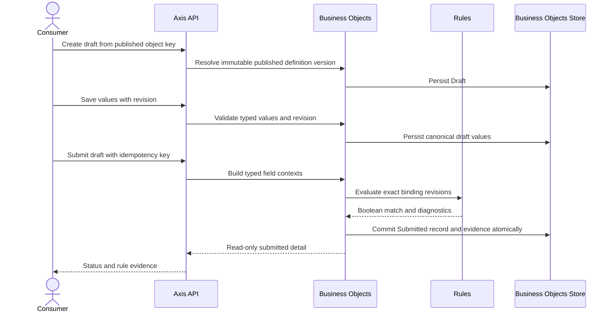

# Submit A Business Object Record

> **Navigation**: [docs/use-cases/business-objects/README.md](./README.md) · [docs/use-cases/README.md](../README.md) · [docs/README.md](../../README.md) · [AGENTS.md](../../../AGENTS.md)

## Purpose

Create, edit, and submit a workspace-scoped business object record against an immutable published definition version. Submission validates typed record values, executes the exact rules attached to that published version, and persists the submitted record with deterministic rule evidence.

Axis owns the generic Draft → Submitted record lifecycle and its REST/MCP contracts. Product-owned consumers own their routes, presentation vocabulary, record setup, and end-to-end journeys.

## Primary actor

- Signed-in workspace user, or an authenticated product/agent consumer, submitting a business object record

## Trigger

- A consumer starts a record from a published business object definition.
- A consumer saves a draft or submits its completed values.

## Main flow

1. A consumer resolves a published business object definition and creates a persisted Draft record.
2. Business Objects ties that record to the exact immutable published definition version.
3. The consumer saves typed values with the current draft revision.
4. The consumer submits the draft.
5. Business Objects validates values against the exact published field contract and builds a typed consumer context for each attached rule binding.
6. Rules resolves each binding's exact immutable binding revision and exact Rule version, including an archived version that was valid when attached, then evaluates the positive Boolean assertion through the pure evaluator.
7. If every applicable rule matches, Business Objects atomically changes the record to Submitted and stores exact rule-evaluation evidence.
8. If a rule returns a valid non-match, the record remains Draft, no submission mutation is committed, and the caller receives recoverable field-level diagnostics.
9. If input validation or rule evaluation fails, the record remains Draft and the system returns a stable failure without treating an error as a successful match.
10. Submitted records are read-only in this slice and remain tied to the definition version and binding revisions used at submission.

## Alternate / error flows

- No published definition version: reject record creation without exposing an unpublished definition as a record contract.
- Unknown field, missing required value, malformed typed value, invalid choice, or cardinality violation: reject the save/submit operation with field-level errors and keep the draft recoverable.
- Stale draft revision: reject the save or submit without overwriting newer record state.
- Unknown, disabled, deleted, or unavailable exact binding revision: fail closed and keep the draft unchanged; never substitute the current binding revision.
- Rule returns `false`: keep the draft unchanged and return valid non-match evidence; `false` is not an evaluator error.
- Unexpected evaluator failure: keep the draft unchanged and return a stable execution failure; it never becomes a submitted record.
- Cross-workspace record, definition, or draft access: return a not-found style outcome without resource disclosure.
- Repeating a submit for an already submitted record returns the existing submitted outcome; create-record idempotency keys are scoped to the workspace and object key, and reusing one with another payload is a conflict.

## Acceptance Criteria

*Happy path*

- **AC-001** A record can be created only from a published business object definition version and stores that immutable version identity.
- **AC-002** Draft values are canonical typed field values represented at the API boundary as bounded string collections; server-side validation owns type, cardinality, choice, and field-key rules.
- **AC-003** Draft saves use optimistic concurrency and preserve the user's latest valid state without allowing a stale request to overwrite it.
- **AC-004** Submission evaluates every attached binding in deterministic published-field and binding order through the public Rules typed context contract.
- **AC-005** A successful submission persists status `Submitted`, the canonical values, actor/timestamps, and exact rule evidence including binding ID/revision, definition key/version, Boolean match, and safe node diagnostics in one Business Objects transaction.
- **AC-006** A valid rule non-match leaves the record in `Draft`, persists no submission transition, and returns recoverable field-level diagnostics to the caller.
- **AC-007** Input validation and rule-evaluation failures leave the previous draft state unchanged and never become a successful submission.
- **AC-008** Submitted records are immutable and read-only in the current slice; no hidden update, delete, or compatibility path is introduced.

*Validation & errors*

- **AC-009** Unknown, duplicate, malformed, or unsupported field values fail before persistence; optional fields may be absent, while requiredness is enforced by the attached published rule contract.
- **AC-010** Choice fields enforce the published selection mode and option keys; Date and DateTime preserve the distinct published semantics.
- **AC-011** A binding revision mismatch, disabled binding revision, missing binding revision, unresolved exact rule version, or evaluator error fails closed without changing the record; an archived exact Rule version remains resolvable for an already published snapshot.
- **AC-012** Create-record idempotency keys are scoped to workspace and published object key; an exact retry is safe and a conflicting payload is rejected.
- **AC-013** Missing workspace/user scope and cross-workspace access are rejected without mutation or disclosure.
- **AC-014** Published field-rule snapshots retain a binding revision; later binding edits or Rule archival cannot silently change an already published record contract, while new attachment/save/publish operations reject archived definitions.

*Edge cases and boundaries*

- **AC-015** Business Objects owns record lifecycle, values, transaction, and evidence; Rules owns reusable definitions, binding revisions, exact rule versions, and pure evaluation.
- **AC-016** The consumer uses a typed `IRuleContextAdapter<TConsumerContext>` and maps only explicit record field data into rule inputs; Rules has no dependency on Business Objects.
- **AC-017** The record store uses a module-owned migration, workspace/object/version/idempotency indexes, and concurrency protection; runtime table generation and event sourcing remain out of scope.
- **AC-018** Axis public REST/OpenAPI and MCP contracts expose the generic definition, record, diagnostics, and rule-evidence behavior required by independently owned consumers. Axis contains no product route, copy, setup behavior, or browser journey for a configured record type.

## Acceptance Test Matrix

| ID | Boundary | Scenario | Covers AC | Verification | Required |
|---|---|---|---|---|---|
| AT-001 | Domain boundary | Record creation, typed value replacement, draft revision, submit transition, submitted immutability, and invalid transition invariants | AC-001, AC-003, AC-005, AC-008 | Domain test | Yes |
| AT-002 | Application boundary | Published definition contract validates text, numeric, date, DateTime, Boolean, Choice, cardinality, unknown, and missing values | AC-002, AC-009, AC-010 | Application test | Yes |
| AT-003 | Application boundary | Consumer adapter maps each field's typed context through exact binding revisions and forwards Boolean results/diagnostics deterministically | AC-004, AC-014, AC-016 | Application test | Yes |
| AT-004 | Application boundary | Rule non-match keeps a draft unchanged and returns field-level diagnostics; evaluator failure is not a submission decision | AC-006, AC-007, AC-011 | Application test | Yes |
| AT-005 | Infrastructure boundary | Records and rule evidence persist through the Business Objects migration with workspace/version/idempotency indexes and optimistic concurrency | AC-005, AC-012, AC-017 | Infrastructure integration test | Yes |
| AT-006 | API boundary | Create, save, submit, list, and get endpoints enforce auth, workspace isolation, stable errors, idempotency, and generated OpenAPI/frontend parity | AC-001, AC-003, AC-005, AC-007, AC-012, AC-013 | API integration test | Yes |
| AT-007 | API/Application boundaries | Published field snapshots carry binding revisions; binding edits cannot change later submission, archived exact Rule versions still execute historically, and new attachment rejects archived definitions | AC-011, AC-014, AC-015 | API integration test + Application test | Yes |
| AT-008 | API boundary | REST/OpenAPI and MCP record operations expose the generic created, draft, submitted, diagnostic, and rule-evidence projections without a product-specific Axis UI | AC-002, AC-005, AC-006, AC-018 | API integration test | Yes |
| AT-009 | API boundary | A consumer uses generic definition and record operations to create, save, submit, and read a record with diagnostics and rule evidence | AC-018 | API integration test | Yes |
| AT-010 | API boundary | An authenticated agent using platform operations creates or discovers a published contract, submits a record, reads the persisted object, and observes exact rule results | AC-004, AC-005, AC-015, AC-018 | API integration test | Yes |

## Out Of Scope

- Product-specific record setup, routes, copy, UI components, and browser journeys.
- Generic workflow-definition authoring, arbitrary states/transitions, assignments, approvals, SLA timers, notifications, webhooks, or automation orchestration.
- Editing or deleting Submitted records.
- Runtime table generation per business object.
- Event sourcing, outbox/inbox, distributed transactions, or cross-database dual writes.
- Product-specific decision policy, financial advice, or underwriting behavior.

## Screen flow

Axis does not own a record-product screen in this slice. A consumer-owned client may present collection, draft, diagnostics, and submitted-detail modes, but it must use the public contract above and owns its accessibility, responsive layout, recovery, and journey evidence.

## Diagrams

### business-object-record-submission

> **Implementation status**
>
> | Layer | Status |
> |---|---|
> | Domain | Done |
> | Application | Done |
> | Infrastructure | Done |
> | API | Done |
> | Frontend | N/A |
> | MCP | Done |
>
> **Gaps vs spec:**
>
> None.
>
> **Deferred follow-ups:** N/A. Generic workflow-definition authoring, approval/assignment lifecycle, and additional record mutations remain out of scope for this lifecycle.
>
> **Verification:** See [submit-business-object-record.evidence.md](./submit-business-object-record.evidence.md) for exact proof paths, Axis wrapper commands, and supported-client runtime evidence.
>
> **Decisions:** Business Objects owns `BusinessObjectRecord` because existing product contracts reserve that ownership. The first lifecycle is Draft → Submitted; a valid rule non-match leaves the Draft recoverable rather than inventing a `Rejected` state. Rules remain pure and consumer-neutral. Published field snapshots include exact binding revisions and retain historical archived-version execution; new attachments reject archived definitions under [docs/use-cases/rules/manage-rule-bindings.md](../rules/manage-rule-bindings.md). Product consumers own presentation and setup; Axis keeps only generic public operations. Generic workflow authoring and event-driven orchestration remain out of scope until a product contract requires them.
