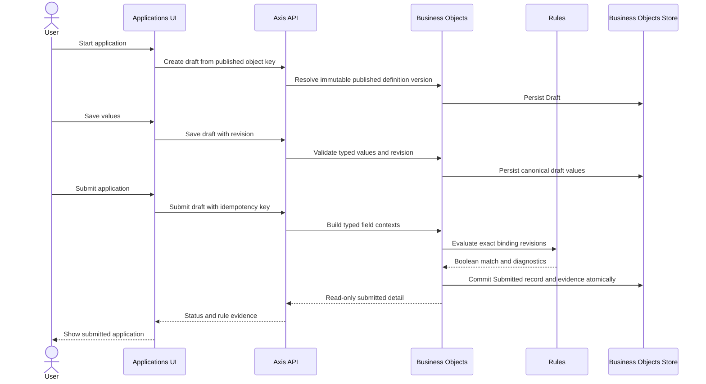

# Submit A Business Object Record

> **Navigation**: [docs/use-cases/business-objects/README.md](./README.md) · [docs/use-cases/README.md](../README.md) · [docs/README.md](../../README.md) · [AGENTS.md](../../../AGENTS.md)

## Purpose

Create, edit, and submit a workspace-scoped business object record against an immutable published definition version. Submission validates the typed record values, executes the exact rules attached to that published version, and persists the submitted record together with deterministic rule evidence.

The first product demonstration uses a published `loan_application` definition and presents it as an Applications experience. `Application` is presentation vocabulary for that configured business object; this slice does not introduce an application-specific bounded context or a generic workflow engine.

## Primary actor

- Signed-in workspace user submitting a business object record

## Trigger

- User starts a new record from a published business object definition.
- User saves a draft or submits the completed record.

## Main flow

1. User opens the Applications collection and starts a new application from a published definition.
2. System creates a persisted Draft record tied to the exact immutable published definition version.
3. User enters values using controls derived from the published field contract and saves the draft with the current revision.
4. User submits the draft.
5. Business Objects validates the submitted values against the exact published field contract and builds a typed consumer context for each attached rule binding.
6. Rules resolves each binding's exact immutable binding revision and published rule version, then evaluates the positive Boolean assertion through the pure evaluator.
7. If every applicable rule matches, Business Objects atomically changes the record to Submitted and stores exact rule-evaluation evidence.
8. If a rule returns a valid non-match, the record remains Draft, no submission mutation is committed, and the UI shows the field-level diagnostics so the user can recover the input.
9. If input validation or rule evaluation fails, the record remains Draft and the system returns a stable failure without treating an error as a successful match.
10. Submitted records are read-only in this slice and remain tied to the definition version and binding revisions used at submission.

## Alternate / error flows

- No published definition version: reject record creation without exposing an unpublished definition as a record contract.
- Unknown field, missing required value, malformed typed value, invalid choice, or cardinality violation: reject the save/submit operation with field-level errors and keep the draft recoverable.
- Stale draft revision: reject the save or submit without overwriting newer record state.
- Unknown, disabled, deleted, or unavailable exact binding revision: fail closed and keep the draft unchanged; never substitute the current binding revision.
- Rule returns `false`: keep the draft unchanged and return valid non-match evidence; `false` is not an evaluator error.
- Unexpected evaluator failure: keep the draft unchanged and return a stable execution failure; it never becomes a submitted record.
- Cross-workspace record, definition, or draft access: return a not-found style outcome without resource disclosure.
- Repeating a submit for an already submitted record returns the existing submitted outcome; create-record idempotency keys are scoped to the workspace and object key, and reusing one with another payload is a conflict.

## Acceptance Criteria

*Happy path*

- **AC-001** A record can be created only from a published business object definition version and stores that immutable version identity.
- **AC-002** Draft values are canonical typed field values represented at the API boundary as bounded string collections; server-side validation owns type, cardinality, choice, and field-key rules.
- **AC-003** Draft saves use optimistic concurrency and preserve the user's latest valid state without allowing a stale request to overwrite it.
- **AC-004** Submission evaluates every attached binding in deterministic published-field and binding order through the public Rules typed context contract.
- **AC-005** A successful submission persists status `Submitted`, the canonical values, actor/timestamps, and exact rule evidence including binding ID/revision, definition key/version, Boolean match, and safe node diagnostics in one Business Objects transaction.
- **AC-006** A valid rule non-match leaves the record in `Draft`, persists no submission transition, and returns recoverable field-level diagnostics to the caller.
- **AC-007** Input validation and rule-evaluation failures leave the previous draft state unchanged and never become a successful submission.
- **AC-008** Submitted records are immutable and read-only in the current slice; no hidden update, delete, or compatibility path is introduced.

*Validation & errors*

- **AC-009** Unknown, duplicate, malformed, or unsupported field values fail before persistence; optional fields may be absent, while requiredness is enforced by the attached published rule contract.
- **AC-010** Choice fields enforce the published selection mode and option keys; Date and DateTime preserve the distinct published semantics.
- **AC-011** A binding revision mismatch, disabled binding, missing binding, unresolved exact rule version, or evaluator error fails closed without changing the record.
- **AC-012** Create-record idempotency keys are scoped to workspace and published object key; an exact retry is safe and a conflicting payload is rejected.
- **AC-013** Missing workspace/user scope and cross-workspace access are rejected without mutation or disclosure.
- **AC-014** Published field-rule snapshots retain a binding revision; later binding edits cannot silently change an already published record contract.

*Edge cases and boundaries*

- **AC-015** Business Objects owns record lifecycle, values, transaction, and evidence; Rules owns reusable definitions, binding revisions, exact rule versions, and pure evaluation.
- **AC-016** The consumer uses a typed `IRuleContextAdapter<TConsumerContext>` and maps only explicit record field data into rule inputs; Rules has no dependency on Business Objects.
- **AC-017** The record store uses a module-owned migration, workspace/object/version/idempotency indexes, and concurrency protection; runtime table generation and event sourcing remain out of scope.
- **AC-018** The Applications UI is a workflow interaction surface: collection, persisted draft, dynamic published-contract form, save, submit, recoverable rule diagnostics, and read-only submitted detail.

## Acceptance Test Matrix

| ID | Boundary | Scenario | Covers AC | Verification | Required |
|---|---|---|---|---|---|
| AT-001 | Domain boundary | Record creation, typed value replacement, draft revision, submit transition, submitted immutability, and invalid transition invariants | AC-001, AC-003, AC-005, AC-008 | Domain test | Yes |
| AT-002 | Application boundary | Published definition contract validates text, numeric, date, DateTime, Boolean, Choice, cardinality, unknown, and missing values | AC-002, AC-009, AC-010 | Application test | Yes |
| AT-003 | Application boundary | Consumer adapter maps each field's typed context through exact binding revisions and forwards Boolean results/diagnostics deterministically | AC-004, AC-014, AC-016 | Application test | Yes |
| AT-004 | Application boundary | Rule non-match keeps a draft unchanged and returns field-level diagnostics; evaluator failure is not a submission decision | AC-006, AC-007, AC-011 | Application test | Yes |
| AT-005 | Infrastructure boundary | Records and rule evidence persist through the Business Objects migration with workspace/version/idempotency indexes and optimistic concurrency | AC-005, AC-012, AC-017 | Infrastructure integration test | Yes |
| AT-006 | API boundary | Create, save, submit, list, and get endpoints enforce auth, workspace isolation, stable errors, idempotency, and generated OpenAPI/frontend parity | AC-001, AC-003, AC-005, AC-007, AC-012, AC-013 | API integration test | Yes |
| AT-007 | API/Application boundaries | Published business-object field snapshots carry binding revisions; updating a binding cannot change the exact published contract used by a later submission | AC-011, AC-014, AC-015 | API integration test + Application test | Yes |
| AT-008 | UI component | Applications collection and managed record window render dynamic field controls, save state, submit state, success detail, and rule mismatch recovery without losing input | AC-002, AC-006, AC-018 | UI component test | Yes |
| AT-009 | Browser journey | User creates an application draft, saves it, submits valid values, sees Submitted evidence, and can recover from a failed rule without console errors or document overflow | AC-001, AC-005, AC-006, AC-018 | Browser automation | Yes |
| AT-010 | API boundary | An authenticated agent using the platform API provisions or discovers the sample contract, submits a record, reads the persisted object, and observes the exact rule result | AC-004, AC-005, AC-015 | API integration test | Yes |

## Out Of Scope

- Generic workflow-definition authoring, arbitrary states/transitions, assignments, approvals, SLA timers, notifications, webhooks, or automation orchestration.
- Editing or deleting Submitted records.
- Runtime table generation per business object.
- Event sourcing, outbox/inbox, distributed transactions, or cross-database dual writes.
- Application-specific loan underwriting, credit scoring, financial advice, or production decision policy; the sample rule is a platform demonstration only.

## Screen flow

| Screen | Required contract |
|---|---|
| Applications collection | Keep one primary table for persisted records with object name/key, status, definition version, updated time, and consumer actions; preserve search/page state while windows open. |
| New application window | Create a persisted Draft first, show the immutable definition/version, render controls from the published field contract, and keep Save draft and Submit application actions explicit. |
| Draft application window | Keep field values recoverable across validation failures, expose current revision, show save/submission pending and failure states, and focus the first invalid field after a failed submit. |
| Rule validation section | Show valid non-match and evaluation-failure states separately; associate safe diagnostics with the affected field and never expose stack traces. |
| Submitted application detail | Render the immutable values, definition version, submitted actor/time, status badge, and exact rule evidence as read-only content. |

Required UI quality: every generated control has a programmatic label and visible invalid/focus state; dynamic controls remain keyboard reachable; window content scrolls internally; submit does not silently discard input; field errors remain near their controls; success and failure states are distinguishable; supported mobile and desktop widths have no document overflow.

## Diagrams

### application-submission

> **Implementation status**
>
> | Layer | Status |
> |---|---|
> | Domain | Done |
> | Application | Done |
> | Infrastructure | Done |
> | API | Done |
> | Frontend | Done |
>
> **Gaps vs spec:** No product behavior gap remains for this executable slice. An MCP client session opened before the bridge build may retain a stale tool snapshot; use the supported MCP host reload/reconnect control or restart that client before relying on newly added record tool names in that existing session.
>
> **Deferred follow-ups:** Generic workflow-definition authoring, approval/assignment lifecycle, and additional record mutations remain explicitly out of scope for this first executable slice.
>
> **Verification:** See [submit-business-object-record.evidence.md](./submit-business-object-record.evidence.md) for the exact commands and runtime evidence.
>
> **Decisions:** Business Objects is extended with `BusinessObjectRecord` because existing product contracts explicitly reserve that ownership. The first lifecycle is Draft → Submitted; a valid rule non-match leaves the Draft recoverable instead of inventing a `Rejected` lifecycle state. Rules remain pure and consumer-neutral. Published field snapshots include exact binding revisions so later binding edits cannot rewrite an immutable record contract. The sample “loan application” is a configured business object and presentation route, not a new Applications bounded context. Generic workflow authoring and event-driven orchestration are deliberately deferred until a real product contract requires them.
