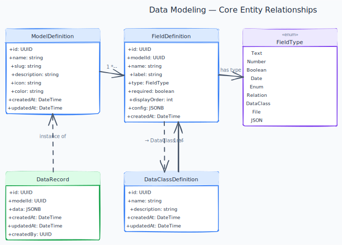

# Data Modeling

[← Back to Use Cases](../README.md)

---

## Overview

Allow users to define their own data structures — Models (like database tables) and Data Classes (reusable nested types). Users can then create, read, update, and delete records against those models. Schemas are defined at runtime and stored as metadata, not as actual DB schema changes.

## Business Value

Custom data modeling is the core differentiator of Axis. Without it, the platform is just another workflow tool with a fixed data structure. With it, users can model any business domain.

## Phase

**MVP**

---

## Use Cases

| Use case | Summary |
|---|---|
| [Add a field to a model](add-a-field-to-a-model.md) | add a field of any supported type to a model so that I can capture the data I need. |
| [Bulk operations on records](bulk-operations-on-records.md) | select multiple records and perform bulk actions so that I can manage large datasets efficiently. |
| [Configure field validation rules](configure-field-validation-rules.md) | configure validation rules on a field so that data quality is enforced at input time. |
| [Create a data class](create-a-data-class.md) | create a data class so that I can define a reusable nested object structure. |
| [Create a model](create-a-model.md) | create a new model so that I can start defining the data structure for my business objects. |
| [Create a record](create-a-record.md) | create a new record for a model so that I can store business data. |
| [Delete a data class](delete-a-data-class.md) | Delete a data class |
| [Delete a model](delete-a-model.md) | delete a model so that I can clean up unused data structures. |
| [Delete a record](delete-a-record.md) | delete a record so that I can remove outdated or incorrect entries. |
| [Edit a data class](edit-a-data-class.md) | edit a data class so that I can add or remove fields as requirements change. |
| [Edit a model](edit-a-model.md) | edit an existing model so that I can add, remove, or rename fields as requirements evolve. |
| [Edit a record](edit-a-record.md) | edit an existing record so that I can update out-of-date information. |
| [Filter and search records](filter-and-search-records.md) | filter and search records so that I can find the specific data I need quickly. |
| [Reorder fields](reorder-fields.md) | reorder fields in a model so that the display order matches our team's mental model. |
| [Use a data class as a field in a model](use-a-data-class-as-a-field-in-a-model.md) | use a data class as a field type in a model so that I can embed structured nested objects without duplicating field d... |
| [View all models](view-all-models.md) | see all models in my organization so that I can understand the data available to me. |
| [View records list](view-records-list.md) | see all records for a model so that I can browse and find the data I need. |

---

## Diagrams

---

## Core Concepts

### Model
A user-defined entity type, equivalent to a database table conceptually. Example: `Order`, `Customer`, `Invoice`.

### Field
A typed attribute on a Model. Each field has a name, type, validation rules, and optionally a display label.

### Data Class
A reusable, structured type composed of multiple fields. Used as a field type within a Model (similar to an embedded object). Example: `Address`, `ContactInfo`.

### Record
A concrete instance of a Model. Records are stored in the tenant's schema using a flexible JSONB-backed storage strategy.

---

## Supported Field Types

| Type | Description |
|---|---|
| `Text` | Short or long text string |
| `Number` | Integer or decimal |
| `Boolean` | True / False |
| `Date` | Date or DateTime |
| `Enum` | One value from a predefined list |
| `Relation` | Reference to a record of another Model |
| `DataClass` | Embedded nested object (references a Data Class) |
| `File` | File attachment reference |
| `JSON` | Raw JSON blob |

---

## Acceptance Criteria (domain)

- [ ] Users can create a model with at least 5 different field types.
- [ ] Relation fields correctly link records across models.
- [ ] Data classes can be nested inside models and reused across multiple models.
- [ ] Deleting a field displays a warning about data loss and requires confirmation.
- [ ] Records can be filtered, sorted, and paginated via API.

---

## Code style

Repo-wide C# conventions (explicit types, naming, Allman braces) are enforced via [`.editorconfig`](../../../.editorconfig). Run `dotnet format Axis.sln` before push ([CONTRIBUTING.md](../../../CONTRIBUTING.md)).

---

## Implementation Status

| Layer | Status | Notes |
|---|---|---|
| Domain | ✅ Done | `DataModel`, `Field`, `DataRecord` aggregates; all field types and domain events |
| Application | ✅ Done | All command/query handlers; `RecordFieldValidator`; `BulkDeleteRecordsHandler`; `ExportRecordsCsvHandler` |
| Infrastructure | ✅ Done | EF Core mappings, repositories, JSONB field converters; `GetPagedAsync` with filter/sort; `BulkDeleteAsync`; `GetAllForExportAsync`. Database `axis_datamodeling` with initial migration `InitialCreate` ([ADR-011](../../TECH_STACK.md#adr-011-per-module-database-with-schema-per-tenant-inside), [ADR-023](../../TECH_STACK.md#adr-023-per-module-ef-core-migrations-only)). DbContext + UnitOfWork inlined per ADR-017. `OrganizationVerifiedHandler` provisions tenant schema via `TenantModuleProvisionAttempt` (reports `TenantModuleProvisionReportEvent` to Identity; retries via `RetryTenantModuleProvisionHandler` + shared `TenantSchemaProvisioner`, tenant provisioning use case). `Axis.DataModeling.Contracts` + `DataModelingEventMapper` publish 9 Avro lifecycle/field events via Wolverine outbox → Kafka ([ADR-019](../../TECH_STACK.md#adr-019-avro-and-schema-registry-for-event-payloads-with-cloudevents-envelope), [ADR-025](../../TECH_STACK.md#adr-025-transport-selection-rule-by-message-name-suffix)) (PR #101). **Done:** `ModelDeletedHandler` in FormBuilder + WorkflowBuilder. **Deferred (PR #101 follow-up):** Kafka consumer in WorkflowBuilder for field delete refs. |
| API | ✅ Done | 7 record endpoints (CRUD + bulk-delete + CSV export); filter/sort params; HTTP 422 `ValidationProblemDetails` on create/update |
| Frontend | ⏳ Pending | — |

---

## Open work (agents)

| Area | Status | Detail |
|------|--------|--------|
| **Backend** | ⚠️ polish | HTTP 422/409 on records ([data-records](./README.md)); relation display-field resolution; model plan limits **not in subscription-plans** (spec mentions 402 — product decision). 30-day purge jobs deferred. |
| **Frontend** | ⏳ | Model/record UI, filters, data-class sub-forms — all US callouts mark Frontend ⏳. |

Module API is largely ✅; grep `API: ⏳` in linked use-case files only when adding endpoints.

---

## Dependencies

- [Platform Foundation](../platform-foundation/README.md)
- [Identity & Access](../identity-access/README.md)

## Dependents

- [Workflow Builder](../workflow-builder/README.md)
- [Form Builder](../form-builder/README.md)
- [Page Builder](../page-builder/README.md)
