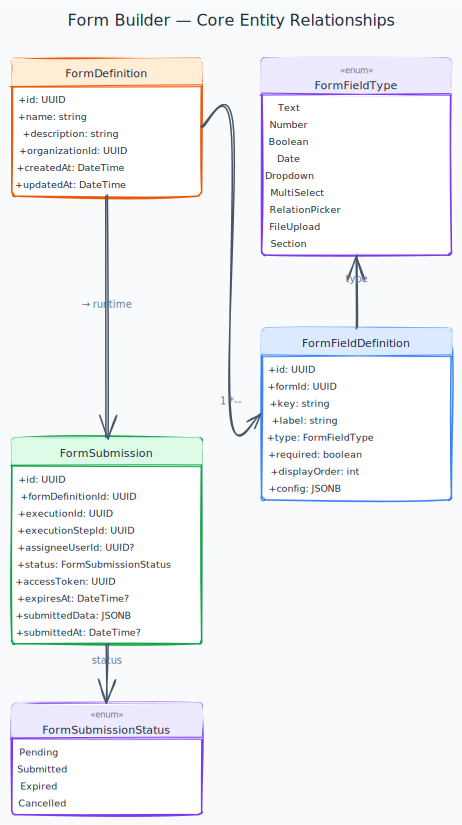

# Form Builder

[← Back to Use Cases](../README.md)

---

## Overview

Enable users to design interactive forms that can be embedded as steps within workflows. Forms collect structured data from users, validate it, and store submissions that can flow through the rest of the workflow as context data.

## Business Value

Forms are the primary mechanism for human interaction within a workflow. Without forms, workflows can only be fully automated — with forms, they can support approval processes, data entry, and human-in-the-loop automation.

## Phase

**MVP**

---

## Use Cases

| Use case | Description |
|---|---|---|
| [Form Definition Management](form-definition.md) | Create, edit, delete form definitions |
| [Form Field Configuration & Validation](form-fields.md) | Add fields with types, labels, placeholders, validation rules |
| [Workflow Step Integration](workflow-integration.md) | Attach a form to a Form step in a workflow |
| [Form Submission Handling](form-submission.md) | Render form to assignee, capture submission, continue workflow |
---

## Diagrams



---

## Form Field Types

| Type | Description |
|---|---|
| `Text Input` | Single-line text |
| `Textarea` | Multi-line text |
| `Number` | Numeric input |
| `Date Picker` | Date or datetime selection |
| `Dropdown` | Select from a list of options |
| `Checkbox` | Boolean toggle |
| `File Upload` | Attach one or more files |
| `Relation Picker` | Search and select a record from a Model |

---

## Form Lifecycle in a Workflow

```
Workflow reaches Form step
    → Assignee receives notification
        → Assignee opens form URL
            → Submits form
                → Submission stored
                    → Workflow continues with form data in context
```

---

## Acceptance Criteria (domain)

- [ ] Users can create a form with at least 5 different field types.
- [ ] Each field can have required validation, min/max length, and custom error messages.
- [ ] A form can be linked to a Form step in a workflow.
- [ ] When workflow reaches the Form step, the assignee receives a notification with the form link.
- [ ] Submitted form data is available as context variables in subsequent workflow steps.
- [ ] Submitting an invalid form shows inline validation errors without page reload.

---

## Code style

Repo-wide C# conventions (explicit types, naming, Allman braces) are enforced via [`.editorconfig`](../../../.editorconfig). Run `dotnet format Axis.sln` before push ([CONTRIBUTING.md](../../../CONTRIBUTING.md)).

---

## Implementation Status

| Layer | Status | Notes |
|---|---|---|
| Domain | ✅ Done | `FormDefinition`, `FormField`, `FormSubmission` aggregates; field types and form-task domain events |
| Application | ⚠️ Partial | Form definition CRUD + fields; subscription-plans: `SubmitFormByToken`, `GetFormTaskByToken`, `GetMyFormTasks`, `ExpireFormSubmissionHandler`. Notifications and role-based assignee resolution pending |
| Infrastructure | ✅ Done | `form_model_references` read model + `ModelDeletedHandler` (DataModeling Kafka) flags broken Relation Picker fields; delete-model guard via `IFormModelReferenceRepository`. Delete-form guard: `FormWorkflowDeletionGuard` calls WorkflowBuilder gRPC `CountBlockingFormReferences`; `FormDeletedEvent` Avro published on delete for WorkflowBuilder `FormDeletedHandler`. Database `axis_formbuilder` ([ADR-011](../../TECH_STACK.md#adr-011-per-module-database-with-schema-per-tenant-inside)); EF `InitialCreate` migration (regenerated via `dotnet ef`); tests/fixtures use `MigrateAsync` ([ADR-023](../../TECH_STACK.md#adr-023-per-module-ef-core-migrations-only)). `FormSubmission` + expiry scheduling via Wolverine. DbContext + UnitOfWork inlined per ADR-017. `FormBuilderEventMapper` translates domain events to Avro at `SaveChangesAsync` and publishes via outbox → Kafka ([ADR-019](../../TECH_STACK.md#adr-019-avro-and-schema-registry-for-event-payloads-with-cloudevents-envelope)). `OrganizationVerifiedHandler` provisions tenant schema via `TenantModuleProvisionAttempt` (reports `TenantModuleProvisionReportEvent` to Identity; retries via `RetryTenantModuleProvisionHandler` + shared `TenantSchemaProvisioner`, tenant provisioning use case). `FormStepReachedHandler` consumes WorkflowEngine's `FormStepReachedEvent` from Kafka (Contracts only — no Domain reference). Consumes WorkflowBuilder lifecycle events from `Axis.WorkflowBuilder.Contracts`. |
| Contracts | ✅ Done | `Axis.FormBuilder.Contracts` — Avro schemas `FormTaskSubmittedEvent` + `FormTaskExpiredEvent` (the form-task lifecycle events WorkflowEngine reacts to). Hand-written `ISpecificRecord` generated code + `FormBuilderKafkaTopics` + `FormBuilderEventExtensions` (typed GUID accessors + `SubmittedData()` JSON round-trip helper since Avro lacks a native any-type). |
| API | ✅ Done | `FormEndpoints` (definitions) + `FormTaskEndpoints` (token submit, my tasks). `submittedBy` resolved via `ICurrentUser` in Application |
| Frontend | ⏳ Pending | — |

---

## Open work (agents)

| Area | Status | Detail |
|------|--------|--------|
| **Backend** | ⚠️ | [form-submission](form-submission.md): notification on assign; expiry → execution failure (workflow-engine); role-based My Tasks aggregation. Token submit + My Tasks API ✅. |
| **Frontend** | ⏳ | Form editor, field picker, standalone submit page, My Tasks — all tenant-registration–subscription-plans US. |
| **Cross-module** | workflow-engine | Form step execution, context expressions, `FormStepReached` consumer path — coordinate with workflow-engine. **platform-foundation organization management [organization deletion](organization-management.md):** `OrganizationFormTaskCanceller` cancels pending form tasks before org hard-delete (Identity-owned job). |

---

## Dependencies

- [Platform Foundation](../platform-foundation/README.md)
- [Identity & Access](../identity-access/README.md)
- [Data Modeling](../data-modeling/README.md) *(for Relation Picker fields)*

## Dependents

- [Workflow Builder](../workflow-builder/README.md) *(Form step type)*
- [Workflow Engine](../workflow-engine/README.md)
