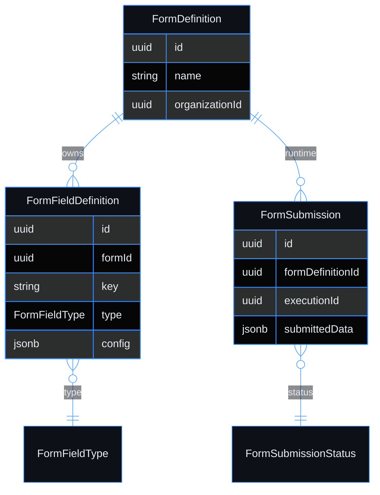

# Use case — Create a form

> **Navigation**: [← Form Builder](../README.md) · [Use cases index](../README.md#use-cases)

## Purpose

Create a new form so that I can design a data collection interface.

## Primary actor

- Organization Member with `form:definition:write`

## Trigger

- User initiates: create a new form

## Main flow

1. Actor satisfies the trigger.
2. System performs the happy-path steps in Acceptance Criteria.
3. Actor receives the expected outcome.

## Alternate / error flows

- Validation failures and edge cases in Acceptance Criteria.

## Context

Users can create, edit, and delete form definitions. A form is a reusable collection of fields that can be embedded in workflow Form steps or rendered on a Page Builder page.

## Acceptance Criteria

*Happy path*
- [ ] Creation dialog collects: name (required), description (optional).
- [ ] New form is created immediately with no fields and opens in the form editor.
- [ ] A live preview panel on the right of the editor shows the form as it would appear to a user filling it in.

*Validation & errors*
- [ ] Name: required, 2–200 characters, unique within the org (case-insensitive). Duplicate shows: "A form named '{name}' already exists."

*Edge cases*
- [ ] Creating a form and immediately navigating away without adding fields: the empty form is saved and visible in the forms list.

*Out of scope*
- Form templates / starter library.

> **Implementation status**
>
> | Layer | Status |
> |-------|--------|
> | Domain | ✅ |
> | Application | ✅ |
> | Infrastructure | ✅ |
> | API | ✅ |
> | Frontend | ⏳ |
>
> **Gaps vs spec:** live preview panel and form editor pending Frontend.
>
> **Decisions:** all form fields stored as JSONB via custom FormFieldConverter using FormFieldType as polymorphic discriminator.

## Wireframes

| Screen | Excalidraw | Preview |
|--------|------------|---------|
| N/A | N/A | N/A |

## Diagrams

### form-model

