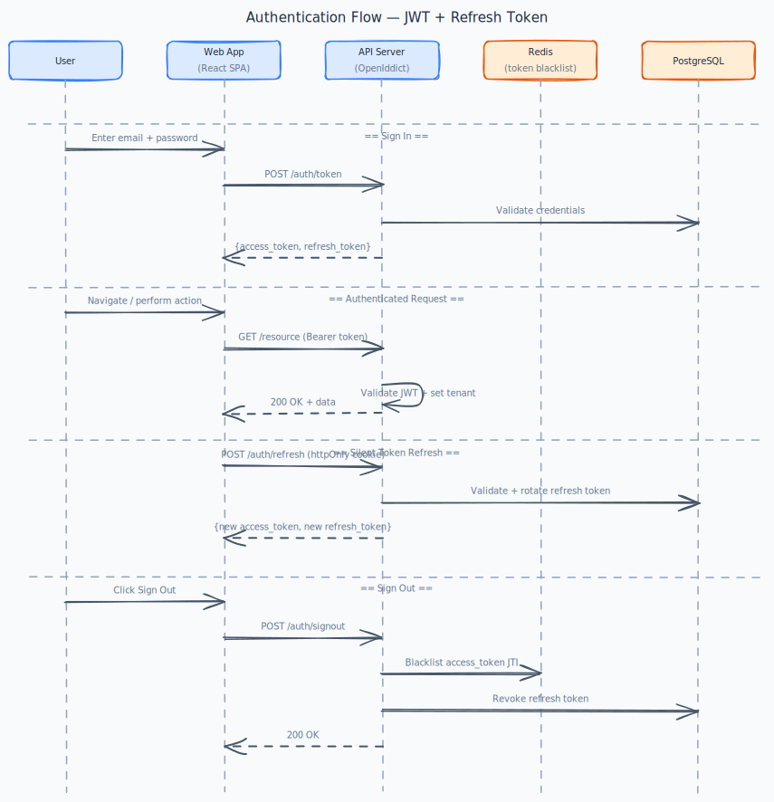

# Identity & Access Management

[← Back to Use Cases](../README.md)

---

## Overview

Provide secure authentication and a flexible role-based access control (RBAC) system. Users belong to an organization, hold one or more roles, and each role grants a set of permissions. All identity data is tenant-scoped.

## Business Value

Security and access control are non-negotiable for a SaaS product. Organizations need confidence that their users see only what they should see.

## Phase

**MVP**

---

## Use Cases

### Authentication

| Use case | Summary |
|---|---|
| [Change password while signed in](change-password/) | Change my password while signed in so that I can keep my account secure. |
| [Reset forgotten password](reset-password/) | Reset my password via email so that I can regain access to my account if I forget it. |
| [View and revoke active sessions](sessions/) | See where I'm currently signed in so that I can revoke access from devices I no longer use. |
| [Sign in with email and password](sign-in/) | Sign in with my email and password so that I can access my organization's workspace. |
| [Sign out](sign-out/) | Sign out so that my session is terminated and no one else can use my account from this device. |
| [Silent token refresh](token-refresh/) | My session to stay active while I'm working so that I'm not interrupted by unexpected sign-out prompts. |

### Users & invitations

| Use case | Summary |
|---|---|
| [Accept an invitation](accept-invite/) | Accept my invitation and set up my account so that I can access the organization. |
| [Deactivate a user](deactivate-user/) | Deactivate a user so that they can no longer access the workspace without deleting their history. |
| [Invite a user to the organization](invite-user/) | Invite a team member by email so that they can join the workspace and start collaborating. |
| [Manage user profile](user-profile/) | Update my profile information so that my name and contact details are current. |

### Roles & permissions

| Use case | Summary |
|---|---|
| [Permission enforcement on the API](api-permissions/) | Every API endpoint to enforce the required permission so that unauthorized actions are rejected at the server… |
| [Assign a role to a user](assign-role/) | Assign a role to a user so that they get the appropriate permissions. |
| [Create a custom role](create-role/) | Create a custom role with specific permissions so that I can grant exactly the right level of access to a group of… |
| [Edit a custom role](edit-role/) | Edit an existing custom role so that I can adjust permissions as our needs change. |
| [View and manage roles](list-roles/) | See all roles in my organization so that I can understand who has what level of access. |
| [Permission enforcement in the frontend](ui-permissions/) | The UI to hide or disable features I don't have access to so that I'm not confused by actions that will fail. |

### Localization & theming

| Use case | Summary |
|---|---|
| [Switch application language (English / Vietnamese)](language/) | Switch the application language between English and Vietnamese so that I can read and operate the app in my preferred… |
| [Switch visual theme (light / dark / system)](theme/) | Switch the visual theme between light, dark, and system so that I can choose a comfortable theme and preserve readable… |

---

## Diagrams

---

## Default Roles

| Role | Description |
|---|---|
| **Admin** | Full access to all features within the organization |
| **Editor** | Can create and edit workflows, models, forms, pages |
| **Viewer** | Read-only access to data and execution history |
| **End User** | Access only to published pages and assigned forms |

*Organizations can create custom roles with granular permissions.*

---

## Acceptance Criteria (domain)

- [ ] Users can register an account and join an organization via invitation.
- [ ] JWT tokens are validated on every request; expired tokens return 401.
- [ ] Users without required permissions receive 403, never 404 or 500.
- [ ] Password reset flow works end-to-end via email link.
- [ ] Roles and permissions are enforced on both API and frontend UI.

---

## Implementation Status

| Layer | Status | Notes |
|---|---|---|
| Domain | ✅ Done | `Organization`, `User`, `Role`, `Invitation` aggregates; `Email`, `OrganizationSlug` value objects; all domain events |
| Application | ✅ Done | `RegisterOrganization`, `InviteUser`, `AcceptInvitation`, `DeactivateUser`, `AssignRoleToUser`, `CreateRole`, `UpdateRole`, `UpdateUserProfile`; `AuthenticateUser`, `VerifyEmail`, `ResendVerificationEmail`, `RequestPasswordReset`, `ResetPassword`, `ChangePassword`, `RevokeSession`; `GetRoles`, `GetUserSessions` queries |
| Infrastructure | ✅ Done | `IdentityDbContext` (public schema), EF Core mappings, all repositories, `BCryptPasswordHasher` (work factor 12), `MailKitEmailSender`, `IdentityUnitOfWork` (maps domain events → Avro integration events on save), `PasswordResetTokenStore`, `SessionStoreService` (wraps `IOpenIddictTokenManager`), `OpenIddictSeeder`. `IdentityGrpcService` exposes `GetUserPermissions` ([ADR-014](../../TECH_STACK.md#adr-014-grpc-for-internal-sync-rpc-and-rest-openapi-for-external-api)). `IdentityEventMapper` translates 5 domain events to Avro records published via Wolverine outbox → Kafka (ADR-019). |
| Contracts | ✅ Done | `Axis.Identity.Contracts` — `Protos/axis/identity/v1/identity_service.proto` (`GetUserPermissions`) + 5 Avro schemas (`OrganizationVerifiedEvent`, `UserDeactivatedEvent`, `UserReactivatedEvent`, `RoleAssignedEvent`, `RoleRemovedEvent`) with hand-written `ISpecificRecord` generated code + `IdentityKafkaTopics` + `IdentityEventExtensions` (typed GUID accessors). |
| API | ✅ Done | OpenIddict 5.x OAuth2/OIDC server: `GET /connect/authorize` (PKCE), `POST /connect/login` (credential validation + session cookie), `POST /connect/token` (code exchange, refresh, client credentials). `POST /api/auth/signout` (revoke refresh token + JTI blacklist). Refresh token delivered as httpOnly `Secure SameSite=Strict` cookie via `ApplyRefreshTokenCookieHandler`; extracted from cookie on refresh via `ExtractRefreshTokenFromCookieHandler`. Permission-based authorization via `PermissionPolicyProvider` + `OpenIddictValidationAspNetCore`. JTI Redis blacklist. Integration-tested with WebApplicationFactory + Testcontainers (PKCE full-flow helpers in `AuthHelper`). |
| Frontend | ⚠️ Partial | Login (PKCE), app shell, dashboard scaffold on PR #50; settings/invitation/session flows and multi-tab refresh still pending. tenant registration use case register page is shipped under Platform Foundation docs. |

**Key implementation decisions:**
- Identity uses the global `public` PostgreSQL schema (not a tenant schema) — registration has no tenant context and email uniqueness is platform-wide.
- Passwords are hashed with BCrypt (work factor 12) via `IPasswordHasher`. The hash is stored as a first-class property on `User` (`PasswordHash`), not a shadow property.
- The 4 default system roles (Admin, Editor, Viewer, End User) and their full permission sets are seeded automatically by `RegisterOrganizationHandler` — see [api-permissions](./api-permissions/) and [ui-permissions](./ui-permissions/) for the permission catalogue.
- **OpenIddict implementation**: OpenIddict 5.x serves as the in-process OAuth2/OIDC authorization server (ADR-004). Authorization Code + PKCE for the SPA; Client Credentials for M2M. Refresh tokens are stored as opaque reference tokens in the OpenIddict `OpenIddictTokens` table and delivered via httpOnly cookie. Access token JTIs are blacklisted in Redis on sign-out. Ephemeral signing/encryption keys are used in development; production should use Azure Key Vault certificates.
- **gRPC (dev):** manual `GetUserPermissions` checks — [patterns.md § gRPC dev verification](../../playbooks/patterns.md#dev--verify-getuserpermissions-with-grpcurl).
- **Known gap (user deactivation)**: Revoking all refresh tokens is immediate, but existing access tokens remain valid up to 15 minutes. Full compliance would require a Redis user-level blacklist (not implemented in MVP).

---

## Open work (agents)

| Area | Status | Detail |
|------|--------|--------|
| **Backend** | ⚠️ polish | [reset-password](./reset-password/), [change-password](./change-password/), [sessions](./sessions/): rate limits, session list API wiring. [api-permissions](./api-permissions/): `[RequirePermission]` / policy tests. [invite-user](./invite-user/): block admin self-invite at API. |
| **Frontend** | ⏳ | Register, settings, invitation accept, session management UI, and localization/theming foundation — see per–use-case callouts in [sign-in](./sign-in/), [accept-invite](./accept-invite/), [sessions](./sessions/), [language](./language/), [theme](./theme/). |

Core auth/OIDC/RBAC backend is ✅; use feature **Gaps vs spec** for the next use case, not domain-level checkboxes.

---

## Dependencies

- [Platform Foundation](../platform-foundation/README.md)

## Dependents

- [Data Modeling](../data-modeling/README.md)
- All other domains
