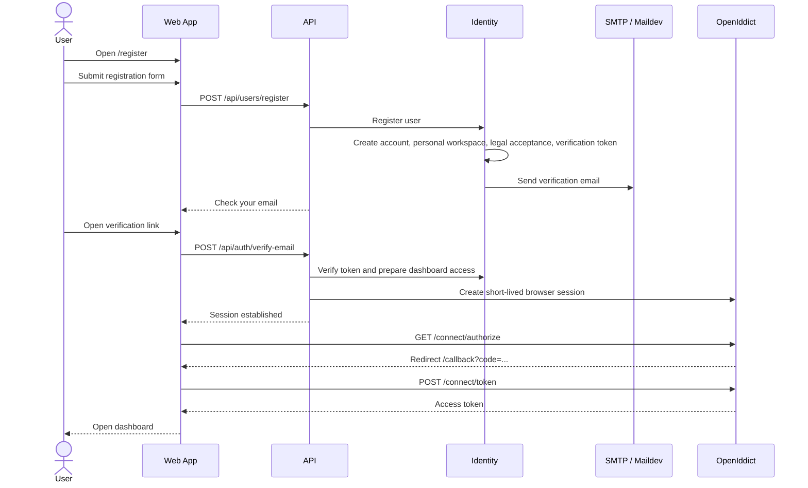

# Register A Standalone User Account

> **Navigation**: [docs/use-cases/identity-access/README.md](./README.md) · [docs/use-cases/README.md](../README.md) · [docs/README.md](../../README.md) · [AGENTS.md](../../../AGENTS.md)

## Purpose

Register a standalone Axis Platform user with email/password so the user can verify their email and reach the account dashboard.

## Primary actor

- Self-service user

## Trigger

- User opens `/register` without any external setup context.

## Main flow

1. User opens the registration page.
2. User enters full name, email, password, password confirmation, and accepts the current user-level Terms of Service and Privacy Policy; the currently selected supported site language is submitted as the initial account language preference.
3. System verifies email uniqueness and password policy.
4. System creates the account, creates the user's personal workspace, records legal acceptance, and sends an email verification link.
5. User opens the verification link.
6. System verifies the email token, signs the user in, completes the browser callback, and routes the user to the dashboard.

## Alternate / error flows

- Duplicate email: show "An account with this email already exists. Sign in instead." as an inline email-field error.
- Invalid, expired, or already-used verification token: show a clear state and allow resend when allowed.
- Rate-limited resend request: show a clear wait state and disable resend while limited.
- Server error during submission: show a generic retry message and re-enable the submit button.

## Acceptance Criteria

*Happy path*
- **AC-001** User registration can be started without any team/setup context.
- **AC-002** User can register with full name, email/password, password confirmation, and current user-level legal acceptance.
- **AC-003** Registration creates the standalone account, personal workspace, and legal acceptance without requiring team/setup context.
- **AC-004** Registration sends an Axis Platform-branded verification email in the account's initial supported language preference with HTML and plain-text bodies, a prominent verification action, a fallback URL, expiry and security context, recipient context, and footer metadata.
- **AC-005** After successful email verification, the user is signed in and routed to the dashboard.

*Validation & errors*
- **AC-006** Email is required, must be a valid email format, and must be unique across Axis Platform users.
- **AC-007** Password is required, must be 15-128 characters, and common or predictable passwords are rejected.
- **AC-008** Password confirmation must match password exactly.
- **AC-009** Missing team/setup context is accepted for standalone registration.
- **AC-010** Field-level errors are shown inline.
- **AC-011** A 5xx registration response shows a generic retry message and re-enables submit.
- **AC-012** Expired, invalid, and already-used verification links show clear user-facing states; rate-limited resend shows a clear wait state.

*Edge cases*
- **AC-013** Multiple rapid submissions are deduplicated with an idempotency key.
- **AC-014** Pasting a password with leading/trailing spaces is accepted as-is.
- **AC-015** Standalone registration leaves the account independent of team/setup context.
- **AC-016** Registration, confirmation, and verification journeys provide a recoverable path when the user cannot complete the current step.
- **AC-017** Registration captures the selected supported site language as the account's initial user-level language preference; missing language input uses the product fallback language, and unsupported language input is rejected.

## Acceptance Test Matrix

| ID | Boundary | Scenario | Covers AC | Verification | Required |
|---|---|---|---|---|---|
| AT-001 | Browser journey | User registers, opens verification email, sees a readable verified handoff, completes browser sign-in, and reaches the dashboard | AC-001, AC-002, AC-004, AC-005, AC-009 | Browser automation | Yes |
| AT-002 | Browser journey | Duplicate email shows the exact inline email-field error | AC-006, AC-010 | Browser automation | Yes |
| AT-003 | API boundary | Registration persists account data, personal workspace, legal acceptance, verification token, and no team/setup dependency | AC-003, AC-004, AC-009, AC-015 | API integration test | Yes |
| AT-004 | UI component | Empty form, invalid email, password confirmation, and backend field errors render inline | AC-006, AC-008, AC-010 | UI component test | Yes |
| AT-005 | UI component | Password policy rejects short/common passwords and accepts leading/trailing spaces as entered | AC-007, AC-014 | UI component test | Yes |
| AT-006 | UI component | 5xx submission failure shows generic retry text and re-enables submit | AC-011 | UI component test | Yes |
| AT-007 | UI/API boundaries | Expired, invalid, and already-used verification links show clear states; resend remains available where allowed and rate-limited resend is clear | AC-012 | UI component test + API integration test | Yes |
| AT-008 | Application boundary | Completed or in-progress idempotency key deduplicates repeated registration attempts | AC-013 | Application test | Yes |
| AT-009 | UI component | Registration, confirmation, and verification screens expose sign-in or registration escape navigation | AC-016 | UI component test | Yes |
| AT-010 | Infrastructure boundary | Verification email content includes clear subject, HTML and plain-text bodies, CTA and fallback link, expiry and security context, recipient context, and footer metadata | AC-004 | Infrastructure test | Yes |
| AT-011 | UI/API boundaries | Registration submits the selected supported site language, persists it as the initial user preference, rejects unsupported language input, and sends the verification email in that language | AC-004, AC-017 | Browser automation + UI component test + API integration test + Infrastructure test | Yes |

## Out Of Scope

- Dashboard experience.

## Screen flow

| Screen | Required contract |
|---|---|
| `/register` | Render an auth-card form with full name, email, password, password confirmation, current Terms/Privacy acceptance, a single submit action, and a sign-in link. Full name is captured and stored as a single account name. Submit the currently selected supported site language as the initial account language preference. |
| `/register` validation | Show required-field, invalid-email, duplicate-email, password-policy, password-confirmation, legal-acceptance, backend field, and generic 5xx errors inline or in the form alert described by the relevant AC. Keep the submit button disabled only while submission or legal-version loading is pending. |
| `/register/confirmation` | Show the submitted email when available, explain that the verification link is required to finish registration, provide resend, show resend success/error/rate-limited states, keep account-enumeration-safe copy, and include a route back to registration. |
| `/auth/verify` | Submit the token once, show loading while verification is pending, show a verified handoff state that remains readable for at least 5 seconds before auto-continuing unless the user chooses the manual continue action, show expired, invalid, and already-used verification states, show the resend rate-limited state when resend is limited, and include sign-in or registration escape navigation in every visible state. |
| Callback/dashboard handoff | The callback and dashboard experience are owned outside this use case; this use case only requires that successful verification completes browser sign-in and routes to dashboard without introducing another transient informational screen in the normal post-verification path. |

Required UI quality: labels must be programmatic, invalid fields must expose invalid state, error/help text must remain associated with the field it describes, recovery actions must be visible and keyboard-reachable, and the screens must use existing auth components and theme tokens.

## Diagrams

### register-user-journey

> **Implementation status**
>
> | Layer | Status |
> |-------|--------|
> | Domain | Done |
> | Application | Done |
> | Infrastructure | Done |
> | API | Done |
> | Frontend | Done |
>
> **Implemented:** The standalone registration backend, API, and frontend screens are in place. `POST /api/users/register` owns submission, account creation, personal workspace creation, initial language preference capture, legal acceptance, idempotency, and verification email creation; the use case also covers localized standards-complete verification email content, email verification, resend states, post-verification PKCE, and dashboard routing.
>
> **Gaps vs spec:** N/A.
>
> **Deferred follow-ups:** N/A.
>
> **Verification:** Required AT rows are covered by browser automation, UI component tests, API integration tests, application tests, and infrastructure tests.
>
> **Decisions:** Screen flow owns the product screen contract; Required UI quality owns accessibility and interaction expectations. Registration uses one user-facing full-name field end-to-end. Resend rate limiting is part of resend behavior, not verification-token resolution. Public auth screens must expose an escape navigation link instead of relying on browser history.
