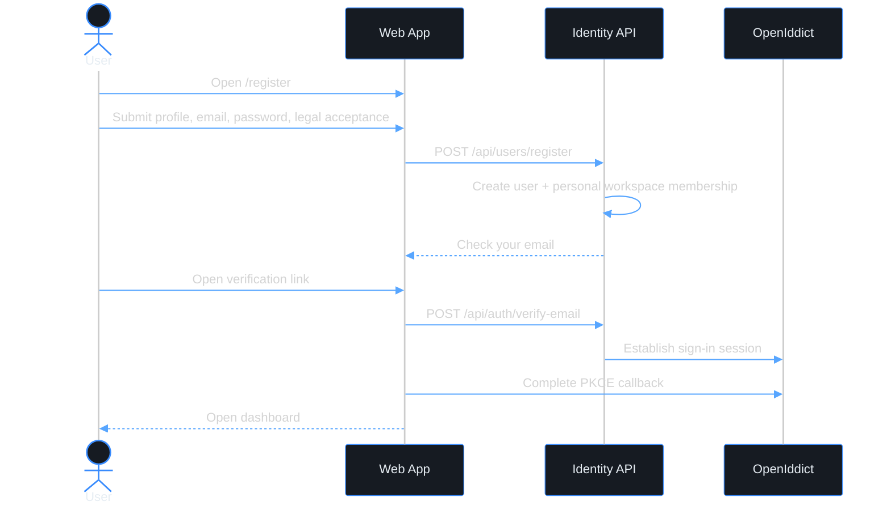

# Use Case - Register A Standalone User Account

> **Navigation**: [Identity Access](../README.md) · [Use cases](../../README.md)

## Purpose

Register a standalone Axis user with email/password so the user can verify their email and reach the account dashboard.

## Primary actor

- Self-service user

## Trigger

- User opens `/register` without any external setup context.

## Main flow

1. User opens the registration page.
2. User enters first name, last name, email, password, password confirmation, and accepts the current user-level Terms of Service and Privacy Policy.
3. System verifies email uniqueness and password policy.
4. System creates the user, creates the user's personal workspace membership, records legal acceptance, and sends an email verification link.
5. User opens the verification link.
6. System verifies the email token, establishes the Axis/OpenIddict sign-in session, completes PKCE, and routes the user to the dashboard.

## Alternate / error flows

- Duplicate email: show "An account with this email already exists. Sign in instead." as an inline email-field error.
- Invalid, expired, rate-limited, or already-used verification token: show a clear state and allow resend when allowed.
- Server error during submission: show a generic retry message and re-enable the submit button.

## Acceptance Criteria

*Happy path*
- [x] **AC-001** User registration can be started without any team/setup context.
- [x] **AC-002** User can register with name fields, email/password, password confirmation, and current user-level legal acceptance.
- [x] **AC-003** Registration creates a `User` with a personal workspace membership and without requiring or creating a team workspace membership.
- [x] **AC-004** Registration sends an email verification link.
- [x] **AC-005** After successful email verification, the user is signed in through Axis/OpenIddict and redirected to the dashboard.

*Validation & errors*
- [x] **AC-006** Email is required, must be a valid email format, and must be unique across Axis users.
- [x] **AC-007** Password is required, must be 15-128 characters, and common or predictable passwords are rejected.
- [x] **AC-008** Password confirmation must match password exactly.
- [x] **AC-009** Missing team/setup context is accepted for standalone registration.
- [x] **AC-010** Field-level errors are shown inline.
- [x] **AC-011** A 5xx registration response shows a generic retry message and re-enables submit.
- [x] **AC-012** Expired, invalid, rate-limited, and already-used verification links show clear user-facing states.

*Edge cases*
- [x] **AC-013** Multiple rapid submissions are deduplicated with an idempotency key.
- [x] **AC-014** Pasting a password with leading/trailing spaces is accepted as-is.
- [x] **AC-015** Standalone registration leaves the account independent of team/setup context so future team create/join flows can attach without re-registration.

## Acceptance Test Matrix

| ID | Level | Scenario | Covers AC | Automated by | Required to close |
|---|---|---|---|---|---|
| REG-001 | E2E | User registers, opens verification email, completes PKCE, and reaches dashboard | AC-001, AC-002, AC-004, AC-005, AC-009 | Playwright | Yes |
| REG-002 | E2E | Duplicate email shows the exact inline email-field error | AC-006, AC-010 | Playwright | Yes |
| REG-003 | API | Registration creates user, personal workspace membership, verification token, and no team membership | AC-003, AC-004, AC-009, AC-015 | xUnit API | Yes |
| REG-004 | Component | Empty form, invalid email, password confirmation, and backend field errors render inline | AC-006, AC-008, AC-010 | Vitest | Yes |
| REG-005 | Component | Password policy rejects short/common passwords and accepts leading/trailing spaces as entered | AC-007, AC-014 | Vitest | Yes |
| REG-006 | Component | 5xx submission failure shows generic retry text and re-enables submit | AC-011 | Vitest | Yes |
| REG-007 | Component/API | Expired, invalid, rate-limited, and already-used verification links show clear states; resend remains available where allowed | AC-012 | Vitest + xUnit API | Yes |
| REG-008 | Application | Completed or in-progress idempotency key deduplicates repeated registration attempts | AC-013 | xUnit Application | Yes |

*Out of scope*
- Anything beyond the verified standalone-registration path.

## Design Sources

| Screen | Source | Preview |
|---|---|---|
| registration flow | N/A | N/A |

## Diagrams

### register-user-journey

> **Implementation status**
>
> | Layer | Status |
> |-------|--------|
> | Domain | Done |
> | Application | Done |
> | Infrastructure | Done |
> | API | Done |
> | Frontend | Done |
>
> **Implemented:** Email/password standalone registration is implemented end to end at `POST /api/users/register`, including idempotency, legal acceptance, personal workspace membership creation, email verification, post-verification PKCE session establishment, confirmation/resend states, and dashboard routing.
>
> **Gaps vs spec:** none for standalone email/password registration.
>
> **Deferred follow-ups:** none inside this use case. Removed capabilities must return as new, scoped use cases before source is added.
>
> **Decisions:** No editable design-source artifact is committed for this use case; implemented screens are covered by component and E2E tests.
