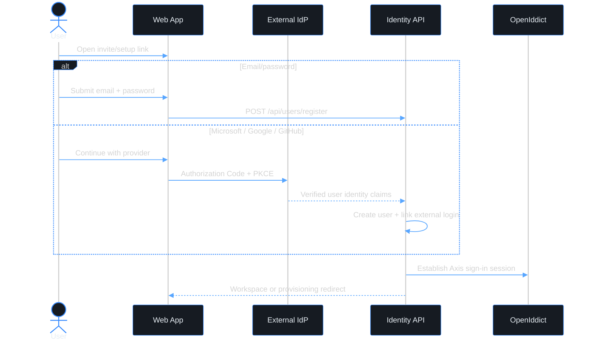

# Use case — Register a user account

> **Navigation**: [← Identity & Access Management](../README.md) · [Use cases index](../README.md#use-cases)

## Purpose

Register my user identity with email/password or Microsoft, Google, or GitHub so that I can join an existing organization and sign in to Axis.

## Primary actor

- invited user
- first organization owner/admin completing setup after [register-org](../../platform-foundation/register-org/)

## Trigger

- User opens an invitation link, first-owner setup link, or self-service user registration entry point for an existing organization.

## Main flow

1. User opens a user registration link tied to an organization, invitation, or first-owner setup token.
2. User chooses email/password or a configured external identity provider.
3. System verifies that the user identity is unique and that the user is allowed to join the target organization.
4. User accepts any required user-level Terms of Service / Privacy Policy.
5. System creates the user account, links the credential or external login, assigns the role granted by the invitation/setup token, and starts a sign-in session.
6. User lands in the workspace or provisioning wait screen for the target organization.

## Alternate / error flows

- Invite/setup token expired or already used: show a clear message and request a new invite/setup link.
- Email already belongs to another Axis user: show "An account with this email already exists. Sign in instead."
- External provider returns no verified email: stop registration before account creation.
- Provider account is already linked to another user: reject registration and direct the user to sign in.
- Organization is still provisioning: complete user registration, then route to workspace provisioning.

## Context

This use case owns user identity onboarding. Third-party identity providers authenticate an individual user and can be linked to that user account. They do not prove ownership of an organization; organization onboarding remains in [register-org](../../platform-foundation/register-org/).

## Acceptance Criteria

*Happy path*
- [ ] User registration can be started from an invitation token or first-owner setup token for an existing organization.
- [ ] User can register with email/password.
- [ ] User can register with Microsoft, Google, or GitHub when the provider is configured ([ADR-027](../../../TECH_STACK.md#adr-027-external-identity-providers-for-user-sign-in-and-registration)).
- [ ] External provider registration requires a verified email claim; unverified or missing email cannot continue.
- [ ] The resulting `User` is attached to exactly one organization and receives the role from the invitation/setup token.
- [ ] External provider identity is stored as a user external login; it is not stored on the organization.
- [ ] After successful registration, the user is signed in through Axis/OpenIddict and redirected to the workspace or provisioning wait screen.

*Validation & errors*
- [ ] Email: required, valid email format, unique across Axis users.
- [ ] Password path: password is required, minimum 8 characters, must contain at least one letter and one number.
- [ ] Password confirmation must match password exactly.
- [ ] External provider path: duplicate provider account is rejected before persistence, not by surfacing a database unique-constraint failure.
- [ ] Token organization mismatch is rejected; a user cannot use an invite/setup token for one organization to join another.
- [ ] All field-level errors are shown inline, not as a global toast.
- [ ] If the API returns a server error (5xx), the form shows a generic "Something went wrong, please try again" message and the submit button re-enables.

*Edge cases*
- [ ] Multiple rapid submissions are deduplicated with an idempotency key.
- [ ] Pasting a password with leading/trailing spaces is accepted as-is.
- [ ] A user can later link or unlink external providers only through an authenticated account-management flow.
- [ ] If the organization is not active yet, successful registration routes to the provisioning wait screen instead of failing.

*Out of scope*
- Creating a new organization; see [register-org](../../platform-foundation/register-org/).
- Enterprise SAML/SCIM federation and per-tenant IdP configuration.
- User invitation creation; see [invite-user](../invite-user/).
- Invitation acceptance details already covered by [accept-invite](../accept-invite/) unless this use case replaces that flow in a future consolidation.
- CAPTCHA / bot protection.

## Wireframes

No local wireframes yet. User registration should reuse the auth card system and add provider-specific states when frontend implementation starts.

| Screen | Excalidraw | Preview |
|--------|------------|---------|
| N/A | N/A | N/A |

## Diagrams

### register-user-journey

> **Implementation status**
>
> | Layer | Status |
> |-------|--------|
> | Domain | ⚠️ |
> | Application | ⚠️ |
> | Infrastructure | ⚠️ |
> | API | ⏳ |
> | Frontend | ⏳ |
>
> **Gaps vs spec:** Current implementation has pieces of user onboarding in [accept-invite](../accept-invite/), [sign-in](../sign-in/), and the older organization registration flow. A dedicated user registration command/API and external-login linking model still need to be implemented from `main`.
>
> **Decisions:** Microsoft / Google / GitHub providers belong to user identity only. They can create or link a `UserExternalLogin`; they must never create an organization directly.
