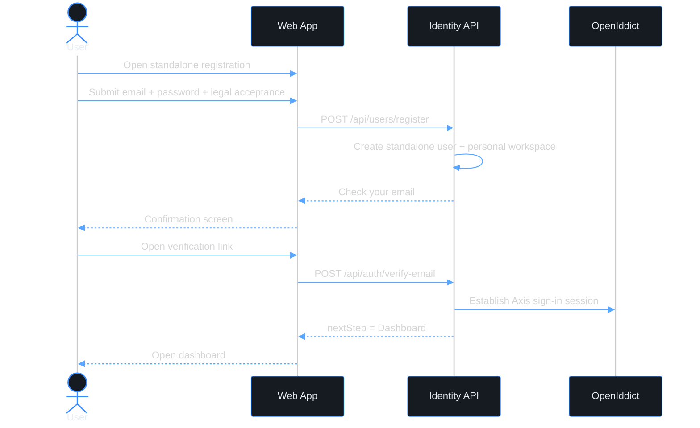

# Use case — Register a standalone user account

> **Navigation**: [Identity & Access Management](../README.md) | [Use cases index](../README.md#use-cases)

## Purpose

Register my standalone user identity with email/password so that I can use Axis as an individual before creating or joining a team workspace.

## Primary actor

- self-service user

## Trigger

- User opens self-service registration without a workspace context.

## Main flow

1. User opens the registration page.
2. User enters full name, email, password, password confirmation, and accepts the current user-level Terms of Service / Privacy Policy.
3. System verifies that the user identity is unique and the password satisfies the policy.
4. System creates the standalone user account, creates the user's personal workspace membership, and sends an email verification link.
5. User opens the verification link.
6. System verifies the user email, establishes the Axis/OpenIddict sign-in session, and routes the user to the dashboard.

## Alternate / error flows

- Email already belongs to another Axis user: show "An account with this email already exists. Sign in instead."
- Verification link expired or already used: show a clear state and allow requesting a new verification email.
- Server error during submission: show a generic retry message and re-enable the submit button.

## Context

This use case owns the smallest complete user identity onboarding path: a person creates a standalone Axis account with email/password, gets a personal workspace, verifies the email address, and reaches their dashboard without any team or setup-token context.

Team membership is intentionally outside this use case. A user can later create or join a team workspace through Workspace-specific flows. First-owner setup after [register-workspace](../../platform-foundation/register-workspace/) is a separate setup-token handoff owned by the team workspace onboarding journey, not by this standalone registration definition.

Third-party identity providers authenticate an individual user and can be linked to that user account in a separate provider-registration/linking use case. They do not prove ownership of a workspace; workspace onboarding remains in [register-workspace](../../platform-foundation/register-workspace/).

## Acceptance Criteria

*Happy path*
- [x] **AC-001** User registration can be started without any team/setup context.
- [x] **AC-002** User can register with full name, email/password, password confirmation, and current user-level legal acceptance.
- [x] **AC-003** A standalone registration creates a `User` with a personal workspace membership and without requiring or creating a team workspace membership.
- [x] **AC-004** Registration sends an email verification link.
- [x] **AC-005** After successful email verification, the user is signed in through Axis/OpenIddict and redirected to the dashboard.

*Validation & errors*
- [x] **AC-006** Email is required, must be a valid email format, and must be unique across Axis users.
- [x] **AC-007** Password is required, must be 15-128 characters, and common or predictable passwords are rejected.
- [x] **AC-008** Password confirmation must match password exactly.
- [x] **AC-009** Missing team/setup context is accepted for standalone registration.
- [x] **AC-010** All field-level errors are shown inline, not as a global toast.
- [x] **AC-011** If the API returns a server error (5xx), the form shows a generic "Something went wrong, please try again" message and the submit button re-enables.
- [x] **AC-012** Expired, invalid, rate-limited, and already-used verification links show clear user-facing states.

*Edge cases*
- [x] **AC-013** Multiple rapid submissions are deduplicated with an idempotency key.
- [x] **AC-014** Pasting a password with leading/trailing spaces is accepted as-is.
- [x] **AC-015** Standalone registration leaves the account independent of team/setup context so later team create/join flows can attach without re-registration.

## Acceptance Test Matrix

| ID | Level | Scenario | Covers AC | Automated by | Required to close |
|---|---|---|---|---|---|
| REG-001 | E2E | User registers, opens verification email, completes PKCE, and reaches dashboard | AC-001, AC-002, AC-004, AC-005, AC-009 | Playwright | Yes |
| REG-002 | E2E | Duplicate email shows the exact inline email-field error | AC-006, AC-010 | Playwright | Yes |
| REG-003 | API | Registration creates user, personal workspace membership, verification token, and no team membership | AC-003, AC-004, AC-009, AC-015 | xUnit API | Yes |
| REG-004 | Component | Empty form, invalid email, password confirmation, and backend field errors render inline | AC-006, AC-008, AC-010 | Vitest | Yes |
| REG-005 | Component | Password policy rejects short/common passwords and accepts leading/trailing spaces as entered | AC-007, AC-014 | Vitest | Yes |
| REG-006 | Component | 5xx submission failure shows generic retry text and re-enables submit | AC-011 | Vitest | Yes |
| REG-007 | Component/API | Expired, invalid, rate-limited, and already-used verification links show clear states; resend remains available where allowed | AC-012 | Vitest + xUnit API | Yes |
| REG-008 | Application | Completed or in-progress idempotency key deduplicates repeated registration attempts | AC-013 | xUnit Application | Yes |

*Out of scope*
- Creating a new team workspace; see [register-workspace](../../platform-foundation/register-workspace/).
- Registering from a first-owner setup token; that handoff belongs to [register-workspace](../../platform-foundation/register-workspace/).
- Invitation-token registration / joining a workspace; see [accept-invite](../accept-invite/) and [invite-user](../invite-user/).
- Microsoft / Google / GitHub registration and account linking ([ADR-027](../../../TECH_STACK.md#adr-027-external-identity-providers-for-user-sign-in-and-registration)).
- Enterprise SAML/SCIM federation and per-workspace IdP configuration.
- CAPTCHA / bot protection.

## Design Sources

User registration reuses the auth card system with email/password setup and field-level help text. Team/setup context is not shown as a required field on the standalone registration screen.

| Screen | Excalidraw | Preview |
|--------|------------|---------|
| register-user | [source](./register-user.excalidraw) | [preview](./register-user.svg) |

## Diagrams

### register-user-journey

> **Implementation status**
>
> | Layer | Status |
> |-------|--------|
> | Domain | Done |
> | Application | Done |
> | Infrastructure | Done |
> | API | Done |
> | Frontend | Done |
>
> **Implemented:** Email/password standalone registration is implemented at `POST /api/users/register`, including idempotency, current legal-version acceptance, personal workspace creation, email verification, post-verification PKCE session establishment, confirmation/resend states, and dashboard routing. Personal workspace provisioning may run in the background, but the standalone user path never routes to the provisioning page.
>
> **Gaps vs spec:** none for standalone email/password registration. Later team create/join behavior is covered by separate workspace and invitation use cases; this use case verifies that standalone registration does not create or require team membership.
>
> **Deferred follow-ups:**
> - Microsoft / Google / GitHub providers are a separate provider registration/linking use case.
> - Invitation-token registration belongs to invitation acceptance/join flows.
> - Polished Workspace setup-token handoff remains with [register-workspace](../../platform-foundation/register-workspace/).
>
> **Decisions:** Providers belong to user identity only; they must never create a team workspace directly. First-owner setup is part of team workspace onboarding, not standalone registration.
