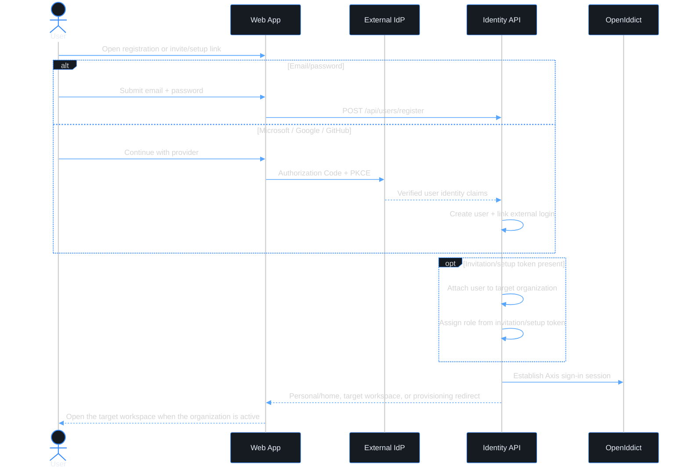

# Use case — Register a user account

> **Navigation**: [← Identity & Access Management](../README.md) · [Use cases index](../README.md#use-cases)

## Purpose

Register my user identity with email/password or Microsoft, Google, or GitHub so that I can use Axis as an individual, or join an organization when I have an invitation/setup link.

## Primary actor

- self-service user
- invited user joining an organization
- first organization owner/admin completing setup after [register-org](../../platform-foundation/register-org/)

## Trigger

- User opens self-service registration, an invitation link, or a first-owner setup link.

## Main flow

1. User opens the registration page. The request may include an organization invitation/setup token, but it does not have to.
2. User chooses email/password or a configured external identity provider.
3. System verifies that the user identity is unique. If an organization token is present, the system also verifies that the user is allowed to join that organization.
4. User accepts any required user-level Terms of Service / Privacy Policy.
5. System creates the user account, links the credential or external login, and starts a sign-in session.
6. If an organization token was present, the system attaches the user to that organization and assigns the role from the invitation/setup token.
7. User lands in their personal/home experience, the target workspace, or the provisioning wait screen for an organization still being set up.

## Alternate / error flows

- Invite/setup token expired or already used: create no organization membership; show a clear message and request a new invite/setup link.
- Email already belongs to another Axis user: show "An account with this email already exists. Sign in instead."
- External provider returns no verified email: stop registration before account creation.
- Provider account is already linked to another user: reject registration and direct the user to sign in.
- Organization is still provisioning: complete user registration, attach the membership, then route to workspace provisioning.

## Context

This use case owns user identity onboarding. Axis is multi-tenant, but an organization is optional for a normal user account: a user can register and use Axis without creating or joining an organization first. Organization membership is added only when registration carries an invitation/setup token, or later through an authenticated join/create-organization flow. Third-party identity providers authenticate an individual user and can be linked to that user account. They do not prove ownership of an organization; organization onboarding remains in [register-org](../../platform-foundation/register-org/).

## Acceptance Criteria

*Happy path*
- [ ] User registration can be started without any organization context.
- [ ] User registration can also be started from an invitation token or first-owner setup token for an organization.
- [ ] User can register with email/password.
- [ ] User can register with Microsoft, Google, or GitHub when the provider is configured ([ADR-027](../../../TECH_STACK.md#adr-027-external-identity-providers-for-user-sign-in-and-registration)).
- [ ] External provider registration requires a verified email claim; unverified or missing email cannot continue.
- [ ] A standalone registration creates a `User` without requiring an organization membership.
- [ ] When an invitation/setup token is present, the resulting `User` is attached to that organization and receives the role from the token.
- [ ] External provider identity is stored as a user external login; it is not stored on the organization.
- [ ] After successful registration, the user is signed in through Axis/OpenIddict and redirected to personal/home, the target workspace, or the provisioning wait screen.

*Validation & errors*
- [ ] Email: required, valid email format, unique across Axis users.
- [ ] Password path: password is required, minimum 15 characters, max 128 characters, and common or predictable passwords are rejected.
- [ ] Password confirmation must match password exactly.
- [ ] External provider path: duplicate provider account is rejected before persistence, not by surfacing a database unique-constraint failure.
- [ ] Token organization mismatch is rejected; a user cannot use an invite/setup token for one organization to join another.
- [ ] Missing organization context is accepted for standalone registration.
- [ ] All field-level errors are shown inline, not as a global toast.
- [ ] If the API returns a server error (5xx), the form shows a generic "Something went wrong, please try again" message and the submit button re-enables.

*Edge cases*
- [ ] Multiple rapid submissions are deduplicated with an idempotency key.
- [ ] Pasting a password with leading/trailing spaces is accepted as-is.
- [ ] A user can later link or unlink external providers only through an authenticated account-management flow.
- [ ] A standalone user can later create or join an organization without re-registering.
- [ ] If the target organization is not active yet, successful organization-linked registration routes to the provisioning wait screen instead of failing.

*Out of scope*
- Creating a new organization; see [register-org](../../platform-foundation/register-org/).
- Enterprise SAML/SCIM federation and per-tenant IdP configuration.
- User invitation creation; see [invite-user](../invite-user/).
- Invitation acceptance details already covered by [accept-invite](../accept-invite/) unless this use case replaces that flow in a future consolidation.
- CAPTCHA / bot protection.

## Wireframes

User registration reuses the auth card system with email/password setup and field-level help text. Organization context is optional and should not be shown as a required field on the default registration screen. External-provider registration remains in the use-case spec, but provider entry points should not appear in the wireframe until that implementation exists.

| Screen | Excalidraw | Preview |
|--------|------------|---------|
| register-user | [source](./register-user.excalidraw) | [preview](./register-user.svg) |

## Diagrams

### register-user-journey

> **Implementation status**
>
> | Layer | Status |
> |-------|--------|
> | Domain | ✅ |
> | Application | ⚠️ |
> | Infrastructure | ⚠️ |
> | API | ✅ |
> | Frontend | ⚠️ |
>
> **Gaps vs spec:** Email/password registration is implemented at `POST /api/users/register`, including standalone registration, idempotency, email verification, and first-user setup-token attachment after organization verification. Remaining gaps are external-provider registration/linking, invitation-token consolidation, and frontend polish for organization-linked post-registration routing.
>
> **Decisions:** Microsoft / Google / GitHub providers belong to user identity only. They can create or link a `UserExternalLogin`; they must never create an organization directly.
