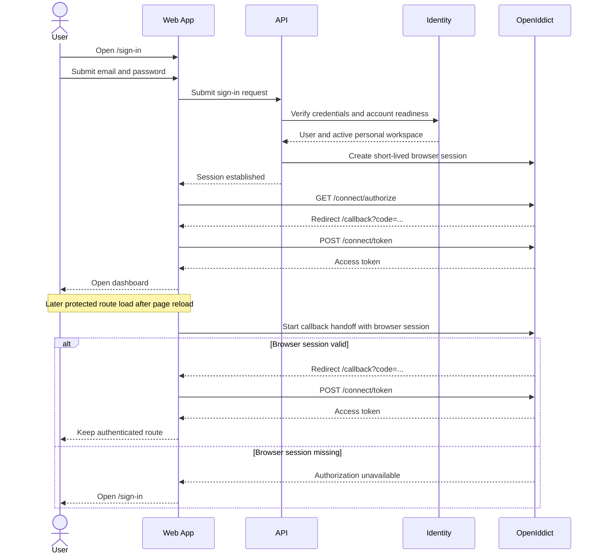

# Sign In To A Standalone User Account

> **Navigation**: [docs/use-cases/identity-access/README.md](./README.md) · [docs/use-cases/README.md](../README.md) · [docs/README.md](../../README.md) · [AGENTS.md](../../../AGENTS.md)

## Purpose

Let a verified standalone Axis Platform user sign in with email/password and reach the account dashboard.

## Primary actor

- Returning standalone user

## Trigger

- User opens `/`, opens `/sign-in`, or an unauthenticated user attempts to open an authenticated Axis Platform route.

## Main flow

1. User opens the sign-in page without any team/setup context.
2. User enters email and password.
3. System validates required fields and email format.
4. System verifies the credentials against the stored password hash.
5. System verifies the account is active, email verified, and has a sign-in-eligible personal workspace.
6. System establishes the short-lived browser authorization session.
7. User completes the existing browser callback, keeps the access token in the frontend memory session, and reaches the dashboard.
8. On a later authenticated route load where the memory session is absent but the browser authorization session remains valid, system restores a new memory access token through the existing callback handoff and keeps the user on the authenticated route.

## Alternate / error flows

- Missing or malformed email/password: show inline field errors.
- Unknown email, wrong password, or inactive account: show a generic account-enumeration-safe error and do not establish a session.
- Correct credentials for an unverified account: show a verification-required state and provide a resend verification action when allowed.
- No sign-in-eligible personal workspace: show a clear non-sensitive account-unavailable state and do not establish a session.
- Rate-limited sign-in or resend attempt: show a clear wait state and disable the affected action while limited.
- Server error during sign-in: show a generic retry message and re-enable the submit button.
- Invalid authorization callback or token exchange failure: show a clear state that lets the user try sign-in again without keeping a stale session.
- Authenticated route load without a valid memory session or browser authorization session: route the user to `/sign-in` without keeping stale local session state.
- Already-authenticated user opens a public Identity Access auth or registration route: route the user to `/dashboard` without showing the public auth or registration screen.
- User opens `/` while no public landing page exists: route by current session state; authenticated or restorable sessions go to `/dashboard`, and unauthenticated sessions go to `/sign-in`.
- Successful technical handoff routes complete before rendering standalone UI; only recoverable error states render a callback screen.

## Acceptance Criteria

*Happy path*
- **AC-001** Sign-in can be started without any team/setup context.
- **AC-002** User can sign in with email and password.
- **AC-003** Sign-in verifies the submitted password against the stored password hash for an active standalone account.
- **AC-004** Sign-in requires the account email to already be verified.
- **AC-005** Sign-in selects the user's active personal workspace as the current workspace for the session.
- **AC-006** Successful sign-in establishes the browser authorization session, completes the callback, keeps the access token in the frontend memory session, and routes the user to the dashboard.
- **AC-007** Unauthenticated access to authenticated Axis Platform routes sends the user to `/sign-in`, while registration remains reachable from the sign-in page.

*Validation & errors*
- **AC-008** Email is required and must be a valid email format.
- **AC-009** Password is required.
- **AC-010** Field-level validation errors are shown inline.
- **AC-011** Unknown email, wrong password, and inactive accounts show the same generic credential error and do not establish a session.
- **AC-012** Correct credentials for an unverified account show a verification-required state with resend available when allowed.
- **AC-013** Resend success, resend failure, and resend rate limiting are clear and account-enumeration-safe.
- **AC-014** A missing or unavailable personal workspace prevents sign-in, shows a clear non-sensitive account-unavailable state, and does not establish a session.
- **AC-015** A 5xx sign-in response shows a generic retry message and re-enables submit.
- **AC-016** Rate-limited sign-in shows a clear wait state and disables submit while limited.
- **AC-017** Invalid callback, state mismatch, or token exchange failure shows a clear retry-sign-in state and clears stale local session data.

*Edge cases*
- **AC-018** Multiple rapid submissions are deduplicated by disabling submit while sign-in or a successful dashboard handoff is pending.
- **AC-019** Email input is trimmed before credential lookup.
- **AC-020** Password input, including leading and trailing spaces, is submitted exactly as entered.
- **AC-021** Sign-in does not create accounts, workspaces, legal acceptances, or verification tokens except when the user explicitly requests verification resend.
- **AC-022** Sign-in, verification-required, and callback journeys provide a recoverable path when the user cannot complete the current step.
- **AC-023** A protected route reload with a valid browser authorization session restores an access token through the existing callback handoff, keeps access tokens out of browser storage, and preserves the requested authenticated route.
- **AC-024** A protected route load without a valid browser authorization session routes to `/sign-in` and clears stale local session state.
- **AC-025** A user with a valid memory access token or browser authorization session who opens `/sign-in`, `/register`, `/register/confirmation`, or `/auth/verify` is routed to `/dashboard` and does not start another public auth, registration, or verification flow.
- **AC-026** A user who opens `/` is routed by the current session state: valid memory access token or browser authorization session reaches `/dashboard` directly, while no valid session reaches `/sign-in`.
- **AC-027** Successful sign-in callback handoffs do not render transient standalone callback pages; callback screens are reserved for recoverable failure states that need user action.

## Acceptance Test Matrix

| ID | Boundary | Scenario | Covers AC | Verification | Required |
|---|---|---|---|---|---|
| AT-001 | Browser journey | Verified standalone user signs in and reaches the dashboard | AC-001, AC-002, AC-003, AC-004, AC-005, AC-006 | Browser automation | Yes |
| AT-002 | Browser journey | Unauthenticated dashboard access routes to sign-in, and sign-in links to registration | AC-007, AC-024 | Browser automation | Yes |
| AT-003 | API boundary | Valid sign-in verifies password hash, active user, verified email, and active personal workspace before establishing a browser authorization session | AC-003, AC-004, AC-005, AC-006 | Application test + API integration test | Yes |
| AT-004 | UI component | Empty form and invalid email render inline field errors | AC-008, AC-009, AC-010 | UI component test | Yes |
| AT-005 | API boundary | Unknown email, wrong password, and inactive account return the same generic credential failure without a session | AC-011 | Application test + API integration test | Yes |
| AT-006 | UI/API boundaries | Unverified account with correct credentials shows verification-required state and resend success, failure, and rate-limited states | AC-012, AC-013 | UI component test + API integration test | Yes |
| AT-007 | API boundary | Missing or unavailable personal workspace prevents session establishment with a non-sensitive account-unavailable error | AC-014 | Application test + API integration test | Yes |
| AT-008 | UI component | 5xx and rate-limited sign-in responses show retry/wait states and restore or disable submit appropriately | AC-015, AC-016 | UI component test | Yes |
| AT-009 | UI component | Invalid callback, state mismatch, and token exchange failure show retry-sign-in state and clear stale local session data | AC-017 | UI component test | Yes |
| AT-010 | UI component | Rapid submissions are deduplicated through sign-in and successful dashboard handoff, email is trimmed, and password whitespace is preserved | AC-018, AC-019, AC-020 | UI component test + Application test | Yes |
| AT-011 | Application boundary | Sign-in does not create accounts, workspaces, legal acceptances, or verification tokens unless resend is explicitly requested | AC-021 | Application test | Yes |
| AT-012 | UI component | Sign-in and callback states expose registration or sign-in escape navigation | AC-022 | UI component test | Yes |
| AT-013 | Browser journey | Authenticated protected route reload restores from the existing browser authorization session and stays on the authenticated route | AC-006, AC-023 | Browser automation + UI component test | Yes |
| AT-014 | Browser journey | Authenticated user opens public auth and registration routes and is routed to the dashboard | AC-025 | Browser automation + UI component test | Yes |
| AT-015 | Browser journey | App root routes by the current session state without showing a guest auth route as an intermediate destination | AC-026 | Browser automation + UI component test | Yes |
| AT-016 | Browser journey | Successful sign-in completes the callback handoff without rendering a transient callback page, while callback failures remain recoverable | AC-017, AC-027 | Browser automation + UI component test | Yes |

## Out Of Scope

- Registering a new account.
- Completing initial email verification after a resend link is opened.
- Dashboard content after successful sign-in.
- Public landing-page content at `/`.

## Screen flow

| Screen | Required contract |
|---|---|
| `/sign-in` | Render an auth-card form with email, password, link to registration, and one submit action. |
| `/sign-in` validation | Show required-field, invalid-email, generic credential, unverified-account, workspace-unavailable, rate-limited, and generic 5xx states inline or in the form alert described by the relevant AC. Keep submit busy and disabled from submit through successful dashboard handoff; re-enable after recoverable sign-in errors except rate-limited. |
| `/sign-in` verification required | Show that email verification is required, allow resend when not limited, and keep resend copy account-enumeration-safe. |
| Callback/dashboard handoff | Reuse the existing browser callback path to exchange the authorization code, keep the access token in memory, and route successful handoffs to `/dashboard` before rendering a standalone callback screen. Render sign-in escape navigation only when callback recovery is needed. |
| Protected route bootstrap | On authenticated routes with no memory access token, try to restore through the existing browser authorization session and callback handoff; continue on success and route to `/sign-in` on failure. |
| Public auth route bootstrap | On public Identity Access auth and registration routes, keep unauthenticated users on the requested public screen, but route users with a valid memory access token or restorable browser authorization session to `/dashboard` before rendering the public flow. |
| App entry bootstrap | On `/`, resolve the current session once and route authenticated or restorable sessions to `/dashboard`; route unauthenticated sessions to `/sign-in` without rendering a public auth screen first. |

Required UI quality: labels must be programmatic, invalid fields must expose invalid state, error/help text must remain associated with the field or form state it describes, recovery actions must be visible and keyboard-reachable, technical success handoffs must not flash standalone intermediate screens or return the primary action to idle before navigation completes, and the screens must use existing auth components and theme tokens.

## Diagrams

### sign-in-user-journey

> **Implementation status**
>
> | Layer | Status |
> |-------|--------|
> | Domain | Done |
> | Application | Done |
> | Infrastructure | Done |
> | API | Done |
> | Frontend | Done |
>
> **Implemented:** The standalone sign-in backend, API, and frontend screens are in place. `POST /api/auth/sign-in` verifies credentials for an active verified user, requires an active personal workspace, establishes the browser authorization session, and reuses the existing callback/dashboard handoff. `/sign-in` owns the returning-user form, validation states, verification-required resend path, generic credential failures, registration link, guest-only route-group redirect behavior, app entry routing from `/`, silent successful callback handoff, and protected-route reload restoration from the existing browser authorization session.
>
> **Gaps vs spec:** N/A.
>
> **Deferred follow-ups:** N/A.
>
> **Verification:** Required AT rows are covered by browser automation, UI component tests, API integration tests, and application tests.
>
> **Decisions:** This use case owns returning-user email/password sign-in for standalone personal workspaces and protected-route session bootstrap from the short-lived browser authorization session. Screen flow owns the product screen contract; Required UI quality owns accessibility and interaction expectations. Access tokens stay in frontend memory and are not persisted to browser storage. Successful sign-in reuses the existing browser callback and dashboard handoff, but technical success handoffs complete silently before rendering standalone callback UI. Sign-in failures keep account-enumeration-safe copy at the credential boundary; unverified accounts and unavailable workspaces use specific non-sensitive states without establishing a session. Public auth screens must expose an escape navigation link instead of relying on browser history. Guest-only auth and registration screens inherit redirect behavior from the guest-only route group instead of declaring per-route guards. Until a public landing page exists, `/` is an app entry bootstrap that routes from the current session state instead of rendering a standalone screen.
