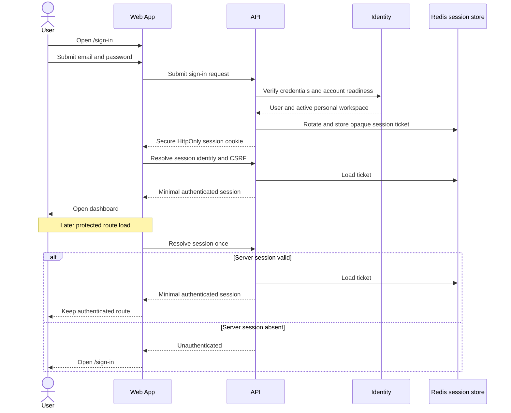

# Sign In To A Standalone User Account

> **Navigation**: [docs/use-cases/identity-access/README.md](./README.md) · [docs/use-cases/README.md](../README.md) · [docs/README.md](../../README.md) · [AGENTS.md](../../../AGENTS.md)

## Purpose

Let a verified standalone Axis Platform user sign in with email/password and reach the account dashboard.

## Primary actor

- Returning standalone user

## Trigger

- User opens `/`, opens `/sign-in`, or an unauthenticated user attempts to open an authenticated Axis Platform route.

## Main flow

1. User opens the sign-in page without any team/setup context.
2. User enters email and password.
3. System validates required fields and email format.
4. System verifies the credentials against the stored password hash.
5. System verifies the account is active, email verified, and has a sign-in-eligible personal workspace.
6. System rotates and establishes an opaque same-origin server session whose identity and ticket remain in the Axis Redis session store.
7. Browser receives only the Secure, HttpOnly, host-only session cookie; the frontend resolves authenticated identity and CSRF material through the session bootstrap and reaches the dashboard without an OAuth callback or bearer token.
8. On a later route load, system resolves the same server session once and either restores the authenticated route or routes the unauthenticated user to sign-in without creating browser auth artifacts.

## Alternate / error flows

- Missing or malformed email/password: show inline field errors.
- Unknown email, wrong password, or inactive account: show a generic account-enumeration-safe error and do not establish a session.
- Correct credentials for an unverified account: show a verification-required state and provide a resend verification action when allowed.
- No sign-in-eligible personal workspace: show a clear non-sensitive account-unavailable state and do not establish a session.
- Rate-limited sign-in or resend attempt: show a clear wait state and disable the affected action while limited.
- Server error during sign-in: show a generic retry message and re-enable the submit button.
- Missing, expired, invalid, or unavailable server session: fail closed, clear the opaque cookie when possible, and route to `/sign-in` without stale authenticated cache state.
- Already-authenticated user opens a public Identity Access auth or registration route: route the user to `/dashboard` without showing the public auth or registration screen.
- User opens `/` while no public landing page exists: route by current session state; authenticated or restorable sessions go to `/dashboard`, and unauthenticated sessions go to `/sign-in`.
- Redis or session-store failure: do not create or infer a session; expose a generic retryable unavailable state without credentials, ticket identifiers, or account data.

## Acceptance Criteria

*Happy path*
- **AC-001** Sign-in can be started without any team/setup context.
- **AC-002** User can sign in with email and password.
- **AC-003** Sign-in verifies the submitted password against the stored password hash for an active standalone account.
- **AC-004** Sign-in requires the account email to already be verified.
- **AC-005** Sign-in selects the user's active personal workspace as the current workspace for the session.
- **AC-006** Successful sign-in rotates and establishes an opaque Redis-backed same-origin server session, returns no OAuth token or authorization artifact to browser code, resolves authenticated identity plus CSRF material through session bootstrap, and routes the user to the dashboard.
- **AC-007** Unauthenticated access to authenticated Axis Platform routes sends the user to `/sign-in`, while registration remains reachable from the sign-in page.

*Validation & errors*
- **AC-008** Email is required and must be a valid email format.
- **AC-009** Password is required.
- **AC-010** Field-level validation errors are shown inline.
- **AC-011** Unknown email, wrong password, and inactive accounts show the same generic credential error and do not establish a session.
- **AC-012** Correct credentials for an unverified account show a verification-required state with resend available when allowed.
- **AC-013** Resend success, resend failure, and resend rate limiting are clear and account-enumeration-safe.
- **AC-014** A missing or unavailable personal workspace prevents sign-in, shows a clear non-sensitive account-unavailable state, and does not establish a session.
- **AC-015** A 5xx sign-in response shows a generic retry message and re-enables submit.
- **AC-016** Rate-limited sign-in shows a clear wait state and disables submit while limited.
- **AC-017** Missing, expired, invalid, or unavailable server session fails closed, clears stale authenticated cache state, and shows sign-in or a generic retryable unavailable state without leaking session details.

*Edge cases*
- **AC-018** Multiple rapid submissions are deduplicated by disabling submit while sign-in or a successful dashboard handoff is pending.
- **AC-019** Email input is trimmed before credential lookup.
- **AC-020** Password input, including leading and trailing spaces, is submitted exactly as entered.
- **AC-021** Sign-in does not create accounts, workspaces, legal acceptances, or verification tokens except when the user explicitly requests verification resend.
- **AC-022** Sign-in, verification-required, and callback journeys provide a recoverable path when the user cannot complete the current step.
- **AC-023** A protected route reload with a valid opaque server session restores identity through one session bootstrap, preserves the requested route, and never starts OAuth or exposes a bearer token.
- **AC-024** A protected route load without a valid server session routes to `/sign-in` and clears stale authenticated cache state.
- **AC-025** A user with a valid server session who opens `/sign-in`, `/register`, `/register/confirmation`, or `/auth/verify` is routed to `/dashboard` without starting another public flow.
- **AC-026** A user who opens `/` is routed by one server-session bootstrap: valid session reaches `/dashboard`, while no valid session reaches `/sign-in`.
- **AC-027** Session establishment and bootstrap do not render a transient callback page or place codes, tokens, ticket identifiers, or secrets in browser-visible state.
- **AC-028** Browser intent preloads do not authenticate, refresh, or mutate session state; session bootstrap is an explicit once-per-entry read.
- **AC-029** Cookie-authenticated unsafe API requests require valid antiforgery evidence, while bearer-authenticated public API clients remain independent of the browser cookie and antiforgery contract.
- **AC-030** Session cookies are Secure, HttpOnly, SameSite=Lax, host-only, path `/`, contain only an opaque identifier, and obey validated idle and absolute lifetimes without sticky-session dependence.

## Acceptance Test Matrix

| ID | Boundary | Scenario | Covers AC | Verification | Required |
|---|---|---|---|---|---|
| AT-001 | Browser journey | Verified standalone user signs in and reaches the dashboard | AC-001, AC-002, AC-003, AC-004, AC-005, AC-006 | Browser automation | Yes |
| AT-002 | Browser journey | Unauthenticated dashboard access resolves the absent browser session once, routes to sign-in, links to registration, and keeps guest-route preloads free of authorization work | AC-007, AC-024, AC-028 | Browser automation + UI component test | Yes |
| AT-003 | API boundary | Valid sign-in verifies password hash, active user, verified email, and active personal workspace before establishing the opaque server session | AC-003, AC-004, AC-005, AC-006 | Application test + API integration test | Yes |
| AT-004 | UI component | Empty form and invalid email render inline field errors | AC-008, AC-009, AC-010 | UI component test | Yes |
| AT-005 | API boundary | Unknown email, wrong password, and inactive account return the same generic credential failure without a session | AC-011 | Application test + API integration test | Yes |
| AT-006 | UI/API boundaries | Unverified account with correct credentials shows one verification-required warning followed by a separate inline resend prompt and action, with clear success, failure, and rate-limited feedback directly below the action row | AC-012, AC-013 | Browser automation + UI component test + API integration test | Yes |
| AT-007 | API boundary | Missing or unavailable personal workspace prevents session establishment with a non-sensitive account-unavailable error | AC-014 | Application test + API integration test | Yes |
| AT-008 | UI component | 5xx and rate-limited sign-in responses show retry/wait states and restore or disable submit appropriately | AC-015, AC-016 | UI component test | Yes |
| AT-009 | UI/API boundaries | Missing, expired, invalid, and unavailable Redis sessions fail closed, clear stale authenticated state, and expose only recoverable non-sensitive errors | AC-017, AC-030 | UI component test + API integration test | Yes |
| AT-010 | UI component | Rapid submissions are deduplicated through sign-in and successful dashboard handoff, email is trimmed, and password whitespace is preserved | AC-018, AC-019, AC-020 | UI component test + Application test | Yes |
| AT-011 | Application boundary | Sign-in does not create accounts, workspaces, legal acceptances, or verification tokens unless resend is explicitly requested | AC-021 | Application test | Yes |
| AT-012 | UI component | Sign-in and callback states expose registration or sign-in escape navigation | AC-022 | UI component test | Yes |
| AT-013 | Browser journey | Authenticated protected-route reload restores from the opaque server session and stays on the requested route without an OAuth callback or browser bearer token | AC-006, AC-023, AC-027 | Browser automation + UI component test | Yes |
| AT-014 | Browser journey | Authenticated user opens public auth and registration routes and is routed to the dashboard | AC-025 | Browser automation + UI component test | Yes |
| AT-015 | Browser journey | App root resolves the server session once and routes without a guest auth hop, OAuth request, or failed authorization resource | AC-026, AC-028 | Browser automation + UI component test | Yes |
| AT-016 | API boundary | Sign-in rotates an opaque cookie with exact flags, returns no auth artifact, and CSRF protects cookie-authenticated unsafe calls without changing bearer-client behavior | AC-006, AC-027, AC-029, AC-030 | API integration test + Browser automation | Yes |

## Out Of Scope

- Registering a new account.
- Completing initial email verification after a resend link is opened.
- Dashboard content after successful sign-in.
- Public landing-page content at `/`.

## Screen flow

| Screen | Required contract |
|---|---|
| `/sign-in` | Render an auth-card form with email, password, link to registration, and one submit action. |
| `/sign-in` validation | Show required-field, invalid-email, generic credential, unverified-account, workspace-unavailable, rate-limited, and generic 5xx states inline or in the form alert described by the relevant AC. Keep submit busy and disabled from submit through successful dashboard handoff; re-enable after recoverable sign-in errors except rate-limited. |
| `/sign-in` verification required | Show one warning notice that explains email verification is required and remains a warning until verification completes. Immediately below the notice, show the established inline resend prompt and link-action pattern; expose sending on the action, place live success/error/rate-limited feedback directly below that row, use the success semantic for successful delivery, and keep resend copy account-enumeration-safe. |
| Session/dashboard handoff | After sign-in, resolve the opaque server session and route to `/dashboard` without an OAuth callback, token exchange, or transient handoff screen. |
| Protected route bootstrap | On authenticated-route navigation, resolve the server session once; continue on success and route to `/sign-in` when absent. Route preloads do not authenticate or mutate the session. |
| Public auth route bootstrap | Keep unauthenticated users on the requested public screen, but route users with a valid server session to `/dashboard` before rendering the public flow. Route preloads do not authenticate or mutate the session. |
| App entry bootstrap | On `/`, resolve the current session once and route authenticated or restorable sessions to `/dashboard`; route unauthenticated sessions to `/sign-in` without rendering a public auth screen first or treating the expected missing browser session as a failed resource. |

Required UI quality: labels must be programmatic, invalid fields must expose invalid state, error/help text must remain associated with the field or form state it describes, recovery actions must be visible and keyboard-reachable, technical success handoffs must not flash standalone intermediate screens or return the primary action to idle before navigation completes, intent preloads must not initiate browser authorization or create failed-resource console noise, and the screens must use existing auth components and theme tokens.

## Diagrams

### sign-in-user-journey

```mermaid
sequenceDiagram
  actor User
  participant Web as Web App
  participant API as API
  participant Identity as Identity
  participant Session as Redis session store

  User->>Web: Open /sign-in
  User->>Web: Submit email and password
  Web->>API: Submit sign-in request
  API->>Identity: Verify credentials and account readiness
  Identity-->>API: User and active personal workspace
  API->>Session: Rotate and store opaque session ticket
  API-->>Web: Secure HttpOnly session cookie
  Web->>API: Resolve session identity and CSRF
  API->>Session: Load ticket
  API-->>Web: Minimal authenticated session
  Web-->>User: Open dashboard

  Note over User,Web: Later protected route load
  Web->>API: Resolve session once
  alt Server session valid
    API->>Session: Load ticket
    API-->>Web: Minimal authenticated session
    Web-->>User: Keep authenticated route
  else Server session absent
    API-->>Web: Unauthenticated
    Web-->>User: Open /sign-in
  end
```

> **Implementation status**
>
> | Layer | Status |
> |-------|--------|
> | Domain | Done |
> | Application | Done |
> | Infrastructure | Done |
> | API | Done |
> | Frontend | Done |
>
> **Implemented:** Credential, account-readiness, workspace, sign-in form, verification-required, resend, route-intent, opaque Redis session bootstrap/rotation, antiforgery, cookie/bearer selection, protected-route restore, and retryable unavailable-session behavior are implemented without the retired browser PKCE/memory-token path.
>
> **Gaps vs spec:** None.
>
> **Deferred follow-ups:** N/A.
>
> **Verification:** See [sign-in-user.evidence.md](./sign-in-user.evidence.md) for every required AT. Reauthentication additionally proves opaque session rotation: the prior cookie receives `401` and the replacement cookie authenticates.
>
> **Decisions:** This use case owns returning-user email/password sign-in and the Axis same-origin opaque server-session bootstrap. OAuth remains for native and confidential external clients, never the Axis browser. Screen flow owns the product experience; required UI quality owns accessibility. Sign-in failures remain account-enumeration-safe; unverified accounts and unavailable workspaces use specific non-sensitive states without establishing a session. Cookie and bearer authentication are explicit independent boundaries, cookie mutations require antiforgery, and no browser compatibility path survives the cutover.
