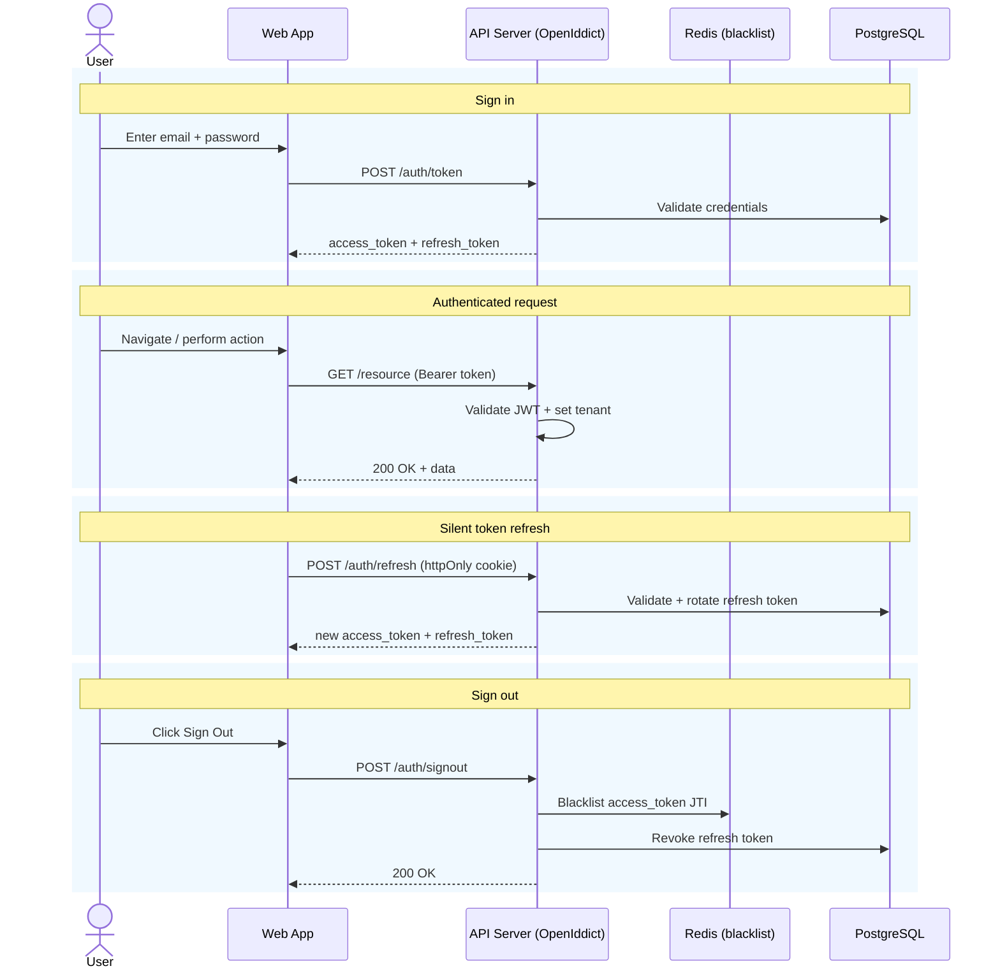

# Use case — Sign in to the workspace

> **Navigation**: [← Identity Access](../README.md) · [Use cases index](../README.md#use-cases)

## Purpose

Sign in with my email and password — or with Microsoft, Google, or GitHub — so that I can access my organization's workspace.

## Primary actor

- user

## Trigger

- User initiates: sign in with my email and password

## Main flow

1. Actor satisfies the trigger.
2. System performs the happy-path steps in Acceptance Criteria.
3. Actor receives the expected outcome.

## Alternate / error flows

- Validation failures and edge cases in Acceptance Criteria.

## Context

Secure sign-in and sign-out flows using JWT access tokens and opaque refresh tokens. Built on OpenIddict, fully self-hosted.

## Acceptance Criteria

*Happy path*
- [ ] Sign-in form accepts email and password.
- [ ] On success, the client receives an access token (JWT, 15-min TTL) stored in memory and a refresh token (7-day TTL) stored in an `httpOnly`, `Secure`, `SameSite=Strict` cookie.
- [ ] User is redirected to their workspace dashboard.

*Validation & errors*
- [ ] Empty email or password: inline field errors, form does not submit.
- [ ] Invalid credentials: generic message "Incorrect email or password" (no indication of which field is wrong).
- [ ] After 5 consecutive failed sign-in attempts within 15 minutes, the account is temporarily locked for 15 minutes. Subsequent attempts show "Too many failed attempts. Try again after [time]."
- [ ] Signing in to an unverified account: "Please verify your email before signing in." with a resend link.
- [ ] Signing in to a deactivated account: "Your account has been deactivated. Contact your organization admin."
- [ ] Server error (5xx): "Something went wrong. Please try again." — the password field is cleared, email retained.

*External identity providers*
- [ ] Sign-in page offers **Microsoft**, **Google**, and **GitHub** buttons alongside the email/password form ([ADR-027](../../../TECH_STACK.md#adr-027-external-identity-providers-for-sign-in-and-registration)).
- [ ] Selecting a provider runs the OAuth2 Authorization Code + PKCE flow through OpenIddict; on return, Axis mints its own access + refresh tokens (the external token is never exposed to the client).
- [ ] A provider login whose verified email matches an existing user attaches to that account rather than creating a duplicate (account linking by verified email).
- [ ] A provider login with no matching account and no pending invitation is rejected with "No account found. Ask your organization admin for an invitation." (provider sign-up happens only through the register-org flow).
- [ ] If the provider returns no verified email, sign-in is rejected with "Your <provider> account has no verified email; use email and password instead."
- [ ] A disabled provider (not configured for this deployment) is not shown.

*Edge cases*
- [ ] Signing in on a new browser while already signed in on another does not invalidate the existing session.
- [ ] Email lookup is case-insensitive (`User@Example.com` matches `user@example.com`).
- [ ] Pasting credentials from a password manager works correctly (no interference with autocomplete).
- [ ] Pressing Enter in the password field submits the form.

*Out of scope*
- 2FA / MFA (TOTP or WebAuthn).
- Enterprise SSO federation (SAML, SCIM provisioning, per-tenant IdP) — separate initiative, see [ADR-027](../../../TECH_STACK.md#adr-027-external-identity-providers-for-sign-in-and-registration).

> **Implementation status**
>
> | Layer | Status |
> |-------|--------|
> | Domain | ✅ |
> | Application | ⚠️ |
> | Infrastructure | ⚠️ |
> | API | ⚠️ |
> | Frontend | ⚠️ |
>
> **Gaps vs spec:** Email/password sign-in (login page + PKCE flow + app shell/dashboard scaffold) on PR #50 branch. **External identity providers (Microsoft/Google/GitHub, ADR-027) are spec'd but not yet implemented** — no provider registration in OpenIddict, no account-linking handler, no provider buttons on the sign-in page. BroadcastChannel multi-tab refresh, account lockout UI, and unverified-email screen polish also pending.
>
> **Deferred (PR #146 follow-up):** 2FA/MFA (TOTP or WebAuthn); enterprise SAML/SCIM federation and per-tenant IdP (ADR-027 enterprise scope).
>
> **Decisions:**
> - OpenIddict 5.x serves as the in-process OAuth2/OIDC server. `AuthenticateUserCommand` validates credentials
> - `/connect/login` sets a 5-min httpOnly session cookie
> - `/connect/authorize` issues the authorization code
> - `/connect/token` exchanges it for access + refresh tokens. Refresh token stored as an opaque reference in DB (OpenIddict `OpenIddictTokens` table) and delivered as an httpOnly `Secure SameSite=Strict` cookie at `/connect` path via `ApplyRefreshTokenCookieHandler`.

## Wireframes

| Screen | Excalidraw | Preview |
|--------|------------|---------|
| N/A | N/A | N/A |

## Diagrams

### auth-flow

