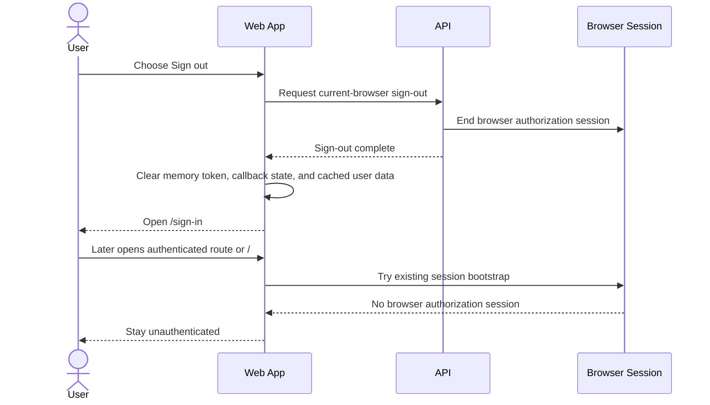

# Sign Out Of A Standalone User Account

> **Navigation**: [docs/use-cases/identity-access/README.md](./README.md) · [docs/use-cases/README.md](../README.md) · [docs/README.md](../../README.md) · [AGENTS.md](../../../AGENTS.md)

## Purpose

Let an authenticated standalone Axis Platform user end account access for the current browser and return to sign-in without being silently restored by the browser authorization session.

## Primary actor

- Authenticated standalone user

## Trigger

- User chooses Sign out from the authenticated app shell account menu.

## Main flow

1. User opens the authenticated app shell account menu.
2. User chooses Sign out.
3. System prevents duplicate sign-out submissions while the request is pending.
4. System ends the short-lived browser authorization session for the current browser.
5. System clears the frontend memory access token, pending browser callback handoff state, and authenticated cached user data.
6. System routes the user to `/sign-in`.
7. On a later authenticated route load, public auth route load, or app entry load from `/`, system treats the current browser as unauthenticated and does not restore the user to `/dashboard` from the ended browser authorization session.

## Alternate / error flows

- Browser authorization session is already absent or expired: sign-out still succeeds, clears local session state, and routes to `/sign-in`.
- Sign-out request fails before the browser authorization session is ended: keep the current authenticated session active, show a recoverable retry state, and do not present sign-out as complete.
- Unauthenticated user: no authenticated app shell account menu is available.

## Acceptance Criteria

*Happy path*
- **AC-001** Sign-out can be started from the authenticated app shell account menu.
- **AC-002** Successful sign-out ends the current browser authorization session.
- **AC-003** Successful sign-out clears the frontend memory access token, pending browser callback handoff state, and authenticated cached user data.
- **AC-004** Successful sign-out routes the user to `/sign-in`.
- **AC-005** After successful sign-out, authenticated route loads, public auth route loads, and app entry loads treat the browser as unauthenticated and do not restore the user to `/dashboard`.

*Validation & errors*
- **AC-006** The sign-out action is not available from unauthenticated routes.
- **AC-007** Duplicate sign-out submissions are prevented while sign-out is pending.
- **AC-008** If the sign-out request fails before the browser authorization session is ended, the user sees a retryable failure state and the current authenticated session is not cleared as completed sign-out.
- **AC-009** If the browser authorization session is already absent or expired, sign-out still succeeds locally and routes to `/sign-in`.

*Edge cases*
- **AC-010** Sign-out affects only the current browser session and does not sign out other devices or browsers.
- **AC-011** Sign-out does not create, update, or delete Identity domain records.
- **AC-012** Previously issued short-lived access tokens are not persisted by the frontend after sign-out.

## Acceptance Test Matrix

| ID | Boundary | Scenario | Covers AC | Verification | Required |
|---|---|---|---|---|---|
| AT-001 | Browser journey | Authenticated user signs out from the app shell, reaches sign-in, and cannot restore the dashboard from the ended browser authorization session | AC-001, AC-002, AC-003, AC-004, AC-005 | Browser automation | Yes |
| AT-002 | API boundary | Sign-out ends the current browser authorization session and succeeds when the browser session is already absent | AC-002, AC-009, AC-010, AC-011 | API integration test | Yes |
| AT-003 | UI component | Sign-out clears local memory session, pending callback state, and authenticated cached user data after the server session is ended | AC-003, AC-004, AC-012 | UI component test | Yes |
| AT-004 | UI component | Pending sign-out prevents duplicate submissions | AC-007 | UI component test | Yes |
| AT-005 | UI component | Failed sign-out shows a retryable state and keeps the authenticated session active | AC-008 | UI component test | Yes |
| AT-006 | Browser journey | Unauthenticated routes do not expose the authenticated app shell sign-out action | AC-006 | Browser automation | Yes |

## Out Of Scope

- Signing out from every device or browser.
- Revoking already issued short-lived access tokens server-side.
- Registering, signing in, or verifying an account.
- Dashboard content after sign-out.

## Screen flow

| Screen | Required contract |
|---|---|
| Authenticated app shell account menu | Show the existing account menu with a Sign out action only inside authenticated routes. |
| Sign-out pending | Keep the Sign out action visibly busy or disabled while the request that ends the browser authorization session is pending. |
| Sign-out success | Clear local session state and route to `/sign-in` without rendering a standalone success page. |
| Sign-out failure | Keep the user in the authenticated app shell, preserve the active session, and show a concise retryable failure state. |
| Post-sign-out bootstrap | Authenticated route loads, public auth route loads, and `/` use the existing session bootstrap rules, but no browser authorization session remains to restore the user after successful sign-out. |

Required UI quality: the Sign out action must be keyboard-reachable, expose its pending/disabled state programmatically, keep retry copy visible near the action that failed, and use existing app shell and design-system controls.

## Diagrams

### sign-out-user-journey

> **Implementation status**
>
> | Layer | Status |
> |-------|--------|
> | Domain | N/A |
> | Application | N/A |
> | Infrastructure | N/A |
> | API | Done |
> | Frontend | Done |
>
> **Implemented:** The authenticated app shell exposes a Sign out action that ends the current browser authorization session through `POST /api/auth/sign-out`, prevents duplicate pending submissions, clears the frontend memory access token, pending callback state, and authenticated cached user data after the server session is ended, routes to `/sign-in`, and keeps the authenticated session active with retryable copy if the sign-out request fails.
>
> **Gaps vs spec:** N/A.
>
> **Deferred follow-ups:** N/A.
>
> **Verification:** Required AT rows are covered by browser automation, UI component tests, and API integration tests.
>
> **Decisions:** This use case owns current-browser sign-out for standalone users. Sign-out ends the browser authorization session used by the sign-in restore flow and clears frontend-only session state, but it does not own global device sign-out or server-side revocation of already issued short-lived access tokens. Domain, Application, and Infrastructure are N/A because sign-out does not create, update, or delete Identity domain records.
