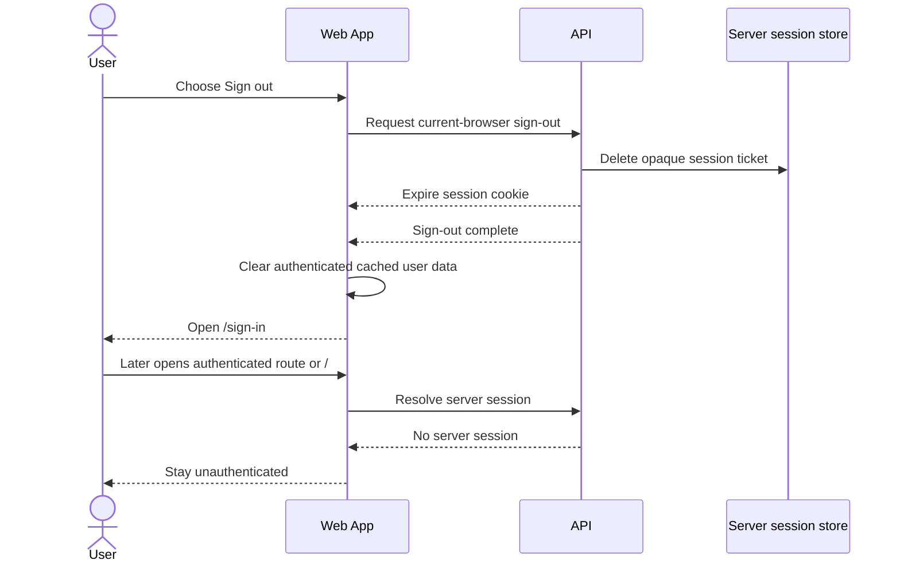

# Sign Out Of A Standalone User Account

> **Navigation**: [docs/use-cases/identity-access/README.md](./README.md) · [docs/use-cases/README.md](../README.md) · [docs/README.md](../../README.md) · [AGENTS.md](../../../AGENTS.md)

## Purpose

Let an authenticated standalone Axis Platform user delete the current opaque server session and return to sign-in without being silently restored.

## Primary actor

- Authenticated standalone user

## Preconditions

- The browser has an authenticated Axis session or a stale session cookie requiring cleanup.

## Trigger

- User chooses Sign out from the authenticated app shell account menu.

## Success guarantee

- The current server-session ticket and browser cookie are invalidated, authenticated client state is cleared, and later bootstrap remains unauthenticated.

## Minimal guarantee

- A failure before server deletion preserves the current authenticated session and reports retryable failure instead of presenting a false sign-out.

## Main flow

1. User opens the authenticated app shell account menu.
2. User chooses Sign out.
3. System prevents duplicate sign-out submissions while the request is pending.
4. System removes the opaque Axis server-session ticket and expires its host-only cookie for the current browser.
5. System clears authenticated frontend cache data; no frontend token or callback state exists.
6. System routes the user to `/sign-in`.
7. On a later authenticated route load, public auth route load, or app entry load from `/`, session bootstrap treats the browser as unauthenticated and cannot restore the deleted session.

## Alternate / error flows

- Server session is already absent or expired: sign-out still expires the cookie, clears local authenticated state, and routes to `/sign-in`.
- Sign-out request fails before the server ticket is deleted: keep the current authenticated session active, show a recoverable retry state, and do not present sign-out as complete.
- Unauthenticated user: no authenticated app shell account menu is available.

## Acceptance Criteria

*Happy path*
- **AC-001** Sign-out can be started from the authenticated app shell account menu.
- **AC-002** Successful sign-out deletes the current opaque server-session ticket and expires its host-only cookie.
- **AC-003** Successful sign-out clears authenticated frontend cache data; no frontend bearer or callback state is maintained.
- **AC-004** Successful sign-out routes the user to `/sign-in`.
- **AC-005** After successful sign-out, authenticated route loads, public auth route loads, and app entry loads treat the browser as unauthenticated and do not restore the user to `/dashboard`.

*Validation & errors*
- **AC-006** The sign-out action is not available from unauthenticated routes.
- **AC-007** Duplicate sign-out submissions are prevented while sign-out is pending.
- **AC-008** If the sign-out request fails before the server ticket is deleted, the user sees a retryable failure state and the current authenticated session is not cleared as completed sign-out.
- **AC-009** If the server session is already absent or expired, sign-out still expires the cookie, succeeds locally, and routes to `/sign-in`.

*Edge cases*
- **AC-010** Sign-out affects only the current browser session and does not sign out other devices or browsers.
- **AC-011** Sign-out does not create, update, or delete Identity domain records.
- **AC-012** Sign-out requires valid antiforgery evidence when a cookie session exists and returns no ticket identifier, token, or secret.

## Acceptance Test Matrix

| ID | Boundary | Scenario | Covers AC | Verification | Required |
|---|---|---|---|---|---|
| AT-001 | Browser journey | Authenticated user signs out from the app shell, reaches sign-in, and cannot restore the dashboard from the deleted server session | AC-001, AC-002, AC-003, AC-004, AC-005 | Browser automation | Yes |
| AT-002 | API boundary | Sign-out validates antiforgery, deletes only the current opaque server ticket, expires the exact cookie, and remains idempotent when the session is absent | AC-002, AC-009, AC-010, AC-011, AC-012 | API integration test | Yes |
| AT-003 | UI component | Sign-out clears authenticated cached user data only after the server session ends and keeps no browser auth artifacts | AC-003, AC-004 | UI component test | Yes |
| AT-004 | UI component | Pending sign-out prevents duplicate submissions | AC-007 | UI component test | Yes |
| AT-005 | UI component | Failed sign-out shows a retryable state and keeps the authenticated session active | AC-008 | UI component test | Yes |
| AT-006 | Browser journey | Unauthenticated routes do not expose the authenticated app shell sign-out action | AC-006 | Browser automation | Yes |

## Out Of Scope

- Signing out from every device or browser.
- Revoking already issued short-lived access tokens server-side.
- Registering, signing in, or verifying an account.
- Dashboard content after sign-out.

## Screen flow

| Screen | Required contract |
|---|---|
| Authenticated app shell account menu | Show the existing account menu with a Sign out action only inside authenticated routes. |
| Sign-out pending | Keep the Sign out action visibly busy or disabled while server-session deletion is pending. |
| Sign-out success | Clear local session state and route to `/sign-in` without rendering a standalone success page. |
| Sign-out failure | Keep the user in the authenticated app shell, preserve the active session, and show a concise retryable failure state. |
| Post-sign-out bootstrap | Authenticated route loads, public auth route loads, and `/` use the server-session bootstrap rules, but no current-browser ticket remains after successful sign-out. |

Required UI quality: the Sign out action must be keyboard-reachable, expose its pending/disabled state programmatically, keep retry copy visible near the action that failed, and use existing app shell and design-system controls.

## Diagrams

### sign-out-user-journey

```mermaid
sequenceDiagram
  actor User
  participant Web as Web App
  participant API as API
  participant Session as Server session store

  User->>Web: Choose Sign out
  Web->>API: Request current-browser sign-out
  API->>Session: Delete opaque session ticket
  API-->>Web: Expire session cookie
  API-->>Web: Sign-out complete
  Web->>Web: Clear authenticated cached user data
  Web-->>User: Open /sign-in

  User->>Web: Later opens authenticated route or /
  Web->>API: Resolve server session
  API-->>Web: No server session
  Web-->>User: Stay unauthenticated
```

> **Implementation status**
>
> | Layer | Status |
> |-------|--------|
> | Domain | N/A |
> | Application | N/A |
> | Infrastructure | Done |
> | API | Done |
> | Frontend | Done |
>
> **Implemented:** The app-shell action, pending/retry behavior, route transition, antiforgery-protected idempotent endpoint, exact opaque-cookie expiry, and Redis ticket deletion are implemented without the retired browser token/callback cleanup path.
>
> **Gaps vs spec:** None.
>
> **Deferred follow-ups:** N/A.
>
> **Verification:** See [sign-out-user.evidence.md](./sign-out-user.evidence.md) for the browser, API, and UI proof covering every required AT.
>
> **Decisions:** This use case owns current-browser sign-out behavior. [Identity Access architecture](../../architecture/identity-access.md#browser-session-realization) owns session realization. The action affects only the current ticket and cookie, not other devices or confidential product-BFF sessions; Product BFF logout and refresh-token revocation are owned by [docs/use-cases/solutions/provision-reference-solution.md](../solutions/provision-reference-solution.md).
