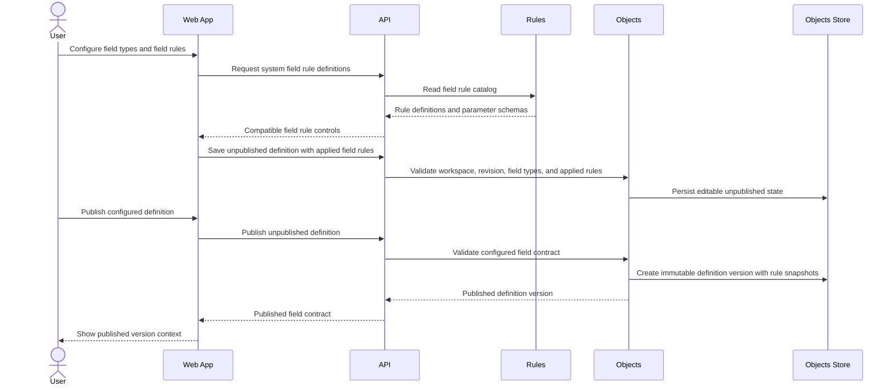

# Configure Field Rules

> **Navigation**: [docs/use-cases/objects/README.md](./README.md) · [docs/use-cases/README.md](../README.md) · [docs/README.md](../../README.md) · [AGENTS.md](../../../AGENTS.md)

## Purpose

Let a signed-in workspace user configure supported field types and system field rules on an unpublished business object definition so published versions carry a stable field contract for future records.

## Primary actor

- Signed-in workspace user

## Trigger

- User edits fields on an unpublished business object definition in the current workspace.
- User prepares to publish an unpublished business object definition that has field configuration.

## Main flow

1. User opens an unpublished business object definition in the current workspace.
2. System shows each unpublished field with its stable field key, label, field type, ordering, and applied field rule summary.
3. User chooses a supported field type for each unpublished field.
4. System uses the Rules catalog to show system field rules compatible with the selected field type.
5. User applies supported field rules and enters required rule parameters.
6. System validates field identity, field type, rule definition key, field-rule compatibility, rule parameters, workspace scope, and the user's last-seen revision.
7. System saves the editable unpublished definition and returns the current revision with the configured field types and field rules.
8. User reviews the unpublished definition before publication.
9. User publishes the unpublished definition using the current revision.
10. System creates an immutable published object definition version that preserves each field's stable identity, type, ordering, label, and applied field rule snapshots.

## Alternate / error flows

- Unsupported field type: reject the save or publish action with a field-type error.
- Unknown field rule definition key: reject the save or publish action with a rule-definition error.
- Field rule incompatible with the selected field type: reject the save or publish action with a rule compatibility error.
- Missing or malformed rule parameter: reject the save or publish action with a parameter-specific error.
- Range rule with a lower bound greater than its upper bound: reject the save or publish action.
- Length rule with a negative length or minimum length greater than maximum length: reject the save or publish action.
- Pattern rule with an invalid or unsupported pattern: reject the save or publish action without evaluating record data.
- Single-select field with no options or duplicate option values: reject the save or publish action.
- Concurrent publish or stale save: reject the stale operation without overwriting the newer unpublished state or published version.
- Missing or unavailable workspace scope: reject the operation without creating, changing, or revealing object definitions.
- Cross-workspace definition access: return a not-found style outcome instead of revealing that another workspace owns the definition.

## Acceptance Criteria

*Happy path*
- **AC-001** User can choose a supported field type for each unpublished field before publication; supported types for this use case are text, integer, decimal, date, boolean, and single-select.
- **AC-002** User can apply system field rules supported by the selected field type before publication.
- **AC-003** Supported system field rules are required value, numeric range, date range, text length, text pattern, and single-select options.
- **AC-004** Each applied field rule stores the Rules-owned definition key and canonical parameter values rather than a hard-coded Objects enum or per-rule nullable columns.
- **AC-005** Saving field type and field rule changes preserves stable field keys, labels, ordering, and field identities while returning the current revision required by later save and publish attempts.
- **AC-006** Publishing a valid unpublished definition creates an immutable published object definition version that preserves each field's type and applied field rule snapshots.
- **AC-007** Published field rule contracts are stored as definition-keyed configuration that a later record-validation use case can consume without treating the unpublished definition as a record contract.

*Validation & errors*
- **AC-008** Unsupported field types, unknown rule definitions, and field rules incompatible with the selected field type are rejected before persistence.
- **AC-009** Rule parameters are required, typed, and validated before persistence, including range bounds, text lengths, text patterns, and single-select option values.
- **AC-010** Publication is blocked when any field type or rule configuration is invalid, while the unpublished definition remains editable.
- **AC-011** Stale unpublished changes and concurrent publish attempts fail without silently overwriting newer field type or rule state.
- **AC-012** System field rules cannot depend on another field, actor role, workflow state, external data, or expression language in this use case.

*Edge cases*
- **AC-013** An authenticated current workspace scope is required to save, publish, list, or load configured field rules; missing or unavailable workspace scope is rejected without mutation.
- **AC-014** Field rules are isolated by workspace through their owning object definition; users cannot create, publish, list, load, or mutate configured rules outside the current workspace scope.
- **AC-015** The Objects module owns object definition fields and applied field rule snapshots; the Rules module owns reusable rule definitions and parameter schemas; Identity owns user, session, and workspace lifecycle.
- **AC-016** This use case does not create, import, edit, list, delete, or validate business object records.
- **AC-017** This use case does not introduce user-authored custom rule definitions, expression DSL evaluation, object-level rules, lifecycle rules, permissions, automations, integrations, or side-effect actions.
- **AC-018** Unpublished save and publish operations are atomic; failed validation, workspace-scope rejection, concurrency conflicts, or persistence failures leave the previous unpublished state and published versions unchanged.

## Acceptance Test Matrix

| ID | Boundary | Scenario | Covers AC | Verification | Required |
|---|---|---|---|---|---|
| AT-001 | Domain boundary | Valid unpublished field configuration captures supported field types, system field rules, stable field identities, labels, and ordering | AC-001, AC-002, AC-003, AC-004, AC-005 | Domain test | Yes |
| AT-002 | Application boundary | Unsupported field types, unknown rule definitions, incompatible rules, invalid parameters, invalid ranges, invalid lengths, invalid patterns, and invalid single-select options fail before persistence | AC-008, AC-009, AC-010, AC-012 | Domain test + Application test | Yes |
| AT-003 | Application boundary | Saving configured field types and field rules returns a current revision that later save and publish attempts must use | AC-005, AC-011, AC-018 | Application test | Yes |
| AT-004 | Application boundary | Publishing a valid unpublished definition creates an immutable version while preserving definition-keyed field rule contracts | AC-006, AC-007, AC-018 | Application test | Yes |
| AT-005 | API boundary | Object definition endpoints expose the approved field type and field rule contract without exposing records, custom expressions, workflow, automation, or integration artifacts | AC-001, AC-002, AC-003, AC-004, AC-007, AC-016, AC-017 | API integration test | Yes |
| AT-006 | API/Application boundaries | Missing workspace scope, unavailable workspace scope, and cross-workspace definition access are rejected without mutation or resource disclosure | AC-013, AC-014, AC-015 | API integration test + Application test | Yes |
| AT-007 | UI component | Business object definition screens expose field type selection, compatible field rule controls, parameter validation, and publish blocking for invalid configuration | AC-001, AC-002, AC-003, AC-008, AC-009, AC-010 | UI component test | Yes |
| AT-008 | Browser journey | User configures field types and field rules, saves the unpublished definition, and publishes it from an authenticated workspace route without console errors, document scrolling, or horizontal overflow | AC-001, AC-002, AC-005, AC-006, AC-013, AC-014 | Browser automation | Yes |
| AT-009 | Domain boundary | Objects consumes Rules through the approved public contract only; module internals remain isolated and runtime record validation or rule-engine behavior does not enter this slice | AC-015, AC-016, AC-017 | Architecture test | Yes |

## Out Of Scope

- Creating, importing, editing, listing, deleting, or validating business object records.
- Revising an already published definition into version 2 or later.
- User-authored custom rule definitions, expression DSLs, formulas, computed fields, or object-level rules.
- Workflow states, lifecycle transitions, permissions, automations, integrations, webhooks, or side-effect actions.
- Related-data providers, external API reads, runtime table generation, or per-definition storage generation.

## Screen flow

| Screen | Required contract |
|---|---|
| Business object definition list | Show current-workspace object definitions and keep entry to unpublished definition editing consistent with the define-business-object use case. |
| Field definition editor | Show each field's stable key, label, selected field type, ordering, and applied field rule summary while allowing edits only on unpublished definitions. |
| Field type control | Let the user choose one supported field type per field and update the compatible field rule controls when the type changes. |
| Field rule configuration | Show system field rule controls that are compatible with the selected field type, parameter validation, and field-specific errors. |
| Publish review | Block publication while invalid field type or rule configuration remains, and identify the affected field and rule. |
| Published definition detail | Show the published field type and field rule contract as immutable version context for future record-facing surfaces. |

Required UI quality: field type and field rule controls must have programmatic labels, keyboard reachability, visible focus, visible invalid states, field-specific error association, stable layout while rule controls appear or disappear, recoverable stale-save and stale-publish states, and copy that fits supported mobile and desktop widths without document scrolling or horizontal overflow.

## Diagrams

### field-rule-publication

> **Implementation status**
>
> | Layer | Status |
> |-------|--------|
> | Domain | Done |
> | Application | Done |
> | Infrastructure | Done |
> | API | Done |
> | Frontend | Done |
>
> **Gaps vs spec:** N/A.
>
> **Deferred follow-ups:** N/A for this use case. Record validation, custom rule authoring, workflow, permissions, automations, and integrations remain separate out-of-scope use cases.
>
> **Verification:** [docs/use-cases/objects/configure-field-rules.evidence.md](./configure-field-rules.evidence.md).
>
> **Decisions:** Field rules are definition-time configuration in this slice. Rules owns reusable system rule definitions and parameter schemas; Objects owns the applied rule snapshots on object fields and published object definition versions. Applied field rules use a stable `definitionKey` plus canonical parameter values instead of a hard-coded Objects enum or per-rule nullable columns. Runtime record value evaluation belongs to a later record-validation use case that consumes published field rule snapshots. The first supported system field rules are required value, numeric range, date range, text length, text pattern, and single-select options. System field rules remain field-local in this slice; cross-field invariants, custom expression DSLs, custom reusable rules, workflow/lifecycle rules, permission rules, automation actions, data-provider reads, and plugins are separate future use cases.
