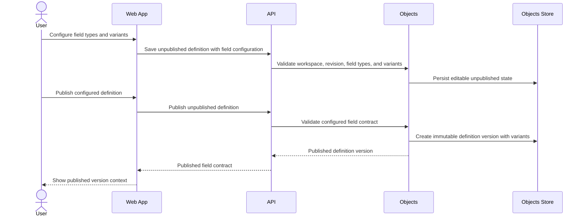

# Configure Field Variants

> **Navigation**: [docs/use-cases/objects/README.md](./README.md) · [docs/use-cases/README.md](../README.md) · [docs/README.md](../../README.md) · [AGENTS.md](../../../AGENTS.md)

## Purpose

Let a signed-in workspace user configure supported field types and built-in field variants on an unpublished business object definition so published versions carry a typed field contract for future records.

## Primary actor

- Signed-in workspace user

## Trigger

- User edits fields on an unpublished business object definition in the current workspace.
- User prepares to publish an unpublished business object definition that has field configuration.

## Main flow

1. User opens an unpublished business object definition in the current workspace.
2. System shows each unpublished field with its stable field key, label, field type, ordering, and applied variant summary.
3. User chooses a supported field type for each unpublished field.
4. User applies supported built-in variants for the selected field type and enters required variant parameters.
5. System validates field identity, field type, variant compatibility, variant parameters, workspace scope, and the user's last-seen revision.
6. System saves the editable unpublished definition and returns the current revision with the configured field types and variants.
7. User reviews the unpublished definition before publication.
8. User publishes the unpublished definition using the current revision.
9. System creates an immutable published object definition version that preserves each field's stable identity, type, ordering, label, and applied variants.

## Alternate / error flows

- Unsupported field type: reject the save or publish action with a field-type error.
- Variant incompatible with the selected field type: reject the save or publish action with a variant compatibility error.
- Missing or malformed variant parameter: reject the save or publish action with a parameter-specific error.
- Range variant with a lower bound greater than its upper bound: reject the save or publish action.
- Length variant with a negative length or minimum length greater than maximum length: reject the save or publish action.
- Pattern variant with an invalid or unsupported pattern: reject the save or publish action without evaluating record data.
- Single-select field with no options or duplicate option values: reject the save or publish action.
- Concurrent publish or stale save: reject the stale operation without overwriting the newer unpublished state or published version.
- Missing or unavailable workspace scope: reject the operation without creating, changing, or revealing object definitions.
- Cross-workspace definition access: return a not-found style outcome instead of revealing that another workspace owns the definition.

## Acceptance Criteria

*Happy path*
- **AC-001** User can choose a supported field type for each unpublished field before publication; supported types for this use case are text, integer, decimal, date, boolean, and single-select.
- **AC-002** User can apply built-in variants supported by the selected field type before publication.
- **AC-003** Supported built-in variants are required, numeric range, date range, text length, text pattern, and single-select options.
- **AC-004** Saving field type and variant changes preserves stable field keys, labels, ordering, and field identities while returning the current revision required by later save and publish attempts.
- **AC-005** Publishing a valid unpublished definition creates an immutable published object definition version that preserves each field's type and applied variants.
- **AC-006** Published field variant contracts are stored as typed configuration that a later record-validation use case can consume without treating the unpublished definition as a record contract.

*Validation & errors*
- **AC-007** Unsupported field types and variants incompatible with the selected field type are rejected before persistence.
- **AC-008** Variant parameters are required, typed, and validated before persistence, including range bounds, text lengths, text patterns, and single-select option values.
- **AC-009** Publication is blocked when any field type or variant configuration is invalid, while the unpublished definition remains editable.
- **AC-010** Stale unpublished changes and concurrent publish attempts fail without silently overwriting newer field type or variant state.
- **AC-011** Built-in field variants cannot depend on another field, actor role, workflow state, external data, or expression language in this use case.

*Edge cases*
- **AC-012** An authenticated current workspace scope is required to save, publish, list, or load configured field variants; missing or unavailable workspace scope is rejected without mutation.
- **AC-013** Field variants are isolated by workspace through their owning object definition; users cannot create, publish, list, load, or mutate configured variants outside the current workspace scope.
- **AC-014** The Objects module owns field type and variant configuration; Identity owns user, session, and workspace lifecycle.
- **AC-015** This use case does not create, import, edit, list, delete, or validate business object records.
- **AC-016** This use case does not introduce user-authored custom variants, expression DSL evaluation, object-level rules, lifecycle rules, permissions, automations, integrations, or side-effect actions.
- **AC-017** Unpublished save and publish operations are atomic; failed validation, workspace-scope rejection, concurrency conflicts, or persistence failures leave the previous unpublished state and published versions unchanged.

## Acceptance Test Matrix

| ID | Boundary | Scenario | Covers AC | Verification | Required |
|---|---|---|---|---|---|
| AT-001 | Domain boundary | Valid unpublished field configuration captures supported field types, built-in variants, stable field identities, labels, and ordering | AC-001, AC-002, AC-003, AC-004 | Domain test | Yes |
| AT-002 | Application boundary | Unsupported field types, incompatible variants, invalid parameters, invalid ranges, invalid lengths, invalid patterns, and invalid single-select options fail before persistence | AC-007, AC-008, AC-009, AC-011 | Domain test + Application test | Yes |
| AT-003 | Application boundary | Saving configured field types and variants returns a current revision that later save and publish attempts must use | AC-004, AC-010, AC-017 | Application test | Yes |
| AT-004 | Application boundary | Publishing a valid unpublished definition creates an immutable version while preserving typed field variant contracts | AC-005, AC-006, AC-017 | Application test | Yes |
| AT-005 | API boundary | Object definition endpoints expose the approved field type and built-in variant contract without exposing records, custom expressions, workflow, automation, or integration artifacts | AC-001, AC-002, AC-003, AC-006, AC-015, AC-016 | API integration test | Yes |
| AT-006 | API/Application boundaries | Missing workspace scope, unavailable workspace scope, and cross-workspace definition access are rejected without mutation or resource disclosure | AC-012, AC-013, AC-014 | API integration test + Application test | Yes |
| AT-007 | UI component | Business object definition screens expose field type selection, compatible variant controls, parameter validation, and publish blocking for invalid configuration | AC-001, AC-002, AC-003, AC-007, AC-008, AC-009 | UI component test | Yes |
| AT-008 | Browser journey | User configures field types and variants, saves the unpublished definition, and publishes it from an authenticated workspace route without console errors, document scrolling, or horizontal overflow | AC-001, AC-002, AC-004, AC-005, AC-012, AC-013 | Browser automation | Yes |
| AT-009 | Domain boundary | Objects module boundaries keep workspace lifecycle outside the module and prevent runtime record validation or rule-engine behavior from entering this slice | AC-014, AC-015, AC-016 | Architecture test | Yes |

## Out Of Scope

- Creating, importing, editing, listing, deleting, or validating business object records.
- Revising an already published definition into version 2 or later.
- User-authored custom variant definitions, expression DSLs, formulas, computed fields, or object-level rules.
- Workflow states, lifecycle transitions, permissions, automations, integrations, webhooks, or side-effect actions.
- Related-data providers, external API reads, runtime table generation, or per-definition storage generation.

## Screen flow

| Screen | Required contract |
|---|---|
| Business object definition list | Show current-workspace object definitions and keep entry to unpublished definition editing consistent with the define-business-object use case. |
| Field definition editor | Show each field's stable key, label, selected field type, ordering, and applied variant summary while allowing edits only on unpublished definitions. |
| Field type control | Let the user choose one supported field type per field and update the compatible variant controls when the type changes. |
| Variant configuration | Show built-in variant controls that are compatible with the selected field type, parameter validation, and field-specific errors. |
| Publish review | Block publication while invalid field type or variant configuration remains, and identify the affected field and variant. |
| Published definition detail | Show the published field type and variant contract as immutable version context for future record-facing surfaces. |

Required UI quality: field type and variant controls must have programmatic labels, keyboard reachability, visible focus, visible invalid states, field-specific error association, stable layout while variant controls appear or disappear, recoverable stale-save and stale-publish states, and copy that fits supported mobile and desktop widths without document scrolling or horizontal overflow.

## Diagrams

### field-variant-publication

> **Implementation status**
>
> | Layer | Status |
> |-------|--------|
> | Domain | Not started |
> | Application | Not started |
> | Infrastructure | Not started |
> | API | Not started |
> | Frontend | Not started |
>
> **Gaps vs spec:** Entire use case is not implemented.
>
> **Deferred follow-ups:** N/A.
>
> **Verification:** Required AT rows need domain tests, application tests, API integration tests, UI component tests, browser automation, and architecture tests before this use case can be marked done.
>
> **Decisions:** This use case extends the unpublished definition authoring surface from text-only fields to typed field contracts with built-in variants. Field variants are definition-time configuration in this slice; runtime record value evaluation belongs to a later record-validation use case that consumes published variant snapshots. The first supported field types are text, integer, decimal, date, boolean, and single-select. The first supported built-in variants are required, numeric range, date range, text length, text pattern, and single-select options. Built-in variants remain field-local in this slice; cross-field invariants, custom expression DSLs, custom reusable variants, workflow/lifecycle rules, permission rules, automation actions, data-provider reads, and plugins are separate future use cases. Published object definition versions remain immutable record contracts, and unpublished definitions remain editable state only.
