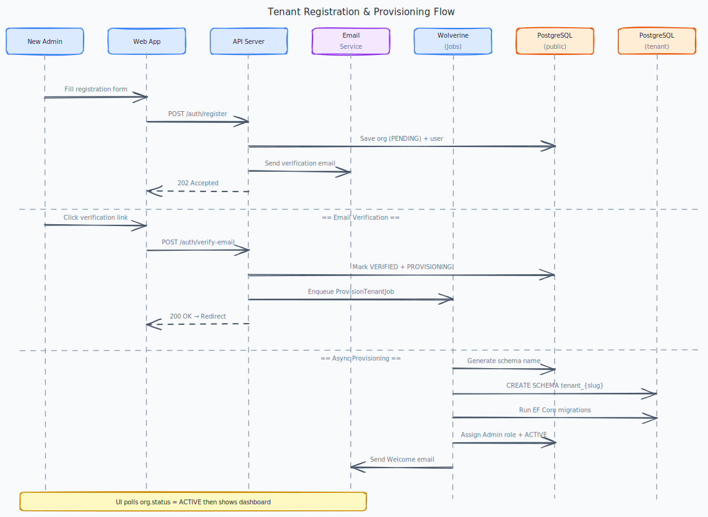

# Platform Foundation

[← Back to Use Cases](../README.md)

---

## Overview

Establish the multi-tenant SaaS foundation that all other modules depend on. This domain covers tenant provisioning, organization lifecycle management, and the data isolation strategy that keeps each tenant's data completely separate.

## Business Value

Without this foundation, nothing else works. Every feature in every other domain runs on top of the multi-tenancy infrastructure built here.

## Scope

**Production scope** — foundational; all other domains depend on this, so it lands first in implementation order.

---

## Use Cases

### Registration & provisioning

| Use case | Summary |
|---|---|
| [Select a subscription plan during registration](plan-at-signup/) | Choose a subscription plan during registration so that I know what features and limits I have access to. |
| [Automatic tenant provisioning](provision-tenant/) | My organization's environment to be ready immediately after email verification so that I can start using the platform… |
| [Register a new organization](register-org/) | Register my organization on the Axis platform so that I can start building workflows for my team. |
| [Verify email and activate account](verify-email/) | Verify my email address so that my account is activated and I can access the platform. |

### Subscription plans

| Use case | Summary |
|---|---|
| [Change organization plan (admin override)](admin-change-plan/) | Manually change an organization's plan so that I can support early customers and testing without a billing integration. |
| [Enforce plan limits at the API](enforce-limits/) | Enforce subscription plan limits at the API so that organizations cannot exceed their subscription without upgrading. |
| [View available plans](view-plans/) | Compare available subscription plans so that I can choose the one that fits my needs. |

### Organization settings

| Use case | Summary |
|---|---|
| [Delete organization](delete-org/) | Permanently delete my organization so that all our data is removed from the platform. |
| [Update organization profile](org-profile/) | Update my organization's name and logo so that the platform reflects our brand. |
| [View organization settings](org-settings/) | View all organization settings in one place so that I have full visibility into the configuration. |

### Tenant isolation

| Use case | Summary |
|---|---|
| [Tenant resolution from JWT](tenant-from-jwt/) | Resolve the active tenant from the JWT on every request so that downstream code never needs to think about tenant… |
| [Automatic tenant scoping on every request](tenant-scope/) | Every database query to be automatically scoped to the requesting tenant so that data isolation is enforced at the… |

---

## Diagrams

---

## Acceptance Criteria (domain)

- [ ] A new organization can register and be fully provisioned (own schema, admin account) within 60 seconds.
- [ ] No tenant can read or write data belonging to another tenant under any circumstances.
- [ ] Tenant schema is automatically created and migrated on registration.
- [ ] Organization can update its profile (name, logo, settings) without affecting other tenants.

---

## Implementation Status

| Layer | Status | Notes |
|---|---|---|
| Shared Domain | ✅ Done | `Entity`, `AggregateRoot`, `ValueObject`, `IDomainEvent`, `Result<T>` |
| Shared Application | ✅ Done | `ICommand/IQuery`, `ICommandHandler/IQueryHandler`, `ValidationBehavior`, `ITenantContext` |
| Shared Infrastructure | ✅ Done | `TenantSchemaInterceptor`, per-module `UnitOfWork` ([ADR-017](../../TECH_STACK.md#adr-017-axisshared-is-abstractions-only-no-shared-implementation)); **OpenTelemetry** host wiring on `Axis.Api` ([ADR-018](../../TECH_STACK.md#adr-018-opentelemetry-sdk-with-grafana-stack-for-observability), [patterns § OpenTelemetry](../../playbooks/patterns.md#opentelemetry-observability)) |
| [Register org](register-org/) | ✅ Done | Self-service signup + verification email — backend complete. Frontend polish ⏳ |
| [Tenant provisioning](provision-tenant/) | ✅ Done | Kafka-driven per-module provisioning, coordinator retries, `GET /api/auth/provisioning-status`. Frontend wait screen ⏳ |
| [Subscription plans](view-plans/) | ✅ Done | `GET /api/plans`, pricing data, 402 limits — see [enforce limits](enforce-limits/). Frontend pricing UI ⏳ |
| [Tenant isolation](tenant-scope/) | ✅ Done | `TenantSchemaInterceptor`, `TenantOrganizationAccessMiddleware`, cross-tenant API tests |
| [Organization management](org-profile/) | ✅ Done | Profile, settings + usage, scheduled deletion + hard-delete job ✅. Frontend settings UI ⏳ |
| Frontend | ⏳ Pending | Verify flow, provisioning wait, settings, pricing |

---

## Open work (agents)

| Priority | Item | Where |
|----------|------|--------|
| **Backend** | ✅ platform-foundation backend use cases complete. Optional: bulk workflow import when product needs [bulk export](../workflow-builder/bulk-export/) AC | [enforce-limits/](enforce-limits/) |
| Frontend | [Verify email](verify-email/), [provisioning wait](provision-tenant/), [pricing](view-plans/), [org settings](org-settings/) wireframes | see **Use Cases** table below |

Domain-level checkboxes above remain spec-only; status is in use-case **Implementation status** callouts.

---

## Dependencies

- None (this is the foundation)

## Dependents

- [Identity & Access](../identity-access/README.md)
- All other domains
