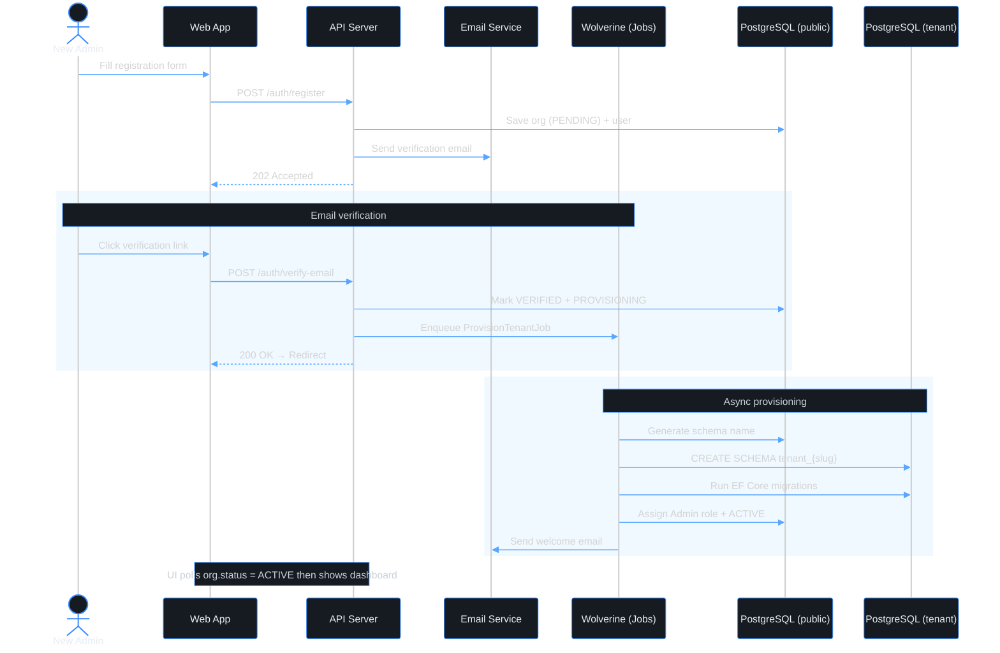

# Use case — Automatic tenant provisioning

> **Navigation**: [← Platform Foundation](../README.md) · [Use cases index](../README.md#use-cases)

## Purpose

My organization's environment to be ready immediately after email verification so that I can start using the platform without waiting.

## Primary actor

- new admin

## Trigger

- User initiates: my organization's environment to be ready immediately after email verification

## Main flow

1. Actor satisfies the trigger.
2. System performs the happy-path steps in Acceptance Criteria.
3. Actor receives the expected outcome.

## Alternate / error flows

- Validation failures and edge cases in Acceptance Criteria.

## Context

Self-service registration flow where a new organization signs up and is automatically provisioned with an isolated database schema and a default admin account. No manual intervention from the Axis team is required.

## Acceptance Criteria

*Happy path*
- [ ] A dedicated PostgreSQL schema is created within 10 seconds of email verification.
- [ ] All base tables are migrated into the new schema automatically.
- [ ] The registering user is assigned the Admin role within the org.
- [ ] Once provisioning completes, the workspace dashboard is fully functional.

*Validation & errors*
- [ ] If provisioning fails (e.g., DB timeout), the error is logged with full context and a retry job is scheduled automatically (up to 3 retries, with exponential backoff).
- [ ] If provisioning fails after all retries, a platform alert is triggered for the Axis team to investigate.
- [ ] The user is not stuck: the UI shows a "Setting up your workspace…" state and retries polling every 5 seconds.

*Edge cases*
- [ ] Provisioning is idempotent: running it twice for the same org does not create duplicate schemas or tables.
- [ ] If the org schema already exists (partial previous run), the migration runner detects this and continues from where it left off.

*Out of scope*
- Custom schema naming chosen by the user — schema names are auto-generated.

> **Implementation status**
>
> | Layer | Status |
> |-------|--------|
> | Domain | ✅ |
> | Application | ✅ |
> | Infrastructure | ✅ |
> | API | ✅ |
> | Frontend | ⏳ |
>
> **Gaps vs spec:** provisioning wait UI (email verification) pending Frontend.
>
> **Done:**
> - org enters `Provisioning` on verify
> - per-module `TenantModuleProvisionReportEvent` + Identity coordinator schedules up to 3 retries with exponential backoff
> - critical log alert when exhausted
> - `GET /api/auth/provisioning-status?token=` for polling.
>
> **Deferred (PR #N follow-up):** external paging integration for platform alerts (critical log is the current signal).
>
> **Decisions:** provisioning is fully event-driven over Kafka per [ADR-019](../../../TECH_STACK.md#adr-019-avro-and-schema-registry-for-event-payloads-with-cloudevents-envelope) — no central provisioner. The verify endpoint stays fast, the provisioning failure mode is decoupled from email verification, and each module owns its own schema lifecycle (satisfies ADR-010 "extraction is a redeploy"). Tenant schema name is derived from `Organization.Id` as `tenant_{orgId:N}` (32-char hex, no dashes) — stable across the lifetime of the org and safe as a Postgres identifier.

## Wireframes

| Screen | Excalidraw | Preview |
|--------|------------|---------|
| workspace-provisioning | [source](./workspace-provisioning.excalidraw) | [preview](./workspace-provisioning.svg) |

## Diagrams

### tenant-provisioning

