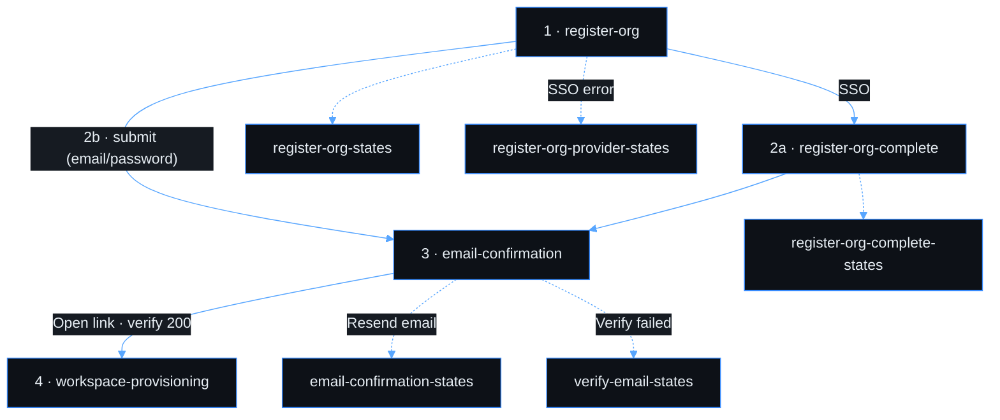

# Use case — Register a new organization

> **Navigation**: [← Platform Foundation](../README.md) · [Use cases index](../README.md#use-cases)

## Purpose

Register my organization on the Axis platform — with email/password or Microsoft, Google, or GitHub — confirm my inbox, verify the email link, and activate the account so that I can start building workflows for my team.

## Primary actor

- prospective customer

## Trigger

- User initiates: register my organization on the Axis platform

## Main flow

1. Actor satisfies the trigger.
2. System performs the happy-path steps in Acceptance Criteria.
3. Actor receives the expected outcome.

## Alternate / error flows

- Validation failures and edge cases in Acceptance Criteria.

## Context

Self-service registration flow where a new organization signs up and is automatically provisioned with an isolated database schema and a default admin account. No manual intervention from the Axis team is required.

## Acceptance Criteria

*Happy path*
- [ ] Registration form collects: organization name, admin full name, admin email, password, and password confirmation.
- [ ] The user must accept the Terms of Service and Privacy Policy (linked) before the form can be submitted; the accepted version is recorded with the account.
- [ ] An organization slug is auto-generated from the organization name (uniqueness-checked) and shown to the user.
- [ ] On successful submission, a verification email is sent (within 60 seconds) and the user sees a confirmation screen.
- [ ] The confirmation screen tells the user to check their email and does not reveal whether the email already exists.
- [ ] Clicking the verification link activates the account and automatically signs the user in.
- [ ] After activation, the user is redirected to the workspace (or to the provisioning wait screen if the tenant schema is still being created).

*Validation & errors*
- [ ] Organization name: required, 2–100 characters.
- [ ] Email: required, valid email format, unique across the platform.
- [ ] Password: required, minimum 8 characters, must contain at least one letter and one number.
- [ ] Password confirmation must match password exactly.
- [ ] All field-level errors are shown inline, not as a global toast.
- [ ] Submitting with an already-registered email shows the same confirmation screen (no information leakage about existing accounts).
- [ ] If the API returns a server error (5xx), the form shows a generic "Something went wrong, please try again" message and the submit button re-enables.

*Edge cases*
- [ ] Multiple rapid submissions of the same form are deduplicated (idempotency key on the request).
- [ ] Pasting a password with leading/trailing spaces is accepted as-is (no silent trimming).
- [ ] Organization name with special characters (e.g., `O'Brien & Co.`) is accepted.

*External identity providers (post-OAuth completion — ADR-027)*
- [ ] Registration page offers **Microsoft**, **Google**, and **GitHub** sign-up alongside the email/password form ([ADR-027](../../../TECH_STACK.md#adr-027-external-identity-providers-for-sign-in-and-registration)). SSO starts OAuth only; it does **not** create an organization by itself.
- [ ] Signing up with a provider runs Authorization Code + PKCE through OpenIddict. On success the client receives verified **email** and **display name** claims only (no organization name from the IdP).
- [ ] If the provider's email already belongs to an Axis account, registration is rejected with "An account with this email already exists. Sign in instead." (no duplicate org) — checked before the completion screen.
- [ ] A provider that returns no verified email cannot continue; registration stops with an error (no completion screen).
- [ ] The user is redirected to a **completion screen** (`register-org-complete`) where they must enter **organization name** (required, 2–100 characters), may edit **admin full name** (pre-filled from display name), and see **email** read-only from the provider.
- [ ] An organization slug is auto-generated from the organization name on the completion screen (uniqueness-checked) and shown read-only, same rules as the email/password path.
- [ ] Terms of Service and Privacy Policy acceptance is required on the completion screen immediately before submit; the accepted version is recorded when the organization is created. No organization exists until this step succeeds.
- [ ] Submitting the completion form creates the organization and admin account with an external login linked (no password). Idempotency applies the same as `POST /api/organizations/`.
- [ ] On success, the user sees the same confirmation screen as the email/password path (verification email when applicable; no email-exists leakage).

*Email verification (link from inbox)*
- [ ] Verification link is valid for 24 hours; an expired link shows a clear message with a **Resend verification email** button.
- [ ] An already-used link shows "This link has already been used. Please sign in."
- [ ] A tampered or invalid token shows "Invalid verification link."
- [ ] Resend is rate-limited: max 3 requests per email per hour; further attempts show "Please wait before requesting another email" (see `verify-email-states` — rate limit panel; same 429 pattern as `email-confirmation-states`).
- [ ] If the user tries to sign in before verifying, they see "Please verify your email first" with a resend option ([sign-in](../../identity-access/sign-in/) owns the login-page AC; backend returns the same message).
- [ ] The verification link works from any browser or device.

*Tenant provisioning (after email verification)*
- [ ] A dedicated PostgreSQL schema is created per module within 10 seconds of email verification (event-driven; see `tenant-provisioning` diagram).
- [ ] All base tables are migrated into each module's tenant schema automatically.
- [ ] The registering user is assigned the Admin role within the org when provisioning completes.
- [ ] Once provisioning completes, the workspace dashboard is fully functional.
- [ ] If provisioning fails (e.g., DB timeout), the error is logged with full context and a retry is scheduled automatically (up to 3 retries, exponential backoff).
- [ ] If provisioning fails after all retries, a platform alert is triggered for the Axis team to investigate.
- [ ] The user is not stuck: the UI shows `workspace-provisioning` (headline **Setting up "{organizationName}" workspace…**, org name from registration context) and polls `GET /api/auth/provisioning-status?token=` every 5 seconds until `isReady`, then redirects to the dashboard. Closing the tab is allowed — reopening the provisioning URL (token in query) or signing in while the org is still `Provisioning` returns to this screen.
- [ ] When automatic retries are exhausted (`ProvisioningFailed`), the UI shows a failed state with **Try again** (manual re-queue; idempotent) and a support link. `POST /api/auth/retry-provisioning` with the same verification token.
- [ ] Provisioning is idempotent: running it twice for the same org does not create duplicate schemas or tables.
- [ ] If a tenant schema already exists (partial previous run), the migration runner continues from where it left off.

*Out of scope*
- CAPTCHA / bot protection on the registration form.
- Automatic re-send of verification email after X minutes (no timer-based resend).
- Custom schema naming chosen by the user — schema names are auto-generated (`tenant_{organizationId:N}`).

> **Implementation status**
>
> | Layer | Status |
> |-------|--------|
> | Domain | ⚠️ |
> | Application | ⚠️ |
> | Infrastructure | ⚠️ |
> | API | ⚠️ |
> | Frontend | ⏳ |
>
> **Gaps vs spec:** **Registration:** email/password path is largely complete (`Idempotency-Key` on `POST /api/organizations/`, slug uniqueness retry). **Not yet:** Terms of Service / Privacy Policy acceptance (record accepted version), external-provider sign-up (ADR-027), **register-org-complete** screen, CAPTCHA (see *Out of scope*). **Email verification (backend ✅):** opaque one-time tokens in `email_verification_tokens` (SHA-256 at rest, 24h TTL), resend rate limit 3/email/hour (`IResendVerificationRateLimiter`, HTTP 429), login blocks unverified users. **Tenant provisioning (backend ✅):** org enters `Provisioning` on verify, `OrganizationVerifiedEvent` → per-module `TenantModuleProvisionReportEvent`, Identity coordinator retries (3×, exponential backoff), critical log on exhaustion, `GET /api/auth/provisioning-status?token=` for polling. **Frontend ⏳:** registration + `verify-email-states` (errors) + `workspace-provisioning`; no verify-success screen — redirect on verify 200 (**Deferred — PR #125 follow-up**). **Manual provisioning retry:** `POST /api/auth/retry-provisioning` + **Try again** UI (**Deferred** — coordinator auto-retry only today).
>
> **Decisions:**
> - duplicate email returns silently without creating anything — matches "same confirmation screen" AC. `RegisterOrganizationCommandValidator` enforces: org name 2–100 chars, valid email, password min 8 chars + letter + number, confirmation match. Org slug auto-generated with uniqueness retry loop
> - BCrypt work factor 12. 4 default system roles seeded atomically in the same transaction.
> - **External providers:** industry-standard **post-OAuth completion** — IdPs supply identity only (email + display name); organization name is always collected on `register-org-complete` before the org is created. Short-lived server session holds the external login between OAuth callback and completion submit.
> - **Resend / verify:** `ResendVerificationEmailCommand` silently succeeds for unknown or already-verified emails (no information leakage). IP-level `auth` rate limiter applies to `/connect/login` and Identity gRPC only — not on verify/resend (keeps integration tests stable).
> - **Provisioning:** event-driven over Kafka per [ADR-019](../../../TECH_STACK.md#adr-019-avro-and-schema-registry-for-event-payloads-with-cloudevents-envelope) — no central provisioner; verify endpoint stays fast; each module owns its schema lifecycle ([ADR-010](../../../TECH_STACK.md#adr-010-modulith-with-strict-service-boundaries-so-extraction-is-a-redeploy)).

## Screen flow

Canonical order for this use case. **The wireframes table below uses the same row order** — read top to bottom when reviewing assets.

| Step | Screen | When |
|------|--------|------|
| 1 | `register-org` | Entry: Microsoft / Google / GitHub **or** email/password form |
| 2a | `register-org-complete` | **SSO only** — after OAuth; collect org name, slug, Terms (email read-only) |
| 2b | `register-org` *(same screen as step 1)* | **Email/password** — submit on the entry form (skips 2a; no extra wireframe) |
| 3 | `email-confirmation` | After org create succeeds (either branch) |
| — | *(no screen on success)* | User opens inbox link → `POST /api/auth/verify-email` → **200 redirects straight to step 4** (no success card) |
| 4 | `workspace-provisioning` | After verify succeeds — poll until tenant ready, then workspace / dashboard |

Step **2b** is a path, not a separate UI file — only **2a** adds `register-org-complete.excalidraw`. The wireframes table lists files; step **2b** is called out on the `register-org` row below.

**Error / reference screens** (not sequential steps — open when implementing that AC group):

| Screen | When |
|--------|------|
| `register-org-provider-states` | SSO rejected before completion (duplicate email, no verified email) |
| `register-org-states` | Validation or 5xx on the entry form |
| `register-org-complete-states` | Validation or Terms not accepted on completion form |
| `email-confirmation-states` | Resend from confirmation screen: in-flight, success (204), rate limit (429) |
| `verify-email-states` | Verify link **errors only** (expired, already used, invalid, 429) — reference board; runtime shows one card |

## Legal links & footer links (UX)

Documented for wireframes and future frontend; **not implemented** in the app yet (see implementation status).

| Control | Wireframe | Intended behavior |
|---------|-----------|-------------------|
| Terms checkbox | `authTermsRow` in `blocks.mjs` | Required before submit — **no `*`** on the row; inline error if unchecked (see `register-org-complete-states`). |
| **Terms of Service** / **Privacy Policy** | Primary inline links with **underline** in the agree sentence | Open the legal document in a **new browser tab** (public URLs TBD, e.g. `/legal/terms`, `/legal/privacy`). Does not submit the form or clear fields. |
| Card footer (e.g. **Sign in**) | `buildAuthCardFooter` — gray lead-in + underlined **primary link** | Navigates to the target auth route (e.g. sign-in page). Same link styling as Terms/Privacy. |
| **Resend email** (`email-confirmation`) | `buildAuthCardInlineRow` — gray lead + underlined **Resend email →**, **left-aligned** with body | `POST /api/auth/resend-verification` with email from registration context. Stay on screen; see `email-confirmation-states` for UI feedback. |
| **Go to sign in** (`email-confirmation`) | `buildAuthCardFooter` — **Already verified?** + underlined **Go to sign in** + forward arrow on the **right** (`forwardArrow: true`) | Navigates to sign-in (user came from registration, not “back”). |

**Resend UI (wireframe):** idle on `email-confirmation`; after click → info banner **Sending…** + **Resend email →** disabled until complete → **204** success banner + **resend link active again** (user may resend until hourly cap), or **429** with resend disabled. API always returns **204** when under cap, even if email unknown (no leakage).

Record **accepted ToS/Privacy version** on the account at org create (AC above); legal page content and versioning are out of scope for this wireframe pass.

## Workspace-provisioning UI (step 4)

Maps to *Tenant provisioning* ACs. **Backend** (async, per module): [`tenant-provisioning`](#tenant-provisioning) diagram — Kafka, schema `tenant_{orgId:N}`, migrations, retries.

**UI (this wireframe):** one **aggregated** checklist — do **not** show Data modeling / Workflow builder / … by name. Poll `GET /api/auth/provisioning-status?token=` every 5 seconds; map API `orgStatus` + module aggregate to the three rows below (icons only — no module list).

| Copy / behavior | Spec |
|-----------------|------|
| Headline | `Setting up "{organizationName}" workspace…` (placeholder **Acme Corp** on wireframe) |
| Tab | User may leave; poll resumes on return until redirect when `isReady` |
| Footer (in progress) | `If setup is slow, we retry automatically (up to 3 attempts).` — matches coordinator `MaxAttempts = 3` |
| Failure actions | **Try again →** then **Contact support if the issue persists →** |

| UI step | Covers (spec) |
|---------|----------------|
| **Creating your workspace** | Subcopy: *Preparing your organization's data* — backend: all tenant-scoped module schemas + migrations (AC: per-module work, one user-facing line) |
| **Assigning admin role** | AC: Admin role when provisioning completes |
| **Opening workspace** | AC: redirect to dashboard when org ACTIVE |

**Failure:** failed panel when provisioning cannot complete after retries; platform alert per AC; **Try again** calls `POST /api/auth/retry-provisioning` (not implemented yet — see gaps). Email verification is the prior step (redirect here on verify 200).

## Wireframes

Nine screens in this folder (four happy-path UI steps, five `*-states` reference boards). Table order follows [Screen flow](#screen-flow). **Verify on success:** no wireframe — redirect to `workspace-provisioning`. **Verify on error:** one card from `verify-email-states`. Diagrams: [`register-org-journey`](#register-org-journey), [`register-org-cases`](#register-org-cases), [`tenant-provisioning`](#tenant-provisioning).

| # | Screen | Role | Excalidraw | Preview |
|---|--------|------|------------|---------|
| 1 · 2b | register-org | Happy path — entry (1); email/password submit (2b) | [source](./register-org.excalidraw) | [preview](./register-org.svg) |
| 2a | register-org-complete | Happy path — post-OAuth completion | [source](./register-org-complete.excalidraw) | [preview](./register-org-complete.svg) |
| 3 | email-confirmation | Happy path — after create (resend link idle) | [source](./email-confirmation.excalidraw) | [preview](./email-confirmation.svg) |
| 4 | workspace-provisioning | Poll UI — aggregated checklist (reference: in progress \| failed) | [source](./workspace-provisioning.excalidraw) | [preview](./workspace-provisioning.svg) |
| — | email-confirmation-states | Resend from step 3 — in-flight, 204, 429 | [source](./email-confirmation-states.excalidraw) | [preview](./email-confirmation-states.svg) |
| — | verify-email-states | Verify link errors — expired, used, invalid, 429 | [source](./verify-email-states.excalidraw) | [preview](./verify-email-states.svg) |
| — | register-org-provider-states | Error — SSO before completion | [source](./register-org-provider-states.excalidraw) | [preview](./register-org-provider-states.svg) |
| — | register-org-states | Error — entry form validation / 5xx | [source](./register-org-states.excalidraw) | [preview](./register-org-states.svg) |
| — | register-org-complete-states | Error — completion form validation / Terms | [source](./register-org-complete-states.excalidraw) | [preview](./register-org-complete-states.svg) |

## Diagrams

Read **`register-org-journey`** once for the full happy path (sign-up → inbox → verify → workspace). Use **`register-org-cases`** when implementing error/state wireframes. **`tenant-provisioning`** is the async/Kafka view (implementers); it continues where the journey ends at verify.

### register-org-journey

End-to-end registration happy path (email/password or SSO). Error branches and SSO rejections are in `register-org-cases`.

```mermaid
%%{init: {'theme':'dark','themeVariables':{'background':'#0d1117','mainBkg':'#0d1117','primaryColor':'#161b22','primaryBorderColor':'#388bfd','primaryTextColor':'#e6edf3','secondaryColor':'#21262d','secondaryBorderColor':'#388bfd','secondaryTextColor':'#e6edf3','tertiaryColor':'#161b22','tertiaryTextColor':'#e6edf3','lineColor':'#58a6ff','textColor':'#e6edf3','nodeBorder':'#388bfd','clusterBkg':'#161b22','clusterBorder':'#388bfd','titleColor':'#e6edf3','edgeLabelBackground':'#161b22','actorBkg':'#161b22','actorBorder':'#388bfd','actorTextColor':'#e6edf3','signalColor':'#58a6ff','labelBoxBkgColor':'#161b22','labelBoxBorderColor':'#388bfd','noteBkgColor':'#161b22','noteBorderColor':'#388bfd','noteTextColor':'#c9d1d9','activationBkgColor':'#30363d'}}}%%

sequenceDiagram
  actor Admin as New Admin
  participant Web as Web App
  participant API as Axis API<br/>(Identity + Org)
  participant Email as Email Service
  participant IdP as IdP (MS/Google/GitHub)

  rect rgb(22, 35, 58)
    Note over Admin,IdP: 1–2 · Sign up (register-org / register-org-complete)
    Admin->>Web: Open registration page
    alt Email / password (2b on register-org)
      Admin->>Web: Accept Terms + submit (Idempotency-Key)
      Web->>API: POST /api/organizations/
      API->>API: Slug, hash password, seed roles
    else SSO (2a register-org-complete)
      Admin->>Web: Microsoft / Google / GitHub
      Web->>IdP: OAuth2 Auth Code + PKCE
      IdP-->>Web: Verified email + display name
      Web->>API: Pre-check claims
      Web-->>Admin: register-org-complete
      Admin->>Web: Org name, slug, Terms + submit
      Web->>API: POST /api/organizations/ + link external login
    end
    API->>Email: Send verification email (if new account)
    API-->>Web: 202 Accepted
    Web-->>Admin: 3 · email-confirmation
  end

  rect rgb(22, 35, 58)
    Note over Admin,Email: 3 · Inbox wait (optional resend)
    opt Resend from confirmation
      Admin->>Web: Resend email
      Web->>API: POST /api/auth/resend-verification
      API-->>Web: 204 (or 429 at cap)
    end
    Admin->>Email: Open verification link (any device)
  end

  rect rgb(22, 35, 58)
    Note over Admin,API: Verify link (no success screen)
    Email-->>Web: Deep link with token
    Web->>API: POST /api/auth/verify-email
    API->>API: Activate user, org → Provisioning, publish events
    API-->>Web: 200 OK → redirect (session cookie when Frontend ships)
    alt Verify error
      API-->>Web: Expired / used / invalid / 429
      Web-->>Admin: verify-email-states (one card)
    end
  end

  rect rgb(22, 35, 58)
    Note over Admin,Web: 4 · workspace-provisioning
    alt Tenant ready
      Web-->>Admin: Workspace / dashboard
    else Schema still provisioning
      Web->>API: GET /api/auth/provisioning-status?token=
      API-->>Web: Org status (modules not shown in UI)
      Web-->>Admin: workspace-provisioning screen
    end
  end

  Note over API,Email: Duplicate email on POST /api/organizations/ still returns 202 + same confirmation screen (no leakage). Async provisioning → tenant-provisioning below.
```

### tenant-provisioning

Async multi-module tenant setup after `POST /api/auth/verify-email` (same registration journey as `register-org-journey` — after redirect to step 4).

```mermaid
%%{init: {'theme':'dark','themeVariables':{'background':'#0d1117','mainBkg':'#0d1117','primaryColor':'#161b22','primaryBorderColor':'#388bfd','primaryTextColor':'#e6edf3','secondaryColor':'#21262d','secondaryBorderColor':'#388bfd','secondaryTextColor':'#e6edf3','tertiaryColor':'#161b22','tertiaryTextColor':'#e6edf3','lineColor':'#58a6ff','textColor':'#e6edf3','nodeBorder':'#388bfd','clusterBkg':'#161b22','clusterBorder':'#388bfd','titleColor':'#e6edf3','edgeLabelBackground':'#161b22','actorBkg':'#161b22','actorBorder':'#388bfd','actorTextColor':'#e6edf3','signalColor':'#58a6ff','labelBoxBkgColor':'#161b22','labelBoxBorderColor':'#388bfd','noteBkgColor':'#161b22','noteBorderColor':'#388bfd','noteTextColor':'#c9d1d9','activationBkgColor':'#30363d'}}}%%

sequenceDiagram
  participant API as Identity API
  participant Kafka
  participant Mod as Module provisioners
  participant Coord as Identity coordinator
  participant Web as Web App

  Note over API,Kafka: Triggered when verify-email succeeds (register-org-journey § 4)
  API->>API: Org → Provisioning, seed tenant_module_provisions
  API->>Kafka: OrganizationVerifiedEvent

  rect rgb(22, 35, 58)
    Note over Kafka,Mod: Per-module schema tenant_{orgId:N}
    Kafka->>Mod: Provision handler (each module DB)
    Mod->>Mod: CREATE SCHEMA + EF migrations
    Mod->>Kafka: TenantModuleProvisionReportEvent
    Kafka->>Coord: Aggregate module reports
    Coord->>Coord: Retry failures (3×, exponential backoff)
    alt All modules succeeded
      Coord->>API: Mark org ACTIVE, assign Admin role
    else Retries exhausted
      Coord->>Coord: Critical log (platform alert)
    end
  end

  rect rgb(22, 35, 58)
    Note over Web,API: workspace-provisioning UI
    Web->>API: GET /api/auth/provisioning-status?token=
    API-->>Web: Org + module status (UI maps to aggregated checklist)
    Web-->>Web: Redirect to dashboard when ACTIVE
  end
```

### register-org-cases

Dev checklist — API outcomes mapped to wireframe `*-states` boards (not the journey happy path).

```mermaid
%%{init: {'theme':'dark','themeVariables':{'background':'#0d1117','mainBkg':'#0d1117','primaryColor':'#161b22','primaryBorderColor':'#388bfd','primaryTextColor':'#e6edf3','secondaryColor':'#21262d','secondaryBorderColor':'#388bfd','secondaryTextColor':'#e6edf3','tertiaryColor':'#161b22','tertiaryTextColor':'#e6edf3','lineColor':'#58a6ff','textColor':'#e6edf3','nodeBorder':'#388bfd','clusterBkg':'#161b22','clusterBorder':'#388bfd','titleColor':'#e6edf3','edgeLabelBackground':'#161b22','actorBkg':'#161b22','actorBorder':'#388bfd','actorTextColor':'#e6edf3','signalColor':'#58a6ff','labelBoxBkgColor':'#161b22','labelBoxBorderColor':'#388bfd','noteBkgColor':'#161b22','noteBorderColor':'#388bfd','noteTextColor':'#c9d1d9','activationBkgColor':'#30363d'}}}%%

sequenceDiagram
  actor Admin as New Admin
  participant Web as Web App
  participant API as Axis API

  rect rgb(22, 35, 58)
    Note over Admin,API: Email/password submission
    Admin->>Web: Submit register-org (+ Terms, Idempotency-Key)
    Web->>API: POST /api/organizations/
    API-->>Web: 400 validation (inline field errors)
    API-->>Web: 5xx generic banner, re-enable submit
    API-->>Web: 202 confirmation (new or duplicate email)
  end

  rect rgb(22, 35, 58)
    Note over Admin,API: Provider callback pre-check
    Admin->>Web: Provider OAuth callback completes
    Web->>API: Validate claims (verified email, uniqueness)
    API-->>Web: Reject: no verified email → provider error
    API-->>Web: Reject: duplicate email → Sign in
    API-->>Web: Open register-org-complete
  end

  rect rgb(22, 35, 58)
    Note over Admin,API: Post-OAuth completion submit
    Admin->>Web: Submit complete form (name, slug, Terms)
    Web->>API: POST completion (link external login)
    API-->>Web: 400 org / Terms errors (inline)
    API-->>Web: 5xx banner, re-enable submit
  end

  rect rgb(22, 35, 58)
    Note over Admin,API: email-confirmation + resend
    API-->>Web: 202 confirmation screen
    Web-->>Admin: email-confirmation-states (204 / 429)
  end

  rect rgb(22, 35, 58)
    Note over Admin,API: verify-email link outcomes
    Admin->>Web: Open verification link
    Web->>API: POST /api/auth/verify-email
    API-->>Web: 200 → redirect workspace-provisioning (no success card)
    API-->>Web: Expired token → Resend CTA
    API-->>Web: Already used → Sign in
    API-->>Web: Invalid / tampered → verify-email invalid panel
    Web->>API: POST /api/auth/resend-verification (from landing)
    API-->>Web: 429 → verify-email-states (rate limit panel)
  end
```

**APIs (registration journey):** `POST /api/organizations/`, `POST /api/auth/resend-verification`, `POST /api/auth/verify-email`, `GET /api/auth/provisioning-status`, `POST /api/auth/retry-provisioning` (manual retry after failure — planned). The former standalone **verify-email** and **provision-tenant** use-case folders were merged into this README.
