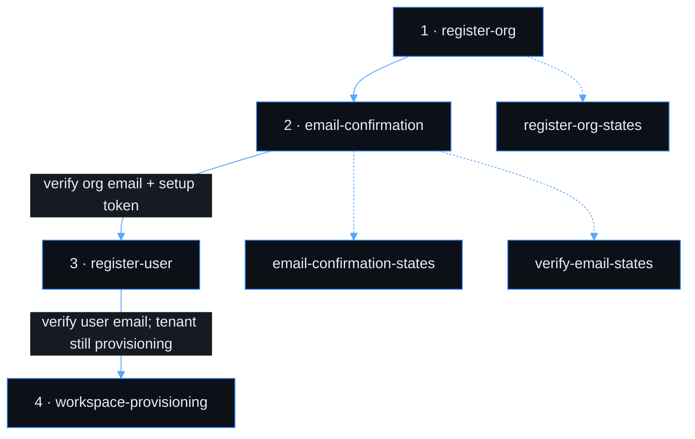
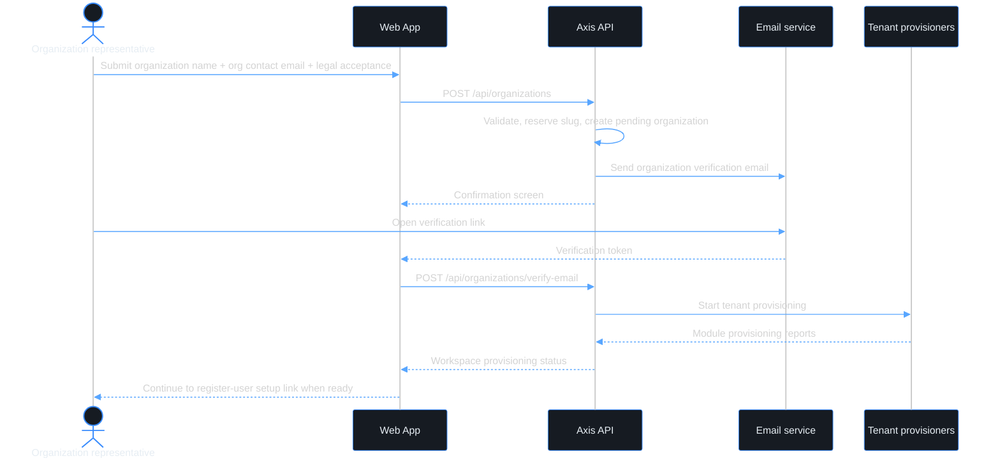
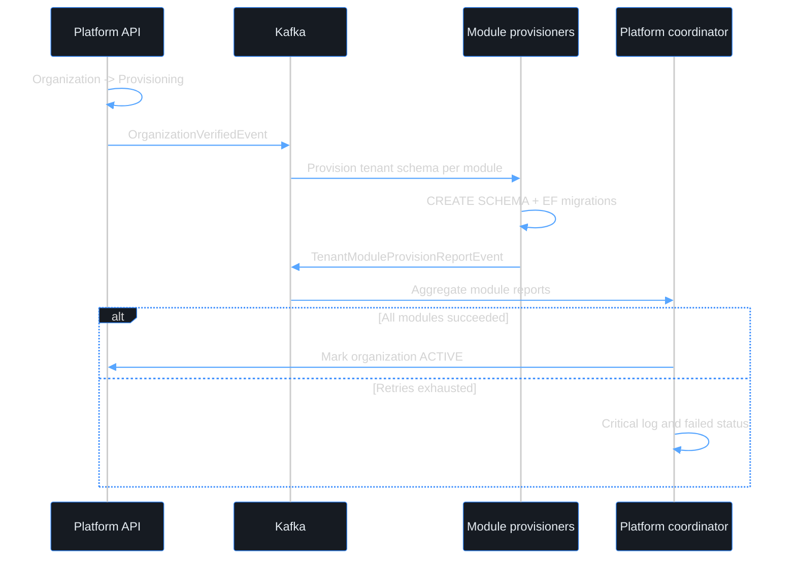

# Use case — Register a new organization

> **Navigation**: [← Platform Foundation](../README.md) · [Use cases index](../README.md#use-cases)

## Purpose

Register an organization on the Axis platform with an official organization contact email, verify that contact channel, and provision the tenant foundation before any user identity is attached.

## Primary actor

- organization representative

## Trigger

- A prospective customer starts onboarding a new organization.

## Main flow

1. Actor opens the organization registration page.
2. Actor enters organization name, organization contact email, and accepts Terms of Service / Privacy Policy.
3. System validates the organization details, reserves a unique organization slug, and sends a verification email to the organization contact email.
4. Actor verifies the organization email link.
5. System marks the organization verified, starts tenant provisioning, and issues a first-user setup link owned by [register-user](../../identity-access/register-user/).
6. Actor continues to user registration to create the first owner/admin identity.

## Alternate / error flows

- Organization email already exists for another organization: show the same confirmation screen where possible; never disclose ownership details to anonymous callers.
- Verification link expired: show a resend option for the organization contact email.
- Verification link already used: show a clear completed-state message and link to user registration or sign-in.
- Provisioning fails after automatic retries: show the workspace provisioning failure state with manual retry/support action.

## Context

This use case is about organization onboarding, not user identity onboarding. The email collected here is an official organization contact email, such as `admin@company.com` or `it@company.com`; it is not a personal user login. Microsoft / Google / GitHub identity providers belong to [register-user](../../identity-access/register-user/) and [sign-in](../../identity-access/sign-in/), where they authenticate an individual user.

Axis supports standalone user accounts. Registering an organization is required only when a user wants to create or join an organization workspace; it is not a prerequisite for normal user registration.

## Acceptance Criteria

*Happy path*
- [ ] Registration form collects organization name and organization contact email.
- [ ] The user must accept the Terms of Service and Privacy Policy before the organization registration can be submitted; the accepted versions are recorded with the organization registration record.
- [ ] An organization slug is auto-generated from the organization name, uniqueness-checked, and shown to the actor before submission.
- [ ] On successful submission, a verification email is sent to the organization contact email and the actor sees a confirmation screen.
- [ ] Clicking the verification link verifies the organization contact email and starts tenant provisioning.
- [ ] After organization verification, the system creates a short-lived first-user setup token/link for [register-user](../../identity-access/register-user/); the organization is not usable until a user account is created and attached.
- [ ] Once tenant provisioning completes, the first registered owner/admin can access the workspace.

*Validation & errors*
- [ ] Organization name: required, 2–100 characters.
- [ ] Organization contact email: required, valid email format, unique across active organizations.
- [ ] Organization contact email must not be collected from Microsoft / Google / GitHub OAuth claims in this use case.
- [ ] All field-level errors are shown inline, not as a global toast.
- [ ] Submitting with an already-registered organization email shows the same confirmation screen when possible; anonymous callers must not learn whether an organization already exists.
- [ ] If the API returns a server error (5xx), the form shows a generic "Something went wrong, please try again" message and the submit button re-enables.

*Edge cases*
- [ ] Multiple rapid submissions of the same organization registration are deduplicated with an idempotency key.
- [ ] Organization name with special characters (e.g., `O'Brien & Co.`) is accepted and slugified consistently.
- [ ] A generic mailbox (e.g., `admin@company.com`) is allowed; the first-user setup link decides who becomes the initial owner/admin.
- [ ] Verification and first-user setup links are short-lived and single-use.

*Tenant provisioning*
- [ ] A dedicated PostgreSQL schema is created per module after organization email verification.
- [ ] All base tables are migrated into each module's tenant schema automatically.
- [ ] Provisioning is idempotent: running it twice for the same organization does not create duplicate schemas or tables.
- [ ] If a tenant schema already exists from a partial previous run, the migration runner continues from where it left off.
- [ ] The UI shows `workspace-provisioning` while tenant setup is running and redirects when the organization becomes active.
- [ ] If provisioning fails after all retries, the UI shows a failed state with **Try again** and support contact.

*Out of scope*
- User account registration, password setup, account linking, and Microsoft / Google / GitHub login; see [register-user](../../identity-access/register-user/).
- Standalone user registration without organization context; see [register-user](../../identity-access/register-user/).
- Enterprise SAML/SCIM federation and per-tenant IdP configuration.
- CAPTCHA / bot protection on the organization registration form.
- Automatic re-send of verification email after X minutes.
- Custom schema naming chosen by the user; schema names are auto-generated.

> **Implementation status**
>
> | Layer | Status |
> |-------|--------|
> | Domain | ✅ |
> | Application | ✅ |
> | Infrastructure | ✅ |
> | API | ✅ |
> | Frontend | ⚠️ |
>
> **Gaps vs spec:** Backend/API now split organization onboarding from user identity registration: `POST /api/organizations` records organization facts + legal versions, sends org-contact verification, starts provisioning after verification, and issues a short-lived setup token for [register-user](../../identity-access/register-user/). Remaining work is the dedicated register-org frontend copy/validation and polished setup-token handoff UI.
>
> **Decisions:**
> - `register-org` owns organization facts only: organization name, organization contact email, legal acceptance, slug, verification, and tenant provisioning.
> - Microsoft / Google / GitHub authenticate users, not organizations. Generic OAuth provider claims must not be used as proof that someone controls an organization.
> - First owner/admin creation is a follow-up user-registration step using a short-lived setup token/link after organization verification.
> - Organization onboarding is optional from the product perspective: a user can register and use Axis without creating or joining an organization.

## Screen flow

Canonical order for this use case. Screens owned by another use case are linked inline.

| Step | Screen | When |
|------|--------|------|
| 1 | `register-org` | Enter organization name, organization contact email, slug preview, and legal acceptance |
| 2 | `email-confirmation` | After organization registration submit; tells actor to verify the organization email |
| 3 | [register-user](../../identity-access/register-user/) | First owner/admin uses the setup token and creates a user identity after organization verification |
| 4 | `workspace-provisioning` | After user email verification when tenant setup is still running |

**Error / reference screens** (not sequential steps):

| Screen | When |
|--------|------|
| `register-org-states` | Validation or 5xx on the organization registration form |
| `email-confirmation-states` | Resend organization verification email: success and rate limit |
| `verify-email-states` | Organization email verification link expired, already used, invalid, or rate-limited |

## Wireframes

UI assets in this folder cover organization-owned screens. External-provider/user-identity screens are owned by [register-user](../../identity-access/register-user/), not this folder.

| # | Screen | Role | Excalidraw | Preview |
|---|--------|------|------------|---------|
| 1 | register-org | Happy path — organization registration form | [source](./register-org.excalidraw) | [preview](./register-org.svg) |
| 2 | email-confirmation | Happy path — organization email confirmation | [source](./email-confirmation.excalidraw) | [preview](./email-confirmation.svg) |
| 4 | workspace-provisioning | Tenant setup progress / failure reference | [source](./workspace-provisioning.excalidraw) | [preview](./workspace-provisioning.svg) |
| — | register-org-states | Validation / 5xx reference | [source](./register-org-states.excalidraw) | [preview](./register-org-states.svg) |
| — | email-confirmation-states | Resend org verification email states | [source](./email-confirmation-states.excalidraw) | [preview](./email-confirmation-states.svg) |
| — | verify-email-states | Org verification link error states | [source](./verify-email-states.excalidraw) | [preview](./verify-email-states.svg) |

## Diagrams

### register-org-journey

Organization onboarding only. User identity setup continues in [register-user](../../identity-access/register-user/) only for users who are creating or joining an organization.

### tenant-provisioning

Async multi-module tenant setup after organization email verification.

**Related:** [register-user](../../identity-access/register-user/) owns standalone user registration, first owner/admin account setup, organization join context, and third-party identity providers.
