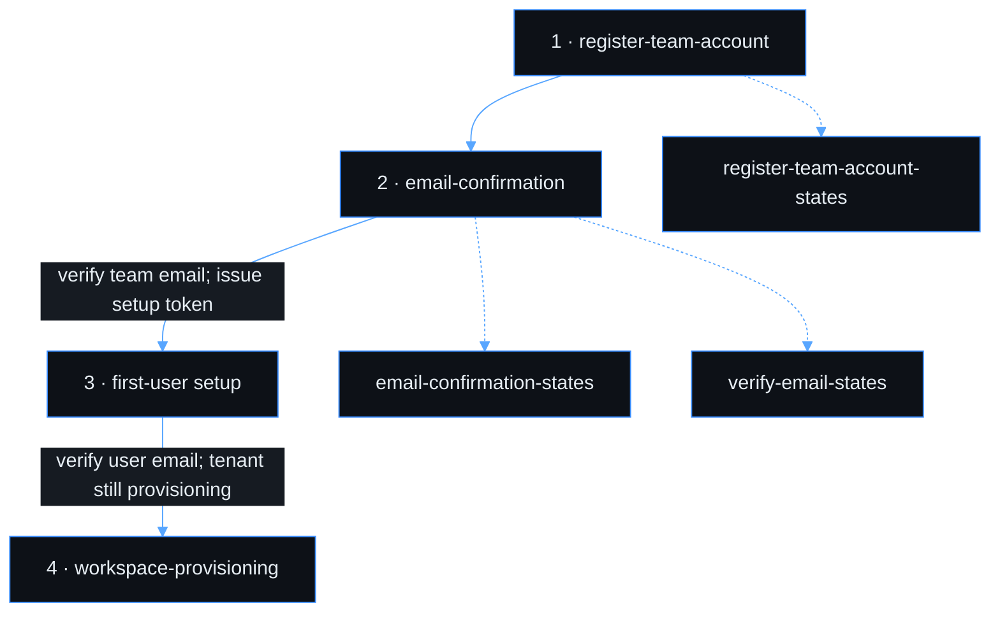
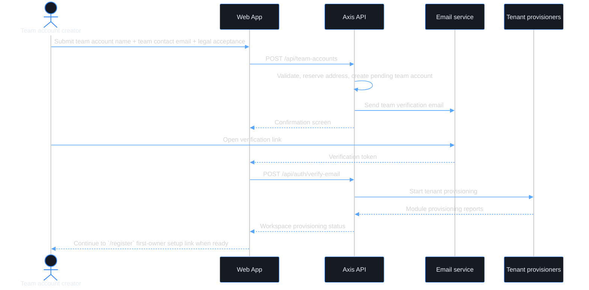
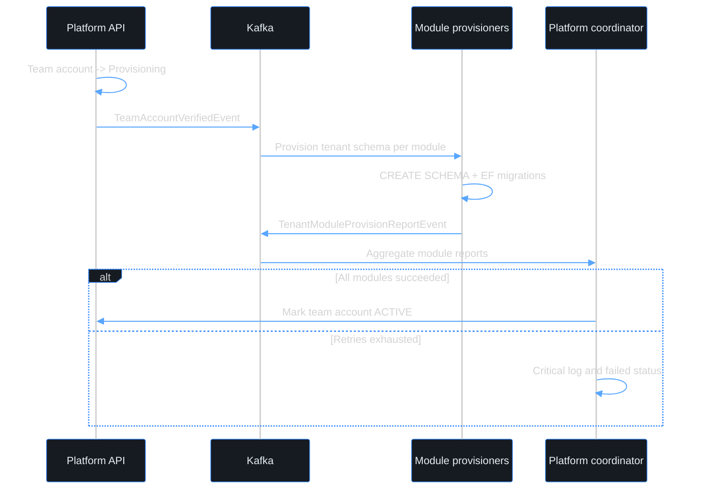

# Use case — Create a team account

> **Navigation**: [← Platform Foundation](../README.md) · [Use cases index](../README.md#use-cases)

## Purpose

Create a team account on the Axis platform so one user can manage multiple users, roles, invitations, and tenant-scoped resources. This is not a legal-team account registration flow; it is the transition from a solo user account to a multi-user account scope.

## Primary actor

- user creating a team account

## Trigger

- A user decides they need to manage other users and roles instead of only using Axis alone.

## Main flow

1. Actor opens the team account registration page.
2. Actor enters team account name, team contact email, and accepts Terms of Service / Privacy Policy.
3. System validates the team account details, reserves a unique team account address, and sends a verification email to the team contact email.
4. Actor verifies the team email link.
5. System marks the team account verified, starts tenant provisioning, and issues a first-user setup link for the `/register` handoff.
6. Actor continues to user registration to create the first owner/admin identity.

## Alternate / error flows

- Team contact email already exists for another team account: show the same confirmation screen where possible; never disclose ownership details to anonymous callers.
- Verification link expired: show a resend option for the team contact email.
- Verification link already used: show a clear completed-state message and link to user registration or sign-in.
- Provisioning fails after automatic retries: show the team-account setup failure state with manual retry/support action.

## Context

This use case is about team-account onboarding, not standalone user identity onboarding. The email collected here is a team contact email; it can be a shared mailbox such as `admin@company.com` or `it@company.com`, but it is not proof of a legal team account. Microsoft / Google / GitHub identity providers belong to user identity sign-in and provider-linking flows, not to team account registration.

Axis supports standalone user accounts. Creating a team account is required only when a user wants to manage other users, roles, invitations, and shared tenant-scoped resources. A user can keep using Axis alone without a team account, and future account-scope switching rules must define when a team account can return to solo mode.

## Acceptance Criteria

*Happy path*
- [ ] Registration form collects team account name and team contact email.
- [ ] The user must accept the Terms of Service and Privacy Policy before the team account registration can be submitted; the accepted versions are recorded with the team account registration record.
- [ ] A team account address is auto-generated from the team account name, uniqueness-checked, and shown to the actor before submission.
- [ ] On successful submission, a verification email is sent to the team contact email and the actor sees a confirmation screen.
- [ ] Clicking the verification link verifies the team contact email and starts tenant provisioning.
- [ ] After team account verification, the system creates a short-lived first-user setup token/link for the `/register` handoff; the team account is not usable until a user account is created and attached.
- [ ] Once tenant provisioning completes, the first registered owner/admin can access the workspace.

*Validation & errors*
- [ ] Team account name: required, 2–100 characters.
- [ ] Team contact email: required, valid email format, unique across active team accounts.
- [ ] Team contact email must not be collected from Microsoft / Google / GitHub OAuth claims in this use case.
- [ ] All field-level errors are shown inline, not as a global toast.
- [ ] Submitting with an already-registered team contact email shows the same confirmation screen when possible; anonymous callers must not learn whether a team account already exists.
- [ ] If the API returns a server error (5xx), the form shows a generic "Something went wrong, please try again" message and the submit button re-enables.

*Edge cases*
- [ ] Multiple rapid submissions of the same team account registration are deduplicated with an idempotency key.
- [ ] Team account name with special characters (e.g., `O'Brien & Co.`) is accepted and slugified consistently.
- [ ] A generic mailbox (e.g., `admin@company.com`) is allowed; the first-user setup link decides who becomes the initial owner/admin.
- [ ] Verification and first-user setup links are short-lived and single-use.

*Tenant provisioning*
- [ ] A dedicated PostgreSQL schema is created per module after team contact email verification.
- [ ] All base tables are migrated into each module's tenant schema automatically.
- [ ] Provisioning is idempotent: running it twice for the same team account does not create duplicate schemas or tables.
- [ ] If a tenant schema already exists from a partial previous run, the migration runner continues from where it left off.
- [ ] The UI shows `workspace-provisioning` while tenant setup is running and redirects when the team account becomes active.
- [ ] If provisioning fails after all retries, the UI shows a failed state with **Try again** and support contact.

*Out of scope*
- Standalone user registration without team account context; see [register-user](../../identity-access/register-user/).
- User account provider linking and Microsoft / Google / GitHub login; see [sign-in](../../identity-access/sign-in/) and ADR-027.
- Enterprise SAML/SCIM federation and per-tenant IdP configuration.
- CAPTCHA / bot protection on the team account registration form.
- Automatic re-send of verification email after X minutes.
- Custom schema naming chosen by the user; schema names are auto-generated.

> **Implementation status**
>
> | Layer | Status |
> |-------|--------|
> | Domain | ✅ |
> | Application | ✅ |
> | Infrastructure | ✅ |
> | API | ✅ |
> | Frontend | ✅ |
>
> **Gaps vs spec:** None for the team-account baseline.
> `POST /api/team-accounts` is the current internal API route; it records team account facts + legal versions and sends team contact verification. It only creates the pending team account record.
> The team-email verification step starts provisioning and issues a short-lived setup token for the `/register` first-owner handoff.
>
> **Deferred follow-ups:** N/A
>
> **Decisions:**
> - `register-team-account` owns team account facts only: team account name, team contact email, legal acceptance, address slug, verification, and tenant provisioning.
> - Microsoft / Google / GitHub authenticate users, not team accounts. Generic OAuth provider claims must not be used as proof that someone controls a team account.
> - First owner/admin identity creation is a setup-token handoff after team account verification. The dedicated team account registration page is `/register/team`; `/register/team` remains a compatibility alias. The first-owner account handoff continues through `/register?setupToken=...`.
> - Team account onboarding is optional from the product perspective: a user can register and use Axis in solo mode without creating or joining a team account.

## Screen flow

Canonical order for this use case. Screens owned by another use case are linked inline.

| Step | Screen | When |
|------|--------|------|
| 1 | `register-team-account` | Enter team account name, team contact email, address preview, and legal acceptance |
| 2 | `email-confirmation` | After team account registration submit; tells actor to verify the team contact email |
| 3 | First-user setup handoff | First owner/admin uses the setup token and creates a user identity after team account verification |
| 4 | `workspace-provisioning` | After user email verification when tenant setup is still running |

**Error / reference screens** (not sequential steps):

| Screen | When |
|--------|------|
| `register-team-account-states` | Validation or 5xx on the team account registration form |
| `email-confirmation-states` | Resend team contact verification email: success and rate limit |
| `verify-email-states` | Team email verification link expired, already used, invalid, or rate-limited |

## Wireframes

UI assets in this folder cover team-account-owned screens. Standalone user registration is owned by [register-user](../../identity-access/register-user/); external-provider/user-identity screens are not owned by this folder.

| # | Screen | Role | Excalidraw | Preview |
|---|--------|------|------------|---------|
| 1 | register-team-account | Happy path — team account registration form | [source](./register-team-account.excalidraw) | [preview](./register-team-account.svg) |
| 2 | email-confirmation | Happy path — team email confirmation | [source](./email-confirmation.excalidraw) | [preview](./email-confirmation.svg) |
| 4 | workspace-provisioning | Tenant setup progress / failure reference | [source](./workspace-provisioning.excalidraw) | [preview](./workspace-provisioning.svg) |
| — | register-team-account-states | Validation / 5xx reference | [source](./register-team-account-states.excalidraw) | [preview](./register-team-account-states.svg) |
| — | email-confirmation-states | Resend team verification email states | [source](./email-confirmation-states.excalidraw) | [preview](./email-confirmation-states.svg) |
| — | verify-email-states | Team verification link error states | [source](./verify-email-states.excalidraw) | [preview](./verify-email-states.svg) |

## Diagrams

### register-team-account-journey

Team account onboarding only. First-owner identity setup continues through the setup-token `/register` handoff for users who are creating a team account.

### tenant-provisioning

Async multi-module tenant setup after team email verification.

**Related:** [register-user](../../identity-access/register-user/) owns standalone user registration. First owner/admin setup-token polish remains part of this team account onboarding journey; third-party identity providers belong to user identity sign-in/provider-linking flows.
